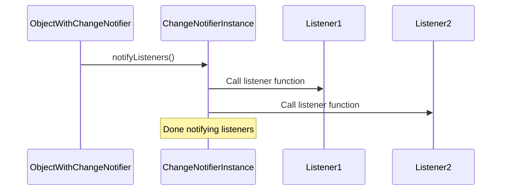

# Chapter 1: ChangeNotifier

Welcome to the Flutter foundation concepts! In this chapter, we're going to explore a really useful tool called `ChangeNotifier`. Imagine you have different parts of your app that need to know when something important happens in another part. How do you tell them? That's where `ChangeNotifier` comes in!

### Why do we need `ChangeNotifier`?

Let's say you have a simple app with a counter. You have a button that increases the count, and you want a text widget to show the current count. When you press the button and increase the count, how does the text widget know to update itself?

You could try passing the counter value around everywhere, but that gets messy quickly. What if multiple widgets need to know the count? What if the count changes in multiple places?

We need a way for the object holding the counter value to announce to anyone interested that its value has changed. This is where `ChangeNotifier` helps us.

### What is `ChangeNotifier`?

Think of `ChangeNotifier` as a little manager for a list of interested parties. The "interested parties" are called **listeners**. These listeners are basically pieces of code that want to know when something changes in the `ChangeNotifier`.

When something *does* change in the object that uses a `ChangeNotifier`, we tell the `ChangeNotifier` to "notify its listeners". The `ChangeNotifier` then goes through its list of listeners and tells each one, "Hey, something changed! You might want to update yourself."

It handles the tricky business of keeping track of who wants to listen and making sure they get the message.

### How does it work?

To use `ChangeNotifier`, you typically create a class that holds the data you want to track (like our counter). Your class will either **extend** or **mix in** `ChangeNotifier`. Mixing in is like adding extra abilities to your class.

Here's a simple example of a counter class that uses `ChangeNotifier`:

```dart
import 'package:flutter/foundation.dart';

class MyCounter with ChangeNotifier {
  int _count = 0; // Our private counter value

  int get count => _count; // A cleaner way to get the count

  void increment() {
    _count++; // Increase the count
    notifyListeners(); // Announce that the count has changed
  }
}
```

In this code:

1. We import `flutter/foundation.dart` which contains `ChangeNotifier`.
2. We create a class `MyCounter` and add the `ChangeNotifier` capabilities to it using `with ChangeNotifier`.
3. We have a private variable `_count` to hold our counter value. We use the `_` prefix to indicate it's internal to this class.
4. We provide a `get` method to access `count` from outside the class.
5. We have an `increment` method that increases the `_count`.
6. The important part is `notifyListeners()`. When we call this method, `ChangeNotifier` tells all the listeners that the `count` has changed.

### Becoming a Listener

Now that we have an object that can announce changes (`MyCounter`), we need a way for other parts of the app (like our text widget) to *listen* for those announcements. We'll learn more about *how* other parts of the UI listen in later chapters when we talk about widgets that are designed to work with objects that can announce changes.

For now, let's just focus on the core idea of adding and removing listeners on the `ChangeNotifier` itself. The `ChangeNotifier` class has methods for this:

```dart
void addListener(VoidCallback listener);
void removeListener(VoidCallback listener);
```

*   `addListener`: This method takes a function (a `VoidCallback`) as input. This function is the 'listener' code that will be run when `notifyListeners()` is called.
*   `removeListener`: This method also takes a `VoidCallback`. It removes a listener that was previously added.

You can see these methods in the `ChangeNotifier` code snippet:

```dart
/// Register a closure to be called when the object notifies its listeners.
void addListener(VoidCallback listener);

/// Remove a previously registered closure from the list of closures that the
/// object notifies.
void removeListener(VoidCallback listener);
```

Usually, you won't call these methods directly yourself when building a Flutter app with widgets. Flutter provides special widgets that handle adding and removing listeners for you, making it much easier. But understanding that this is happening under the hood is important!

### Inside `ChangeNotifier` (Simplified)

How does `ChangeNotifier` keep track of listeners and notify them? Looking at the code, we can see it manages a list of `VoidCallback?` (which are functions that take no arguments and return nothing and can also be null):

```dart
List<VoidCallback?> _listeners = _emptyListeners;
int _count = 0;
```

*   `_listeners`: This is the internal list where `ChangeNotifier` stores all the functions (listeners) that have been added.
*   `_count`: This keeps track of how many active listeners are currently in the list.

When you call `addListener(someFunction)`, `ChangeNotifier` adds `someFunction` to this `_listeners` list and increases `_count`.

When you call `removeListener(someFunction)`, `ChangeNotifier` finds `someFunction` in the list and removes it (or marks it for removal if notifications are currently happening).

When you call `notifyListeners()`, `ChangeNotifier` loops through its `_listeners` list and calls each function (listener) one by one:

```dart
void notifyListeners() {
  // ... other code ...
  final int end = _count;
  for (int i = 0; i < end; i++) {
    try {
      _listeners[i]?.call(); // Calls the listener function
    } catch (exception, stack) {
      // Handles any errors that happen in a listener
    }
  }
  // ... other code ...
}
```

This loop is the core of how `ChangeNotifier` works – it simply goes through its list and calls every listener function.

Here's a super simple sequence diagram to visualize the process when `notifyListeners()` is called:



This diagram shows that when `notifyListeners()` is called on the `ChangeNotifier`, it then calls the functions registered by `Listener1` and `Listener2`.

### Conclusion

In this chapter, we learned about `ChangeNotifier`, a fundamental building block in Flutter for creating objects that can announce changes to interested parts of your application. We saw how it manages a list of listeners and how you call `notifyListeners()` to trigger an update.

While we touched on `addListener` and `removeListener`, we also noted that in a typical Flutter app, you'll use specialized widgets to handle the listening part. In the next chapter, we will dive deeper into the concept of a `Listenable`, which is the interface that `ChangeNotifier` implements and which other parts of Flutter interact with.

[Next Chapter: Listenable](02_listenable_.md)

---

Generated by [AI Codebase Knowledge Builder](https://github.com/The-Pocket/Tutorial-Codebase-Knowledge)