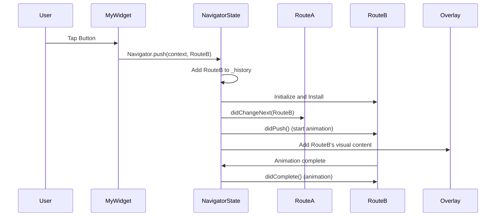
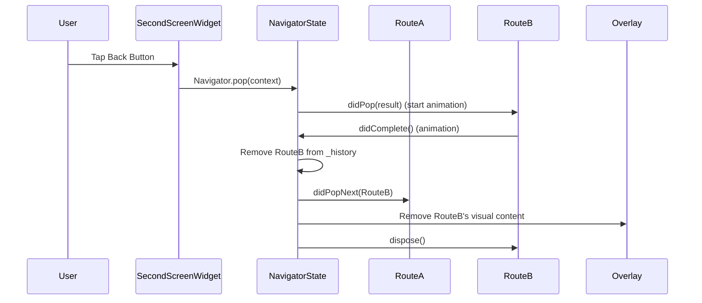

# Chapter 1: Navigator

Welcome to the wonderful world of Flutter! In this first chapter, we'll be diving into a core concept that's essential for building interactive apps: the `Navigator`.

Think of a **Navigator** like a friendly guide in your app. As you use an app, you move from one screen to another – maybe viewing a list of products, then tapping on one to see its details. The `Navigator` is the engine that makes these transitions happen smoothly.

Let's imagine your app is like a stack of cards, where each card is a different screen or page.


When you open your app, the "Home Screen" card is at the bottom of the stack. When you tap on "Products," the "Products Screen" card is placed on top. Then, if you tap on a specific product, the "Product Detail Screen" card goes on top of the "Products Screen."

The `Navigator` helps you manage this stack of "cards" (which we'll refer to as **[Route](02_route_.md)**s in Flutter). It allows you to:

*   **Push** a new card onto the top of the stack. This shows a new screen to the user.
*   **Pop** the top card off the stack. This takes the user back to the previous screen.
*   Even **replace** cards or handle more complex rearrangements.

This "stack" metaphor is a great way to visualize how navigation works in most mobile apps.

## Our First Navigation Example

Let's build a super simple example to see the `Navigator` in action. We'll have one screen with a button that takes us to a second screen, and the second screen will have a button to go back.

Imagine our app structure:

```
Home Screen (Screen 1)
  |
  | -- Tap button to go to -->
  |
Second Screen (Screen 2)
```

Here's how you would typically navigate from Screen 1 to Screen 2 in Flutter using the `Navigator`:

```dart
// In Screen 1's button's onPressed callback:
// This pushes a new route (Screen 2) onto the navigator
Navigator.push(
  context,
  MaterialPageRoute(builder: (context) => SecondScreen()),
);
```

**Explanation:**

*   `Navigator.push()` is the method we use to add a new screen to the stack.
*   `context` tells Flutter where in the widget tree we are, so it knows which `Navigator` to use (we'll talk more about `of(context)` later).
*   `MaterialPageRoute` is a specific type of **[Route](02_route_.md)** that provides platform-adaptive transitions (like sliding from the side on Android or fading on iOS). The `builder` creates the widget for the new screen (`SecondScreen`).

Now, on the `SecondScreen`, we need a way to go back to the `HomeScreen`.

```dart
// In Screen 2's button's onPressed callback:
// This pops the current route (Screen 2) off the navigator
Navigator.pop(context);
```

**Explanation:**

*   `Navigator.pop()` is the method to remove the top screen from the stack. It takes us back to the screen below (in this case, the `HomeScreen`).
*   Again, `context` is used to find the correct `Navigator`.

See? It's like adding and removing cards from a deck! `push` adds a card, and `pop` removes the top one.

## Understanding Navigator.of(context)

In the code snippets above, you might have noticed `Navigator.push(context, ...)` and `Navigator.pop(context)`. What's that `context` doing there?

In Flutter, the `context` is like an address for a widget's location in the widget tree. A `Navigator` widget lives somewhere in your app's widget tree (often managed by `MaterialApp` or `WidgetsApp`). When you call `Navigator.of(context)`, you are asking Flutter to find the nearest `Navigator` widget in the widget tree **above** the widget associated with that `context`.

Think of it as saying, "Hey Flutter, find the `Navigator` that is in charge of the part of the screen I'm currently in."

This means that when you are building the UI for a screen and you want to navigate FROM that screen, you use the `context` provided to that screen's `build` method.

## Peeking Under the Hood (Simple Version)

So, how does the `Navigator` actually manage these "cards" or **[Route](02_route_.md)**s internally?

Imagine the `Navigator` has a private list: `_history`. This list holds all the **[Route](02_route_.md)**s, ordered from the one at the bottom of the stack to the one currently visible at the top.

When you call `Navigator.push(context, newRoute)`:

1.  The `Navigator.of(context)` finds the correct `NavigatorState` (the actual object that manages the state of the `Navigator`).
2.  A new entry representing `newRoute` is added to the end of the `_history` list.
3.  The `NavigatorState` performs some internal updates. It tells the new **[Route](02_route_.md)** it's been added (`route.didAdd()`) or pushed (`route.didPush()`), and it tells the previous top **[Route](02_route_.md)** that something new is on top of it (`previousRoute.didChangeNext()`).
4.  It then instructs Flutter's `Overlay` widget to display the visual content of the new **[Route](02_route_.md)**. The `Overlay` is like a special container that can layer widgets on top of each other, perfect for showing one screen on top of another.
5.  An animation plays to transition the new screen into view.



And when you call `Navigator.pop(context, result)`:

1.  The `Navigator.of(context)` finds the correct `NavigatorState`.
2.  The `NavigatorState` tells the current top **[Route](02_route_.md)** that it's being popped (`route.didPop(result)`). This is where the **[Route](02_route_.md)** can return an optional `result` back to the screen that pushed it.
3.  If the **[Route](02_route_.md)** allows itself to be popped (most do), the `NavigatorState` removes it from the `_history` list.
4.  It tells the **[Route](02_route_.md)** that's now at the top that the route above it has been popped (`newTopRoute.didPopNext(poppedRoute)`).
5.  It removes the popped **[Route](02_route](02_route_).md)'s visual content from the `Overlay`.
6.  An animation plays to transition back to the previous screen.
7.  Finally, after any exit animations, the popped **[Route](02_route_.md)** is disposed of.



## Code Snippets from the Flutter Source

Let's look at a couple of simplified snippets from the `navigator.dart` file to see how some of this is handled in the actual Flutter code.

The `Navigator` class definition:

```dart
class Navigator extends StatefulWidget {
  // ... properties like pages, onGenerateRoute, etc.

  // Static methods for navigation (what you'll use most often)
  static Future<T?> pushNamed<T extends Object?>(...) { ... }
  static Future<T?> push<T extends Object?>(...) { ... }
  static void pop<T extends Object?>(...) { ... }
  // ... other navigation methods

  static NavigatorState of(BuildContext context, {bool rootNavigator = false}) {
    // This is the helper function to find the NavigatorState
    // It looks up the widget tree starting from the provided context
    // ...
  }

  @override
  NavigatorState createState() => NavigatorState();
}
```

This snippet shows that `Navigator` is a `StatefulWidget`, meaning it has mutable state that changes over time (the stack of routes!). It also defines the handy static methods (`push`, `pop`, `pushNamed`, etc.) that you'll call on `Navigator.of(context)`. The `createState()` method creates the `NavigatorState` where the actual work happens.

Inside the `NavigatorState` class (which extends `State<Navigator>` and implements `RestorationMixin`):

```dart
class NavigatorState extends State<Navigator> with TickerProviderStateMixin, RestorationMixin {
  late GlobalKey<OverlayState> _overlayKey;
  final _History _history = _History(); // This conceptually represents the stack of routes

  // ... other internal variables and methods

  @optionalTypeArgs
  Future<T?> push<T extends Object?>(Route<T> route) {
    _pushEntry(_RouteEntry(route, pageBased: false, initialState: _RouteLifecycle.push));
    return route.popped; // Returns a Future that completes when the route is popped
  }

  void _pushEntry(_RouteEntry entry) {
    assert(!_debugLocked);
    assert(() { _debugLocked = true; return true; }());
    assert(entry.route._navigator == null);
    assert(entry.currentState == _RouteLifecycle.push);
    _history.add(entry); // Add the new route entry to the internal history list
    _flushHistoryUpdates(); // Process changes and update UI
    assert(() { _debugLocked = false; return true; }());
    _afterNavigation(entry.route); // Handle things like cancelling gestures
  }

  @optionalTypeArgs
  void pop<T extends Object?>([T? result]) {
     assert(!_debugLocked);
     assert(() { _debugLocked = true; return true; }());
     final _RouteEntry entry = _history.lastWhere(_RouteEntry.isPresentPredicate);
     // ... logic to handle popping based on route properties
     entry.pop<T>(result); // Mark the entry for popping with the result
     _flushHistoryUpdates(rearrangeOverlay: false); // Process changes
     assert(entry.currentState == _RouteLifecycle.idle || entry.route._popCompleter.isCompleted);
     assert(() { _debugLocked = false; return true; }());
     _afterNavigation(entry.route); // Handle things like cancelling gestures
  }

  // ... build method to create the Overlay and handle gestures
}
```

This shows the `_history` list, where the `_RouteEntry` objects (which wrap our **[Route](02_route_.md)**s) are stored. You can also see simplified versions of the `push` and `pop` methods, which add/remove entries from `_history` and then call `_flushHistoryUpdates` to make the changes visible.

Notice how `push` returns `route.popped`. This is the `Future` we talked about earlier! It lets you know when the pushed route eventually gets popped and gives you access to its result.

## Conclusion

In this chapter, we introduced the Flutter `Navigator`. We learned that it manages a stack of **[Route](02_route_.md)**s, allowing users to navigate between different screens in an app. We saw how easy it is to `push` new screens onto the stack and `pop` back to previous ones using `Navigator.of(context)`. We also peeked at the internal `_history` list the `NavigatorState` uses to keep track of the route stack.

In the next chapter, we'll dive deeper into what a **[Route](02_route_.md)** is and explore different types of **[Route](02_route_.md)**s you can use with the `Navigator`.

[Chapter 2: Route](02_route_.md)

---

Generated by [AI Codebase Knowledge Builder](https://github.com/The-Pocket/Tutorial-Codebase-Knowledge)