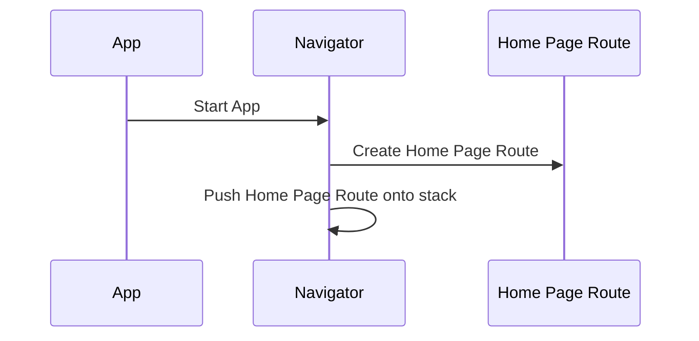
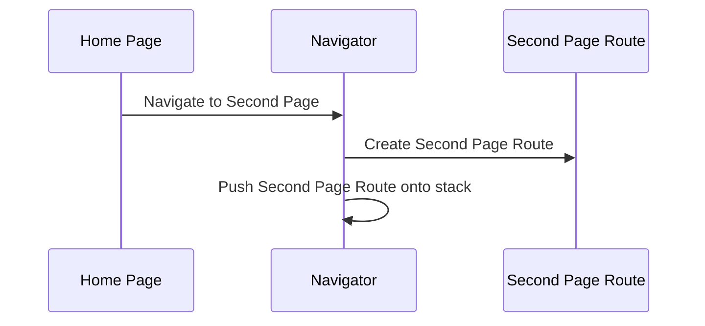
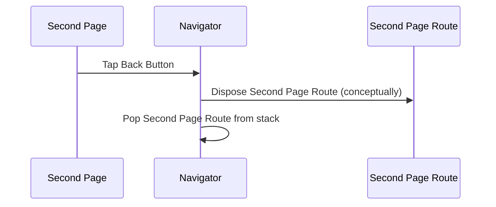

# Chapter 1: Route

Welcome to the first chapter of our Flutter tutorial on navigation! In this chapter, we're going to talk about a fundamental concept in Flutter: the `Route`.

Imagine you're using a phone app, like a social media app or a shopping app. You start on a main screen, maybe a feed of posts or a list of products. When you tap on a post to see more details or tap on a product to see its description, you move to a new screen. Then, when you want to go back, you tap a back button and you're back on the previous screen.

In Flutter, each one of these screens is often represented by something called a `Route`. Think of it like a destination you can navigate to within your app.

### What is a Route?

Let's use an analogy. Imagine you have a stack of cards. Each card in this stack represents a different screen or page in your app. A `Route` is like a single card in this stack. It knows what content (widgets) should be displayed for that specific screen.

When you navigate to a new screen in your app, it's like pushing a new card onto the top of the stack. The new card (the new `Route`) is now visible.

When you go back to the previous screen, it's like taking the top card off the stack. The card below it (the previous `Route`) becomes visible again.

The component in Flutter that manages this stack of `Route`s is called the [Navigator](03_navigator.md). We'll learn more about the [Navigator](03_navigator.md) later, but for now, just know that it's what handles showing and hiding these "cards" (your `Route`s).

### Why do we need Routes?

Using `Route`s helps us organize our app's screens and manage navigation between them. Instead of having one giant piece of code for your entire app, you break it down into smaller, manageable `Route`s, each responsible for a single screen. This makes your code easier to understand, maintain, and test.

### How to Use a Simple Route (Conceptually)

While you don't often create a base `Route` directly, you work with subclasses of `Route` that add more functionality. A common way to define a simple screen is using a `MaterialPageRoute` (which is a type of [ModalRoute](04_modalroute_.md), and [TransitionRoute](02_transitionroute_.md), which inherits from [OverlayRoute](03_overlayroute_.md), which inherits from `Route`!). Don't worry about all the subclasses for now, we'll cover them in later chapters. Let's look at a very basic example of how you might define a simple screen conceptually using something like a `MaterialPageRoute`.

Imagine we have a simple app with two screens: `HomePage` and `SecondPage`.

Here's a conceptual look at how you might define the `SecondPage` as a route:

```dart
// This is an abstract representation and not the actual code you write directly for Route.
// You'll use subclasses like MaterialPageRoute.

// Represents our Second Page screen content.
class SecondPageContent extends StatelessWidget {
  @override
  Widget build(BuildContext context) {
    return Scaffold(
      appBar: AppBar(title: Text('Second Page')),
      body: Center(child: Text('Welcome to the Second Page!')),
    );
  }
}

// Conceptually, how the SecondPage could be represented as a Route.
// In reality, you'd use a MaterialPageRoute or similar.
class SecondPageRoute /* extends Route */ {
  Widget buildPageContent(BuildContext context) {
    return SecondPageContent();
  }
}
```

This isn't the exact code you'd use for a base `Route`, but it illustrates the idea: a `Route` is associated with the content of a screen.

Now, let's think about how the [Navigator](03_navigator.md) uses these `Route`s like a stack of cards.

### The Route Stack with Navigator

When you start your app, the first screen ([Route](01_route_.md)) is pushed onto the [Navigator](03_navigator.md)'s stack.



Then, when you navigate from `HomePage` to `SecondPage`, the [Navigator](03_navigator.md) pushes the `SecondPage`'s `Route` onto the stack.



Now, the `SecondPage` `Route` is at the top of the stack and is visible to the user.

When you tap the back button, the [Navigator](03_navigator.md) pops the top `Route` (the `SecondPage` `Route`) off the stack.



And now, the `HomePage` `Route` is at the top of the stack again, and you see the home screen.

### Looking at the Code (Briefly)

Let's take a peek at the actual Flutter code for the base `Route` class (from the provided snippet). Don't worry if this looks complex; we're just highlighting a few key things.

```dart
abstract class Route<T> extends Listenable {
  // ... other properties and methods ...

  /// Called when this route is pushed onto the navigator.
  @protected
  TickerFuture didPush() { /* ... */ }

  /// Called when this route is popped.
  @mustCallSuper
  bool didPop(T? result) { /* ... */ }

  // ... more code ...
}
```

Even in this simplified view, you can see methods like `didPush()` and `didPop()`. These are methods that the [Navigator](03_navigator.md) calls on a `Route` when it's pushed onto or popped off the stack. This allows a `Route` to react to these navigation events if needed.

The `<T>` in `<T> extends Listenable` means that a `Route` (and its subclasses) can have a return type. When a route is popped, it can optionally return a value back to the route that launched it. For example, you might have a screen to select an item from a list, and when you pop that screen, you return the selected item.

### Conclusion

In this chapter, we introduced the concept of a `Route` in Flutter navigation. We learned that a `Route` represents a screen or destination in your app and how the [Navigator](03_navigator.md) manages a stack of these `Route`s to handle navigation. While you usually work with subclasses of `Route`, understanding the basic idea of a `Route` as a screen in a stack is crucial for understanding how navigation works in Flutter.

In the next chapter, we'll dive into [TransitionRoute](02_transitionroute_.md), a type of `Route` that adds animations when you navigate between screens.

[Chapter 2: TransitionRoute](02_transitionroute_.md)

---

Generated by [AI Codebase Knowledge Builder](https://github.com/The-Pocket/Tutorial-Codebase-Knowledge)