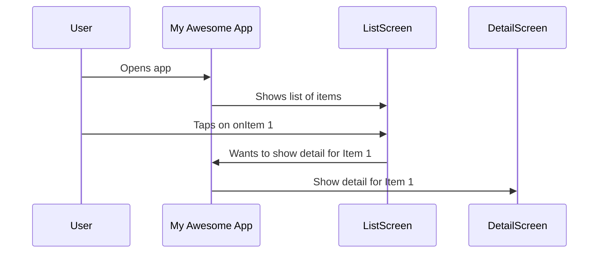

# Chapter 1: RouteInformation

Welcome to the first chapter of our Flutter routing tutorial! In this chapter, we'll start by exploring a fundamental concept called `RouteInformation`.

Imagine you have a mobile app with different screens, like a home screen, a settings screen, and a profile screen. When you navigate between these screens, your app needs to know where it's going and sometimes, it needs extra details about where it's landing. This is where `RouteInformation` comes in!

## What is RouteInformation?

Think of `RouteInformation` as a special note that your app uses to keep track of its location and any important information about that location.

It contains two main things:

1.  **Location:** This is like the 'address' of where you are in the app. On the web, this is often the URL (like `myapp.com/settings`). In a mobile app, it represents a specific screen or view you want to show.
2.  **State:** This is like extra notes or details about that location. For example, if you're on a profile page, the state might include the user's ID so the page knows which profile to display. If you're on a screen with a search bar, the state might hold the text the user typed in.

Essentially, `RouteInformation` is a bundle of information that describes a specific point or configuration within your application.

## Why Do We Need RouteInformation?

Consider a simple use case: building an app that shows a list of items, and when you tap an item, it takes you to a detail page for that item.



To show the detail screen, the app needs to know *which* item's details to show. It can't just say "go to the detail screen." It needs that extra information to configure the detail screen correctly. This is where `RouteInformation` is useful. The "note" for the detail screen route would include both the location (the detail screen) and the state (the ID of the item).

## How Does it Work? (A Simple View)

We'll dive into the concepts that use `RouteInformation` in later chapters ([Chapter 2: RouteInformationProvider](02_routeinformationprovider_.md), [Chapter 3: RouteInformationParser](03_routeinformationparser_.md), and [Chapter 4: RouterDelegate](04_routerdelegate_.md)), but for now, think of it like this:

1.  Something triggers a change in the app's desired location (e.g., user taps a button, the app starts up).
2.  A `RouteInformation` object is created, containing the new location and any relevant state.
3.  This `RouteInformation` note is then passed around to different parts of the routing system to figure out what screen to show and how to configure it.

Let's look at how `RouteInformation` is defined in Flutter's code.

```dart
/// A piece of routing information.
///
/// The route information consists of a location string of the application and
/// a state object that configures the application in that location.
class RouteInformation {
  /// Creates a route information object.
  const RouteInformation({
    String? location, // Deprecated, use uri instead
    Uri? uri, // The location (like a web address)
    this.state, // Extra details for this location
  });

  final String? _location; // Internal storage for the old location string

  /// The uri location of the application.
  Uri get uri {
     // Logic to get the URI, using the provided uri or parsing the location
     // ...
  }

  final Uri? _uri; // Internal storage for the URI

  /// The state of the application in the [uri].
  final Object? state;
}
```

As you can see, the `RouteInformation` class has a `uri` property (which is the modern way to represent the location) and a `state` property where you can store extra data.

Here's how you might create a `RouteInformation` object for our item detail use case:

```dart
// Imagine item ID is 123
int itemId = 123;

// Create the route information
RouteInformation itemDetailRoute = RouteInformation(
  uri: Uri.parse('/items/$itemId'), // Location: /items/123
  state: {'itemId': itemId}, // State: Store the item ID
);
```

In this simplified example, we create a `RouteInformation` object. The `uri` `/items/123` tells us *where* we want to go (the item detail page for item 123), and the `state` map `{ 'itemId': 123 }` provides the specific detail needed at that location (the ID of the item).

This `RouteInformation` object is a crucial piece of data that the rest of the routing system will use to render the correct details for Item 123.

## Internal View (How Flutter Uses It)

Flutter's internal routing system uses `RouteInformation` as a common format for communicating routing changes. When something triggers a route change (like the user tapping a button or the browser URL changing), the system often generates a `RouteInformation` object. This object is then processed by other parts of the routing system to update the UI.

It's important to understand that `RouteInformation` itself doesn't *make* anything happen on screen. It's just the *information* about the desired state. Other components will read this information and act on it. We'll cover these components in the next chapters.

The provided code snippets show how the central `Router` widget internally uses `RouteInformation`. For example, the `_processRouteInformation` method processes an incoming `RouteInformation` object:

```dart
// Snippet from Router's internal State
void _processRouteInformation(
  RouteInformation information, // The incoming RouteInformation
  ValueGetter<_RouteSetter<T>> delegateRouteSetter, // A way to set the delegate's route
) {
  // ... asserts and setup ...

  // Use the routeInformationParser (explained in Chapter 3)
  // to turn the RouteInformation into a configuration (T)
  widget.routeInformationParser!
      .parseRouteInformationWithDependencies(information, context)
      .then<void>(_processParsedRouteInformation(_currentRouterTransaction, delegateRouteSetter));
}
```

This snippet shows that when the `Router` gets a `RouteInformation`, it uses something called a `RouteInformationParser` to understand the information and turn it into a structured `configuration` that the app's logic can understand.

Another part of the `Router`'s internal state shows how it reports changes back using `RouteInformation`:

```dart
// Snippet from Router's internal State
void _reportRouteInformation(Duration timestamp) {
  if (!mounted) {
    return;
  }
  // ... asserts ...

  if (_routeInformation.value != null) {
    final RouteInformation currentRouteInformation = _routeInformation.value!;
    // Calls the RouteInformationProvider (explained in Chapter 2)
    widget.routeInformationProvider!.routerReportsNewRouteInformation(
      currentRouteInformation,
      type: _currentIntentionToReport!,
    );
  }
  // ... reset intention ...
}
```

Here, after the app's state changes and the `Router` rebuilds, it retrieves the *current* `RouteInformation` (using the `routerDelegate`, explained in Chapter 4) and reports it back using the `RouteInformationProvider`. This is how, for example, the browser's URL stays updated as you navigate within your Flutter web app.

These internal workings highlight that `RouteInformation` is the key piece of data that flows through Flutter's router system, carrying the "where and what" of the app's state.

## Conclusion

In this chapter, we learned that `RouteInformation` is a simple but powerful concept. It's a data object that holds information about your app's location and any associated state. This note-like structure is essential for telling the app where it is and what it should be doing at that location.

We saw how it's used to represent the desired destination and information needed to display a specific item's details. We also got a peek at how the `Router` internally uses `RouteInformation` for both processing incoming route requests and reporting the current state.

In the next chapter, we'll explore the [RouteInformationProvider](02_routeinformationprovider_.md), which is responsible for providing this `RouteInformation` to the routing system.

[Next Chapter: RouteInformationProvider](02_routeinformationprovider_.md)

---

Generated by [AI Codebase Knowledge Builder](https://github.com/The-Pocket/Tutorial-Codebase-Knowledge)