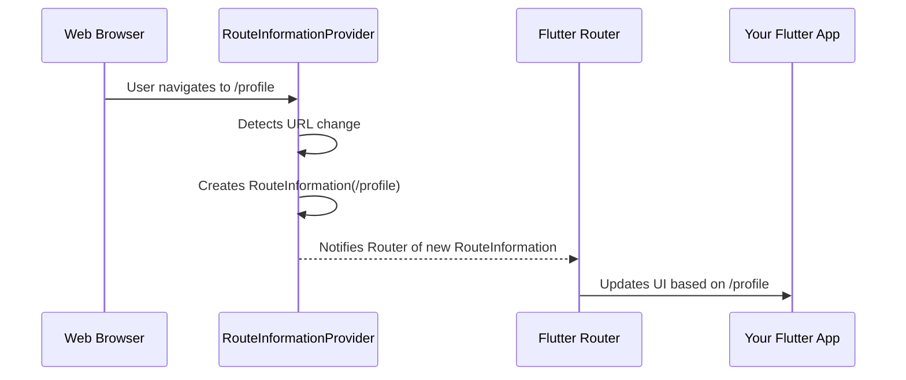
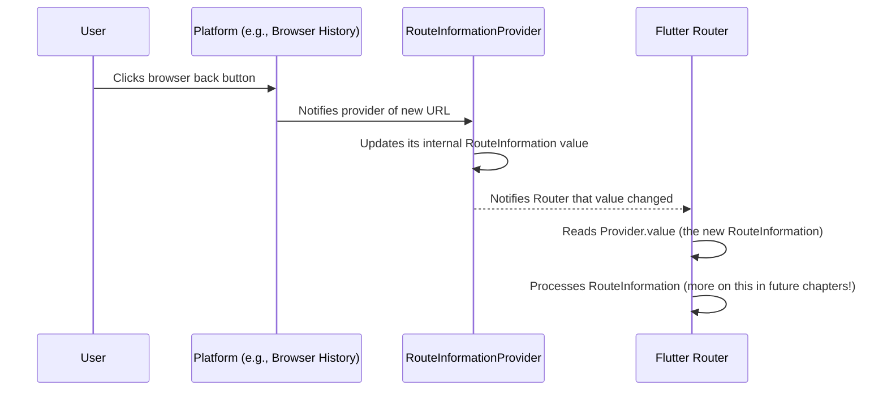

# Chapter 2: RouteInformationProvider

Welcome back! In the last chapter, we introduced the concept of [RouteInformation](01_routeinformation_.md) – that little bundle of data telling our app where it wants to go and any extra details needed for that location.

Now, how does this [RouteInformation](01_routeinformation_.md) actually get into our app's hands? This is where the `RouteInformationProvider` comes in!

## What is a RouteInformationProvider?

Think of `<RouteInformationProvider>` as the "sensor" or the "source of truth" for route changes outside of your app's internal navigation logic. Its job is to *provide* the current [RouteInformation](01_routeinformation_.md) to the rest of the routing system when needed.

Here's its main purpose:

*   **Detecting External Changes:** It listens for things happening *outside* your app that should cause a route change. On the web, this is usually the browser's URL changing (like when the user clicks the back button or types a new URL). On mobile, it might listen for system intents (like a deep link opening the app to a specific screen).
*   **Providing Initial Route:** When your app first starts, the `RouteInformationProvider` tells the routing system what the initial route should be.
*   **Saving State:** It also helps the app save its current route information for state restoration, so if the app is closed and reopened, it can go back to where the user was.

Essentially, it's the bridge between external navigation events (like browser actions) and your Flutter routing system.

## Why Do We Need a RouteInformationProvider?

Imagine you're building a web app with Flutter. The user types `yourwebsite.com/settings` into their browser. How does your Flutter app know to show the Settings screen?

This is the `RouteInformationProvider`'s job! It detects that the browser URL has changed, creates a [RouteInformation](01_routeinformation_.md) object (e.g., `uri: Uri.parse('/settings')`), and then tells the `Router` (which we'll cover in [Chapter 5: Router](05_router_.md)) that there's new route information available.

Here's a simple scenario:



Without the `RouteInformationProvider`, your Flutter app wouldn't know when the browser's URL changes, and could therefore not respond to users navigating via the browser's history or URL bar.

## The `PlatformRouteInformationProvider`

Flutter provides a built-in `RouteInformationProvider` called `PlatformRouteInformationProvider`. This is the most common one you'll use, especially for web apps.

Let's look at a simplified version of how you might use it when setting up your main app widget (like `MaterialApp.router`):

```dart
// Example setup using MaterialApp.router
MaterialApp.router(
  routeInformationProvider: PlatformRouteInformationProvider(
    initialRouteInformation: RouteInformation(uri: Uri.parse('/')), // Start at home
  ),
  // ... other delegates will be added here later
  // routeInformationParser: ..., // Chapter 3
  // routerDelegate: ..., // Chapter 4
  // backButtonDispatcher: ..., // Chapter 6
)
```

In this tiny snippet:
*   We're creating a `PlatformRouteInformationProvider`.
*   We tell it the `initialRouteInformation`, which is the [RouteInformation](01_routeinformation_.md) for the home screen (`/`). When the app starts, this is the first route information the provider gives to the `Router`.

The `PlatformRouteInformationProvider` automatically hooks into the underlying platform (web browser history, mobile system intents) to sense changes and provide new [RouteInformation](01_routeInformation_.md) objects.

## How it Works (A Simple View)

The `RouteInformationProvider` is like a `ValueListenable<RouteInformation>`. This means:

1.  It holds a `value` which is the current [RouteInformation](01_routeinformation_.md).
2.  You can `addListener` to it to be notified whenever its `value` changes.

The `Router` widget listens to the `RouteInformationProvider`. When the provider's value changes, the `Router` knows it needs to process this new [RouteInformation](01_routeinformation_.md) and potentially update the UI.

Here's a simplified sequence:



This shows the flow when an external event triggers a route change. The `RouteInformationProvider` is the one translating that external event into a format (the [RouteInformation](01_routeinformation_.md) object) that the Flutter `Router` can understand and act upon.

## Internal View (How Flutter Uses It)

Looking at the code snippets from `packages/flutter/lib/src/widgets/router.dart`, we can see how the `RouterState` interacts with the `RouteInformationProvider`.

First, when the `Router` is initialized, it registers itself as a listener:

```dart
// Snippet from _RouterState.initState
@override
void initState() {
  super.initState();
  // Router registers as a listener!
  widget.routeInformationProvider?.addListener(_handleRouteInformationProviderNotification);
  // ... other initializations ...
}
```

This is super important! It means whenever the `RouteInformationProvider` detects a change and calls `notifyListeners()` (which `ValueNotifier` does internally when its value changes), the `_handleRouteInformationProviderNotification` method in the `RouterState` will be called.

What happens inside that method?

```dart
// Snippet from _RouterState._handleRouteInformationProviderNotification
void _handleRouteInformationProviderNotification() {
  _routeParsePending = true; // Marks that we need to parse a new route
  _processRouteInformation(
    widget.routeInformationProvider!.value, // Get the NEW RouteInformation
    () => widget.routerDelegate.setNewRoutePath, // Tell the delegate to set the new path
  );
}
```

This method does two key things:

1.  It gets the latest [RouteInformation](01_routeinformation_.md) from the provider (`widget.routeInformationProvider!.value`).
2.  It calls `_processRouteInformation`, which signals the `Router` to start processing this new [RouteInformation](01_routeinformation_.md). We'll see how this processing happens in the next chapters ([Chapter 3: RouteInformationParser](03_routeinformationparser_.md) and [Chapter 4: RouterDelegate](04_routerdelegate_.md)).

The `RouteInformationProvider` also works in the other direction! When your app's internal state changes and causes the `RouterDelegate` to update its `currentConfiguration` and notify the `Router`, the `Router` reports this back to the provider:

```dart
// Snippet from _RouterState._maybeNeedToReportRouteInformation
void _maybeNeedToReportRouteInformation() {
  // Get the current RouteInformation from the delegate
  _routeInformation.value = _retrieveNewRouteInformation();
  _currentIntentionToReport ??= RouteInformationReportingType.none;
  // Schedule a task to report it
  _scheduleRouteInformationReportingTask();
}

// Snippet from _RouterState._reportRouteInformation
void _reportRouteInformation(Duration timestamp) {
  // ... checks ...
  if (_routeInformation.value != null) {
    final RouteInformation currentRouteInformation = _routeInformation.value!;
    assert(_currentIntentionToReport != null);
    // This is where the Router tells the provider about the current route!
    widget.routeInformationProvider!.routerReportsNewRouteInformation(
      currentRouteInformation,
      type: _currentIntentionToReport!,
    );
  }
  // ... reset intention ...
}
```

This `routerReportsNewRouteInformation` call is handled by the `RouteInformationProvider`. For the `PlatformRouteInformationProvider` specifically, this method is overridden to update the browser's history:

```dart
// Snippet from PlatformRouteInformationProvider.routerReportsNewRouteInformation
@override
void routerReportsNewRouteInformation(
  RouteInformation routeInformation, {
  RouteInformationReportingType type = RouteInformationReportingType.none,
}) {
  SystemNavigator.selectMultiEntryHistory(); // For state restoration
  SystemNavigator.routeInformationUpdated( // This updates browser history
    uri: routeInformation.uri,
    state: routeInformation.state,
    replace: switch (type) {
      RouteInformationReportingType.neglect => true,
      RouteInformationReportingType.navigate => false,
      RouteInformationReportingType.none => _equals(_valueInEngine.uri, routeInformation.uri),
    },
  );
  _value = routeInformation; // Update internal value
  _valueInEngine = routeInformation; // Keep track of what's in the engine
}
```

This bidirectional communication is key: the provider gets changes *from* the platform (like browser actions) and provides them *to* the `Router`, and the `Router` reports its *current* state *to* the provider so that the platform (like browser history) can stay synchronized.

## Conclusion

The `RouteInformationProvider` is the "eye on the outside world" for your Flutter router. It detects external navigation changes and supplies the crucial [RouteInformation](01_routeinformation_.md) to the system. The `PlatformRouteInformationProvider` is the standard implementation that connects your app to platform features like browser history. Understanding that it acts as both a source of initial and external route information and a target for reporting the app's current route is essential for seeing the full picture of Flutter's routing system.

In the next chapter, we'll look at the [RouteInformationParser](03_routeinformationparser_.md), which takes the raw [RouteInformation](01_routeinformation_.md) provided by the `RouteInformationProvider` and turns it into something your app's logic can understand.

[Next Chapter: RouteInformationParser](03_routeinformationparser_.md)

---

Generated by [AI Codebase Knowledge Builder](https://github.com/The-Pocket/Tutorial-Codebase-Knowledge)