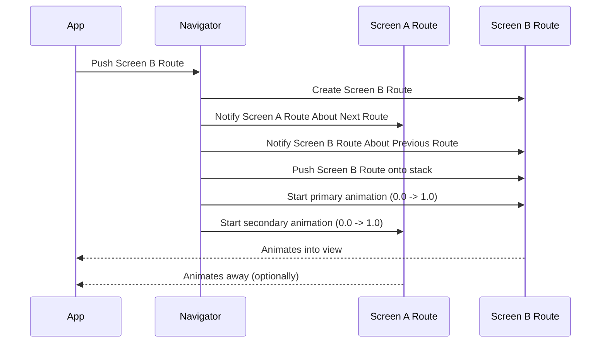
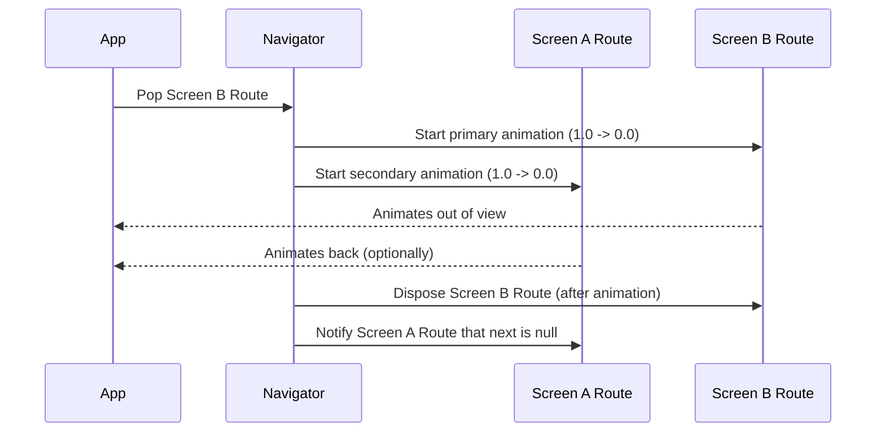

# Chapter 2: TransitionRoute

Welcome back! In the last chapter, [Chapter 1: Route](01_route_.md), we learned that a [Route](01_route_.md) in Flutter is like a card in a stack, representing a screen in your app. When you navigate, you're essentially pushing or popping these cards from the [Navigator](03_navigator.md)'s stack.

But if you've ever used an app, you know that switching between screens isn't usually just an instant swap. Screens often smoothly slide in, fade out, or have other cool visual effects. That's where `TransitionRoute` comes in.

### What is a TransitionRoute?

Imagine those cards we talked about. A `TransitionRoute` is like a special animated card. When you add (push) a `TransitionRoute` onto the stack, it doesn't just appear; it animates into view. Similarly, when you remove (pop) it, it animates out of view.

It's like adding visual flair to your navigation! These animations make moving between screens feel more natural and engaging for the user.

### Why Use TransitionRoute?

While `TransitionRoute` is an abstract class you don't use directly, understanding it helps you understand the animation behavior of common Flutter routes like `MaterialPageRoute` (which we'll see in a later chapter, [Chapter 4: ModalRoute](04_modalroute_.md)). These common routes *are* `TransitionRoute`s under the hood, inheriting its animation capabilities.

Using routes that handle transitions automatically saves you a lot of work. Instead of manually animating every screen change, the `TransitionRoute` does it for you based on its definition.

### Key Concepts of TransitionRoute

Let's look at some core ideas that make `TransitionRoute` work:

*   **Animations:** `TransitionRoute` manages two main animations:
    *   The **primary animation**: This animation controls how *this* route enters or exits the screen. It typically goes from 0.0 to 1.0 when the route is pushed and 1.0 to 0.0 when it's popped.
    *   The **secondary animation**: This animation controls how the *previous* route (the one below this one in the stack) reacts when this route is pushed on top of it, or how the *next* route (the one pushed on top of this one) reacts when it's popped. This allows routes to coordinate their transitions.

*   **Transition Duration:** A `TransitionRoute` defines how long its animations should take when going forwards ([`transitionDuration`](#transitionDuration)) and backwards ([`reverseTransitionDuration`](#reverseTransitionDuration)).

*   **Opaque:** Some routes, like a full-screen page, cover everything below them. These are called "opaque" routes. `TransitionRoute` has a property ([`opaque`](#opaque)) to indicate this. When an opaque route is fully visible, the routes below it don't need to be built, which can save performance.

### How TransitionRoute Works (Conceptually)

Let's go back to our card stack analogy, but now with animated cards.

When you push a `TransitionRoute` (`Screen B Route`) onto the stack which already contains a `TransitionRoute` (`Screen A Route`):



During this animation:

*   `Screen B Route`'s primary animation is running from 0.0 (fully hidden or partially visible depending on the type of transition) to 1.0 (fully visible).
*   `Screen A Route`'s secondary animation is running, potentially animating `Screen A` as `Screen B` covers it.

When you pop `Screen B Route`:



During this animation:

*   `Screen B Route`'s primary animation is running from 1.0 to 0.0, animating it out.
*   `Screen A Route`'s secondary animation is running, potentially animating `Screen A` back into its full state as `Screen B` is removed.

The `TransitionRoute` handles linking these animations together, so the pushing and popping feel smooth.

### Looking at the Code

Let's peek at the `TransitionRoute` code definition from the provided snippet. Again, don't feel pressured to understand every detail, but observe the parts that relate to animation:

```dart
abstract class TransitionRoute<T> extends OverlayRoute<T> implements PredictiveBackRoute {
  // ... other properties and methods ...

  /// The duration the transition going forwards.
  Duration get transitionDuration;

  /// The duration the transition going in reverse.
  Duration get reverseTransitionDuration => transitionDuration;

  /// Whether the route obscures previous routes when the transition is complete.
  bool get opaque;

  // ... other properties and methods ...

  /// The animation that drives the route's transition...
  Animation<double>? get animation;

  /// The animation for the route being pushed on top of this route.
  Animation<double>? get secondaryAnimation;

  // ... more code ...

  @override
  TickerFuture didPush(); // Called when pushed, starts forward animation

  @override
  bool didPop(T? result); // Called when popped, starts reverse animation

  // ... more code ...
}
```

Here we see the properties we discussed: `transitionDuration`, `reverseTransitionDuration`, `opaque`, `animation`, and `secondaryAnimation`. The `didPush` and `didPop` methods are where the `TransitionRoute` typically tells its animation controller to start the transition animation.

You also see that `TransitionRoute` `extends OverlayRoute<T>`, which means it's a type of [OverlayRoute](03_overlayroute_.md). We'll learn more about [OverlayRoute](03_overlayroute_.md) in the next chapter, but for now, know that [OverlayRoute](03_overlayroute_.md)s display their content in the [Navigator](03_navigator.md)'s [Overlay](03_overlayroute_.md), which is necessary for animations and showing overlays like modal barriers.

### Example (Conceptual)

While we won't write a full `TransitionRoute` from scratch (you usually work with subclasses), let's see conceptually how a simple fade transition might be described within a `TransitionRoute` structure.

Imagine a `FadePageRoute` which is a `TransitionRoute`. It would define how its page content fades in and out.

```dart
// This is a conceptual example, not actual Flutter code for a bare TransitionRoute.
// You'd use a subclass like ModalRoute or PageRouteBuilder.

class FadePageRoute extends TransitionRoute<void> {

  // This would be the widget for the screen content.
  final Widget pageContent;

  FadePageRoute({required this.pageContent});

  @override
  Duration get transitionDuration => const Duration(milliseconds: 300); // Fade in 300ms

  @override
  Duration get reverseTransitionDuration => const Duration(milliseconds: 300); // Fade out 300ms

  @override
  bool get opaque => false; // A fade transition isn't opaque until fully visible.

  @override
  Iterable<OverlayEntry> createOverlayEntries() {
    // In a real TransitionRoute/OverlayRoute, this would create the
    // OverlayEntry that holds the transition and the page content.
    // We'll see OverlayEntry in the next chapter.
    return []; // Simplified for this conceptual example
  }

  // Conceptual: This is where you'd build the transition widget.
  // The 'animation' here is the primary animation for THIS route.
  Widget buildTransition(BuildContext context, Animation<double> animation) {
    // Use the animation to control the opacity.
    return FadeTransition(
      opacity: animation, // Drives the fade animation
      child: pageContent, // The actual screen content
    );
  }

  // In a real TransitionRoute, you'd implement methods like buildPage
  // and buildTransitions as part of a ModalRoute subclass.
  // For simplicity, we just show the transition idea.
}
```

In a real Flutter app, when you use a route like `MaterialPageRoute`, it internally uses the `animation` and `secondaryAnimation` provided by its `TransitionRoute` foundation to create the Material Design animated transitions (like sliding in from the side). You provide the `pageContent`, and the `MaterialPageRoute` (which is a `TransitionRoute`) handles the animation around it using its `buildTransitions` method.

### Conclusion

In this chapter, we explored the concept of `TransitionRoute`, the foundation for animated screen transitions in Flutter navigation. We learned how it manages primary and secondary animations to create smooth visual effects when navigating between screens, how it defines transition durations, and the meaning of the `opaque` property. Understanding `TransitionRoute` is key to understanding how common routes like `MaterialPageRoute` provide their built-in animations.

In the next chapter, we'll look at [OverlayRoute](03_overlayroute_.md), which is another layer routes use to display themselves within the [Navigator](03_navigator.md)'s [Overlay](03_overlayroute_.md).

[Chapter 3: OverlayRoute](03_overlayroute_.md)

---

Generated by [AI Codebase Knowledge Builder](https://github.com/The-Pocket/Tutorial-Codebase-Knowledge)