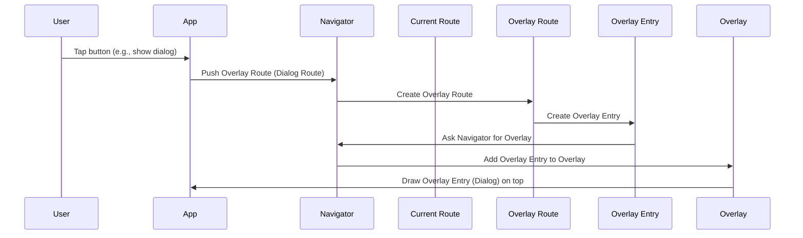
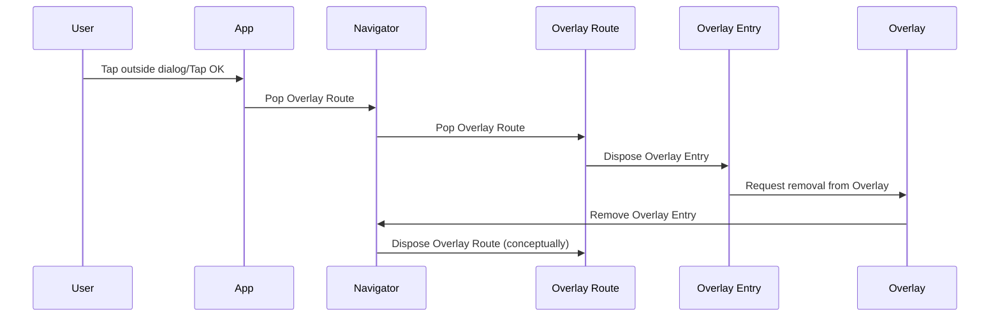

# Chapter 3: OverlayRoute

Welcome back, future Flutter expert! In the last chapter, [Chapter 2: TransitionRoute](02_transitionroute_.md), we saw how a `TransitionRoute` adds cool animations when you switch screens, making your app feel smooth.

Now, sometimes you don't want to completely *replace* the current screen like a new card on the stack. Instead, you want to put something *on top* of it, maybe a small pop-up message or a menu, while still being able to see or interact with the screen underneath. That's where `OverlayRoute` comes in!

### What is an OverlayRoute?

Let's go back to our playing card analogy. An `OverlayRoute` is like a special, transparent card you place on top of the existing stack. You can usually see through parts of this transparent card to the cards below. This is different from a regular route that acts like a solid card, completely covering whatever is beneath it.

Think of it like putting a sticky note or a transparent sheet with some information on top of a page in a book. The original page is still there, and you can see it, but there's a new layer on top.

Common examples of things that use `OverlayRoute` include:

*   **Dialogs:** Those small boxes that pop up to ask you a question or show important information.
*   **Pop-up Menus:** Menus that appear when you tap a button, floating over the content.
*   **Bottom Sheets:** Panels that slide up from the bottom of the screen.

These elements don't take over the whole screen, but they still need to be on top and often prevent interaction with the content below.

### Why Use OverlayRoute?

`OverlayRoute` is a crucial piece of the puzzle for displaying widgets that aren't part of the main screen layout but need to appear above everything else within the [Navigator](03_navigator_.md)'s view. It uses a special helper called an `OverlayEntry` to actually place its widgets on top of the existing routes in the [Navigator](03_.overlayroute_.md)'s [Overlay](03_.overlayroute_.md).

You won't usually create a raw `OverlayRoute` yourself. Instead, you'll use subclasses that build upon `OverlayRoute`'s capabilities, like [ModalRoute](04_modalroute_.md), which adds features like modal barriers (the dimming effect behind a dialog).

### Key Concepts of OverlayRoute

*   **Overlay:** The [Navigator](03_overlayroute_.md) has an `Overlay` widget which acts like a layered canvas. `OverlayEntry`s are placed into this `Overlay` to display content on top of other things.
*   **OverlayEntry:** This is the piece that holds the widget you want to display on top. An `OverlayRoute` creates and manages one or more `OverlayEntry`s.
*   **Transparency:** The key characteristic of an `OverlayRoute` is its ability to be non-opaque, meaning you can potentially see through it to the routes below.

### How OverlayRoute Works (Conceptually)

When an `OverlayRoute` (like a dialog route) is pushed onto the [Navigator](03_overlayroute_.md)'s stack:



The `OverlayRoute` calculates what it needs to display (like the dialog box and the dimming barrier) and creates `OverlayEntry` objects for them. These `OverlayEntry`s are then added to the [Navigator](03_overlayroute_.md)'s `Overlay`. The `Overlay` renders these entries on top of all the other routes currently in the stack.

When the `OverlayRoute` is popped (the dialog is dismissed):



The `OverlayRoute` disposes of its `OverlayEntry` objects, which tells the `Overlay` to remove them. The content disappears from the screen, and you can interact with the routes below again.

### Looking at the Code

Let's look at the provided code snippet for the `OverlayRoute` class.

```dart
abstract class OverlayRoute<T> extends Route<T> {
  // ... other properties and methods ...

  /// Subclasses should override this getter to return the builders for the overlay.
  @factory
  Iterable<OverlayEntry> createOverlayEntries();

  @override
  List<OverlayEntry> get overlayEntries => _overlayEntries;
  final List<OverlayEntry> _overlayEntries = <OverlayEntry>[];

  @override
  void install() {
    assert(_overlayEntries.isEmpty);
    _overlayEntries.addAll(createOverlayEntries());
    super.install();
  }

  // ... more code ...

  @override
  void dispose() {
    for (final OverlayEntry entry in _overlayEntries) {
      entry.dispose();
    }
    _overlayEntries.clear();
    super.dispose();
  }
}
```

Key things to notice:

*   `abstract class OverlayRoute<T> extends Route<T>`: This tells us that `OverlayRoute` is a type of [Route](01_route_.md) and means you can't create an instance of it directly. It's a base class for other route types.
*   `Iterable<OverlayEntry> createOverlayEntries()`: This is an abstract method that subclasses must implement. This method is where the subclass defines what `OverlayEntry` (or entries) it needs to create to display its content.
*   `List<OverlayEntry> get overlayEntries`: This property holds the actual `OverlayEntry` objects that the route creates.
*   `install()`: When the route is installed (added to the [Navigator](03_overlayroute_.md)), it calls `createOverlayEntries()` to get the `OverlayEntry` list.
*   `dispose()`: When the route is disposed, it makes sure to dispose of its `OverlayEntry` objects too, cleaning them up from the `Overlay`.

This structure ensures that subclasses provide the necessary content (through `createOverlayEntries`) and that the base `OverlayRoute` handles the creation and cleanup of these `OverlayEntry`s within the [Navigator](03_overlayroute_.md)'s `Overlay`.

### Example (Conceptual)

Let's imagine a very simple `SimplePopupRoute` that shows a text message on top of everything.

```dart
// This is a simplified conceptual example, not real code for a direct OverlayRoute.
// You'd typically extend ModalRoute which extends OverlayRoute.

import 'package:flutter/widgets.dart';
import 'package:flutter/material.dart';
import 'package:flutter/animation.dart'; // For Animation

class SimplePopupRoute extends OverlayRoute<void> {

  final String message;

  SimplePopupRoute({required this.message});

  @override
  Iterable<OverlayEntry> createOverlayEntries() {
    // This route creates one OverlayEntry to display its content.
    return [
      OverlayEntry(
        // The builder function gets called by the Overlay to create the widget.
        builder: (BuildContext context) {
          return Center(
            child: Card( // Simple card background
              child: Padding(
                padding: const EdgeInsets.all(16.0),
                child: Text(message), // Display the message
              ),
            ),
          );
        },
      ),
    ];
  }

  // Overlay routes often need animations, so methods from TransitionRoute
  // would be implemented in a subclass like ModalRoute or PopupRoute.
  // For this simple conceptual example, we'll skip explicit transition details.

  // In a real scenario extending ModalRoute, you'd implement methods
  // like barrierColor, barrierDismissible, and buildPage/buildTransitions.

  @override
  bool get opaque => false; // It's a pop-up, so it's not fully opaque.

  @override
  bool get maintainState => true; // Keep the state of the route below it.

  // These are abstract in OverlayRoute and implemented in subclasses:
  // @override
  // Duration get transitionDuration => Duration.zero; // Example: no transition easily here

  // @override
  // String? get barrierLabel => 'Dismiss popup'; // Example for accessibility

  // @override
  // Color? get barrierColor => Colors.black54; // Example for dimming

  // @override
  // bool get barrierDismissible => true; // Example: allow tapping outside to dismiss

}
```

In this conceptual example, the `SimplePopupRoute` implements `createOverlayEntries` and returns a list containing a single `OverlayEntry`. The `OverlayEntry`'s `builder` function creates the actual widget (`Center` > `Card` > `Padding` > `Text`) that appears as the popup.

When you push this route onto the [Navigator](03_overlayroute_.md), the `OverlayRoute` framework ensures that this `OverlayEntry` gets added to the [Navigator](03_overlayroute_.md)'s `Overlay`, making the popup visible on top of the current screen.

### Conclusion

In this chapter, we introduced `OverlayRoute`, the abstraction that allows routes to display content on top of other routes within the [Navigator](03_overlayroute_.md)'s `Overlay`. We learned that it uses `OverlayEntry` to place its widgets and is the foundation for elements like dialogs and pop-up menus that don't replace the whole screen. While you typically work with subclasses rather than `OverlayRoute` directly, understanding its role is essential for grasping how these temporary, layered UI elements work in Flutter navigation.

In the next chapter, we'll delve into [ModalRoute](04_modalroute_.md), a very common type of route that builds upon `OverlayRoute` and `TransitionRoute` to provide features like modal barriers and easy integration with standard page transitions.

[Chapter 4: ModalRoute](04_modalroute_.md)

---

Generated by [AI Codebase Knowledge Builder](https://github.com/The-Pocket/Tutorial-Codebase-Knowledge)