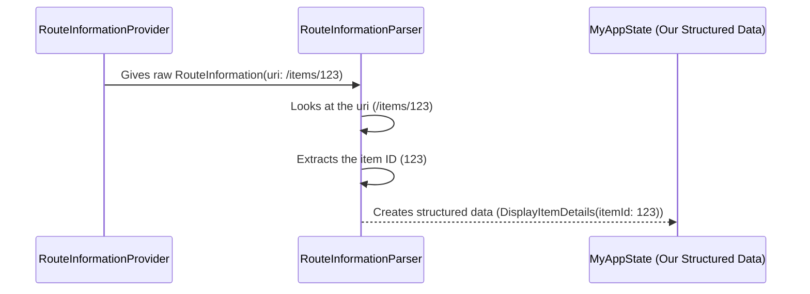

# Chapter 3: RouteInformationParser

Welcome back! In the last chapter, we learned about the [RouteInformationProvider](02_routeinformationprovider_.md), which is like the "sensor" that detects external route changes and provides us with [RouteInformation](01_routeinformation_.md) – that important note about the desired location and state.

Now, we have this `RouteInformation` note, but it's often still in a somewhat raw format (like a web URL string and a generic state object). How does our app understand what this means in terms of *which screens* to show and *how* to set them up?

This is where the `RouteInformationParser` comes in!

## What is a RouteInformationParser?

Think of the `RouteInformationParser` as a **translator**. Its main job is to take the `RouteInformation` provided by the [RouteInformationProvider](02_routeinformationprovider_.md) and **translate** it into a structured format that your app's logic can easily understand. This structured format is often custom to your application and describes the current "state" or "configuration" of your navigation.

Let's revisit our item detail example from [Chapter 1: RouteInformation](01_routeinformation_.md).



In this example:
1.  The `RouteInformationProvider` gives the parser the `RouteInformation` object with the URI `/items/123`.
2.  The `RouteInformationParser` receives this. It inspects the URI string.
3.  It recognizes the pattern `/items/:itemId` and extracts the `123` part.
4.  It then creates a more structured, app-specific object, like `DisplayItemDetails(itemId: 123)`. This object clearly and strongly types the intent: "show the details screen for item 123."

This structured data (`DisplayItemDetails` in our example) is the output of the `RouteInformationParser`, and it's what the [RouterDelegate](04_routerdelegate_.md) will use to decide what widgets to build.

## Why Do We Need a RouteInformationParser?

Imagine your app has many different types of screens, each needing specific data:
*   A profile screen might need a user ID (`/users/456`).
*   A product listing screen might need a category ID and a sort order (`/products?category=electronics&sort=price`).
*   A settings screen might not need any extra data (`/settings`).

The raw `RouteInformation` (the URI string and the state map) can be flexible, but it can also be messy to work with directly in your app's UI building logic. You'd have to constantly parse strings, check existence of keys in a map, etc.

The `RouteInformationParser` centralizes this translation process. It takes the responsibility of understanding the raw `RouteInformation` format and producing a clean, well-defined object that represents the app's desired state. This keeps your UI building logic (in the [RouterDelegate](04_routerdelegate_.md)) much cleaner.

It also works in reverse! When your app's state changes internally and the [RouterDelegate](04_routerdelegate_.md) updates its `currentConfiguration`, the `Router` asks the `RouteInformationParser` to **restore** a `RouteInformation` from this structured configuration. This is how the parser helps in two directions:

*   **Parsing:** `RouteInformation` (raw)  -> Structured App Configuration (easy for [RouterDelegate](04_routerdelegate_.md))
*   **Restoring:** Structured App Configuration -> `RouteInformation` (raw) (for [RouteInformationProvider](02_routeinformationprovider_.md), e.g., updating browser URL)

## How to Create a Simple RouteInformationParser

Let's create a simple `RouteInformationParser` that can handle two routes: `/` (home) and `/items/:id` (item detail).

First, we need to define the structured data type that our parser will output. This is often called a "configuration" or "path".

```dart
// A simple enum to represent our app's "screens" or "paths"
enum MyAppPath {
  home,
  itemDetail,
}

// A class to hold potentially complex configuration data
class MyAppRouteConfiguration {
  final MyAppPath path;
  final int? itemId; // Specific data for itemDetail path

  MyAppRouteConfiguration.home()
      : path = MyAppPath.home,
        itemId = null;

  MyAppRouteConfiguration.itemDetail(this.itemId)
      : path = MyAppPath.itemDetail,
        assert(itemId != null);

  // Helper to check if it's the home route
  bool get isHomePage => path == MyAppPath.home;

  // Helper to check if it's the item detail route
  bool get isItemDetailPage => path == MyAppPath.itemDetail;
}
```

Here, we have `MyAppPath` to represent the different *types* of paths and `MyAppRouteConfiguration` to hold the *specific* details for that path (like the `itemId`).

Now, let's build the `RouteInformationParser`. We need to extend `RouteInformationParser<T>`, where `T` is our structured configuration type (`MyAppRouteConfiguration`).

```dart
// Our custom parser class
class MyAppRouteInformationParser
    extends RouteInformationParser<MyAppRouteConfiguration> {

  // This method translates RouteInformation to our configuration
  @override
  Future<MyAppRouteConfiguration> parseRouteInformation(
      RouteInformation routeInformation) async {

    final uri = routeInformation.uri; // Get the URI from the RouteInformation

    // Check if the path is empty or just "/"
    if (uri.pathSegments.isEmpty || uri.pathSegments.first == '') {
      return SynchronousFuture(MyAppRouteConfiguration.home()); // It's the home page!
    }

    // Check if the path starts with "items"
    if (uri.pathSegments.length == 2 && uri.pathSegments.first == 'items') {
      final String itemIdSegment = uri.pathSegments[1]; // Get the ID part

      // Try to parse the ID as an integer
      final int? itemId = int.tryParse(itemIdSegment);
      if (itemId != null) {
        return SynchronousFuture(MyAppRouteConfiguration.itemDetail(itemId)); // It's an item detail!
      }
    }

    // If neither matches, maybe route to home or show an error
    // For simplicity, let's route to home for now
    return SynchronousFuture(MyAppRouteConfiguration.home());
  }

  // This method translates our configuration back to RouteInformation
  @override
  RouteInformation? restoreRouteInformation(
      MyAppRouteConfiguration configuration) {
    // Based on the configuration, create the RouteInformation
    if (configuration.isHomePage) {
      return RouteInformation(uri: Uri.parse('/')); // Home page URI
    }

    if (configuration.isItemDetailPage) {
      // Item detail page URI, include the item ID
      return RouteInformation(uri: Uri.parse('/items/${configuration.itemId}'));
    }

    // Should not happen if we handle all paths in our configuration
    return null;
  }
}
```

Let's break down the important parts:

1.  **`parseRouteInformation`:** This is where the magic happens for `RouteInformation` -> Configuration.
    *   It receives the `RouteInformation`.
    *   It accesses the `uri` (the location).
    *   It uses simple logic (checking path segments) to figure out what the URI means in terms of our app's screens.
    *   If the path is `/`, it returns `MyAppRouteConfiguration.home()`.
    *   If the path is `/items/:id` and the `:id` is a number, it returns `MyAppRouteConfiguration.itemDetail(itemId)`.
    *   **Important:** It returns a `Future`. For simple synchronous processing like this, we wrap the result in `SynchronousFuture`. This tells Flutter that the result is available immediately. If parsing required network requests or heavy computation, it would be a real `Future`.

2.  **`restoreRouteInformation`:** This handles the reverse, Configuration -> `RouteInformation`.
    *   It receives our app configuration (`MyAppRouteConfiguration`).
    *   Based on which type of configuration it is (`isHomePage` or `isItemDetailPage`), it constructs and returns the appropriate `RouteInformation` object.
    *   For the item detail page, it rebuilds the `/items/:id` URI using the `itemId` from the configuration.
    *   Returning `null` means this configuration shouldn't be reported as a route change (useful for temporary internal states you don't want reflecting in the browser history).

Now, with our `MyAppRouteInformationParser` and `MyAppRouteConfiguration`, the incoming `RouteInformation` from the [RouteInformationProvider](02_routeinformationprovider_.md) can be cleanly translated into something our [RouterDelegate](04_routerdelegate_.md) can easily work with.

## Internal View (How Flutter Uses It)

Let's look at how the `Router` widget (`packages/flutter/lib/src/widgets/router.dart`) uses the `RouteInformationParser`.

When the [RouteInformationProvider](02_routeinformationprovider_.md) notifies the `Router` that there's new `RouteInformation` available, the `_handleRouteInformationProviderNotification` method is called (as we saw in [Chapter 2](02_routeinformationprovider_.md)). This method then calls `_processRouteInformation`:

```dart
// Snippet from _RouterState._processRouteInformation
void _processRouteInformation(
  RouteInformation information, // The new RouteInformation
  ValueGetter<_RouteSetter<T>> delegateRouteSetter, // A way to call the delegate (RouterDelegate)
) {
  // ... setup ...

  // *** This is where the parser is used! ***
  // It calls parseRouteInformationWithDependencies
  widget.routeInformationParser!
      .parseRouteInformationWithDependencies(information, context)
      .then<void>( // When the parsing is done...
          _processParsedRouteInformation( // ...process the parsed data (T)
              _currentRouterTransaction, delegateRouteSetter));
}
```

This snippet clearly shows the flow:
1.  `_processRouteInformation` is called with the new `information` (the `RouteInformation` from the provider).
2.  It accesses the `widget.routeInformationParser`.
3.  It calls the parser's `parseRouteInformationWithDependencies` method, passing the `information` and the `context`.
4.  Because `parseRouteInformationWithDependencies` (or the simpler `parseRouteInformation` it calls) returns a `Future`, the `.then` is used to wait for the result.
5.  Once the parsing is complete, the resulting structured data (`T`, which is our `MyAppRouteConfiguration` in the example) is passed to `_processParsedRouteInformation`.

What does `_processParsedRouteInformation` do? It calls the `setNewRoutePath` or `setInitialRoutePath` methods on the [RouterDelegate](04_routerdelegate_.md) (using the provided `delegateRouteSetter`) with the parsed configuration:

```dart
// Snippet from _RouterState._processParsedRouteInformation
_RouteSetter<T> _processParsedRouteInformation(
  Object? transaction,
  ValueGetter<_RouteSetter<T>> delegateRouteSetter,
) {
  return (T data) async { // 'data' is the parsed config (MyAppRouteConfiguration)
    if (_currentRouterTransaction != transaction) {
      return; // Ignore if a new route change happened meantime
    }
    // *** Calls the RouterDelegate's setter with the parsed data! ***
    await delegateRouteSetter()(data);
    if (_currentRouterTransaction == transaction) {
      // If still processing the same transaction, rebuild the Router
       _rebuild();
    }
  };
}
```

This completes the first half of the journey: `RouteInformationProvider` -> `RouteInformation` -> `RouteInformationParser` -> Structured Configuration -> `RouterDelegate`.

The second half, for restoring and reporting the current route (`RouterDelegate` -> Configuration -> `RouteInformationParser` -> `RouteInformation` -> [RouteInformationProvider](02_routeinformationprovider_.md)), happens when the `Router` rebuilds and needs to report the current state. The `_maybeNeedToReportRouteInformation` method is involved:

```dart
// Snippet from _RouterState._maybeNeedToReportRouteInformation
void _maybeNeedToReportRouteInformation() {
  // *** Retrieves the current config from the RouterDelegate ***
  // *** And uses the parser to turn it back into RouteInformation ***
  _routeInformation.value = _retrieveNewRouteInformation();

  _currentIntentionToReport ??= RouteInformationReportingType.none;
  _scheduleRouteInformationReportingTask(); // Schedules reporting to the provider
}

// Snippet from _RouterState._retrieveNewRouteInformation
RouteInformation? _retrieveNewRouteInformation() {
  final T? configuration = widget.routerDelegate.currentConfiguration; // Get config
  if (configuration == null) {
    return null;
  }
  // *** Calls the parser's restoreRouteInformation method! ***
  return widget.routeInformationParser?.restoreRouteInformation(configuration);
}
```

Here:
1.  `_maybeNeedToReportRouteInformation` is called.
2.  It calls `_retrieveNewRouteInformation`.
3.  `_retrieveNewRouteInformation` asks the `routerDelegate` for its `currentConfiguration`.
4.  If a configuration is available, **it calls the `routeInformationParser`'s `restoreRouteInformation` method** with this configuration.
5.  The resulting `RouteInformation` is then stored and scheduled to be reported to the [RouteInformationProvider](02_routeinformationprovider_.md).

This shows how the `RouteInformationParser` acts as the critical bridge, translating back and forth between the raw platform-friendly `RouteInformation` and your app-specific structured configuration.

## Conclusion

In this chapter, we learned that the `RouteInformationParser` is the translator in the Flutter routing system. It skillfully converts the raw `RouteInformation` (often from external sources like browser URLs) into a structured, app-specific data type that represents the desired navigation state. It also works in reverse, helping to restore `RouteInformation` from the app's current state for things like updating browser history. By creating a custom parser and a custom configuration type, you gain fine-grained control over how your app interprets incoming routes and represents its own navigation state.

In the next chapter, we'll finally dive into the [RouterDelegate](04_routerdelegate_.md), which takes the structured data produced by the `RouteInformationParser` and uses it to build the actual UI, deciding which screens or widgets to display.

[Next Chapter: RouterDelegate](04_routerdelegate_.md)

---

Generated by [AI Codebase Knowledge Builder](https://github.com/The-Pocket/Tutorial-Codebase-Knowledge)