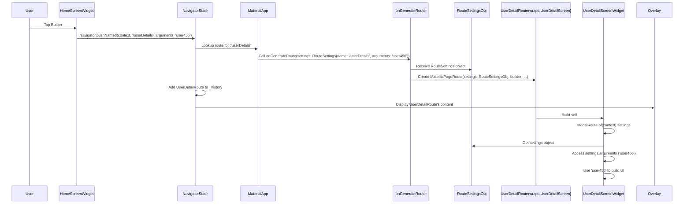

# Chapter 3: RouteSettings

Welcome back, navigators! In the previous chapters, we learned about the fundamental concepts of mobile navigation in Flutter: the [Navigator](01_navigator_.md) (our stack manager) and the [Route](02_route_.md) (the recipe for a screen).

Now, let's look at something that adds more details and flexibility to our routes: **RouteSettings**.

Imagine each [Route](02_route_.md) is a playing card representing a screen in our app. What information might we want to write on the back of that card? Maybe a name for the screen, or some extra data it needs to display correctly. That's what `RouteSettings` are for!

`RouteSettings` are simple objects attached to a [Route](02_route_.md) that provide contextual information about that route, specifically its **name** and any **arguments** passed to it.

## Why do we need RouteSettings?

Let's revisit our simple app with a home screen and a second screen. In [Chapter 2: Route](02_route_.md), we pushed our `SecondScreen` like this:

```dart
Navigator.push(
  context,
  MaterialPageRoute(builder: (context) => const SecondScreen()),
);
```

This worked fine. But what if our app grew larger and had many screens? Remembering to create `MaterialPageRoute` instances everywhere could become cumbersome. Also, what if we wanted to navigate to a screen but needed to give it some specific information?

For example, maybe our second screen should display details about a specific user. We need a way to tell the `SecondScreen` *which* user's details to show.

This is where `RouteSettings` become incredibly useful, particularly with **named routes**.

## Using Named Routes with RouteSettings

Instead of building a `MaterialPageRoute` directly every time, we can give our routes names (like URLs on the web!) and let the [Navigator](01_navigator_.md) generate the route based on that name.

Let's set up our app to use named routes. We'll add a `routes` map to our `MaterialApp`:

```dart
import 'package:flutter/material.dart';
import 'second_screen.dart'; // Assuming this file exists

void main() {
  runApp(MaterialApp(
    title: 'Named Routes Demo',
    initialRoute: '/', // Start on the home screen
    routes: {
      '/': (context) => const HomeScreen(), // Our home screen has the name '/'
      '/secondScreen': (context) => const SecondScreen(), // Our second screen has the name '/secondScreen'
    },
  ));
}

class HomeScreen extends StatelessWidget {
  const HomeScreen({super.key});

  @override
  Widget build(BuildContext context) {
    return Scaffold(
      appBar: AppBar(title: const Text('Home Screen')),
      body: Center(
        child: ElevatedButton(
          onPressed: () {
            // Navigate using the route name!
            Navigator.pushNamed(context, '/secondScreen');
          },
          child: const Text('Go to Second Screen'),
        ),
      ),
    );
  }
}

// second_screen.dart remains the same
// import 'package:flutter/material.dart';
// class SecondScreen extends StatelessWidget {
//   const SecondScreen({super.key});
//   @override
//   Widget build(BuildContext context) {
//     return Scaffold(
//       appBar: AppBar(title: const Text('Second Screen')),
//       body: Center(
//         child: ElevatedButton(
//           onPressed: () {
//             Navigator.pop(context);
//           },
//           child: const Text('Go Back!'),
//         ),
//       ),
//     );
//   }
// }
```

Now, in our `HomeScreen`, instead of this:

```dart
Navigator.push(
  context,
  MaterialPageRoute(builder: (context) => const SecondScreen()),
);
```

We can simply do this:

```dart
Navigator.pushNamed(context, '/secondScreen');
```

This is cleaner, especially when we might navigate to the same screen from multiple places. The `'/secondScreen'` string is the `name` property stored in the `RouteSettings` of the route that gets created.

When we call `Navigator.pushNamed(context, '/secondScreen')`, here's what happens (simplified):

1.  `Navigator.of(context)` finds the nearest [NavigatorState](01_navigator_.md).
2.  The [NavigatorState](01_navigator_.md) looks in its `routes` map (provided in `MaterialApp`).
3.  It finds the entry for `'/secondScreen'` which points to `(context) => const SecondScreen()`.
4.  It calls this builder *and* creates a `RouteSettings` object behind the scenes with `name: '/secondScreen'`.
5.  It then creates the actual [Route](02_route_.md) (like a `MaterialPageRoute`) using the builder and attaches these `RouteSettings` to it.
6.  Finally, it pushes this new [Route](02_route_.md) onto the stack, just like a regular `push`.

So, even with named routes, a [Route](02_route_.md) object is still created, and it carries the `RouteSettings` with the name we used.

## Passing Arguments with RouteSettings

The other significant property of `RouteSettings` is `arguments`. This allows us to pass data to the screen we're navigating to.

Let's go back to our user detail example. We want to navigate to a `UserDetailScreen` and tell it which user to display.

First, we need a new screen widget that knows how to receive arguments. We can access the arguments through the `RouteSettings` of the current route using `ModalRoute.of(context)!.settings.arguments`.

```dart
import 'package:flutter/material.dart';

class UserDetailScreen extends StatelessWidget {
  const UserDetailScreen({super.key});

  @override
  Widget build(BuildContext context) {
    // We expect the arguments to be a String (the user ID)
    final userId = ModalRoute.of(context)!.settings.arguments as String?;

    if (userId == null) {
      return Scaffold(
        appBar: AppBar(title: const Text('Error')),
        body: const Center(child: Text('User ID not provided')),
      );
    }

    return Scaffold(
      appBar: AppBar(title: const Text('User Details')),
      body: Center(
        child: Text('Displaying details for User ID: $userId'),
      ),
    );
  }
}
```

Now, we need to update our `MaterialApp`'s `routes` and our `HomeScreen` to push this new screen and pass the user ID.

We *could* add a new entry to the `routes` map:

```dart
routes: {
  // ... other routes
  '/userDetails': (context) => const UserDetailScreen(),
},
```

And push with arguments:

```dart
Navigator.pushNamed(context, '/userDetails', arguments: 'user123');
```

Let's integrate this into our example. We'll replace the button in `HomeScreen` to go to `UserDetailScreen` instead of `SecondScreen`.

```dart
import 'package:flutter/material.dart';
// import 'second_screen.dart'; // No longer needed for this example
import 'user_detail_screen.dart'; // Import our new user detail screen

void main() {
  runApp(MaterialApp(
    title: 'Named Routes with Arguments Demo',
    initialRoute: '/', // Start on the home screen
    routes: {
      '/': (context) => const HomeScreen(), // Our home screen has the name '/'
      // We won't explicitly list /userDetails here,
      // we'll use onGenerateRoute for more flexibility
      // for handling arguments.
      // '/userDetails': (context) => const UserDetailScreen(),
    },
    // We'll use onGenerateRoute to handle named routes,
    // especially those with arguments.
    onGenerateRoute: (RouteSettings settings) {
      // The settings object contains the name and arguments!
      print('Navigating to: ${settings.name}');
      print('Arguments: ${settings.arguments}');

      if (settings.name == '/userDetails') {
        // We create the route here, using the arguments from settings
        return MaterialPageRoute(
          builder: (context) => const UserDetailScreen(),
          settings: settings, // Pass the settings to the new route!
        );
      }
      // Handle other named routes here if needed, or return null for onUnknownRoute

      // If the named route is not /userDetails or /, let the system handle it
      // (or fall back to onUnknownRoute if defined)
      return null; // Indicates route was not handled by onGenerateRoute
    },
  ));
}

class HomeScreen extends StatelessWidget {
  const HomeScreen({super.key});

  @override
  Widget build(BuildContext context) {
    return Scaffold(
      appBar: AppBar(title: const Text('Home Screen')),
      body: Center(
        child: ElevatedButton(
          onPressed: () {
            // Navigate using the route name and pass arguments!
            Navigator.pushNamed(context, '/userDetails', arguments: 'user456');
          },
          child: const Text('Go to User Details (user456)'),
        ),
      ),
    );
  }
}

// Make sure user_detail_screen.dart is in the same project
// import 'package:flutter/material.dart';
// class UserDetailScreen extends StatelessWidget {
//   const UserDetailScreen({super.key});
//   @override
//   Widget build(BuildContext context) {
//     final userId = ModalRoute.of(context)!.settings.arguments as String?;
//     if (userId == null) {
//       return Scaffold(
//         appBar: AppBar(title: const Text('Error')),
//         body: const Center(child: Text('User ID not provided')),
//       );
//     }
//     return Scaffold(
//       appBar: AppBar(title: const Text('User Details')),
//       body: Center(
//         child: Text('Displaying details for User ID: $userId'),
//       ),
//     );
//   }
// }
```

Notice how we are now using the `onGenerateRoute` callback in `MaterialApp`. This callback receives the `RouteSettings` object directly. We inspect `settings.name` and `settings.arguments` inside `onGenerateRoute` to decide which route to create and how to configure it. It's crucial to **pass the `settings` object** to the `MaterialPageRoute` (or any custom [Route](02_route_.md) you create) so that the route itself and the widgets built by it can access these settings later (like our `UserDetailScreen` does with `ModalRoute.of(context)!.settings`).

This pattern of using `onGenerateRoute` with `RouteSettings` is very common and powerful for managing navigation in larger apps, especially when routes require specific initial data.

## RouteSettings Under the Hood (Simplified)

We've already seen the definition of `RouteSettings` from the Flutter source code in [Chapter 2: Route](02_route_.md):

```dart
/// Data that might be useful in constructing a [Route].
@immutable
class RouteSettings {
  /// Creates data used to construct routes.
  const RouteSettings({this.name, this.arguments});

  /// The name of the route (e.g., "/settings").
  ///
  /// If null, the route is anonymous.
  final String? name;

  /// The arguments passed to this route.
  ///
  /// May be used when building the route, e.g. in [Navigator.onGenerateRoute].
  final Object? arguments;

  @override
  String toString() =>
      '${objectRuntimeType(this, 'RouteSettings')}(${name == null ? 'none' : '"$name"'}, $arguments)';
}
```

This is a simple, immutable class (meaning its values don't change after it's created). It just holds the `name` (a `String?`) and `arguments` (an `Object?`).

How do these settings get attached to a [Route](02_route_.md) and then accessed by the widgets on that route?

1.  **Creation:** When a [Route](02_route_.md) is created (either directly like `MaterialPageRoute(...)` or by the [Navigator's](01_navigator_.md) `onGenerateRoute` or `routes` map), it's typically given a `RouteSettings` object. For `MaterialPageRoute`, you pass it as a constructor argument (`settings: ...`). For named routes, the [Navigator](01_navigator_.md) creates one internally based on the pushed name and arguments.
2.  **Attachment:** The [Route](02_route_.md) object has a `settings` property that holds this `RouteSettings` instance. Looking back at the abstract `Route<T>` class definition from [Chapter 2: Route](02_route_.md), you'll see the `RouteSettings get settings;` getter.
3.  **Access:** Widgets on a route, like our `UserDetailScreen`, can access the `Route` they belong to. For modal routes (like `MaterialPageRoute` or dialogs that cover the screen), the easiest way to get the current `Route` (and thus its `RouteSettings`) is using `ModalRoute.of(context)`. `ModalRoute` is a subclass of `Route` that provides additional capabilities, including making the current route available via `ModalRoute.of`.



This diagram shows how the `RouteSettings` object is created during `pushNamed`, passed to `onGenerateRoute`, attached to the `UserDetailRoute`, and finally accessed by the `UserDetailScreenWidget` using `ModalRoute.of(context)!.settings`.

## Conclusion

In this chapter, we explored `RouteSettings`, the simple but important helper object that adds context and information to our [Route](02_route_.md)s. We learned how `RouteSettings` enable named routes and, crucially, how they allow us to pass arguments between screens using `Navigator.pushNamed` and retrieve them on the destination screen using `ModalRoute.of(context)`. This provides a clean and structured way to handle navigation data in Flutter applications, especially when combined with `onGenerateRoute`.

Understanding `RouteSettings` is key to effectively using named routes and passing data, which are fundamental patterns in Flutter navigation. In the next chapter, we'll look at another core piece of the navigation puzzle: the `Page` abstraction.

[Chapter 4: Page](04_page_.md)

---

Generated by [AI Codebase Knowledge Builder](https://github.com/The-Pocket/Tutorial-Codebase-Knowledge)