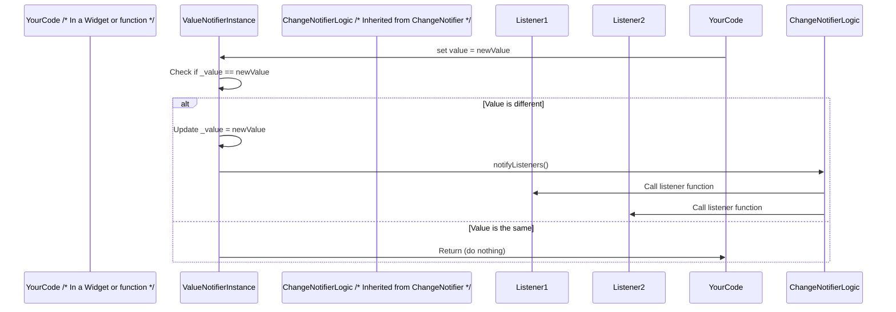

# Chapter 3: ValueNotifier

Welcome back! In our previous chapters, we learned about the fundamental building blocks for observation in Flutter: [ChangeNotifier](01_changenotifier_.md) (the manager that tells everyone something changed) and [Listenable](02_listenable_.md) (the general idea of an object that can be listened to).

Today, we're going to look at a really convenient helper class that builds directly on [ChangeNotifier](01_changenotifier_.md) and [Listenable](02_listenable_.md): the `ValueNotifier`.

### What is a ValueNotifier?

Imagine you have a single number you want to display in your app, like the temperature or a score. This number changes over time, and you want your display to update automatically whenever it changes.

You *could* create a custom class that uses [ChangeNotifier](01_changenotifier_.md) like we did in Chapter 1:

```dart
import 'package:flutter/foundation.dart';

class TemperatureDisplay with ChangeNotifier {
  double _degrees = 20.0; // Our temperature

  double get degrees => _degrees;

  void setTemperature(double newTemp) {
    if (_degrees != newTemp) { // Only update if it's actually different
      _degrees = newTemp;
      notifyListeners(); // Tell everyone it changed!
    }
  }
}
```

This works perfectly fine! But what if you *only* care about managing this *single* value and notifying listeners when *that specific value* changes? Writing this little extra code just to hold and manage one value can feel a bit repetitive.

This is where `ValueNotifier` comes in handy!

A `ValueNotifier` is specifically designed to wrap and manage a *single* piece of data. It combines the ability to hold a value *with* the ability to notify listeners when that value changes. It does all the heavy lifting of the `setTemperature` logic for you.

Think of it like a little box that holds one item. When you replace the item inside the box with a *different* item, the box automatically sends out a signal to everyone who is watching it.

### Why use ValueNotifier?

`ValueNotifier` simplifies common tasks where you need to make a single variable or property observable.

1.  **Simplicity:** It's less code than creating a custom [ChangeNotifier](01_changenotifier_.md) just to manage one value.
2.  **Focus:** It clearly indicates that the primary thing being observed is a specific value.
3.  **Convenience:** It provides a direct way to access the current value using its `value` property.

It's ideal for simple state like:
*   A loading status (true/false)
*   The currently selected item in a list
*   A simple counter (like our Chapter 1 example!)
*   A text field's current input

### How to use ValueNotifier

Using `ValueNotifier` is straightforward. You create an instance of it, giving it an initial value. You can then access and change the value directly using the `.value` property.

Here's how we could use a `ValueNotifier` for our temperature example:

```dart
import 'package:flutter/foundation.dart';

// Create a ValueNotifier holding a double value, starting at 20.0
final ValueNotifier<double> temperatureNotifier = ValueNotifier<double>(20.0);

void updateTemperature(double newTemp) {
  // Change the value directly using the .value property
  // ValueNotifier automatically checks if it's different and, if so,
  // calls notifyListeners() internally.
  temperatureNotifier.value = newTemp;
}

void main() {
  // Add a listener manually (usually done by widgets in Flutter)
  temperatureNotifier.addListener(() {
    print('Temperature changed to: ${temperatureNotifier.value} degrees');
  });

  print('Initial temperature: ${temperatureNotifier.value}'); // Output: 20.0

  // Update the temperature
  print('Setting temperature to 25.0...');
  updateTemperature(25.0); // This will call the listener

  // Update with the same value (listener is NOT called)
  print('Setting temperature to 25.0 again...');
  updateTemperature(25.0); // No output from listener this time

  // Update to a different value
  print('Setting temperature to 18.5...');
  updateTemperature(18.5); // This will call the listener

  // Don't forget to dispose of notifiers when done (important in real apps!)
  // temperatureNotifier.dispose(); // Covered in later chapters
}
```

If you run this code, the output would look like this:

```
Initial temperature: 20.0
Setting temperature to 25.0...
Temperature changed to: 25.0 degrees
Setting temperature to 25.0 again...
Setting temperature to 18.5...
Temperature changed to: 18.5 degrees
```

Notice that the listener function (`print('Temperature changed...')`) is only called when we set the value to `25.0` (because it was `20.0`) and when we set it to `18.5` (because it was `25.0`). Setting it to `25.0` again when it was already `25.0` does *not* trigger a notification. This is a key feature of `ValueNotifier` – it only notifies if the *value has actually changed* (based on the `==` operator).

To make a `ValueNotifier`, you simply call its constructor with the initial value:

```dart
ValueNotifier<int> score = ValueNotifier<int>(0);
```

To get the value:

```dart
int currentScore = score.value;
```

To change the value and potentially trigger notifications:

```dart
score.value = 100; // If score was not 100, listeners are notified
```

### Inside ValueNotifier

How does `ValueNotifier` achieve this? It extends [ChangeNotifier](01_changenotifier_.md)!

This means a `ValueNotifier` *is* a [ChangeNotifier](01_changenotifier_.md), so it automatically inherits the ability to manage listeners (`addListener`, `removeListener`, `notifyListeners`).

Here's a simplified look at its core structure (from the `change_notifier.dart` file you saw previously):

```dart
/// A [ChangeNotifier] that holds a single value.
/// ... explanation ...
class ValueNotifier<T> extends ChangeNotifier implements ValueListenable<T> {
  /// Creates a [ChangeNotifier] that wraps this value.
  ValueNotifier(this._value) { /* ... startup code ... */ }

  /// The current value stored in this notifier.
  /// ... explanation ...
  @override
  T get value => _value;
  T _value; // Holds the single value

  set value(T newValue) {
    // This is automatically called when you do `myNotifier.value = someValue;`
    if (_value == newValue) {
      return; // If the new value is the same, do nothing
    }
    _value = newValue; // Update the internal value
    notifyListeners(); // Inherited from ChangeNotifier, tells everyone!
  }

  // ... other methods ...
}
```

In this code:

1.  It `extends ChangeNotifier` and `implements ValueListenable<T>` (we'll cover `ValueListenable` in the next chapter!).
2.  It has an internal variable `_value` of type `T` to hold the data.
3.  The `value` property has both a `get` (to read the value) and a `set` (to change the value).
4.  The crucial part is the `set value`. When you assign a new value to `value`, this `set` method is executed.
5.  Inside the `set` method, it first checks `if (_value == newValue)`. This prevents unnecessary notifications if you set the value to what it already is.
6.  If the values are different, it updates `_value` to `newValue`.
7.  Finally, it calls `notifyListeners()`, which is the method inherited from [ChangeNotifier](01_changenotifier_.md), triggering all registered listeners just like we saw in Chapter 1.

Here's a quick sequence diagram showing what happens when you set the `value` property:



This diagram illustrates how your code setting the value first triggers the `ValueNotifier`'s internal check, and if the value is different, it uses the inherited [ChangeNotifier](01_changenotifier_.md) logic to notify listeners.

### Analogy Recap

*   `ValueNotifier`: The specialized box that holds *one* item. It checks if you replace the item with something *different* before telling anyone.
*   `value`: The item currently inside the box.
*   `set value = ...`: Replacing the item in the box.
*   Inherited [ChangeNotifier](01_changenotifier_.md): The underlying mechanism the box uses to manage its list of watchers and send out signals.
*   `notifyListeners()` (called internally by `set value`): The act of the box sending a signal ("Hey, my item changed!") to everyone watching.
*   Listeners: The people watching the box, waiting for a signal.

### Conclusion

`ValueNotifier` is a powerful and convenient class in Flutter for managing and observing changes to a single value. It saves you from writing boilerplate code by extending [ChangeNotifier](01_changenotifier_.md) and providing a simple `value` property that automatically handles updating the internal state and notifying listeners when the value changes.

It's a specific type of [ChangeNotifier](01_changenotifier_.md) focused on a single value and is often used for simple, localized state.

In the next chapter, we'll explore [ValueListenable](04_valuelistenable_.md), the interface that `ValueNotifier` implements, which is the *blueprint* for any object that exposes a `value` that can be listened to for changes.

[Next Chapter: ValueListenable](04_valuelistenable_.md)

---

Generated by [AI Codebase Knowledge Builder](https://github.com/The-Pocket/Tutorial-Codebase-Knowledge)