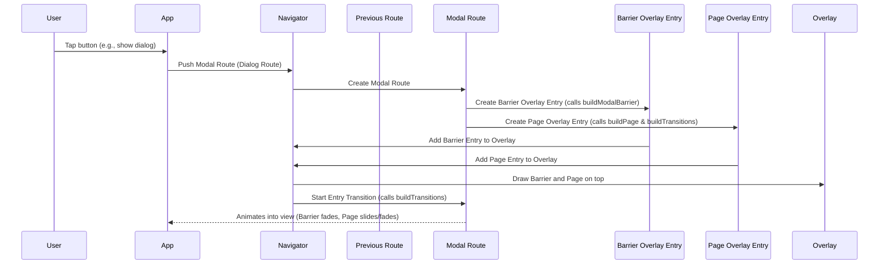
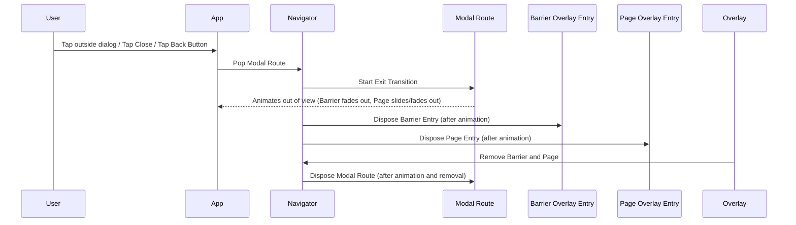

# Chapter 4: ModalRoute

Welcome back to our Flutter navigation journey! In the last chapter, [Chapter 3: OverlayRoute](03_overlayroute_.md), we learned how `OverlayRoute` allows us to display widgets on top of existing screens without replacing them entirely, kind of like putting a transparent layer on your playing cards. This is great for things like pop-ups.

But what about those times when you want to show something like a full-screen page *over* the previous one, but still indicate that the previous page is there in the background, maybe by dimming it? You also want to prevent the user from tapping on anything in the background. That's exactly what `ModalRoute` helps us with!

### What is a ModalRoute?

A `ModalRoute` is a specific and very common type of route in Flutter that creates a "modal" experience. Imagine you have your deck of playing cards ([Route](01_route_.md) stack). When you push a `ModalRoute` onto the stack, it's like putting a semi-transparent sheet over your playing cards. This sheet is called a **modal barrier**.

Here's what the modal barrier does:

1.  **Visual Indication:** It often slightly dims or blurs the screens below, making it clear that the new content is the primary focus.
2.  **Interaction Blocker:** It prevents you from touching or interacting with anything on the screens underneath it.
3.  **Dismissal:** Often, tapping this modal barrier dismisses the `ModalRoute` (like tapping outside a dialog to close it).

So, a `ModalRoute` isn't just about putting something *on top* like an `OverlayRoute`; it's about putting something *on top* with a special "modal" behavior that focuses the user's attention and blocks background interaction.

Common examples of things built using `ModalRoute` include:

*   **Dialogs:** The confirmation boxes or alert messages you see.
*   **Bottom Sheets:** Panels that slide up from the bottom (like the share sheet on your phone).
*   **Full-screen Modals:** Sometimes used for creating or editing items where you want a clear separation from the main flow.
*   **`MaterialPageRoute`:** One of the most common routes for navigating between full-screen pages in Material Design apps, it is a subclass of `ModalRoute`.

### Why Use ModalRoute?

`ModalRoute` provides the built-in mechanism for managing the modal barrier and handling its behavior (like tapping to dismiss). It also inherits the animation capabilities from `TransitionRoute` and the overlay management from `OverlayRoute`. This makes it the perfect foundation for creating screens and pop-ups that need this modal behavior.

Instead of building the dimming and tap-blocking logic yourself, you use a `ModalRoute` (or a route that extends `ModalRoute`) and configure its properties.

### Key Concepts of ModalRoute

Building on the concepts from [TransitionRoute](02_transitionroute_.md) and [OverlayRoute](03_overlayroute_.md), here are the key things that distinguish `ModalRoute`:

*   **Modal Barrier:** This is the defining feature. It's the visual overlay (often dimmed) that blocks interaction with routes below. `ModalRoute` handles creating and managing this barrier using an `OverlayEntry`.
*   **`barrierDismissible`:** A property that controls whether tapping the modal barrier will automatically pop (dismiss) the route.
*   **`barrierColor`:** The color to use for the modal barrier (often a semi-transparent black). If `null`, there's no visible barrier.
*   **`barrierLabel`:** A semantic label for the barrier, important for accessibility (for screen readers).
*   **Inherits Transitions:** Since it extends `TransitionRoute`, `ModalRoute` has the `animation` and `secondaryAnimation` properties and methods like `buildTransitions` to handle animated entrances and exits.
*   **Inherits Overlay Management:** Since it extends `OverlayRoute`, `ModalRoute` creates and manages `OverlayEntry`s to display its content and the modal barrier in the [Navigator](03_overlayroute_.md)'s `Overlay`.
*   **`buildPage` vs `buildTransitions`:** `ModalRoute` clearly separates the task of building the *content* of the screen (`buildPage`) from building the *animations* around that content (`buildTransitions`). `buildPage` is typically called once when the route is first built, while `buildTransitions` is called more frequently as the animation progresses.

### How ModalRoute Works (Conceptually)

When a `ModalRoute` is pushed onto the [Navigator](03_overlayroute_.md)'s stack:



Here's what's happening:

1.  The `ModalRoute` is created.
2.  It implements `createOverlayEntries()` (from `OverlayRoute`) to create *two* main `OverlayEntry`s: one for the **modal barrier** and one for the **page content** itself.
3.  The `buildModalBarrier()` method is called to create the barrier widget.
4.  The `buildPage()` method is called to create the main content widget of the route.
5.  The `buildTransitions()` method is called, which wraps the content returned by `buildPage` with transition widgets driven by the route's `animation` and `secondaryAnimation`.
6.  These two `OverlayEntry`s are added to the [Navigator](03_overlayroute_.md)'s `Overlay`. Crucially, the modal barrier `OverlayEntry` is positioned *below* the page content `OverlayEntry` in the `Overlay` stack.
7.  The transition animation (`animation`) starts. The barrier's opacity animates from transparent to the `barrierColor`, and the page content animates according to `buildTransitions`.

When the `ModalRoute` is popped (dismissed):



The animation runs in reverse, fading the barrier out and animating the page content away. Once the animation is complete, the `OverlayEntry`s for the barrier and the page are disposed, removing them from the `Overlay`, and you see the previous route again. `ModalRoute` manages this whole process.

### Looking at the Code

Let's examine relevant parts of the `ModalRoute` class definition from the provided snippet.

```dart
abstract class ModalRoute<T> extends TransitionRoute<T> with LocalHistoryRoute<T> {
  /// Creates a route that blocks interaction with previous routes.
  ModalRoute({super.settings, super.requestFocus, this.filter, this.traversalEdgeBehavior});

  // ... other properties and methods ...

  /// Whether you can dismiss this route by tapping the modal barrier.
  bool get barrierDismissible;

  /// The color to use for the modal barrier. If this is null, the barrier will
  /// be transparent.
  Color? get barrierColor;

  /// The semantic label used for a dismissible barrier.
  String? get barrierLabel;

  /// The curved that is used for animating the modal barrier in and out.
  Curve get barrierCurve => Curves.ease;

  /// Whether the route should remain in memory when it is inactive.
  bool get maintainState;

  // ... The API for subclasses to override ...

  /// Override this method to build the primary content of this route.
  Widget buildPage(
    BuildContext context,
    Animation<double> animation,
    Animation<double> secondaryAnimation,
  );

  /// Override this method to wrap the [child] with one or more transition
  /// widgets that define how the route arrives on and leaves the screen.
  Widget buildTransitions(
    BuildContext context,
    Animation<double> animation,
    Animation<double> secondaryAnimation,
    Widget child,
  ) {
    return child; // Default is no transition
  }

  // ... The API for subclasses to override - used by this class ...

  /// Build the barrier for this [ModalRoute], subclasses can override
  /// this method to create their own barrier with customized features such as
  /// color or accessibility focus size.
  Widget buildModalBarrier() { /* ... default implementation using AnimatedModalBarrier ... */ }

  // ... Internals ...

  @override
  Iterable<OverlayEntry> createOverlayEntries() {
    return <OverlayEntry>[
      _modalBarrier = OverlayEntry(builder: _buildModalBarrier),
      _modalScope = OverlayEntry(
        builder: _buildModalScope, // This builds the page content and transitions
        maintainState: maintainState,
        canSizeOverlay: opaque,
      ),
    ];
  }

  // ... more code ...
}
```

Notice these key points:

*   `extends TransitionRoute<T> with LocalHistoryRoute<T>`: It inherits all the animation features of `TransitionRoute` and capabilities related to local history from `LocalHistoryRoute`.
*   `barrierDismissible`, `barrierColor`, `barrierLabel`, `barrierCurve`: These are properties that subclasses must provide or can override to configure the modal barrier.
*   `maintainState`: Controls whether the route's widgets are kept alive even when it's not the current screen. Important for transitions and cases where you might need to access the previous route's state.
*   `buildPage()`: An abstract method (must be implemented by subclasses) that defines the main visual content of the route.
*   `buildTransitions()`: Can be overridden by subclasses to wrap the `child` (the result of `buildPage`) with custom transition widgets. The default just returns the child without transitions.
*   `buildModalBarrier()`: Can be overridden, but usually the default implementation is sufficient, using `AnimatedModalBarrier`.
*   `createOverlayEntries()`: Overrides the `OverlayRoute` method to create *two* `OverlayEntry`s: one for the barrier (`_modalBarrier`) and one for the page content and its transitions (`_modalScope`).

### Example: A Simple Custom ModalRoute (Conceptual)

Let's create a very basic custom `ModalRoute` that shows a solid color dimmed barrier and some text in the center, and can be dismissed by tapping the barrier.

```dart
import 'package:flutter/material.dart'; // For Colors and basic widgets
import 'package:flutter/widgets.dart'; // For abstract classes and core widgets
// ModalRoute is in flutter/src/widgets/routes.dart, but we import material.dart
// for convenience and common widgets like Material, Scaffold, Text, Center, etc.

// Extending ModalRoute directly is advanced. Usually you'd extend PageRoute
// (a subclass of ModalRoute) or use RouteBuilder.
// This example is for showing ModalRoute concepts.
class SimpleModalRoute extends ModalRoute<void> {

  final String message;

  SimpleModalRoute({required this.message, super.settings});

  @override
  Duration get transitionDuration => const Duration(milliseconds: 300); // How long animations take

  @override
  Duration get reverseTransitionDuration => const Duration(milliseconds: 300); // How long reverse animations take

  @override
  bool get barrierDismissible => true; // Can tap barrier to dismiss

  @override
  Color? get barrierColor => Colors.black.withOpacity(0.5); // Semi-transparent black barrier

  @override
  String? get barrierLabel => 'Dismiss Simple Modal'; // Accessibility label

  @override
  bool get opaque => false;
  // It's not fully opaque immediately because the barrier and content
  // are animating in. The ModalRoute's internal logic sets opaque to true
  // on an OverlayEntry once the animation is complete if the route is opaque.
  // For a dialog like this, it's generally not considered fully "opaque" in
  // the sense of completely covering the previous route's render object.

  @override
  bool get maintainState => true; // Keep previous route state

  // This is where we build the main content of the modal screen.
  @override
  Widget buildPage(
    BuildContext context,
    Animation<double> animation,
    Animation<double> secondaryAnimation,
  ) {
    // The actual content of your modal.
    return Material( // Standard Material design container
      type: MaterialType.transparency, // Don't show default Material background
      child: Center( // Center the content
        child: Card( // A simple card for the message
          margin: const EdgeInsets.all(40.0),
          child: Padding(
            padding: const EdgeInsets.all(16.0),
            child: Text(message), // Display the message
          ),
        ),
      ),
    );
  }

  // This is where we define entrance and exit animations around the content.
  @override
  Widget buildTransitions(
    BuildContext context,
    Animation<double> animation,
    Animation<double> secondaryAnimation,
    Widget child, // This is the widget returned by buildPage
  ) {
    // Use a FadeTransition for the content.
    return FadeTransition(
      opacity: animation, // Drive opacity with the primary animation (0.0 to 1.0)
      child: child, // The content from buildPage
    );
    // We could add more complex transitions here if needed,
    // potentially using secondaryAnimation as well.
  }
}
```

To show this conceptual route, you would use `Navigator.push`:

```dart
// Assuming you are in a widget that has access to BuildContext
ElevatedButton(
  onPressed: () {
    Navigator.of(context).push(
      SimpleModalRoute(message: 'This is my simple modal!'),
    );
  },
  child: const Text('Show Simple Modal'),
)
```

When you tap the button:

1.  A `SimpleModalRoute` instance is created.
2.  It's pushed onto the [Navigator](03_overlayroute_.md)'s stack.
3.  `createOverlayEntries()` is called, creating an `OverlayEntry` for the barrier and an `OverlayEntry` for the page content.
4.  The barrier `OverlayEntry`'s builder calls `buildModalBarrier()`, which creates an `AnimatedModalBarrier`. Since `barrierColor` is set, it will animate to semi-transparent black.
5.  The page content `OverlayEntry`'s builder calls `_buildModalScope`, which internally calls `buildPage()` (to get the `Card` with the `Text`) and `buildTransitions()` (which adds a `FadeTransition` around the card).
6.  Both `OverlayEntry`s are added to the [Navigator](03_overlayroute_.md)'s `Overlay`.
7.  Since `buildTransitions` uses the `animation`, the `Card` widget will fade in as the route pushes.
8.  Since `barrierDismissible` is true, tapping the semi-transparent area around the card will pop (dismiss) the route.

### Conclusion

In this chapter, we explored `ModalRoute`, a crucial abstraction in Flutter navigation that provides a "modal" user experience. We learned how it builds upon [TransitionRoute](02_transitionroute_.md) and [OverlayRoute](03_overlayroute_.md) to add features like the modal barrier (with properties like `barrierDismissible` and `barrierColor`) and clearly separates content building (`buildPage`) from transition building (`buildTransitions`). Understanding `ModalRoute` is fundamental to working with common routes like `MaterialPageRoute` and creating your own custom modal experiences.

In the next chapter, we'll look at [PopupRoute](05_popuproute_.md), a specific type of `ModalRoute` often used for menus and other non-fullscreen overlays.

[Chapter 5: PopupRoute](05_popuproute_.md)

---

Generated by [AI Codebase Knowledge Builder](https://github.com/The-Pocket/Tutorial-Codebase-Knowledge)