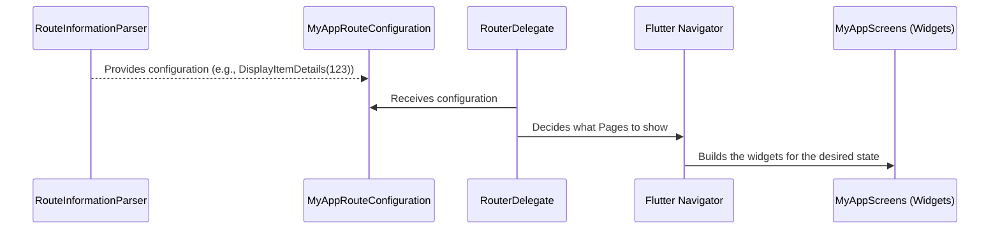

# Chapter 4: RouterDelegate

Welcome back to our Flutter routing journey! In the previous chapters, we learned about [RouteInformation](01_routeinformation_.md) (the note about our desired location) and the [RouteInformationProvider](02_routeinformationprovider_.md) (the sensor that provides this note). We then saw how the [RouteInformationParser](03_routeinformationparser_.md) acts as the translator, turning the raw [RouteInformation](01_routeinformation_.md) into a clean, structured app configuration that our app understands.

Now, what do we *do* with this structured configuration? How do we actually display the right screens and build the visual layout of our app based on it?

This is the job of the `RouterDelegate`!

## What is a RouterDelegate?

Think of the `RouterDelegate` as the **main builder** or the **presenter** of your app's layout for routing. It receives the structured configuration (the output from the [RouteInformationParser](03_routeinformationparser_.md)) and is responsible for:

1.  **Building the UI:** Deciding which widgets to show based on the configuration. This commonly involves creating a `Navigator` widget, which manages a stack of `Page` objects (which represent your screens).
2.  **Handling Configuration Changes:** Updating the UI when the configuration changes (e.g., the user navigates to a different screen).
3.  **Handling Pop Requests:** Responding to requests to "go back" (like the user pressing the system back button) and determining if the current screen can be popped.

Essentially, the `RouterDelegate` takes the "what" (the desired state/configuration) and creates the "how" (the actual widgets on the screen).

Let's look at our item detail example again:



In this flow:
1.  The [RouteInformationParser](03_routeinformationparser_.md) gives us our `MyAppRouteConfiguration` (like `DisplayItemDetails(123)`).
2.  The `RouterDelegate` gets this configuration.
3.  Based on the configuration, the `RouterDelegate` decides which screens should be visible. In a common pattern, it builds or updates a `Navigator` widget.
4.  The `Navigator` then takes care of displaying the appropriate `Page` widgets for those screens.

## Why Do We Need a RouterDelegate?

Without a `RouterDelegate`, the `Router` wouldn't know how to translate the parsed route information into a visual representation. It doesn't know *which* widgets correspond to your app's `MyAppRouteConfiguration`.

The `RouterDelegate` decouples the parsing logic (handled by the [RouteInformationParser](03_routeinformationparser_.md)) from the UI building logic. This allows you to:

*   **Define your UI structure separately:** You can decide how screens are stacked (using `Navigator`), shown in tabs, or arranged in any other layout based on the route.
*   **Control animated transitions:** The `Navigator` built by the delegate handles screen transitions.
*   **Manage screen state:** The delegate often holds the current app configuration and uses it to manage the state of the screens being displayed.
*   **Handle back button behavior:** The delegate is the primary place to implement custom logic for what happens when the user presses the back button ([Chapter 6: BackButtonDispatcher](06_backbuttondispatcher_.md) will notify the delegate).

## How to Create a Simple RouterDelegate

Using our `MyAppRouteConfiguration` from [Chapter 3](03_routeinformationparser_.md), let's create a simple `RouterDelegate` that shows either a Home screen or an Item Detail screen using a `Navigator`.

We need to extend `RouterDelegate<T>` where `T` is our configuration type (`MyAppRouteConfiguration`). We also need to implement the `Listenable` interface (often done using a `ChangeNotifier` or mixing in `PopNavigatorRouterDelegateMixin` and extending `ChangeNotifier`). For building a `Navigator`, the `PopNavigatorRouterDelegateMixin` is very commonly used, as it automatically hooks the `popRoute` method to the `Navigator`.

```dart
import 'package:flutter/foundation.dart'; // For ChangeNotifier and SynchronousFuture
import 'package:flutter/material.dart';   // For Navigator and Button

// Re-using our configuration from Chapter 3
enum MyAppPath {
  home,
  itemDetail,
}

class MyAppRouteConfiguration {
  final MyAppPath path;
  final int? itemId;

  MyAppRouteConfiguration.home()
      : path = MyAppPath.home,
        itemId = null;

  MyAppRouteConfiguration.itemDetail(this.itemId)
      : path = MyAppPath.itemDetail,
        assert(itemId != null);

  bool get isHomePage => path == MyAppPath.home;
  bool get isItemDetailPage => path == MyAppPath.itemDetail;
}

// Our RouterDelegate
class MyAppRouterDelegate extends RouterDelegate<MyAppRouteConfiguration>
    with ChangeNotifier, PopNavigatorRouterDelegateMixin<MyAppRouteConfiguration> {

  // Required by PopNavigatorRouterDelegateMixin
  @override
  final GlobalKey<NavigatorState> navigatorKey = GlobalKey<NavigatorState>();

  // This holds the current configuration received from the parser
  MyAppRouteConfiguration? _currentConfiguration;

  // This getter is called by the Router to know the current state
  @override
  MyAppRouteConfiguration? get currentConfiguration => _currentConfiguration;

  // This is called by the Router when a new route is parsed
  @override
  Future<void> setNewRoutePath(MyAppRouteConfiguration configuration) {
    // Update our internal state with the new configuration
    _currentConfiguration = configuration;
    // Notify listeners (the Router) to rebuild
    notifyListeners();
    // Return a completed future since this is synchronous
    return SynchronousFuture<void>(null);
  }

  // PopRoute is handled by PopNavigatorRouterDelegateMixin

  // This is where we build the UI based on the current configuration
  @override
  Widget build(BuildContext context) {
    List<Page> pages = [];

    // Always show the Home page as the base
    pages.add(
       MaterialPage( // MaterialPage provides platform-specific transitions
         child: HomePage(
           // Function to navigate to item detail
           onItemTapped: (itemId) {
             // Update configuration internally and notify listeners
             setNewRoutePath(MyAppRouteConfiguration.itemDetail(itemId));
           },
         ),
         key: const ValueKey('HomePage'), // Unique key for Navigator
       )
    );

    // If configuration indicates item detail, add that page on top
    if (_currentConfiguration?.isItemDetailPage == true) {
      pages.add(
        MaterialPage(
          child: ItemDetailPage(
            itemId: _currentConfiguration!.itemId!,
          ),
          key: ValueKey('ItemDetailPage-${_currentConfiguration!.itemId}'), // Unique key including ID
        )
      );
    }

    // Build a Navigator with the determined list of pages
    return Navigator(
      key: navigatorKey,
      pages: pages,
      onPopPage: (route, result) {
        // Handle when a route is popped from the Navigator (e.g., by tapping back button on app bar)
        if (!route.didPop(result)) {
          return false;
        }

        // If a page was popped, update our configuration by going back to home
        // In a real app, this logic would be more complex to handle nested routes
        if (_currentConfiguration?.isItemDetailPage == true) {
           setNewRoutePath(MyAppRouteConfiguration.home());
        }

        return true; // Tell the Navigator the pop was handled
      },
    );
  }

  // dispose method inherited from ChangeNotifier
}

// Dummy widgets for our screens
class HomePage extends StatelessWidget {
   const HomePage({super.key, required this.onItemTapped});
   final void Function(int) onItemTapped;

   @override
   Widget build(BuildContext context) {
     return Scaffold(
       appBar: AppBar(title: const Text('Home')),
       body: Center(
         child: Column(
           mainAxisAlignment: MainAxisAlignment.center,
           children: <Widget>[
             const Text('Home Screen'),
             ElevatedButton(
               onPressed: () => onItemTapped(123), // Navigate to item 123
               child: const Text('Go to Item 123'),
             ),
           ],
         ),
       ),
     );
   }
}

class ItemDetailPage extends StatelessWidget {
   const ItemDetailPage({super.key, required this.itemId});
   final int itemId;

   @override
   Widget build(BuildContext context) {
     return Scaffold(
       appBar: AppBar(title: Text('Item $itemId Details')),
       body: Center(
         child: Text('Details for Item ID: $itemId'),
       ),
     );
   }
}
```

Let's break down the `MyAppRouterDelegate`:

1.  **`navigatorKey`:** Required by `PopNavigatorRouterDelegateMixin`. This key is used to get a reference to the `NavigatorState` (`navigatorKey.currentState`). The mixin's `popRoute` uses this to call `navigator?.maybePop()`.
2.  **`_currentConfiguration`:** A private variable to store the latest configuration we received.
3.  **`currentConfiguration` getter:** The `Router` calls this to get the current state of our delegate. This is important for the [RouteInformationParser](03_routeInformationParser_.md)'s `restoreRouteInformation` method (to convert back to raw [RouteInformation](01_routeInformation_.md)) and for state restoration.
4.  **`setNewRoutePath(MyAppRouteConfiguration configuration)`:** This is the core method called by the `Router` after the [RouteInformationParser](03_routeInformationParser_.md) successfully translates `RouteInformation` into `MyAppRouteConfiguration`.
    *   We update `_currentConfiguration` with the new `configuration`.
    *   We call `notifyListeners()`. This tells the `Router` that our delegate's state has changed and it needs to `rebuild`. When the `Router` rebuilds, it calls our `build` method.
    *   We return a `SynchronousFuture` because our update is immediate.
5.  **`popRoute()`:** This is implemented by `PopNavigatorRouterDelegateMixin`. It automatically calls the `maybePop()` method on the `Navigator` instance identified by `navigatorKey`. `Navigator.maybePop()` attempts to pop the topmost route. If successful, it returns `true`; otherwise, `false`. This result is then returned by `popRoute`, and the [BackButtonDispatcher](06_backbuttondispatcher_.md) uses it to decide if the pop was handled or if it should bubble the back request further.
6.  **`build(BuildContext context)`:** This is where the UI is constructed.
    *   We create a list of `Page` objects. A `Navigator` displays pages based on this list.
    *   We always add the `HomePage` as the base page.
    *   We check `_currentConfiguration`. If it indicates `isItemDetailPage`, we add the `ItemDetailPage` to the list. Since the `ItemDetailPage` is added *after* the `HomePage`, it will be displayed on top in the `Navigator` stack.
    *   We return a `Navigator` widget. We provide our `navigatorKey`.
    *   `onPopPage` is a callback for the `Navigator`. It's triggered when a page asks to be popped (e.g., by the user pressing the back arrow in an `AppBar`, *not* the system back button, which is handled by `popRoute`). We check if the pop was handled and, if so, update our internal configuration to navigate back (in this simple case, back to home).

Now, when the [RouteInformationParser](03_routeInformationParser_.md) gives `MyAppRouterDelegate` a configuration like `MyAppRouteConfiguration.itemDetail(123)`, the delegate updates its internal state, calls `notifyListeners`, the `Router` rebuilds, the `build` method is called, the `Navigator` gets a list of pages with the `HomePage` and `ItemDetailPage(123)`, and the Navigator shows the Item Detail screen on top!

## Internal View (How Flutter Uses It)

Let's revisit the `Router`'s internal state (`packages/flutter/lib/src/widgets/router.dart`) to see how it interacts with the `RouterDelegate`.

As we saw in [Chapter 3](03_routeinformationparser_.md), after the [RouteInformationParser](03_routeInformationParser.md) successfully calls `parseRouteInformationWithDependencies` and the `Future` completes, the `_processParsedRouteInformation` method handles the result:

```dart
// Snippet from _RouterState._processParsedRouteInformation
_RouteSetter<T> _processParsedRouteInformation(
  Object? transaction, // Unused in this simplified view
  ValueGetter<_RouteSetter<T>> delegateRouteSetter, // Function to get the delegate's setter
) {
  return (T data) async { // 'data' is the parsed config (MyAppRouteConfiguration)
    // Call the appropriate delegate method with the parsed data!
    await delegateRouteSetter()(data);
    // After the delegate finishes setting the new path, rebuild
    // (provided no other transactions interfered)
    _rebuild();
  };
}
```

This confirms that the `Router` calls the `setNewRoutePath` (or `setInitialRoutePath`/`setRestoredRoutePath`) method on the `routerDelegate` instance using the parsed configuration data (`T`, our `MyAppRouteConfiguration`). Once that method completes, the `Router` calls `_rebuild()`, which triggers `setState` and causes the `Router` widget itself to rebuild. This rebuild is what ultimately calls the `routerDelegate`'s `build` method to generate the UI.

The `Router` also listens to the `RouterDelegate` for notifications. This connection is made in the `_RouterState.initState` method:

```dart
// Snippet from _RouterState.initState
@override
void initState() {
  super.initState();
  // ... other listeners ...
  // Router listens to the delegate!
  widget.routerDelegate.addListener(_handleRouterDelegateNotification);
}
```

And the `_handleRouterDelegateNotification` method:

```dart
// Snippet from _RouterState._handleRouterDelegateNotification
void _handleRouterDelegateNotification() {
  // When the delegate notifies, rebuild the Router
  setState(() {
    /* routerDelegate wants to rebuild */
  });
  // And potentially report the new route information
  _maybeNeedToReportRouteInformation();
}
```

This is crucial! When our `MyAppRouterDelegate` calls `notifyListeners()` in its `setNewRoutePath`, this method (`_handleRouterDelegateNotification`) is triggered. This causes the `Router`'s `setState` to run, leading to a rebuild and a call to our delegate's `build` method.

Finally, the `Router` uses the delegate for handling back button presses. The [BackButtonDispatcher](06_backbuttondispatcher_.md) notifies the `Router`, which calls `_handleBackButtonDispatcherNotification`:

```dart
// Snippet from _RouterState._handleBackButtonDispatcherNotification
Future<bool> _handleBackButtonDispatcherNotification() {
  _currentRouterTransaction = Object(); // Start a new transaction
  // Call the delegate's popRoute method!
  return widget.routerDelegate.popRoute().then<bool>(
    _handleRoutePopped(_currentRouterTransaction), // Process the result
  );
}
```

Here, the `Router` calls the `routerDelegate.popRoute()` method. As we discussed, if you're using `PopNavigatorRouterDelegateMixin`, this calls `navigatorKey.currentState?.maybePop()`. The `Router` waits for the result of `popRoute` (true if handled, false otherwise) and uses it to determine the next steps, including whether to rebuild or allow the back event to bubble up further.

These internal methods clearly show how the `RouterDelegate` is central to the process: the `Router` *calls* the delegate to set the new route and *calls* it to handle pops, and the delegate asynchronously *notifies* the router when its internal state changes and it needs to rebuild the UI.

## Conclusion

The `RouterDelegate` is the powerhouse of your Flutter router. It's the component that takes the parsed route configuration and transforms it into the visual layout of your application, typically by building or updating a `Navigator` widget. You implement its methods (`setNewRoutePath`, `popRoute`, `build`, and `currentConfiguration`) to control how routes are displayed and how back button presses are handled. By notifying its listeners (`notifyListeners()`), it signals the `Router` to rebuild the UI based on the updated state.

In the next chapter, we'll see how the [Router](05_router_.md) widget itself orchestrates all these pieces – the [RouteInformationProvider](02_routeinformationprovider_.md), the [RouteInformationParser](03_routeinformationparser_.md), and the `RouterDelegate`.

[Next Chapter: Router](05_router_.md)

---

Generated by [AI Codebase Knowledge Builder](https://github.com/The-Pocket/Tutorial-Codebase-Knowledge)