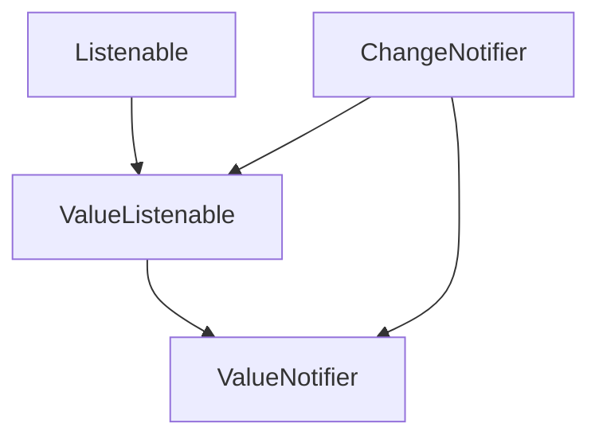

# Chapter 4: ValueListenable

Welcome back! We've been building up our understanding of how objects in Flutter can announce changes. We started with [ChangeNotifier](01_changenotifier_.md), the general concept of managing listeners, and then looked at [Listenable](02_listenable_.md), the interface that defines the ability to be listened to. In our last chapter, we saw [ValueNotifier](03_valuelistenable_.md), a convenient class that wraps a single value and extends [ChangeNotifier](01_changenotifier_.md).

Now, let's explore the idea that [ValueNotifier](03_valuelistenable_.md) *implements*: the `ValueListenable`.

### What is a ValueListenable?

Remember how a [Listenable](02_listenable_.md) is the blueprint for *any* object that can be listened to? A `ValueListenable` is a more specific kind of blueprint. It's for objects that not only can be listened to, but also hold a *specific* value that can change.

Think of it like this:

*   A [Listenable](02_listenable_.md) is a "can be watched" sign.
*   A `ValueListenable` is a "can be watched, *and* I have a value you can look at" sign.

So, a `ValueListenable` is an object that:

1.  Implements the [Listenable](02_listenable_.md) interface (meaning you can add and remove listeners).
2.  Exposes a `.value` property that gives you the current value it holds.
3.  Notifies its listeners whenever that `.value` changes.

Our [ValueNotifier](03_valuelistenable_.md) from the last chapter is a perfect example of a `ValueListenable`. It holds a value (like the temperature) and tells you when it changes.

### Why do we need ValueListenable?

You might be thinking, "Okay, so [ValueNotifier](03_valuelistenable_.md) does this. Why do I need a separate term `ValueListenable`?"

The `ValueListenable` is an *interface*. This means it's a contract or a set of rules that any class can choose to follow. By defining the `ValueListenable` interface, Flutter allows different classes to provide the same "has a value that can change and be listened to" capability.

This is powerful because widgets and other parts of Flutter can be built to work with *any* `ValueListenable`, not just specifically a [ValueNotifier](03_valuelistenable_.md).

For example, Flutter has a widget called `ValueListenableBuilder`. This widget knows how to listen to *any* object that follows the `ValueListenable` rules and rebuild itself whenever that object's value changes. It doesn't care if you give it a [ValueNotifier](03_valuelistenable_.md), an `Animation` (which also happens to be a `ValueListenable`), or your own custom class that implements `ValueListenable`.

It promotes **code reusability and flexibility**.

### How does ValueListenable work?

Since `ValueListenable` is an interface (like [Listenable](02_listenable_.md)), you don't create instances of it directly. You create instances of classes that *implement* the `ValueListenable` interface. The most common one you'll encounter for simple values is [ValueNotifier](03_valuelistenable_.md), which we just learned about.

The `ValueListenable` interface (found in the same `change_notifier.dart` file we've been looking at) defines two things:

1.  It extends the `Listenable` interface.
2.  It requires a `get value` getter.

Here's the interface definition:

```dart
abstract class ValueListenable<T> extends Listenable {
  // Abstract const constructor ...

  /// The current value of the object. When the value changes, the callbacks
  /// registered with [addListener] will be invoked.
  T get value;
}
```

*   `abstract class ValueListenable<T>`: This declares the interface. The `<T>` means it works with any type of data (like `int`, `double`, `String`, or your own custom classes).
*   `extends Listenable`: This confirms that a `ValueListenable` is also a regular [Listenable](02_listenable_.md). It inherits the `addListener` and `removeListener` methods.
*   `T get value;`: This is the key part. Any class implementing `ValueListenable<T>` *must* provide a way to read its current value, and that way is accessed via a property called `value` which returns data of type `T`.

Remember our [ValueNotifier](03_valuelistenable_.md) from the last chapter? It implements this interface:

```dart
class ValueNotifier<T> extends ChangeNotifier implements ValueListenable<T> {
  // ... (constructor and internal _value) ...

  @override // <-- This annotation reminds us we are fulfilling an interface requirement
  T get value => _value;

  set value(T newValue) {
    // ... (checks for equality and calls notifyListeners) ...
  }
}
```

The `@override` annotation here is helpful because it explicitly shows that `ValueNotifier` is providing the `get value` method as required by the `ValueListenable<T>` interface.

### Using ValueListenable (via ValueListenableBuilder)

The most common way you'll interact with `ValueListenable` in Flutter UI is through widgets designed to work with them, like `ValueListenableBuilder`.

Let's revisit our counter example, but this time using `ValueListenableBuilder` and a simple `ValueNotifier` (which is a `ValueListenable`):

```dart
import 'package:flutter/material.dart';

void main() {
  runApp(MyApp());
}

class MyApp extends StatelessWidget {
  @override
  Widget build(BuildContext context) {
    return MaterialApp(
      home: CounterPage(),
    );
  }
}

// Our ValueListenable holds the counter value
final ValueNotifier<int> counter = ValueNotifier<int>(0);

// A simple page with a ValueListenableBuilder and a button.
class CounterPage extends StatelessWidget {
  @override
  Widget build(BuildContext context) {
    return Scaffold(
      appBar: AppBar(title: Text('ValueListenable Example')),
      body: Center(
        // ValueListenableBuilder listens to the 'counter' ValueNotifier
        child: ValueListenableBuilder<int>(
          valueListenable: counter, // This is our ValueListenable!
          builder: (context, currentValue, child) {
            // This builder function is called whenever counter.value changes.
            // 'currentValue' is the current value from the ValueListenable.
            return Text(
              'Counter: $currentValue', // Display the current value
              style: TextStyle(fontSize: 30),
            );
          },
        ),
      ),
      floatingActionButton: FloatingActionButton(
        onPressed: () {
          // Increment the value of the ValueNotifier
          counter.value++;
        },
        child: Icon(Icons.add),
      ),
    );
  }
}
```

When you run this app:

1.  The `ValueNotifier<int> counter` is created with an initial value of 0.
2.  The `ValueListenableBuilder` is built. It's given our `counter` object as its `valueListenable`.
3.  The `ValueListenableBuilder` immediately calls its `builder` function for the first time, receiving the initial `counter.value` (which is 0). The `Text` widget displays "Counter: 0".
4.  When you tap the `FloatingActionButton`, `counter.value++` is called.
5.  Because we set `counter.value` to a new value (1), the `ValueNotifier` (which is a `ValueListenable`) calls its `notifyListeners()` method internally.
6.  The `ValueListenableBuilder` is one of the listeners! It receives the notification.
7.  The `ValueListenableBuilder` then tells Flutter to rebuild only the part of the UI inside its `builder` function.
8.  The `builder` function is called *again*, this time receiving the new `counter.value` (which is 1). The `Text` widget updates to "Counter: 1".
9.  This process repeats every time you tap the button.

The `ValueListenableBuilder` is able to do this because `ValueNotifier` implements the `ValueListenable` interface. The builder widget simply cares that the object it's given adheres to the `ValueListenable` contract (it can be listened to, and it has a `value`).

### ValueListenable + Listenable + ChangeNotifier + ValueNotifier

Let's quickly recap how these four concepts relate using our analogies:

*   **The Change:** The specific event (the counter goes from 0 to 1).
*   **Listenable (Blueprint):** The general idea of an object that *can* be watched for changes (`addListener`, `removeListener`). Sign: "Can be watched".
*   **ValueListenable (More Specific Blueprint):** The idea of an object that *can* be watched AND holds a `value` that changes. Sign: "Can be watched, and I have a value you can look at".
*   **ChangeNotifier (Implementation):** A class that provides the *actual code* to manage a list of listeners and notify them. Engine: The system that keeps track of watchers and sends messages.
*   **ValueNotifier (Specific Implementation):** A class that *extends* [ChangeNotifier](01_changenotifier_.md) and *implements* `ValueListenable`. It specifically wraps a single value and notifies listeners *only* when that value changes. It's the specialized box with a window that calls its parent ([ChangeNotifier](01_changenotifier_.md)) when the item inside is replaced with a different one.

Here's a simple diagram showing the relationship between the concepts:



This diagram visually represents:
*   A `ValueListenable` *is a type of* [Listenable](02_listenable_.md).
*   [ValueNotifier](03_valuenotifier_.md) *is a type of* [ChangeNotifier](01_changenotifier_.md).
*   [ValueNotifier](03_valuenotifier_.md) *implements* the `ValueListenable` interface.
*   [ChangeNotifier](01_changenotifier_.md) implements [Listenable](02_listenable_.md) (though not explicitly shown inheriting in this simple diagram, it's part of its definition).

Essentially, `ValueListenable` is the contract that `ValueNotifier` follows, allowing widgets like `ValueListenableBuilder` to work with it without needing to know it's specifically a [ValueNotifier](03_valuelistenable_.md).

### Conclusion

In this chapter, we learned about the `ValueListenable` interface. We saw that it's a type of [Listenable](02_listenable_.md) that specifically deals with objects that hold a value and notify listeners when that value changes. We understood why having this interface is important for building flexible Flutter widgets like `ValueListenableBuilder`.

We reinforced that [ValueNotifier](03_valuenotifier_.md) is a common class that implements the `ValueListenable` interface, making it easy to create and use observable single values in your application.

You now have a solid understanding of the four key concepts: [ChangeNotifier](01_changenotifier_.md), [Listenable](02_listenable_.md), [ValueNotifier](03_valuenotifier_.md), and ValueListenable. These form the bedrock for many Flutter state management approaches!

---

Generated by [AI Codebase Knowledge Builder](https://github.com/The-Pocket/Tutorial-Codebase-Knowledge)