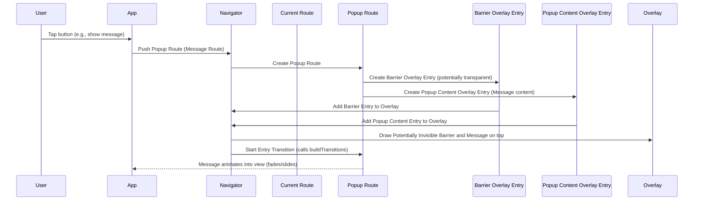
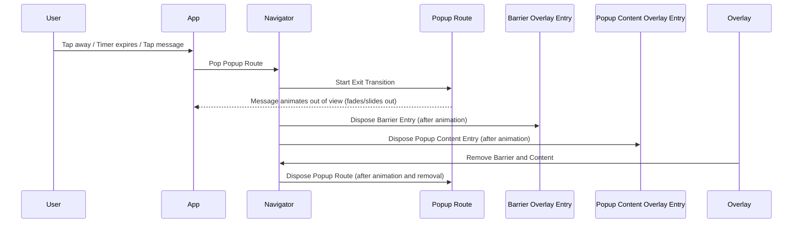

# Chapter 5: PopupRoute

Welcome back! In [Chapter 4: ModalRoute](04_modalroute_.md), we learned about `ModalRoute`, a powerful tool for creating screens or overlays that block interaction with the content below, often with a dimming "modal barrier." This is perfect for full-screen pages and dialogs that demand the user's full attention.

But sometimes, you need something lighter – a small menu that pops up, an informational bubble, or a simple toast message. These aren't full-screen pages and they don't always need a heavy modal barrier. They're more like small pieces of content that temporarily appear *on top* of the current screen. That's where `PopupRoute` comes in!

### What is a PopupRoute?

Think of our playing cards again, representing your screens ([Route](01_route_.md)s). A `PopupRoute` is like a very specific kind of transparent card you put on top, but it only contains a *small* image or text snippet, centered or placed in a specific spot. It doesn't usually cover the whole card below, and while it's technically a type of [ModalRoute](04_modalroute_.md) (meaning it can have a barrier), that barrier is often transparent or very light, and it might not block gestures to the same extent as a full modal.

The key idea is that a `PopupRoute` is designed for temporary, often non-fullscreen, overlay content.

Use cases for things that often use `PopupRoute` (or routes built on top of it) include:

*   **Dropdown menus:** When you tap a button and a small list of options appears below it.
*   **Tooltips:** The small informational boxes that appear when you long-press a UI element.
*   **Simple Popover notifications:** Small messages that appear briefly.

### Why Use PopupRoute?

`PopupRoute` is a specialized type of [ModalRoute](04_modalroute_.md) that comes with some default behaviors suitable for pop-up style elements. By inheriting from [ModalRoute](04_modalroute_.md), it automatically gets the ability to be displayed in the [Navigator](03_overlayroute_.md)'s [Overlay](03_overlayroute_.md) ([OverlayRoute](03_overlayroute_.md)) and handle entrance/exit animations ([TransitionRoute](02_transitionroute_.md)).

However, `PopupRoute` overrides some of the default `ModalRoute` properties to make it better suited for pop-ups:

*   **`opaque` is `false`:** By default, pop-ups are not fully opaque. You can usually see through them to the content below, or they only cover a small area. This is different from a full-screen page route where `opaque` is usually true.
*   **`maintainState` is `true`:** Pop-ups often appear and disappear quickly. Keeping the state of the route below them active can make transitions smoother.
*   **`allowSnapshotting` is `false`:** Pop-up animations are typically lightweight coordinate system transitions, rather than full-screen snapshots.

You won't usually create a raw `PopupRoute` yourself. You'll typically use concrete subclasses provided by the framework or packages, or build your own custom routes that extend `PopupRoute` for specialized pop-up needs. For example, the internal routes used for `showMenu` often extend `PopupRoute`.

### Key Concepts of PopupRoute

Since `PopupRoute` extends [ModalRoute](04_modalroute_.md), it inherits most of its concepts like the barrier (though often transparent), dismissibility, animation, and overlay management. The main distinctions are the default values for the properties mentioned above:

*   `opaque`: Defaults to `false` (not fully covering the previous route).
*   `maintainState`: Defaults to `true` (previous route state is maintained).
*   `allowSnapshotting`: Defaults to `false` (doesn't use snapshots for transitions).
*   **Content Placement:** While the base `PopupRoute` doesn't dictate *where* on the screen the pop-up appears, concrete subclasses will handle positioning (e.g., relative to a button for a dropdown).
*   **Minimal Barrier:** Often configured with a fully transparent or nearly transparent barrier or no barrier at all, as interaction blocking might not be the primary goal.

### How PopupRoute Works (Conceptually simplified)

Let's imagine a simple pop-up message. When a `PopupRoute` for this message is pushed:



Similar to a regular [ModalRoute](04_modalroute_.md), it creates `OverlayEntry`s for a barrier (even if transparent) and its content, adding them to the [Navigator](03_overlayroute_.md)'s `Overlay`. The difference is in how these entries are built and behave based on the `PopupRoute`'s default properties and the specific implementation of the pop-up itself (e.g., its size, position, and custom transitions).

When the `PopupRoute` is popped (the message disappears or is tapped):



The animation runs in reverse, and the `OverlayEntry`s are removed.

### Looking at the Code

Let's look at the simple definition of the `PopupRoute` class from the provided snippet.

```dart
abstract class PopupRoute<T> extends ModalRoute<T> {
  /// Initializes the [PopupRoute].
  PopupRoute({super.settings, super.requestFocus, super.filter, super.traversalEdgeBehavior});

  @override
  bool get opaque => false;

  @override
  bool get maintainState => true;

  @override
  bool get allowSnapshotting => false;
}
```

As you can see:

*   `abstract class PopupRoute<T> extends ModalRoute<T>`: It directly inherits from [ModalRoute](04_modalroute_.md).
*   It overrides three properties: `opaque`, `maintainState`, and `allowSnapshotting` to provide the default behaviors expected for pop-up style routes. These defaults are specifically chosen because pop-ups typically appear as overlays without fully obscuring the previous route (`opaque: false`), often need the previous route's state intact for smooth transitions (`maintainState: true`), and rely on widget-based position/size animations rather than rendering snapshots (`allowSnapshotting: false`).

These simple overrides make `PopupRoute` a convenient starting point for creating new types of pop-up overlays.

### Example: A Simple Pop-up with RawDialogRoute

While directly extending `PopupRoute` is less common for beginners, `RawDialogRoute` (which `showGeneralDialog` uses internally) *is* a `PopupRoute`. Let's revisit a slightly modified conceptual example using `RawDialogRoute` to see how it aligns with `PopupRoute` characteristics.

`RawDialogRoute` inherently embodies the `PopupRoute` concept because it's designed for showing arbitrary content ([`pageBuilder`](#pageBuilder)) often not full-screen, typically with a barrier (configurable color/dismissibility), and benefiting from the default non-opaque behavior.

```dart
import 'package:flutter/material.dart';

// Using showGeneralDialog which creates a RawDialogRoute internally
Future<void> showSimplePopup(BuildContext context, String message) async {
  await showGeneralDialog<void>(
    context: context,
    barrierColor: Colors.black.withOpacity(0.1), // A very light semi-transparent barrier
    barrierDismissible: true, // Tap outside to dismiss
    barrierLabel: 'Dismiss Message',
    transitionDuration: const Duration(milliseconds: 200),
    // RawDialogRoute sets this to PopupRoute which defaults to false
    // allowSnapshotting: false, // This is already the default for PopupRoute

    pageBuilder: (
      BuildContext dialogContext,
      Animation<double> animation,
      Animation<double> secondaryAnimation,
    ) {
      // This is where you build the content of your pop-up
      return Center( // Center the popup content
        child: Card( // Put content in a card
          margin: const EdgeInsets.all(50.0),
          child: Padding(
            padding: const EdgeInsets.all(20.0),
            child: Text(message), // Show the message
          ),
        ),
      );
    },
     transitionBuilder: (
      BuildContext context,
      Animation<double> animation,
      Animation<double> secondaryAnimation,
      Widget child,
    ) {
      // Define how the popup animates in/out
      return ScaleTransition( // Scale animation
        scale: CurvedAnimation( // Use a curve for smoother animation
          parent: animation,
          curve: Curves.easeOutCubic,
        ),
        child: child, // The content from pageBuilder
      );
    },
  );
}

// Example usage in a widget:
// ElevatedButton(
//   onPressed: () {
//     showSimplePopup(context, 'Hello from the popup!');
//   },
//   child: const Text('Show Popup'),
// )

```

In this example, calling `showSimplePopup` uses `showGeneralDialog`, which creates a `RawDialogRoute` (a `PopupRoute`). We configure a very light barrier, make it dismissible by tapping the barrier, and provide a `pageBuilder` to define the content (a centered `Card` with text) and a `transitionBuilder` for a scale animation.

Because `RawDialogRoute` is a `PopupRoute`, it benefits from the `opaque: false` default, allowing you to see the content behind the pop-up. The `maintainState: true` default helps ensure smooth transitions.

### Conclusion

In this chapter, we introduced `PopupRoute`, a specialized type of [ModalRoute](04_modalroute_.md) tailored for creating temporary, often non-fullscreen, overlay elements like menus and simple notifications. We learned how it inherits capabilities from [ModalRoute](04_modalroute_.md) and [TransitionRoute](02_transitionroute_.md) but overrides properties like `opaque`, `maintainState`, and `allowSnapshotting` to better fit typical pop-up behaviors. While you often use routes like `RawDialogRoute` (created by `showGeneralDialog`) that are subclasses of `PopupRoute`, understanding `PopupRoute` helps explain why these elements behave the way they do.

In the next chapter, we'll briefly look at [PredictiveBackRoute](06_predictivebackroute_.md), an interface related to handling platform-specific back gestures.

[Chapter 6: PredictiveBackRoute](06_predictivebackroute_.md)

---

Generated by [AI Codebase Knowledge Builder](https://github.com/The-Pocket/Tutorial-Codebase-Knowledge)