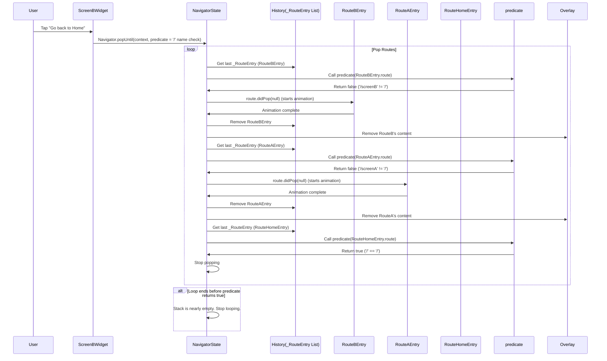

# Chapter 5: RoutePredicate

Welcome back, future Flutter navigators! In our previous chapters, we explored the [Navigator](01_navigator_.md) (the screen manager), the [Route](02_route_.md) (the screen recipe), [RouteSettings](03_routesettings_.md) (names and arguments), and the [Page](04_page_.md) (a blueprint for routes).

Today, we're looking at another useful tool in the Navigator's kit: the **RoutePredicate**. While `push` adds routes and `pop` removes the top one, sometimes you need more control over *which* routes get removed from the stack. That's where a `RoutePredicate` comes in!

## What is a RoutePredicate?

A `RoutePredicate` is essentially a **function** that helps the [Navigator](01_navigator_.md) decide if a specific [Route](02_route_.md) meets certain criteria. Think of it like a filter or a test you can apply to each [Route](02_route_.md) in the [Navigator's](01_navigator_.md) history stack.

The [Navigator](01_navigator_.md) can use these predicates with methods like `popUntil` and `pushNamedAndRemoveUntil` to perform actions on multiple routes until a route that matches the predicate is found.

## The Use Case: Clearing Navigation History

Imagine you have an app with a navigation flow like this:

Home -> List -> Detail -> Edit -> Confirmation -> Home

If you are on the "Confirmation" screen and tap a button that says "Finish," you probably want to go all the way back to the "Home" screen, removing "Confirmation," "Edit," and "Detail" from the history.

Using just `pop` wouldn't work easily; you'd have to call `pop` three times, only if you knew exactly how many screens were above the Home screen. This isn't flexible.

A `RoutePredicate` allows you to say, "Keep popping routes off the stack *until* you find the 'Home' route."

## Using RoutePredicate with `popUntil`

The primary method where you'll use a `RoutePredicate` is `Navigator.popUntil`. This method traverses backwards through the [Navigator's](01_navigator_.md) history stack and pops routes until the provided predicate returns `true` for a route. The route that satisfies the predicate is *not* popped itself.

Let's set up a simple example to demonstrate this. We'll have three screens: Home, Screen A, and Screen B. We'll navigate from Home -> Screen A -> Screen B, and then use `popUntil` from Screen B to go back to Home.

First, let's define our screens with unique names in their `RouteSettings`:

```dart
import 'package:flutter/material.dart';

// Screen 1: Home
class HomeScreen extends StatelessWidget {
  const HomeScreen({super.key});

  @override
  Widget build(BuildContext context) {
    return Scaffold(
      appBar: AppBar(title: const Text('Home Screen')),
      body: Center(
        child: ElevatedButton(
          onPressed: () {
            Navigator.pushNamed(context, '/screenA');
          },
          child: const Text('Go to Screen A'),
        ),
      ),
    );
  }
}

// Screen 2: Screen A
class ScreenA extends StatelessWidget {
  const ScreenA({super.key});

  @override
  Widget build(BuildContext context) {
    return Scaffold(
      appBar: AppBar(title: const Text('Screen A')),
      body: Center(
        child: ElevatedButton(
          onPressed: () {
            Navigator.pushNamed(context, '/screenB');
          },
          child: const Text('Go to Screen B'),
        ),
      ),
    );
  }
}

// Screen 3: Screen B
class ScreenB extends StatelessWidget {
  const ScreenB({super.key});

  @override
  Widget build(BuildContext context) {
    return Scaffold(
      appBar: AppBar(title: const Text('Screen B')),
      body: Center(
        child: ElevatedButton(
          onPressed: () {
            // This is where we use popUntil!
            Navigator.popUntil(context, (route) {
              // Our predicate: check if the route is the Home Screen route ('/')
              return route.settings.name == '/';
            });
          },
          child: const Text('Go back to Home'),
        ),
      ),
    );
  }
}
```

Now, let's set up our `MaterialApp` with named routes:

```dart
import 'package:flutter/material.dart';
import 'screens.dart'; // Assuming screens.dart contains the screen widgets above

void main() {
  runApp(MaterialApp(
    title: 'Pop Until Demo',
    initialRoute: '/',
    routes: {
      '/': (context) => const HomeScreen(),
      '/screenA': (context) => const ScreenA(),
      '/screenB': (context) => const ScreenB(),
    },
  ));
}
```

In this example:

1.  We start on `/` (HomeScreen).
2.  Tapping the button on `HomeScreen` pushes `/screenA`.
3.  Tapping the button on `ScreenA` pushes `/screenB`.
4.  Now the navigation stack is conceptually `[/, /screenA, /screenB]`.
5.  On `ScreenB`, when the button is tapped, `Navigator.popUntil(context, (route) { return route.settings.name == '/'; });` is called.
6.  The [Navigator](01_navigator_.md) looks at `/screenB`. Does its name equal '/'? No. It is popped.
7.  The [Navigator](01_navigator_.md) looks at `/screenA`. Does its name equal '/'? No. It is popped.
8.  The [Navigator](01_navigator_.md) looks at `/`. Does its name equal '/'? Yes! The predicate returns true. The popping stops.
9.  The user is now back on the `HomeScreen`.

The `RoutePredicate` itself is this part:

```dart
(route) {
  return route.settings.name == '/';
}
```

It's a function that takes one argument: a `Route<dynamic>` object. Inside the function, we check if the `settings.name` of that route is equal to '/'.

## Common RoutePredicates

While you can write any predicate function you need, Flutter provides some handy ones:

*   **`(Route<dynamic> route) => false`**: This predicate always returns false. If used with `popUntil`, it would pop *all* routes until the last one (which won't be popped). If used with `pushNamedAndRemoveUntil`, it would remove *all* routes currently in the stack before pushing the new one.
*   **`ModalRoute.withName('/someName')`**: This is a very common predicate. It returns a function that checks if a route is a `ModalRoute` (which most full-screen routes are) and if its `settings.name` matches the provided string. This is exactly what we used in our example with `ModalRoute.withName('/')`.

Let's rewrite our `ScreenB` code using `ModalRoute.withName`:

```dart
// Inside Screen B's ElevatedButton onPressed:
onPressed: () {
  Navigator.popUntil(context, ModalRoute.withName('/'));
},
```

This is functionally identical to our previous code and is more concise. `ModalRoute.withName('/')` *returns* the predicate function we need.

## Using RoutePredicate with `pushNamedAndRemoveUntil`

Another method that uses `RoutePredicate` is `Navigator.pushNamedAndRemoveUntil`. This method first pushes a new named route onto the stack and *then* removes all the routes below the new route until the predicate returns true.

The "Confirmation -> Home" example from earlier is a perfect fit for this. If the "Finish" button on "Confirmation" pushes the "Home" route and removes everything until the "Home" route is found *again* (the original one at the bottom of the stack).

Assume we have a `ConfirmationScreen` widget and `/confirmation` route:

```dart
// Inside ConfirmationScreen's ElevatedButton onPressed:
onPressed: () {
  // Push the Home screen route and remove everything until we find
  // the original Home screen route ('/')
  Navigator.pushNamedAndRemoveUntil(
    context,
    '/', // The name of the new route to push
    ModalRoute.withName('/') // The predicate: stop removing when we find '/'
  );
},
```

In this scenario:

1.  The stack is `[ /, /list, /detail, /edit, /confirmation ]`.
2.  `pushNamedAndRemoveUntil` first prepares to push `/`.
3.  It looks at `/confirmation`. Does it match `ModalRoute.withName('/')`? No. It's marked for removal.
4.  It looks at `/edit`. Does it match? No. Marked for removal.
5.  It looks at `/detail`. Does it match? No. Marked for removal.
6.  It looks at `/list`. Does it match? No. Marked for removal.
7.  It looks at `/`. Does it match? Yes! The predicate returns true. The process of identifying routes to remove stops.
8.  The new route (`/`) is pushed, and simultaneously, the routes marked for removal (`/confirmation`, `/edit`, `/detail`, `/list`) are disposed of.
9.  The stack is now just `[ / ]`.

This allows you to effectively "reset" part of the navigation stack or jump back to a known point while removing everything above it.

## RoutePredicate Under the Hood (Simplified)

A `RoutePredicate` is just a function signature. Looking at the Flutter code (`navigator.dart`):

```dart
/// Signature for the [Navigator.popUntil] predicate argument.
typedef RoutePredicate = bool Function(Route<dynamic> route);
```

This tells us it's a function that accepts a `Route<dynamic>` as input and returns a `bool`. `true` means the predicate is satisfied, `false` means it's not.

How does the `NavigatorState` use this predicate internally? Let's focus on the `popUntil` method (simplified):

```dart
// Inside NavigatorState class (simplified)
void popUntil(RoutePredicate predicate) {
  assert(!_debugLocked);
  assert(() { _debugLocked = true; return true; }());

  // Find the last route that is current or has state that handles pops internally.
  // We stop there.
  _RouteEntry? candidate = _lastRouteEntryWhereOrNull(_RouteEntry.isPresentPredicate);

  // Iterate backwards through the history
  // We use candidate.route.willHandlePopInternally to handle routes that
  // manage their own pop behavior (like nested navigators or forms).
  // If a route handles pop internally (willHandlePopInternally is true),
  // we try to pop it internally first (candidate.route.didPop(null)).
  // If it still satisfies the predicate after internal pop, we stop.
  // If not, or if it didn't handle it internally, we continue popping.
  while (candidate != null) {
    // Check if the current route candidate satisfies the predicate
    if (predicate(candidate.route)) {
      assert(() { _debugLocked = false; return true; }());
      return; // Predicate returned true, stop popping
    }

    // If the candidate wants to handle pops internally, try that first
    if (candidate.route.willHandlePopInternally) {
        // Try to pop internally. If it returns false, it means
        // it handled something, but doesn't want to be removed from the stack yet.
        final bool poppedInternally = candidate.route.didPop(null);
        assert(!poppedInternally); // didPop returning false means it's handled internally
        // After internal pop, does it *now* satisfy the predicate?
        if (predicate(candidate.route)) {
             assert(() { _debugLocked = false; return true; }());
            return; // Predicate returned true after internal pop, stop
        }
        // If it didn't satisfy the predicate even after internal pop,
        // continue the while loop check
    } else {
         // If the route doesn't handle pop internally, just pop it off the stack.
         pop(); // This calls _history[index of candidate].pop(null) and leads to _flushHistoryUpdates removing it
    }

    // After potentially popping the current candidate, revisit the list
    // to find the new top candidate.
    candidate = _lastRouteEntryWhereOrNull(_RouteEntry.isPresentPredicate);
  }

  // If the loop finishes, it means the predicate never returned true
  // before the stack was (almost) empty.
  assert(() { _debugLocked = false; return true; }());
}
```



This simplified diagram shows `popUntil` iterating backwards, applying the predicate to each route it encounters (represented by `_RouteEntry.route`), and if the predicate is false, it removes that route before checking the next one. The loop stops *before* removing the route that satisfies the predicate.

## Conclusion

A `RoutePredicate` is a powerful function that allows you to define criteria for selecting routes within the [Navigator's](01_navigator_.md) history stack. This is particularly useful with methods like `popUntil` and `pushNamedAndRemoveUntil` to clear multiple routes efficiently based on their properties, most commonly their name. By using predicates like `ModalRoute.withName`, you can create flexible navigation flows that aren't tied to knowing the exact number of screens in the stack.

Now that we understand how to identify and manage groups of routes using predicates, we'll move on to discuss `RoutePopDisposition`, which determines whether a route *can* be popped and how a pop request should be handled.

[Chapter 6: RoutePopDisposition](06_routepopdisposition_.md)

---

Generated by [AI Codebase Knowledge Builder](https://github.com/The-Pocket/Tutorial-Codebase-Knowledge)