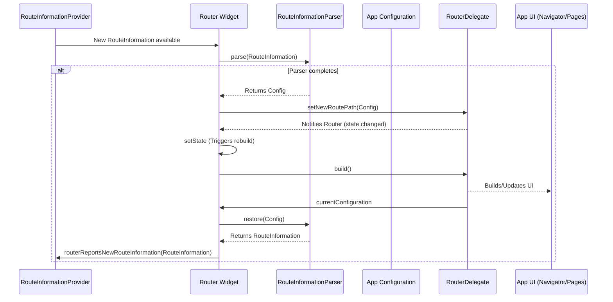

# Chapter 5: Router

Welcome back to our Flutter routing deep dive! In the previous chapters, we've explored some key players:
*   [Chapter 1: RouteInformation](01_routeinformation_.md): The note telling us where to go and what data is needed.
*   [Chapter 2: RouteInformationProvider](02_routeinformationprovider_.md): The sensor that detects external route changes and gives us the `RouteInformation`.
*   [Chapter 3: RouteInformationParser](03_routeinformationparser_.md): The translator that turns `RouteInformation` into a structured app configuration.
*   [Chapter 4: RouterDelegate](04_routerdelegate_.md): The builder that takes the structured configuration and builds the UI, usually with a `Navigator`.

But who brings all these pieces together? Who is in charge of the whole routing process, listening to the [RouteInformationProvider](02_routeinformationprovider_.md), using the [RouteInformationParser](03_routeinformationparser_.md), and commanding the [RouterDelegate](04_routerdelegate_.md)?

Meet the `Router` widget!

## What is the Router Widget?

The `Router` widget is the **central hub** or the **orchestrator** of the Flutter routing system. It's the widget you place in your widget tree that ties together the [RouteInformationProvider](02_routeinformationprovider_.md), [RouteInformationParser](03_routeinformationparser_.md), and [RouterDelegate](04_routerdelegate_.md).

Think of it as the conductor of an orchestra:

*   It listens to the **[RouteInformationProvider](02_routeinformationprovider_.md)** (like listening to a signal from outside, such as a browser URL change).
*   It hands that signal ([RouteInformation](01_routeinformation_.md)) to the **[RouteInformationParser](03_routeinformationparser_.md)** (like asking the translator to figure out what the signal means).
*   It takes the result from the parser (the structured app configuration) and gives it to the **[RouterDelegate](04_routerdelegate_.md)** (like telling the builder exactly what to display).
*   It also allows the [RouterDelegate](04_routerdelegate_.md) to report its current state and uses the [RouteInformationParser](03_routeinformationparser_.md) to convert that back to [RouteInformation](01_routeinformation_.md) for things like browser history.
*   It coordinates with the [BackButtonDispatcher](06_backbuttondispatcher_.md) to handle system back button presses by telling the [RouterDelegate](04_routerdelegate_.md) to `popRoute`.

Essentially, the `Router` widget is the glue that makes the Declarative Router system work. It's rarely something you interact with directly *after* setting it up; its job is to manage the delegates you provide.

Here's a simplified flow showing the `Router` in the middle:



This diagram shows the core cycle: The provider gets information, gives it to the Router, the Router passes it to the parser, the parser gives back configuration, the Router gives that to the delegate, the delegate updates its state and notifies the Router, the Router tells the delegate to build the UI, and finally, the Router gets the current state back from the delegate to report to the provider (for things like browser history).

## Why Do We Need the Router Widget?

While each delegate ([RouteInformationProvider](02_routeinformationprovider_.md), [RouteInformationParser](03_routeinformationparser_.md), [RouterDelegate](04_routerdelegate_.md), and [BackButtonDispatcher](06_backbuttondispatcher_.md)) has a specific responsibility, they need a manager to coordinate them. The `Router` widget provides this management layer.

It handles the complex asynchronous interactions (like waiting for the parser to finish) and ensures that when one delegate signals a change (like the provider getting a new route or the delegate's state changing), the correct methods on the other delegates are called in the right order.

Setting up your routing with the `Router` looks like this (using `MaterialApp.router`, which internally uses a `Router` widget):

```dart
import 'package:flutter/material.dart';
import 'my_app_routing.dart'; // Assume this file contains our custom delegates and config

void main() {
  runApp(const MyApp());
}

class MyApp extends StatelessWidget {
  const MyApp({super.key});

  @override
  Widget build(BuildContext context) {
    // MaterialApp.router creates and manages a Router widget internally
    return MaterialApp.router(
      title: 'My Router App',

      // Provide our custom delegates!
      routeInformationProvider: PlatformRouteInformationProvider(
        initialRouteInformation: RouteInformation(uri: Uri.parse('/')),
      ),
      routeInformationParser: MyAppRouteInformationParser(), // From Chapter 3
      routerDelegate: MyAppRouterDelegate(),           // From Chapter 4
      // backButtonDispatcher: RootBackButtonDispatcher(), // From Chapter 7
    );
  }
}
```

Here, you don't explicitly write `Router(...)`, but `MaterialApp.router` is a convenience widget that does it for you. You pass in your custom implementations of the delegates we've discussed. The `MaterialApp.router` (or `WidgetsBinding.builder`) is a common place to set up the root `Router` for your application.

You *can* create a `Router` widget directly in your tree if you need nested routing, but for a basic app, the one provided by `MaterialApp.router` is usually sufficient.

## How the Router Widget Works (Internal View)

Let's peek inside the `_RouterState` class, which implements the state for the `Router` widget. This is where the connections between the delegates happen.

We've seen snippets of this in previous chapters, but let's review the core interactions:

1.  **Receiving Route Information:** When the [RouteInformationProvider](02_routeinformationprovider_.md) notifies its listeners (which the `Router` state is), the `_handleRouteInformationProviderNotification` method is called:

    ```dart
    // Snippet from _RouterState._handleRouteInformationProviderNotification
    void _handleRouteInformationProviderNotification() {
      _routeParsePending = true; // Mark that we need to parse
      _processRouteInformation(
        widget.routeInformationProvider!.value, // Get the NEW RouteInformation
        () => widget.routerDelegate.setNewRoutePath, // Tell the delegate to set the new path
      );
    }
    ```
    This gets the latest [RouteInformation](01_routeinformation_.md) from the provider and calls `_processRouteInformation`.

2.  **Processing Route Information:** The `_processRouteInformation` calls the [RouteInformationParser](03_routeinformationparser_.md):

    ```dart
    // Snippet from _RouterState._processRouteInformation
    void _processRouteInformation(
      RouteInformation information,
      ValueGetter<_RouteSetter<T>> delegateRouteSetter, // How to call the delegate
    ) {
      // ... setup ...

      // Call the parser!
      widget.routeInformationParser!
          .parseRouteInformationWithDependencies(information, context)
          .then<void>( // When parsing completes...
              _processParsedRouteInformation( // ...process the result
                  _currentRouterTransaction, delegateRouteSetter));
    }
    ```
    This waits for the `parseRouteInformationWithDependencies` future to complete.

3.  **Calling the RouterDelegate:** Once the parser returns the structured configuration (`T`), `_processParsedRouteInformation` is called, which then calls the appropriate setter on the [RouterDelegate](04_routerdelegate_.md) (`setNewRoutePath`, `setInitialRoutePath`, or `setRestoredRoutePath`):

    ```dart
    // Snippet from _RouterState._processParsedRouteInformation
    _RouteSetter<T> _processParsedRouteInformation(
      Object? transaction,
      ValueGetter<_RouteSetter<T>> delegateRouteSetter,
    ) {
      return (T data) async { // 'data' is the parsed config
        // Call the delegate's method!
        await delegateRouteSetter()(data);
         // If successful, trigger a rebuild
        _rebuild();
      };
    }
    ```

4.  **Listening to the RouterDelegate:** The `Router` also listens to the [RouterDelegate](04_routerdelegate_.md). This is set up in `initState`:

    ```dart
    // Snippet from _RouterState.initState
    @override
    void initState() {
      super.initState();
      // ... other listeners ...
      // Listen to the delegate!
      widget.routerDelegate.addListener(_handleRouterDelegateNotification);
    }
    ```
    And when the delegate calls `notifyListeners()`, `_handleRouterDelegateNotification` runs:

    ```dart
    // Snippet from _RouterState._handleRouterDelegateNotification
    void _handleRouterDelegateNotification() {
      // Rebuild the Router
      setState(() { /* routerDelegate wants to rebuild */ });
      // And potentially report the new route information
      _maybeNeedToReportRouteInformation();
    }
    ```
    This rebuild is what causes the delegate's `build` method to be called, updating the UI. The call to `_maybeNeedToReportRouteInformation` triggers the reverse process (Configuration -> [RouteInformation](01_routeinformation_.md) -> [RouteInformationProvider](02_routeinformationprovider_.md)).

5.  **Handling Back Button:** The `Router` also listens to the [BackButtonDispatcher](06_backbuttondispatcher_.md) (set up in `initState`). When notified, it calls the delegate's `popRoute` method:

    ```dart
    // Snippet from _RouterState._handleBackButtonDispatcherNotification
    Future<bool> _handleBackButtonDispatcherNotification() {
      _currentRouterTransaction = Object(); // Start a new transaction
      // Call the delegate's popRoute!
      return widget.routerDelegate.popRoute().then<bool>(
        _handleRoutePopped(_currentRouterTransaction), // Process the result
      );
    }
    ```

These internal methods show how the `Router` is constantly listening for changes from the [RouteInformationProvider](02_routeinformationprovider_.md), orchestrating the parsing and delegate updates, and listening back to the [RouterDelegate](04_routerdelegate_.md) and [BackButtonDispatcher](06_backbuttondispatcher_.md) to manage the overall routing state and UI.

The `build` method of the `Router` simply provides an `InheritedWidget` (`_RouterScope`) so descendant widgets can access the router's delegates (using `Router.of(context)`) and then calls `widget.routerDelegate.build(context)` to get the actual UI tree:

```dart
// Snippet from _RouterState.build
@override
Widget build(BuildContext context) {
  return UnmanagedRestorationScope(
    bucket: bucket,
    child: _RouterScope(
      // Provides delegates via InheritedWidget
      routeInformationProvider: widget.routeInformationProvider,
      bac...tonDispatcher: widget.backButtonDispatcher,
      ro...InformationParser: widget.routeInformationParser,
      r...Delegate: widget.routerDelegate,
      routerState: this,
      child: Builder(
        // *** Calls the delegate's build method! ***
        builder: widget.routerDelegate.build,
      ),
    ),
  );
}
```

This reinforces that the `Router`'s job isn't to build the screen content itself, but to provide the context (via `_RouterScope`) and tell the `RouterDelegate` when and where to build.

## Conclusion

The `Router` widget is the central figure in Flutter's Declarative Router system. It's the orchestrator that receives route information, delegates the parsing to the [RouteInformationParser](03_routeinformationparser_.md), passes the resulting configuration to the [RouterDelegate](04_routerdelegate_.md) to build the UI, and coordinates with the [BackButtonDispatcher](06_backbuttondispatcher_.md) for back button handling. While you often interact with it indirectly through convenience widgets like `MaterialApp.router`, understanding its role as the connector between all the delegates is key to grasping how the system functions.

In the next chapter, we'll look closer at the [BackButtonDispatcher](06_backbuttondispatcher_.md), which the `Router` listens to for those important system back button presses.

[Next Chapter: BackButtonDispatcher](06_backbuttondispatcher_.md)

---

Generated by [AI Codebase Knowledge Builder](https://github.com/The-Pocket/Tutorial-Codebase-Knowledge)