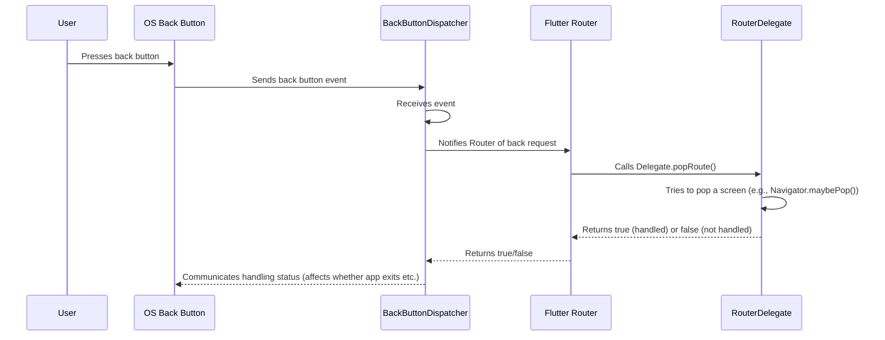

# Chapter 6: BackButtonDispatcher

Welcome back! In the last five chapters, we've built a good understanding of how Flutter's Declarative Router manages navigation using:

*   [Chapter 1: RouteInformation](01_routeinformation_.md): The "where and what" note.
*   [Chapter 2: RouteInformationProvider](02_routeinformationprovider_.md): The "sensor" for external route changes.
*   [Chapter 3: RouteInformationParser](03_routeinformationparser_.md): The "translator" from raw notes to structured app configurations.
*   [Chapter 4: RouterDelegate](04_routerdelegate_.md): The "builder" that uses the configuration to show screens, often via a `Navigator`.
*   [Chapter 5: Router](05_router_.md): The "orchestrator" that connects all the delegates.

Now, what about that important system back button? On platforms like Android, users expect the back button to work intuitively – usually closing the current screen or going back to the previous step. How does our declarative routing system handle this?

This is where the `BackButtonDispatcher` comes in!

## What is a BackButtonDispatcher?

Think of the `BackButtonDispatcher` as the **system back button listener**. It's a mechanism that receives notifications when the user presses the hardware or software back button provided by the operating system (like on Android phones).

When the `BackButtonDispatcher` catches a back button event, it doesn't handle it directly. Instead, its main job is to **forward** this event to the **[Router](05_router_.md)**. The [Router](05_router_.md) then tells the **[RouterDelegate](04_routerdelegate_.md)** to attempt to handle the back action.

The `BackButtonDispatcher` also supports **nesting**. This means if you have multiple [Router](05_router_.md)s for different parts of your UI (e.g., a main app [Router](05_router_.md) and a separate [Router](05_router_.md) for a flow within a tab), the back button event can be dispatched correctly to the most relevant [Router](05_router_.md) and its delegate.

Its main purposes are:

1.  **Receive System Back Button Events:** Listen for the platform-specific signal that the user wants to go back.
2.  **Dispatch to the Router:** Notify the **[Router](05_router_.md)** that a back request has occurred.
3.  **Coordinate Hierarchies:** Allow nested [Router](05_router_.md)s to participate in back button handling.

Here's a simple flow:



This flow shows that the `BackButtonDispatcher` is the critical first step in the Flutter routing system's response to a back button press.

## Why Do We Need a BackButtonDispatcher?

Without a `BackButtonDispatcher`, Flutter wouldn't have a standardized way to receive back button events from the underlying operating system. Each platform might signal this differently, and the `BackButtonDispatcher` provides a common interface.

Furthermore, since back button behavior can depend on the current screen and state (which is managed by your `RouterDelegate` in conjunction with a `Navigator`), the `BackButtonDispatcher` is needed to effectively forward this request to the component best equipped to handle it – your `RouterDelegate`.

It separates the *detection* of the back button press from the *logic* of what happens when it's pressed, keeping responsibilities clear.

## How to Use a BackButtonDispatcher

You typically don't build your own custom `BackButtonDispatcher` from scratch for a basic app. Flutter provides standard implementations that you simply provide to your `Router` (or `MaterialApp.router`).

For the main, top-level `Router` in your app, you'll almost always use the `RootBackButtonDispatcher`. We'll cover `RootBackButtonDispatcher` in more detail in [Chapter 7](07_rootbackbuttondispatcher_.md), but for now, just know that it's the concrete class that listens to the platform's default back button messages.

Here's how you integrate it into your `MaterialApp.router` setup:

```dart
import 'package:flutter/material.dart';
import 'my_app_routing.dart'; // Assumes this has MyAppRouteInformationParser etc.

void main() {
  runApp(const MyApp());
}

class MyApp extends StatelessWidget {
  const MyApp({super.key});

  @override
  Widget build(BuildContext context) {
    return MaterialApp.router(
      title: 'My Router App',
      routeInformationProvider: PlatformRouteInformationProvider(
        initialRouteInformation: RouteInformation(uri: Uri.parse('/')),
      ),
      routeInformationParser: MyAppRouteInformationParser(), // From Chapter 3
      routerDelegate: MyAppRouterDelegate(),           // From Chapter 4

      // *** Provide the BackButtonDispatcher here! ***
      backButtonDispatcher: RootBackButtonDispatcher(), // Using the root dispatcher

    );
  }
}
```

By providing a `RootBackButtonDispatcher` to the `backButtonDispatcher` property, you're telling the `Router` widget: "Use this object to listen for system back button presses."

When the user presses the back button, the `RootBackButtonDispatcher` catches it and notifies the `Router`. The `Router` then calls your `RouterDelegate`'s `popRoute` method. As we saw in [Chapter 4](04_routerdelegate_.md), if you use the `PopNavigatorRouterDelegateMixin`, your `popRoute` method will automatically try to pop the top-most page from the `Navigator`.

So, in essence, providing a `RootBackButtonDispatcher` and using `PopNavigatorRouterDelegateMixin` in your `RouterDelegate` gives you standard back button behavior that pops screens from your primary `Navigator`.

## Internal View (How Flutter Uses It)

Let's see how the `Router` widget (`packages/flutter/lib/src/widgets/router.dart`) interacts with the `BackButtonDispatcher`.

The `Router`'s internal state (`_RouterState`) registers itself as a listener with the `BackButtonDispatcher` in its `initState` method:

```dart
// Snippet from _RouterState.initState
@override
void initState() {
  super.initState();
  // ... other listeners ...
  // Router registers as a listener to the back button dispatcher!
  widget.backButtonDispatcher?.addCallback(_handleBackButtonDispatcherNotification);
  // ... rest of initState ...
}
```

This means when the `BackButtonDispatcher` receives a back button event and calls its `invokeCallback` method, the `_handleBackButtonDispatcherNotification` method in the `_RouterState` will be executed.

What does `_handleBackButtonDispatcherNotification` do? It's responsible for telling the **[RouterDelegate](04_routerdelegate_.md)** to handle the pop request:

```dart
// Snippet from _RouterState._handleBackButtonDispatcherNotification
Future<bool> _handleBackButtonDispatcherNotification() {
  // Create a new transaction object (used internally to track simultaneous requests)
  _currentRouterTransaction = Object();
  // *** Call the delegate's popRoute method! ***
  return widget.routerDelegate.popRoute().then<bool>(
    // Process the result from popRoute (true/false)
    _handleRoutePopped(_currentRouterTransaction),
  );
}
```

Let's break this down:

1.  When the `BackButtonDispatcher` notifies the `Router`, `_handleBackButtonDispatcherNotification` is called.
2.  Crucially, it calls `widget.routerDelegate.popRoute()`. This redirects the responsibility of handling the back action to the `RouterDelegate`.
3.  The `RouterDelegate`'s `popRoute` method (which, with `PopNavigatorRouterDelegateMixin`, calls `Navigator.maybePop()`) attempts to handle the back event. It returns a `Future<bool>`: `true` if it successfully popped something, `false` otherwise.
4.  The `.then<bool>` structure waits for this `Future<bool>` to complete. The result (`true` or `false`) is then passed to `_handleRoutePopped`.

The `_handleRoutePopped` method simply processes the result:

```dart
// Snippet from _RouterState._handleRoutePopped
_AsyncPassthrough<bool> _handleRoutePopped(Object? transaction) {
  return (bool data) { // 'data' is the true/false result from popRoute()
    if (transaction != _currentRouterTransaction) {
      // If a new transaction started while we were waiting for popRoute,
      // assume this pop was handled to avoid unwanted bubbling.
      return SynchronousFuture<bool>(true);
    }
    // Trigger a rebuild of the Router (which calls the delegate's build)
    _rebuild();
    // Return the actual result (true/false) so the dispatcher knows if it was handled
    return SynchronousFuture<bool>(data);
  };
}
```

This method:

1.  Receives the boolean result `data` from the `RouterDelegate.popRoute()`.
2.  If the pop was handled (`data` is `true`), it calls `_rebuild()`, which causes the `Router` to rebuild, reflecting the popped page (e.g., the `Navigator` with one less page).
3.  It returns the `data` result (`true` or `false`) back up the chain. This result goes back to the `BackButtonDispatcher`, which can use it to signal to the platform whether the event was fully handled by Flutter (preventing the OS from, say, closing the entire app).

These internal steps illustrate how the `BackButtonDispatcher` acts as the initial trigger for back button handling, forwarding the request to the **[Router](05_router_.md)**, which then relies on the **[RouterDelegate](04_routerdelegate_.md)** to perform the actual logic.

## Conclusion

The `BackButtonDispatcher` is the abstraction responsible for catching system back button presses and initiating the backward navigation process within your Flutter app's routing system. It acts as a listener for platform-specific back events and effectively notifies the **[Router](05_router_.md)**, which then directs the responsibility to the **[RouterDelegate](04_routerdelegate_.md)**'s `popRoute` method. By using a `RootBackButtonDispatcher` at the top level of your app and implementing `popRoute` (often with the help of `PopNavigatorRouterDelegateMixin`), you ensure that the system back button interacts correctly with your app's navigation stack.

In the next two chapters, we'll look closer at the common implementations: [RootBackButtonDispatcher](07_rootbackbuttondispatcher_.md) and [ChildBackButtonDispatcher](08_childbackbuttondispatcher_.md).

[Next Chapter: RootBackButtonDispatcher](07_rootbackbuttondispatcher_.md)

---

Generated by [AI Codebase Knowledge Builder](https://github.com/The-Pocket/Tutorial-Codebase-Knowledge)