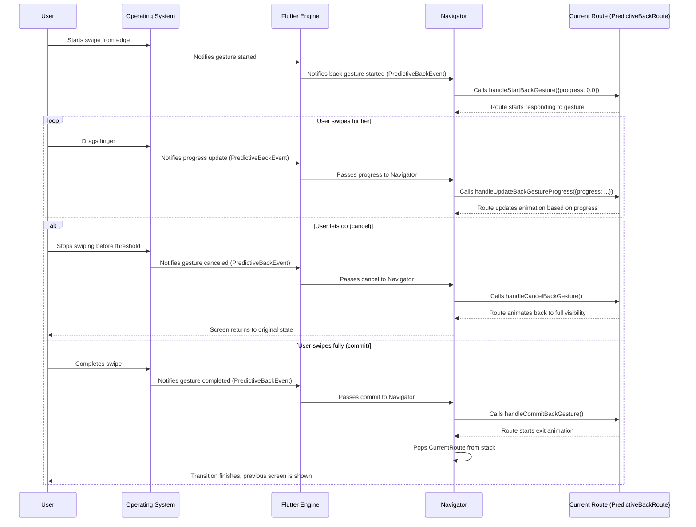

# Chapter 6: PredictiveBackRoute

Welcome back! In our previous chapters, we've explored how Flutter uses [Route](01_route_.md)s like a stack of playing cards to manage screens, how [TransitionRoute](02_transitionroute_.md) adds animations to make screen changes smooth, and how [OverlayRoute](03_overlayroute_.md) and [ModalRoute](04_modalroute_.md) let us place content on top of existing screens, sometimes with a dimming barrier.

Today, we’re going to look at a concept called `PredictiveBackRoute`. This is a slightly more advanced topic, specifically related to how users interact with the "back" action on platforms like Android, where you can sometimes swipe from the edge of the screen to preview the previous screen *before* fully completing the back gesture.

### What is a PredictiveBackRoute?

Imagine you're looking at a detailed picture in a gallery app on your phone. You know you want to go back to the list of pictures. On some operating systems (like recent Android versions), you can start a swipe gesture from the left or right edge of the screen. As you swipe, the current screen starts to shrink and move away, and you can see the previous screen (the list of pictures) peeking from behind! If you complete the swipe, you go back. If you let go halfway, the current screen snaps back into place.

This interactive, visual "pull-to-go-back" experience is what **Predictive Back** is all about. It gives the user a clearer idea of where they're going before they commit to the back action.

`PredictiveBackRoute` is an abstraction in Flutter that helps routes participate in this predictive back gesture. It's like giving your animated playing cards a special edge that responds to a "pulling" motion, showing what's underneath before you actually lift the card off the stack.

You won't often create a `PredictiveBackRoute` directly because it's an `interface` (a contract for what a class *should* do). Instead, other route types like `TransitionRoute` (which includes `ModalRoute` like `MaterialPageRoute`) *implement* this interface, adding the necessary logic to respond to these predictive back gestures.

### Why Use PredictiveBackRoute?

Implementing predictive back requires coordination between the operating system's gesture detection and the route's animation. The OS tells the app that a back gesture is starting, how far along it is, if it's canceled, or if it's committed. The route needs to respond by animating its appearance accordingly.

The `PredictiveBackRoute` interface defines the standard methods that routes need to provide to handle these events. By having routes implement this interface, the Flutter framework (specifically, the [Navigator](03_overlayroute_.md) or underlying low-level gesture handlers) knows how to communicate with the route during a predictive back gesture.

This makes integrating with native predictive back much cleaner. The route, by implementing `PredictiveBackRoute`, declares that it *knows how* to handle such gestures, and the framework uses the defined methods to control its animation during the gesture.

### Key Concepts of PredictiveBackRoute

Since `PredictiveBackRoute` is an interface, its main "concepts" are the methods it requires implementing classes to have:

*   **`handleStartBackGesture({double progress})`:** Called when a predictive back gesture *begins*. The `progress` tells the route how much the user has already swiped (0.0 is the start, 1.0 is fully back).
*   **`handleUpdateBackGestureProgress({required double progress})`:** Called repeatedly as the user *drags* the swipe gesture. The `progress` updates continuously from near 0.0 up to 1.0. This is where the route should update its transition animation based on the user's finger movement.
*   **`handleCancelBackGesture()`:** Called if the user *releases* the gesture *before* reaching the commit threshold (usually before reaching the edge). The route should animate back to its fully visible state.
*   **`handleCommitBackGesture()`:** Called if the user *completes* the gesture (swipes all the way or past a certain point). The route should finish its exit animation and be popped from the navigator.
*   **`popGestureEnabled`:** A getter that indicates whether the route *can* currently be dismissed by a pop gesture (like predictive back). This helps the framework decide if it should even start sending gesture events to this route.

Routes that implement `PredictiveBackRoute` use these methods to control their existing animation controllers (like the one inherited from [TransitionRoute](02_transitionroute_.md)).

### How PredictiveBackRoute Works (Simplified)

Let's trace what happens conceptually when a user performs a predictive back gesture on a screen represented by a route that implements `PredictiveBackRoute` (like a `MaterialPageRoute`).



Notice how the operating system detects the gesture, passes information through the Flutter engine to the [Navigator](03_overlayroute_.md), and the [Navigator](03_overlayroute_.md) then uses the `PredictiveBackRoute` methods to tell the specific route how to animate.

### Looking at the Code

Let's look at the `PredictiveBackRoute` interface definition (it's part of the `TransitionRoute` code snippet you have, near the end). Remember, an interface just lists methods that a class *must* provide.

```dart
abstract interface class PredictiveBackRoute {
  /// Whether this route is the top-most route on the navigator.
  bool get isCurrent;

  /// Whether a pop gesture can be started by the user for this route.
  bool get popGestureEnabled;

  /// Handles a predictive back gesture starting.
  void handleStartBackGesture({double progress = 0.0});

  /// Handles a predictive back gesture updating as the user drags across the
  /// screen.
  void handleUpdateBackGestureProgress({required double progress});

  /// Handles a predictive back gesture ending successfully.
  void handleCommitBackGesture();

  /// Handles a predictive back gesture ending in cancellation.
  void handleCancelBackGesture();
}
```

This code snippet confirms the methods we discussed: `isCurrent` (useful to check if this is the route the user is trying to back from), `popGestureEnabled` (to check if the gesture is allowed), and the four `handle...BackGesture` methods for the different phases of the gesture.

Now, let's look at how `TransitionRoute` (which `ModalRoute` extends) implements these methods. This logic is also in the provided snippet.

```dart
abstract class TransitionRoute<T> extends OverlayRoute<T> implements PredictiveBackRoute {
  // ... other code ...

  // Begin PredictiveBackRoute.

  @override
  void handleStartBackGesture({double progress = 0.0}) {
    assert(isCurrent);
    _controller?.value = progress; // Set animation value to initial progress
    navigator?.didStartUserGesture(); // Notify navigator a gesture started
  }

  @override
  void handleUpdateBackGestureProgress({required double progress}) {
    // If some other navigation happened during this gesture, don't mess with
    // the transition anymore.
    if (!isCurrent) {
      return;
    }
    _controller?.value = progress; // Update animation value based on drag progress
  }

  @override
  void handleCancelBackGesture() {
    _handleDragEnd(animateForward: true); // Animate forward (back to original state)
  }

  @override
  void handleCommitBackGesture() {
    _handleDragEnd(animateForward: false); // Animate backward (complete pop)
  }

  void _handleDragEnd({required bool animateForward}) {
    if (isCurrent) {
      if (animateForward) {
        // Calculate animation duration based on current progress
        final int droppedPageForwardAnimationTime = min(
          ui.lerpDouble(800, 0, _controller!.value)!.floor(),
          300,
        );
        _controller?.animateTo(
          1.0, // Animate to fully forward (visible)
          duration: Duration(milliseconds: droppedPageForwardAnimationTime),
          curve: Curves.fastLinearToSlowEaseIn,
        );
      } else {
        // This route is destined to pop at this point. Reuse navigator's pop.
        navigator?.pop(); // Trigger the pop

        // The popping may have finished inline if already at the target destination.
        if (_controller?.isAnimating ?? false) {
          // If still animating, finish the pop animation
          final int droppedPageBackAnimationTime =
              ui.lerpDouble(0, 800, _controller!.value)!.floor();
          _controller!.animateBack(
            0.0, // Animate back to fully dismissed
            duration: Duration(milliseconds: droppedPageBackAnimationTime),
            curve: Curves.fastLinearToSlowEaseIn,
          );
        }
      }
    }

    // Notify navigator the gesture stopped after delay if needed
    if (_controller?.isAnimating ?? false) {
       // ... animation status listener logic ...
    } else {
      navigator?.didStopUserGesture();
    }
  }

  // ... more code ...

  @override
  bool get popGestureEnabled {
    // ... checks if a pop gesture is currently allowed ...
    // Checks things like: is this the first route? Is there a WillPopScope blocking?
    // Is another gesture or animation already happening?
    return true; // Simplified example - actual logic depends on many factors
  }

  // End PredictiveBackRoute.

  // ... rest of TransitionRoute code ...
}
```

In this code (simplified):

*   When the gesture starts (`handleStartBackGesture`), the route's internal animation controller (`_controller`) is set to the initial progress, and the [Navigator](03_overlayroute_.md) is notified a gesture is active.
*   When the gesture updates (`handleUpdateBackGestureProgress`), the animation controller's value is directly set to the current gesture `progress`. This makes the transition animation track the user's finger!
*   When the gesture ends (either `handleCancelBackGesture` or `handleCommitBackGesture`), the `_handleDragEnd` method is called.
*   `_handleDragEnd` decides whether to animate the route back to fully visible (`animateForward: true`) or fully dismissed (`animateForward: false`).
*   If completing the pop, it calls `navigator?.pop()`, which triggers the standard route popping process, and then finishes any remaining animation smoothly.
*   `popGestureEnabled` contains logic to determine if this route is a candidate for a back gesture.

This implementation in `TransitionRoute` provides the generic plumbing for predictive back. Specific route types, like `MaterialPageRoute`, might use the `animation` value provided by the `_controller` (which is now being manipulated by the gesture handlers) within their `buildTransitions` method to create the actual visual effect of the previous screen peeking out or the current screen sliding away.

### Example (Conceptual)

You don't typically *use* `PredictiveBackRoute` directly. You benefit from it when using routes that *implement* it.

For example, `MaterialPageRoute` implements `PredictiveBackRoute` (because it extends `ModalRoute` which extends `TransitionRoute`). When you use `Navigator.push(context, MaterialPageRoute(...))`, the resulting route automatically participates in Android's predictive back gesture because `MaterialPageRoute` provides the gesture handling logic inherited from `TransitionRoute`. You don't write any predictive back code yourself!

```dart
// You don't implement PredictiveBackRoute yourself for standard routes.
// MaterialPageRoute already does this for you.

Navigator.push(
  context,
  MaterialPageRoute(
    builder: (context) {
      return Scaffold(
        appBar: AppBar(title: const Text('Detail Page')),
        body: const Center(child: Text('Swipe from the edge to see predictive back!')),
      );
    },
  ),
);

// Because MaterialPageRoute is (indirectly) a PredictiveBackRoute,
// when a predictive back gesture starts on an Android device:
// The framework calls handleStartBackGesture on the MaterialPageRoute instance.
// As the user swipes, handleUpdateBackGestureProgress is called repeatedly.
// The MaterialPageRoute's buildTransitions method (using the manipulated animation)
// draws the predictive back effect (e.g., the page sliding away).
// If the user cancels, handleCancelBackGesture is called.
// If the user commits, handleCommitBackGesture is called, triggering a pop.
```

This is the power of abstraction: you get complex behavior like predictive back "for free" when using standard routes that implement the necessary interfaces and base classes.

### Conclusion

In this chapter, we briefly explored `PredictiveBackRoute`, an interface that enables routes to participate in platform-specific interactive back gestures like Android's predictive back. We learned that it defines methods for handling the start, update, cancel, and commit phases of the gesture, and that base classes like `TransitionRoute` implement this interface to provide the core logic for controlling the route's animation based on user input. By using routes that implement `PredictiveBackRoute` (like `MaterialPageRoute`), you automatically get support for these modern navigation features on supporting platforms.

In the next chapter, we'll look at [LocalHistoryRoute](07_localhistoryroute_.md), a mixin that allows routes to handle some "back" actions internally without actually popping the route from the navigator stack.

[Chapter 7: LocalHistoryRoute](07_localhistoryroute_.md)

---

Generated by [AI Codebase Knowledge Builder](https://github.com/The-Pocket/Tutorial-Codebase-Knowledge)