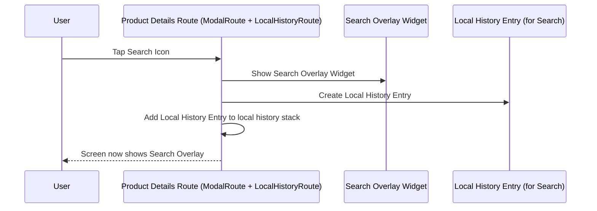
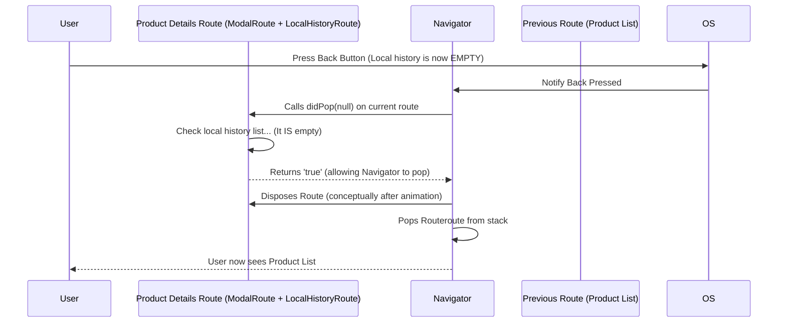

# Chapter 7: LocalHistoryRoute

Welcome back, future Flutter expert! In our previous chapters, we've climbed the `Route` hierarchy, learning about animated transitions ([TransitionRoute](02_transitionroute_.md)), layered overlays ([OverlayRoute](03_overlayroute_.md)), and modal experiences ([ModalRoute](04_modalroute_.md)), even touching on predictive back gestures ([PredictiveBackRoute](06_predictivebackroute_.md)). Our mental model has been a stack of full playing cards, where "back" always means peeling off the top card to reveal the one below.

But what if you're on a single screen (one card), and within that screen, you perform a few actions that feel like mini-navigations, but you don't want to fully leave that screen? Imagine a search feature within a product details page. You:

1.  Are viewing product details.
2.  Tap a search icon within that page.
3.  A search bar appears on the *same* page, and you start typing.
4.  As you type, search results appear, perhaps covering the main product details.
5.  You tap a result, maybe showing a mini-preview, still within this screen.

Now, what happens if you press the back button? You probably don't want to go *all the way back* to the list of products. You likely want to:

1.  Hide the mini-preview.
2.  Hide the search results.
3.  Hide the search bar, returning to the original product details view.
4.  *Then*, if you press back again, you go back to the product list.

This is where `LocalHistoryRoute` comes in! It allows a single [Route](01_route_.md) (or rather, a `ModalRoute` that uses the `LocalHistoryRoute` *mixin*) to manage its *own* mini-stack of pop-like behaviors without involving the main [Navigator](03_overlayroute_.md) stack.

### What is a LocalHistoryRoute?

A `LocalHistoryRoute` is not a separate type of route in the same way that [ModalRoute](04_modalroute_.md) is a separate type from [OverlayRoute](03_overlayroute_.md). Instead, it's a **mixin**. Think of a mixin as a set of extra powers or abilities you can *add* to an existing class. `LocalHistoryRoute` adds the ability to handle "back" actions *locally*, within that route itself, instead of letting the [Navigator](03_overlayroute_.md) pop the entire route off the stack.

Specifically, `ModalRoute` uses ([mixes in](04_modalroute_.md)) the `LocalHistoryRoute` capabilities. This means any `ModalRoute` (including common ones like `MaterialPageRoute`) can have its own *local history*.

Imagine your single screen (the playing card) can have sticky notes attached to its *front*. When you add a sticky note (like showing a search bar), you're adding an entry to the screen's "local history." When you press back, instead of removing the entire card, the screen checks its sticky notes. If there's a sticky note, it removes the top sticky note (hiding the search bar) and stays on the same card. Only when all sticky notes are gone does the next back press remove the main card.

### Why Use LocalHistoryRoute?

Using `LocalHistoryRoute` (by adding entries to the local history of a `ModalRoute`) is essential for implementing UI patterns where a "back" action within a screen should reverse a temporary state change or overlay *before* navigating away from that screen.

This provides a more intuitive and consistent user experience, especially on platforms where the hardware or OS back button is commonly used. You keep the user focused on the current screen until they've finished the sub-tasks (like search or filtering) they started within it.

### Key Concepts of LocalHistoryRoute

`LocalHistoryRoute` introduces a simple mechanism:

*   **Local History Entry (`LocalHistoryEntry`):** This is the core concept! It's an object representing a single "step" in the route's local history. You add these entries when you perform an action that should be reversible by a local back press (e.g., showing an overlay, expanding a section).
*   **`onRemove` callback:** Each `LocalHistoryEntry` has an optional `onRemove` callback. This function is called when that specific history entry is removed (when the user performs a local back action that corresponds to this entry). This is where you put the code to *undo* the action associated with this entry (e.g., hide the search results, close the search bar).
*   **Adding Entries (`addLocalHistoryEntry`):** Routes that use the mixin (`LocalHistoryRoute`) have a method to add a new `LocalHistoryEntry` to their history stack. The most recently added entry is at the top.
*   **Handling Pop (`didPop` & `willHandlePopInternally`):** The `LocalHistoryRoute` mixin overrides the route's `didPop` method. When the [Navigator](03_overlayroute_.md) tries to pop the route, the `LocalHistoryRoute` checks its local history. If there are entries, it *doesn't* let the [Navigator](03_overlayroute_.md) pop the main route. Instead, it removes the last `LocalHistoryEntry` and calls its `onRemove` callback. Only if the local history is empty does it allow the `Navigator` to proceed with popping the main route. The `willHandlePopInternally` getter also reflects this state; it returns `true` if there are local history entries, indicating that the route will handle the pop itself.

Essentially, the `LocalHistoryRoute` mixin intercept's the `Navigator`'s `pop` command when the route has local history entries, handles it internally by removing an entry, and then tells the `Navigator` "No, I wasn't popped, I handled it."

### How LocalHistoryRoute Works (Conceptual)

Let's trace the playing card example with a local search feature using `LocalHistoryRoute`.

**Scenario 1: Adding a Local History Entry (Showing Search)**



The key here is that tapping the search icon doesn't push a new route. It changes the UI *within* the current route and adds a marker (`LocalHistoryEntry`) to the route's internal history list.

**Scenario 2: Pressing Back (Local Pop)**

```mermaid
sequenceDiagram
    participant User as User
    participant Routeroute as Product Details Route (ModalRoute + LocalHistoryRoute)
    participant Navigator as Navigator
    participant LocalHistoryEntry as Local History Entry (for Search)

    User->>OS: Press Back Button
    OS->>Navigator: Notify Back Pressed
    Navigator->>Routeroute: Calls didPop(null) on current route
    Routeroute->>Routeroute: Check local history list... (It's NOT empty)
    Routeroute->>LocalHistoryEntry: Remove top Local History Entry
    Routeroute->>LocalHistoryEntry: Call onRemove() callback (...which hides the Search Overlay)
    Routeroute-->>Navigator: Returns 'false' (claiming it was NOT popped)
    Navigator-->>User: Navigator stays on the same route; User sees Product Details again.
```

When back is pressed, the `Navigator` asks the route to pop. But the route, thanks to the mixin, sees a `LocalHistoryEntry` and *doesn't* let the `Navigator` pop it. Instead, it handles the "pop" locally by removing the entry and triggering its `onRemove` callback, which reverses the local UI change.

**Scenario 3: Pressing Back Again (Full Pop)**



With the local history empty, when back is pressed again, the route's `didPop` sees the empty list and *does* return `true`, indicating that it allowed itself to be popped. The `Navigator` then proceeds with removing the route from its stack.

### Looking at the Code

Let's examine the relevant parts of the `LocalHistoryRoute` mixin definition.

```dart
mixin LocalHistoryRoute<T> on Route<T> {
  List<LocalHistoryEntry>? _localHistory;
  int _entriesImpliesAppBarDismissal = 0;

  /// Adds a local history entry to this route.
  void addLocalHistoryEntry(LocalHistoryEntry entry) { /* ... adds to _localHistory ... */ }

  /// Remove a local history entry from this route.
  void removeLocalHistoryEntry(LocalHistoryEntry entry) { /* ... removes from _localHistory and calls onRemove */ }

  @override
  RoutePopDisposition get popDisposition {
    if (willHandlePopInternally) {
      return RoutePopDisposition.pop; // Indicate that this route will handle the pop internally.
    }
    return super.popDisposition; // Let the base class decide (usually allows Navigator pop).
  }

  @override
  bool didPop(T? result) {
    if (_localHistory != null && _localHistory!.isNotEmpty) {
      final LocalHistoryEntry entry = _localHistory!.removeLast();
      // ... cleanup and call entry._notifyRemoved() which calls onRemove ...
      return false; // IMPORTANT: Return false to tell Navigator it was NOT popped
    }
    return super.didPop(result); // Local history empty, let the base class handle the pop.
  }

  @override
  bool get willHandlePopInternally {
    return _localHistory != null && _localHistory!.isNotEmpty; // True if local history exists.
  }
}
```

Key things to note:

*   `mixin LocalHistoryRoute<T> on Route<T>`: This confirms it's a mixin that can only be applied to classes that are (or inherit from) `Route<T>`.
*   `_localHistory`: A private list that stores the `LocalHistoryEntry` objects. It acts as the local history stack.
*   `addLocalHistoryEntry(LocalHistoryEntry entry)`: Adds an entry to the `_localHistory` list.
*   `removeLocalHistoryEntry(LocalHistoryEntry entry)`: Removes a specific entry (you might call this if a local state change is reversed by something other than a back button).
*   `popDisposition`: Overridden to return `RoutePopDisposition.pop` if `willHandlePopInternally` is true, signaling that the route will handle the pop itself.
*   `didPop(T? result)`: This is the crucial override. It checks if `_localHistory` is empty. If not, it removes the last entry, calls its `onRemove` callback, and returns `false`. Returning `false` signifies to the [Navigator](03_overlayroute_.md) that this route *was not* removed from the stack. If `_localHistory` *is* empty, it calls `super.didPop`, letting the base `Route` (and thus the [Navigator](03_overlayroute_.md)) handle the pop.
*   `willHandlePopInternally`: This getter returns `true` if there are any local history entries, informing potentially other parts of the framework (like an `AppBar` which might decide to show a back button or not) that the route has internal pop handling.

Now let's look at the `LocalHistoryEntry` itself:

```dart
/// An entry in the history of a [LocalHistoryRoute].
class LocalHistoryEntry {
  /// Creates an entry in the history of a [LocalHistoryRoute].
  ///
  /// The [impliesAppBarDismissal] defaults to true if not provided.
  LocalHistoryEntry({this.onRemove, this.impliesAppBarDismissal = true});

  /// Called when this entry is removed from the history of its associated [LocalHistoryRoute].
  final VoidCallback? onRemove;

  LocalHistoryRoute<dynamic>? _owner;

  /// Whether an [AppBar] in the route this entry belongs to should
  /// automatically add a back button or close button.
  final bool impliesAppBarDismissal;

  /// Remove this entry from the history of its associated [LocalHistoryRoute].
  void remove() {
    _owner?.removeLocalHistoryEntry(this);
    assert(_owner == null);
  }

  void _notifyRemoved() {
    onRemove?.call();
  }
}
```

Here:

*   `LocalHistoryEntry({this.onRemove, this.impliesAppBarDismissal = true})`: The constructor takes an optional `onRemove` callback.
*   `onRemove`: The function that gets called when this specific entry is popped from the local history.
*   `impliesAppBarDismissal`: A flag that affects whether an `AppBar` automatically shows a back button. If a route has local history entries where this is true, the `AppBar` might show a back button, even if the route isn't truly `canPop` from the `Navigator`'s perspective.

### Example: Implementing Local History for Search

Let's build a conceptual example showing how you'd use `LocalHistoryRoute` (via a `ModalRoute` subclass like `MaterialPageRoute`) to implement the local search functionality we discussed.

We'll create a simple screen that shows content, and tapping a button adds a "search bar" overlay and a local history entry. Tapping back will hide the search bar.

```dart
import 'package:flutter/material.dart';

// This widget represents our screen that we push as a route.
class ProductDetailsScreen extends StatefulWidget {
  const ProductDetailsScreen({super.key});

  @override
  State<ProductDetailsScreen> createState() => _ProductDetailsScreenState();
}

class _ProductDetailsScreenState extends State<ProductDetailsScreen> {
  // State to control the visibility of the "search bar" overlay.
  bool _showSearchBar = false;

  // The LocalHistoryEntry we'll manage. We need to keep a reference
  // so we can potentially remove it explicitly if needed (though pop handles it).
  LocalHistoryEntry? _searchHistoryEntry;

  // Function to show the search bar and add a local history entry.
  void _activateSearch() {
    // If the search bar is already shown, do nothing.
    if (_showSearchBar) {
      return;
    }
    setState(() {
      _showSearchBar = true;
    });

    // Get the current ModalRoute for this screen.
    // MaterialPageRoute is a ModalRoute, so this works.
    final ModalRoute<dynamic>? modalRoute = ModalRoute.of(context);

    // Create a new LocalHistoryEntry.
    _searchHistoryEntry = LocalHistoryEntry(
      // When this entry is removed (via local pop), this function is called.
      onRemove: () {
        // Hide the search bar.
        setState(() {
          _showSearchBar = false;
        });
        // Clear our reference to the entry.
        _searchHistoryEntry = null;
      },
      // Setting this to true means the AppBar might show a back button
      // while the search bar is visible.
      impliesAppBarDismissal: true,
    );

    // Add the entry to the current route's local history.
    modalRoute?.addLocalHistoryEntry(_searchHistoryEntry!);

    print('Search activated, LocalHistoryEntry added.');
  }

  // Function to explicitly close the search bar (e.g., tapping an 'x' button).
  void _deactivateSearch() {
     if (!_showSearchBar || _searchHistoryEntry == null) {
       return;
     }
     // Removing the entry manually also calls its onRemove callback
     // which will hide the search bar.
     _searchHistoryEntry!.remove();
     print('Search deactivated, LocalHistoryEntry removed manually.');
   }


  @override
  Widget build(BuildContext context) {
    // Getting the ModalRoute here makes the widget rebuild if the route's
    // properties related to ModalRoute.of change (like canPop, isCurrent).
    // This is often how widgets react to route changes.
    final ModalRoute<dynamic>? modalRoute = ModalRoute.of(context);

    return Scaffold(
      appBar: AppBar(
        title: const Text('Product Details'),
        // AppBar automatically uses ModalRoute.of(context).willHandlePopInternally
        // (or popDisposition indirectly) and impliesAppBarDismissal
        // to decide whether to show a back button.
      ),
      body: Stack( // Use a Stack to layer the search bar on top
        children: [
          // Main product details content
          Center(
            child: Column(
              mainAxisAlignment: MainAxisAlignment.center,
              children: <Widget>[
                const Text('Product Details Go Here'),
                const SizedBox(height: 20),
                ElevatedButton(
                  onPressed: _activateSearch, // Button to trigger local navigation
                  child: const Text('Show Search (Local)'),
                ),
                 // Example of a widget that might disappear on local pop
                if (_showSearchBar)
                 Padding(
                    padding: const EdgeInsets.only(top: 20.0),
                    child: Text('Search Results Placeholder...'),
                 ),
              ],
            ),
          ),

          // The "search bar" overlay, conditionally visible
          if (_showSearchBar)
            Positioned( // Position on top
              top: 0,
              left: 0,
              right: 0,
              child: Container(
                color: Colors.white,
                 padding: const EdgeInsets.symmetric(horizontal: 8.0),
                 child: Row(
                    children: [
                       Expanded(
                          child: TextField(
                             decoration: InputDecoration(hintText: 'Search...'),
                             autofocus: true,
                          ),
                       ),
                       IconButton(
                           icon: Icon(Icons.close),
                           onPressed: _deactivateSearch, // Explicit close button
                       ),
                    ],
                 ),
              ),
            ),
        ],
      ),
    );
  }
}

// To use this:
// Navigator.push(
//   context,
//   MaterialPageRoute(builder: (context) => const ProductDetailsScreen()),
// );
```

In this example:

1.  We have a `ProductDetailsScreen` StatefulWidget.
2.  We use a boolean `_showSearchBar` to control the visibility of our pseudo-search overlay.
3.  When the "Show Search" button is pressed (`_activateSearch`):
    *   We set `_showSearchBar` to `true`, making the search UI visible.
    *   We get the current `ModalRoute.of(context)`. Since `MaterialPageRoute` is a `ModalRoute`, this gives us the route object for this screen.
    *   We create a `LocalHistoryEntry`. Its `onRemove` callback sets `_showSearchBar` back to `false`.
    *   We call `modalRoute?.addLocalHistoryEntry(_searchHistoryEntry!)` to add the entry to the route's local history list.
4.  Now, if you press the device's back button:
    *   The `Navigator` receives the pop request.
    *   It calls `didPop` on our `MaterialPageRoute`.
    *   The `MaterialPageRoute` (thanks to the `LocalHistoryRoute` mixin) sees that its local history (`_localHistory`) is not empty.
    *   It removes the `_searchHistoryEntry` from its `_localHistory`.
    *   It calls the `onRemove` callback of that `_searchHistoryEntry`.
    *   The `onRemove` callback fires, setting `_showSearchBar = false`, which hides the search UI.
    *   The `didPop` method returns `false` to the `Navigator`.
    *   The `Navigator` does *not* pop the `ProductDetailsScreen`.
5.  If you press back again:
    *   The `Navigator` calls `didPop` again.
    *   The route's local history is now empty.
    *   `didPop` calls `super.didPop`, which allows the standard route popping mechanism to happen.
    *   The `ProductDetailsScreen` is popped, and you return to the previous full screen.

The `impliesAppBarDismissal: true` on the `LocalHistoryEntry` hints to the `AppBar` that it should show a back button. When the local history is empty, the base route's `willHandlePopInternally` becomes false, and the `AppBar` correctly reflects that the next back press will pop the whole route.

### Conclusion

In this chapter, we explored `LocalHistoryRoute`, not a direct route class, but a powerful mixin used by `ModalRoute` to enable routes to manage their own internal history of pop-like behaviors. We learned how `LocalHistoryEntry` with its `onRemove` callback serves as the mechanism for capturing reversible state changes within a single screen, and how the mixin intercepts the `Navigator`'s pop requests to handle them locally when history entries exist. Understanding `LocalHistoryRoute` is crucial for building intuitive navigation flows where a back press within a screen should undo a temporary UI change before exiting the screen entirely.

In the next chapter, we will discuss [PopEntry](08_popentry_.md), a more modern way to declaratively manage pop behavior within a route's widget subtree.

[Chapter 8: PopEntry](08_popentry_.md)

---

Generated by [AI Codebase Knowledge Builder](https://github.com/The-Pocket/Tutorial-Codebase-Knowledge)