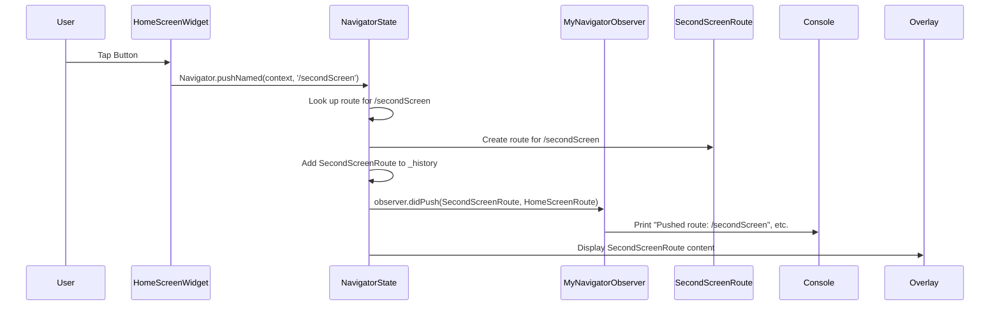

# Chapter 7: NavigatorObserver

Welcome back, Flutter enthusiasts! In our journey through Flutter navigation, we've learned about the [Navigator](01_navigator_.md) managing the route stack, [Route](02_route_.md)s as screen recipes, [RouteSettings](03_routesettings_.md) for details, [Page](04_page_.md)s for declarative navigation, [RoutePredicate](05_routepredicate_.md)s for advanced route selection, and [RoutePopDisposition](06_routepopdisposition_.md) for controlling pop behavior.

Today, we're adding a tool that lets us *watch* all of this navigation magic happen: the **NavigatorObserver**.

Think of a **NavigatorObserver** as a silent spy or a detective that keeps an eye on everything the [Navigator](01_navigator_.md) is doing. Whenever a route is pushed, popped, replaced, or even removed, the `NavigatorObserver` gets a notification.

## Why do we need a NavigatorObserver?

Why would you want to watch the [Navigator](01_navigator_.md)? Here are a few common reasons:

1.  **Logging:** You might want to track which screens the user visits and in what order for analytics or debugging. A `NavigatorObserver` can simply print a message every time a route changes.
2.  **Analytics:** Similar to logging, you can send navigation events to an analytics service (like Google Analytics or Firebase Analytics) to understand user flow within your app.
3.  **External Updates:** Maybe some part of your app needs to react whenever a specific screen is shown or dismissed. An observer can trigger actions outside of the screen itself.
4.  **Custom Behaviors:** In advanced scenarios, you might use an observer to implement custom global behaviors related to navigation, like managing certain background tasks.

The core idea is that the `NavigatorObserver` allows you to react *globally* to changes in the [Navigator's](01_navigator_.md) state without needing to add logic to *every single screen's* navigation calls (`push`, `pop`, etc.).

## Using NavigatorObserver to Log Navigation Events

Let's dive into our main use case: logging every time a screen is pushed or popped.

To use a `NavigatorObserver`, you need to:

1.  Create a class that extends `NavigatorObserver`.
2.  Override the methods that correspond to the events you want to listen to (like `didPush` and `didPop`).
3.  Provide an instance of your observer class to the `observers` list of your `Navigator` (or usually, your `MaterialApp` or `WidgetsApp`, which creates the main [Navigator]).

Here's our simple logging observer:

```dart
import 'package:flutter/material.dart';

// Our custom observer that extends NavigatorObserver
class MyNavigatorObserver extends NavigatorObserver {
  // Called when a route is pushed (a new screen is added)
  @override
  void didPush(Route<dynamic> route, Route<dynamic>? previousRoute) {
    print('NavigatorObserver: Pushed route: ${route.settings.name}');
    print('NavigatorObserver: Previous route: ${previousRoute?.settings.name}');
  }

  // Called when a route is popped (a screen is removed)
  @override
  void didPop(Route<dynamic> route, Route<dynamic>? previousRoute) {
    print('NavigatorObserver: Popped route: ${route.settings.name}');
    print('NavigatorObserver: New current route: ${previousRoute?.settings.name}');
  }

  // You can override other methods too, like didReplace, didRemove, etc.
}
```

This class is pretty straightforward. It just overrides `didPush` and `didPop` to print messages showing the name of the route involved in the event and the route below it.

Now, let's integrate this into our simple navigation setup with a Home Screen and Second Screen using named routes, similar to what we did in [Chapter 3: RouteSettings](03_routesettings_.md).

```dart
import 'package:flutter/material.dart';
import 'my_navigator_observer.dart'; // Import our observer

// Screen 1: Home
class HomeScreen extends StatelessWidget {
  const HomeScreen({super.key});

  @override
  Widget build(BuildContext context) {
    return Scaffold(
      appBar: AppBar(title: const Text('Home Screen')),
      body: Center(
        child: ElevatedButton(
          onPressed: () {
            Navigator.pushNamed(context, '/secondScreen');
          },
          child: const Text('Go to Second Screen'),
        ),
      ),
    );
  }
}

// Screen 2: Second Screen
class SecondScreen extends StatelessWidget {
  const SecondScreen({super.key});

  @override
  Widget build(BuildContext context) {
    return Scaffold(
      appBar: AppBar(title: const Text('Second Screen')),
      body: Center(
        child: ElevatedButton(
          onPressed: () {
            Navigator.pop(context);
          },
          child: const Text('Go Back!'),
        ),
      ),
    );
  }
}
```

And here's how we provide our observer to the `MaterialApp`:

```dart
import 'package:flutter/material.dart';
import 'screens.dart'; // Contains HomeScreen and SecondScreen
import 'my_navigator_observer.dart'; // Import our observer

// Create an instance of our observer
final MyNavigatorObserver myObserver = MyNavigatorObserver();

void main() {
  runApp(MaterialApp(
    title: 'Navigator Observer Demo',
    initialRoute: '/',
    routes: {
      '/': (context) => const HomeScreen(),
      '/secondScreen': (context) => const SecondScreen(),
    },
    // Provide our observer here!
    observers: [
      myObserver, // Add our observer to the list
    ],
  ));
}
```

When you run this code and navigate between the screens, you'll see the `print` statements from `MyNavigatorObserver` appear in your console every time a `push` or `pop` happens.

**Expected Console Output (walking through the simple flow):**

1.  App starts (HomeScreen is the initial route, often added without a `push` notification by default setup): No observer notification yet.
2.  Tap "Go to Second Screen" button:
    ```
    NavigatorObserver: Pushed route: /secondScreen
    NavigatorObserver: Previous route: /
    ```
3.  Tap "Go Back!" button:
    ```
    NavigatorObserver: Popped route: /secondScreen
    NavigatorObserver: New current route: /
    ```

This is a minimal example, but it shows the power of listening to navigation events centrally.

## Other Methods to Observe

Besides `didPush` and `didPop`, `NavigatorObserver` also offers other methods you can override:

*   `didReplace({Route<dynamic>? newRoute, Route<dynamic>? oldRoute})`: Called when one route is replaced by another (e.g., using `Navigator.pushReplacement`).
*   `didRemove(Route<dynamic> route, Route<dynamic>? previousRoute)`: Called when a route is removed from the stack without being popped (e.g., using `Navigator.removeRoute`).
*   `didChangeTop(Route<dynamic> topRoute, Route<dynamic>? previousTopRoute)`: Called whenever the top-most route on the navigator changes, regardless of how it changed (push, pop, replace affecting top).
*   `didStartUserGesture(Route<dynamic> route, Route<dynamic>? previousRoute)`: Called when a user starts a gesture associated with navigation (like the iOS back swipe).
*   `didStopUserGesture()`: Called when a user gesture associated with navigation ends.

Overriding these methods lets your observer react to the full spectrum of navigation changes.

## NavigatorObserver Under the Hood (Simplified)

How does the `NavigatorObserver` get its notifications?

The `NavigatorState` (the actual state object that manages the routes, discussed in [Chapter 1: Navigator](01_navigator_.md)) holds a list of `NavigatorObserver` instances provided to it via the `Navigator` widget's `observers` property. Whenever the `NavigatorState` performs a navigation operation (like adding or removing a route from its internal stack), it iterates through its list of observers and calls the corresponding notification method on each one.

Imagine the `NavigatorState`'s `push` method (simplified):

```dart
// Inside NavigatorState class (simplified push)
@optionalTypeArgs
Future<T?> push<T extends Object?>(Route<T> route) {
  // ... (internal logic to add route entry to _history) ...

  // After the internal state is updated...
  // Notify observers about the push event!
  // _effectiveObservers is the list of observers including the hero controller
  for (final NavigatorObserver observer in _effectiveObservers) {
    observer.didPush(route, previousRoute); // Calls the observer's method
  }

  // ... (more internal logic, animations, etc.) ...

  return route.popped; // Return the future
}
```

Similarly, the `pop` method (simplified):

```dart
// Inside NavigatorState class (simplified pop)
@optionalTypeArgs
void pop<T extends Object?>([T? result]) {
  // ... (internal logic to remove route entry from _history) ...

  // After the internal state changes...
  // Notify observers about the pop event!
  // _effectiveObservers is the list of observers
  for (final NavigatorObserver observer in _effectiveObservers) {
    observer.didPop(poppedRoute, newTopRoute); // Calls the observer's method
  }

  // ... (more internal logic) ...
}
```

And how about our logging example flow with the observer?



This simple diagram shows that when `Navigator.pushNamed` (which internally calls the `push` method in `NavigatorState`) is executed, the `NavigatorState` makes a call to the `didPush` method on your `MyNavigatorObserver` instance, allowing it to react to the event.

## Conclusion

The `NavigatorObserver` is a powerful, yet simple abstraction that allows you to listen to and react to events happening within a [Navigator]. By creating a custom observer and providing it to your application's main [Navigator], you can centralize logic for tasks like logging, analytics, or triggering side effects based on navigation changes. It provides a clean way to decouple these global concerns from the individual screen widgets and navigation calls.

In the next chapter, we'll explore another advanced concept for customizing behavior within the [Navigator]: the `TransitionDelegate`, which influences how pages animate when the `Navigator.pages` list changes.

[Chapter 8: TransitionDelegate](08_transitiondelegate_.md)

---

Generated by [AI Codebase Knowledge Builder](https://github.com/The-Pocket/Tutorial-Codebase-Knowledge)