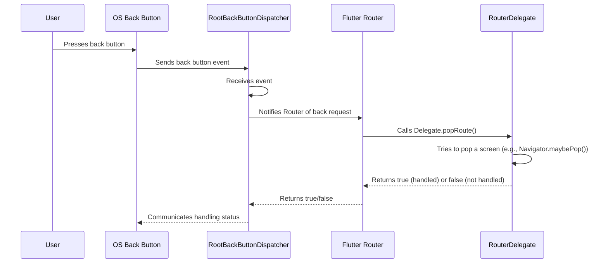

# Chapter 7: RootBackButtonDispatcher

Welcome back! In the last chapter, we learned about the [BackButtonDispatcher](06_backbuttondispatcher_.md), the mechanism that listens for system back button presses and forwards them to the [Router](05_router_.md). We saw that it's how Flutter handles those important "go back" requests from the operating system, especially on platforms like Android.

Now, we're going to look at a specific and very common type of [BackButtonDispatcher](06_backbuttondispatcher_.md): the `RootBackButtonDispatcher`.

## What is a RootBackButtonDispatcher?

Think of the `RootBackButtonDispatcher` as the **primary listener for system back buttons for your app's main navigation**. It's the one that sits at the highest level of your routing setup and is the first to hear when the user presses the device's back button.

Its main job is simple:

1.  **Listen to the Platform:** It registers with the underlying operating system to receive notifications whenever the global "pop route" event occurs (which happens when the user presses the back button).
2.  **Notify the Router:** When it receives such a notification, it immediately tells the **[Router](05_router_.md)** it's associated with that a back request has happened.

It doesn't decide *what* happens when the back button is pressed; that's the job of the [RouterDelegate](04_routerdelegate_.md). The `RootBackButtonDispatcher` is solely responsible for *detecting* the system event and ensuring the top-level [Router](05_router_.md) is informed.

It's called "Root" because it's intended for the main, un-nested [Router](05_router_.md) at the root of your application's navigation hierarchy.

Here's the flow we saw in [Chapter 6](06_backbuttondispatcher_.md), specifically with the `RootBackButtonDispatcher`:



## Why Do We Use a RootBackButtonDispatcher?

For most standard Flutter applications using the declarative router, you need *one* object that is responsible for catching the system back button event at the highest level. The `RootBackButtonDispatcher` is the built-in, standard way to achieve this.

If you don't provide any [BackButtonDispatcher](06_backbuttondispatcher_.md) to your root [Router](05_router_.md) (like the one managed by `MaterialApp.router`), system back button presses might not be handled correctly by your declarative routing system. You need an object connected to the `Router` that is specifically listening for these events.

Using `RootBackButtonDispatcher` gives you:

*   **Standard Platform Integration:** It knows how to hook into the platform's native back button events.
*   **Initial Back Button Handling Trigger:** It serves as the starting point for the back button event processing chain (RootDispatcher -> [Router](05_router_.md) -> [RouterDelegate](04_routerdelegate_.md)).

## How to Use RootBackButtonDispatcher

As we briefly saw in the previous chapter, using `RootBackButtonDispatcher` is straightforward. You instantiate it and provide it to the `backButtonDispatcher` property of your main `Router` widget. Since `MaterialApp.router` creates the main `Router` for you, you provide it there:

```dart
import 'package:flutter/material.dart';
import 'my_app_routing.dart'; // Assumes this has MyAppRouteInformationParser etc.

void main() {
  runApp(const MyApp());
}

class MyApp extends StatelessWidget {
  const MyApp({super.key});

  @override
  Widget build(BuildContext context) {
    // MaterialApp.router creates and manages a Router widget internally
    return MaterialApp.router(
      title: 'My Router App',
      routeInformationProvider: PlatformRouteInformationProvider(
        initialRouteInformation: RouteInformation(uri: Uri.parse('/')),
      ),
      routeInformationParser: MyAppRouteInformationParser(), // From Chapter 3
      routerDelegate: MyAppRouterDelegate(),           // From Chapter 4

      // *** Provide the RootBackButtonDispatcher here! ***
      backButtonDispatcher: RootBackButtonDispatcher(), // Simple instantiation

    );
  }
}
```

That's it! You don't need to configure the `RootBackButtonDispatcher` any further for basic usage. By passing `RootBackButtonDispatcher()` to the `backButtonDispatcher` property, you are giving the `Router` the listener it needs to react to system back button pushes.

The `RootBackButtonDispatcher` itself doesn't require any arguments or complex setup for this purpose. It simply plugs into the platform's back button event system.

Remember from [Chapter 4](04_routerdelegate_.md) that your `MyAppRouterDelegate` should implement the `popRoute` method (usually by mixing in `PopNavigatorRouterDelegateMixin`) for the back button press to actually do something like pop a screen from a `Navigator`. The `RootBackButtonDispatcher` just gets the event to the `Router`, and the `Router` passes it to the delegate's `popRoute`.

## Internal View (How Flutter Uses RootBackButtonDispatcher)

Let's dive a little deeper into the code to see how `RootBackButtonDispatcher` achieves its goal.

The `RootBackButtonDispatcher` class inherits from the base `BackButtonDispatcher` and also `WidgetsBindingObserver`:

```dart
// Snippet from packages/flutter/lib/src/widgets/router.dart
class RootBackButtonDispatcher extends BackButtonDispatcher with WidgetsBindingObserver {
  /// Create a root back button dispatcher.
  RootBackButtonDispatcher();

  // ... methods below ...
}
```
By mixing in `WidgetsBindingObserver`, the `RootBackButtonDispatcher` can listen to system events delivered via the `WidgetsBinding.instance`.

When the `Router` associated with this dispatcher starts up, it calls `addCallback` on the `RootBackButtonDispatcher` (as we saw in [Chapter 6](06_backbuttondispatcher_.md)'s internal view).

```dart
// Snippet from packages/flutter/lib/src/widgets/router.dart (_RouterState.initState)
widget.backButtonDispatcher?.addCallback(_handleBackButtonDispatcherNotification);
```

The `RootBackButtonDispatcher` overrides the `addCallback` method to start listening to the `WidgetsBinding` if it's the first callback being added:

```dart
// Snippet from packages/flutter/lib/src/widgets/router.dart (RootBackButtonDispatcher)
@override
void addCallback(ValueGetter<Future<bool>> callback) {
  if (!hasCallbacks) { // hasCallbacks comes from the base BackButtonDispatcher
    WidgetsBinding.instance.addObserver(this); // Starts listening to platform events!
  }
  super.addCallback(callback); // Add the provided callback (from the Router)
}
```

This `WidgetsBinding.instance.addObserver(this)` call is key. It registers the `RootBackButtonDispatcher` instance to receive important system event notifications, including `didPopRoute`.

When the user presses the system back button, the Flutter engine on the platform side catches it and signals the framework through `WidgetsBinding`. This triggers the `didPopRoute` method *on the registered observer* (our `RootBackButtonDispatcher` instance):

```dart
// Snippet from packages/flutter/lib/src/widgets/router.dart (RootBackButtonDispatcher)
@override
Future<bool> didPopRoute() => invokeCallback(Future<bool>.value(false));
```

Here's what happens in `didPopRoute`:

1.  It calls `invokeCallback`. This method, inherited from the base `BackButtonDispatcher`, is designed to call the callbacks that have been `addCallback`-ed to it.
2.  As we saw earlier, the `Router` added a callback (`_handleBackButtonDispatcherNotification`) that triggers the `routerDelegate.popRoute()`.
3.  So, the `didPopRoute` call effectively results in our `Router`'s `_handleBackButtonDispatcherNotification` being executed, which in turn calls our custom `RouterDelegate`'s `popRoute` method.
4.  The result of `routerDelegate.popRoute()` (true/false future) is then returned by `invokeCallback` and subsequently by `didPopRoute`. This result goes back to the `WidgetsBinding`, indicating whether Flutter handled the pop request internally or if the underlying platform should proceed with its default behavior (like closing the app).

The `removeCallback` method in `RootBackButtonDispatcher` does cleanup, removing the observer if no more callbacks are listening:

```dart
// Snippet from packages/flutter/lib/src/widgets/router.dart (RootBackButtonDispatcher)
@override
void removeCallback(ValueGetter<Future<bool>> callback) {
  super.removeCallback(callback);
  if (!hasCallbacks) {
    WidgetsBinding.instance.removeObserver(this); // Stop listening to platform events
  }
}
```

This internal structure shows that the `RootBackButtonDispatcher` is a specialized `BackButtonDispatcher` that uses `WidgetsBindingObserver` to be the initial point of contact for system back button events, forwarding them through the generic `invokeCallback` mechanism to the registered listeners (the `Router`).

## Conclusion

The `RootBackButtonDispatcher` is the standard, top-level component for receiving system back button presses in Flutter's declarative routing system. By providing an instance of `RootBackButtonDispatcher` to your root `Router`, you ensure that the system back button events are caught and properly dispatched to your `RouterDelegate`'s `popRoute` method for handling (typically popping a screen from a `Navigator`). It acts as the crucial bridge between the platform's back button mechanism and your application's routing logic.

In the next chapter, we'll look at the [ChildBackButtonDispatcher](08_childbackbuttondispatcher_.md), which is used when you have nested `Router`s and need more fine-grained control over which part of your UI handles the back button.

[Next Chapter: ChildBackButtonDispatcher](08_childbackbuttondispatcher_.md)

---

Generated by [AI Codebase Knowledge Builder](https://github.com/The-Pocket/Tutorial-Codebase-Knowledge)