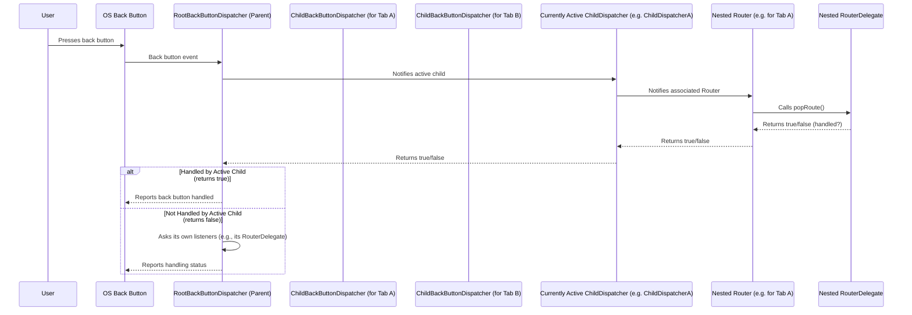

# Chapter 8: ChildBackButtonDispatcher

Welcome back! Over the past seven chapters, we've journeyed through the core components of Flutter's Declarative Router system, covering everything from the "note" ([Chapter 1: RouteInformation](01_routeinformation_.md)) to the "orchestrator" ([Chapter 5: Router](05_router_.md)) and the "system back button listener" ([Chapter 6: BackButtonDispatcher](06_backbuttondispatcher_.md) and [Chapter 7: RootBackButtonDispatcher](07_rootbackbuttondispatcher_.md)).

You learned that the `RootBackButtonDispatcher` is essential for catching global system back button presses and sending them to your *main* [Router](05_router_.md). But what if your app has a more complex layout?

## Why Nested Routers Need ChildBackButtonDispatcher

Imagine your app has a main screen with a tab bar at the bottom. Each tab has its own separate navigation flow. For instance:

*   **Tab A:** A list of items -> Item Detail -> Another sub-page.
*   **Tab B:** User profile -> Edit profile.
*   **Tab C:** Settings.

```mermaid
graph TD
    A[App Root (Router)] --&gt; B[Main Screen (Tab Bar)]
    B --&gt; C{Tab A}
    B --&gt; D{Tab B}
    B --&gt; E{Tab C}
    C --&gt; F[Item List]
    F --&gt; G[Item Detail]
    D --&gt; H[Profile]
    H --&gt; I[Edit Profile]
```

In this setup, you might use a separate [Router](05_router_.md) and [RouterDelegate](04_routerdelegate_.md) *within each tab*. This allows each tab to manage its own navigation stack independently.

Now, consider the user pressing the system back button. What should happen?

*   If they are deep inside **Tab A**'s detail page, you likely want the back button to pop *within Tab A*.
*   Only if they are at the root of **Tab A** (the item list) should the back button switch tabs or potentially go back from the main screen.

The `RootBackButtonDispatcher` sends the back event to the *main* [Router](05_router_.md) at the top of your app. But that main [Router](05_router_.md) doesn't know which tab is currently active or which nested [Router](05_router_.md) should handle the pop request.

This is the problem the `ChildBackButtonDispatcher` solves!

## What is a ChildBackButtonDispatcher?

A `ChildBackButtonDispatcher` is a type of [BackButtonDispatcher](06_BackButtonDispatcher.md) designed specifically for **nested [Router](05_router.md)s**. Instead of listening to the platform directly like the `RootBackButtonDispatcher`, it listens to a *parent* [BackButtonDispatcher](06_BackButtonDispatcher.md).

Its core responsibilities are:

1.  **Listen to a Parent:** It receives back button notifications from the [BackButtonDispatcher](06_BackButtonDispatcher.md) higher up in the hierarchy (usually the `RootBackButtonDispatcher` or another `ChildBackButtonDispatcher`).
2.  **Connect to a Child Router:** It's associated with a specific nested [Router](05_router.md).
3.  **Claim Priority:** It can signal to its parent that its associated nested [Router](05_router.md) is currently active and *should* be given the *first chance* to handle any incoming back button notifications.
4.  **Dispatch to the Child Router:** If its parent gives it priority, it forwards the back button notification to its associated nested [Router](05_router.md) (which then calls its nested [RouterDelegate](04_routerdelegate_.md)'s `popRoute` method).

Think of the `ChildBackButtonDispatcher` as a representative for its nested [Router](05_router.md), telling the back button system: "Hey, my section of the UI is currently focused, send the back events here first!"

Here's the flow with nested dispatchers:



This diagram illustrates that the `RootBackButtonDispatcher` is the initial receiver, but it then checks with its "children" (the `ChildBackButtonDispatcher`s that have claimed priority) to see who should handle the event first.

## How to Use ChildBackButtonDispatcher

To use a `ChildBackButtonDispatcher`, you need two things:

1.  **A Parent Dispatcher:** This will be the [BackButtonDispatcher](06_BackButtonDispatcher.md) of the [Router](05_router.md) widget higher up in the tree (usually the `RootBackButtonDispatcher` of your main app [Router](05_router.md)). You can get this using `Router.of(context).backButtonDispatcher`.
2.  **A Child Router:** The `ChildBackButtonDispatcher` will be provided to the `backButtonDispatcher` property of your nested [Router](05_router.md).

Let's sketch out how you might set this up for a tabbed interface, assuming you have a main `MaterialApp.router` and then a `Router` inside each tab's content widget.

```dart
import 'package:flutter/material.dart';
import 'my_app_routing.dart'; // Assume custom delegates for tabs

// Assume MyAppRouterDelegate implements routing for the main app (e.g., showing tabs)
// Assume MyAppRouteInformationParser handles parsing main paths (e.g., /tab_a)

// Assume you have separate delegates and parsers for each tab's routing
// Example: TabARouterDelegate, TabARouteInformationParser, TabAConfig

class MainScreenWithTabs extends StatefulWidget {
  // ... constructor and state management for current tab ...
  final int currentTab; // Assume this state exists
  const MainScreenWithTabs({super.key, required this.currentTab});

  @override
  State<MainScreenWithTabs> createState() => _MainScreenWithTabsState();
}

class _MainScreenWithTabsState extends State<MainScreenWithTabs> {
   // We need separate delegates and parsers for each tab's *nested* router
   // Their configurations would be different from the main app config
   late final TabARouterDelegate _tabARouterDelegate;
   late final TabARouteInformationParser _tabARouteInformationParser;
    late final TabBRouterDelegate _tabBRouterDelegate;
   late final TabBRouteInformationParser _tabBRouteInformationParser;

   @override
   void initState() {
       super.initState();
       _tabARouterDelegate = TabARouterDelegate();
       _tabARouteInformationParser = TabARouteInformationParser();
       _tabBRouterDelegate = TabBRouterDelegate();
       _tabBRouteInformationParser = TabBRouteInformationParser();
   }

   @override
   void dispose() {
       _tabARouterDelegate.dispose();
       _tabBRouterDelegate.dispose();
       super.dispose();
   }

  @override
  Widget build(BuildContext context) {
    // Get the parent BackButtonDispatcher (from the main app Router)
    final BackButtonDispatcher parentBackButtonDispatcher =
        Router.of(context).backButtonDispatcher!;

    // Create a ChildBackButtonDispatcher for each tab's future Router
    final ChildBackButtonDispatcher tabABackButtonDispatcher =
        parentBackButtonDispatcher.createChildBackButtonDispatcher();
    final ChildBackButtonDispatcher tabBBackButtonDispatcher =
        parentBackButtonDispatcher.createChildBackButtonDispatcher();

    // *** Important: Tell the currently active tab's dispatcher to take priority! ***
    // This is usually done whenever the tab selection changes.
    // For simplicity here, we'll do it based on the current tab index in build.
    // A real implementation might do this in a state change callback.
    if (widget.currentTab == 0) {
        tabABackButtonDispatcher.takePriority();
    } else if (widget.currentTab == 1) {
        tabBBackButtonDispatcher.takePriority();
    }
    // Tab C might not have a nested router, or claim priority only when a specific view is shown.

    Widget tabContent;
    if (widget.currentTab == 0) {
      tabContent = Router<TabAConfig>( // Nested Router for Tab A
        routerDelegate: _tabARouterDelegate,
        routeInformationParser: _tabARouteInformationParser,
        // *** Provide the ChildBackButtonDispatcher to the nested Router! ***
        backButtonDispatcher: tabABackButtonDispatcher,
      );
    } else if (widget.currentTab == 1) {
       tabContent = Router<TabBConfig>( // Nested Router for Tab B
        routerDelegate: _tabBRouterDelegate,
        routeInformationParser: _tabBRouteInformationParser,
         // *** Provide the ChildBackButtonDispatcher to the nested Router! ***
        backButtonDispatcher: tabBBackButtonDispatcher,
      );
    } else {
       tabContent = Center(child: Text('Settings Tab')); // Tab C - no nested router needed here
    }

    return Scaffold(
      appBar: AppBar(title: const Text('App with Tabs')),
      body: tabContent, // Show the content of the current tab
      bottomNavigationBar: BottomNavigationBar(
         currentIndex: widget.currentTab,
         onTap: (index) { /* Update widget.currentTab state and rebuild */}
         // ... items for tabs ...
      ),
    );
  }
}
```

Breaking down the key parts of using `ChildBackButtonDispatcher`:

1.  **Get the Parent:** `Router.of(context).backButtonDispatcher!` retrieves the `BackButtonDispatcher` from the nearest ancestor [Router](05_router.md) (in this case, the main app [Router](05_router.md) set up by `MaterialApp.router`). We use `!` assuming the main router *has* a dispatcher (like `/ RootBackButtonDispatcher`).
2.  **Create Children:** `parentBackButtonDispatcher.createChildBackButtonDispatcher()` is the method on the parent where you create instances of `ChildBackButtonDispatcher` that are linked to this parent.
3.  **Provide to Nested Router:** Each `ChildBackButtonDispatcher` is then given to the `backButtonDispatcher` property of the specific nested [Router](05_router.md) it manages.
4.  **Claim Priority (`takePriority()`):** This is arguably the most important step for nested routers. When a nested [Router](05_router.md)'s content becomes the user's *focus* (e.g., when a user switches tabs), you must call `takePriority()` on that nested [Router](05_router.md)'s `ChildBackButtonDispatcher`. This tells the parent dispatcher: "If a back button event comes in, ask *me* first before anyone else (or before handling it yourself)."

When the user presses the back button:

*   The event is first caught by the `RootBackButtonDispatcher`.
*   The `RootBackButtonDispatcher` checks if any of its `ChildBackButtonDispatcher`s have called `takePriority()` most recently.
*   If the `ChildBackButtonDispatcher` for the currently active tab (e.g., Tab A) called `takePriority()`, the `RootBackButtonDispatcher` forwards the back request to *that* `ChildBackButtonDispatcher`.
*   That `ChildBackButtonDispatcher` then notifies its associated nested [Router](05_router.md).
*   The nested [Router](05_router.md) calls its nested [RouterDelegate](04_routerdelegate_.md)'s `popRoute()` method.
*   If the nested [RouterDelegate](04_routerDelegate_.md) (e.g., for Tab A) successfully pops a screen from its `Navigator`, its `popRoute()` returns `Future.value(true)`.
*   This `true` bubbles back up through the `ChildBackButtonDispatcher` to the `RootBackButtonDispatcher`, signaling that the back event was fully handled internally. The OS default pop (like closing the app) is then prevented.
*   If the nested [RouterDelegate](04_routerDelegate_.md)'s `popRoute()` returns `Future.value(false)` (meaning the nested tab's `Navigator` couldn't pop anything because it was already at its root), the `ChildBackButtonDispatcher` also returns `false` to the `RootBackButtonDispatcher`.
*   The `RootBackButtonDispatcher` then proceeds to ask its *own* listeners (which include the main app [Router](05_router.md)'s primary listener, which would call the main app [RouterDelegate](04_routerDelegate_.md)'s `popRoute`). This would allow the main app [RouterDelegate](04_routerDelegate_.md) to handle the back press, perhaps by changing tabs or exiting the app.

This priority system ([deferTo](https://api.flutter.dev/flutter/widgets/BackButtonDispatcher/deferTo.html) and [takePriority](https://api.flutter.dev/flutter/widgets/BackButtonDispatcher/takePriority.html)) managed by the parent and child dispatchers is what makes nested back button handling work correctly.

A common helper widget is [BackButtonListener](https://api.flutter.dev/flutter/widgets/BackButtonListener-class.html). This widget automatically creates a `ChildBackButtonDispatcher` linked to the nearest ancestor [Router](05_router.md)'s dispatcher and calls `takePriority()` when the widget is first built. It also handles removing itself when it's disposed. This is useful if you just need a specific widget *deeper* in the tree (not a whole nested `Router`) to temporarily handle back button presses.

## Internal View (How Flutter Uses ChildBackButtonDispatcher)

Let's look at some code snippets from `packages/flutter/lib/src/widgets/router.dart` to see how `ChildBackButtonDispatcher` works with its parent.

Recall in [Chapter 6](06_backbuttondispatcher_.md), we saw the base `BackButtonDispatcher` has an `invokeCallback` method and keeps a list of potential children that might take priority (`_children`).

The `RootBackButtonDispatcher`'s `didPopRoute` method (which catches the native back event) simply calls `invokeCallback`:

```dart
// Snippet from RootBackButtonDispatcher
@override
Future<bool> didPopRoute() => invokeCallback(Future<bool>.value(false));
```

The base `BackButtonDispatcher.invokeCallback` method is where the child prioritization logic lives:

```dart
// Snippet from BackButtonDispatcher.invokeCallback
@override
Future<bool> invokeCallback(Future<bool> defaultValue) {
  if (_children.isNotEmpty) { // Check if there are children that claimed priority
    final List<ChildBackButtonDispatcher> children = _children.toList();
    int childIndex = children.length - 1; // Start with the most recent child

    Future<bool> notifyNextChild(bool result) {
      if (result) { // If the previous child handled it (returned true)
        return SynchronousFuture<bool>(result); // Stop and return true
      }
      // If not handled, go to the next child in the priority list (backwards)
      if (childIndex > 0) {
        childIndex -= 1;
        // *** Recursively call notifiedByParent on the child ***
        return children[childIndex].notifiedByParent(defaultValue).then<bool>(notifyNextChild);
      }
      // No children handled it, call the parent's own callbacks
      return super.invokeCallback(defaultValue);
    }
    // Start the process by asking the latest child
    return children[childIndex].notifiedByParent(defaultValue).then<bool>(notifyNextChild);
  }
  // No children claimed priority, call the parent's own callbacks
  return super.invokeCallback(defaultValue);
}
```

This shows the delegation:
1.  `invokeCallback` checks if there are prioritized children (`_children`).
2.  If yes, it starts a chain, calling `notifiedByParent` on the most recently prioritized child.
3.  If that child's `notifiedByParent` returns `false` (didn't handle it), it moves to the *next* child in the priority list and calls its `notifiedByParent`, and so on.
4.  If any child returns `true`, the chain stops, and `true` is returned all the way up.
5.  If *no* children handle it (all return `false`), the `invokeCallback` finally calls `super.invokeCallback(defaultValue)`, which triggers the parent's own registered callbacks (like the one from the `Router` itself, which calls its `RouterDelegate.popRoute`).

Now, let's look at the `ChildBackButtonDispatcher`. Its key method is `notifiedByParent`:

```dart
// Snippet from ChildBackButtonDispatcher.notifiedByParent
@protected
Future<bool> notifiedByParent(Future<bool> defaultValue) {
  // A child dispatcher simply calls its OWN invokeCallback.
  // Its own callbacks are the ones added by the nested Router it's linked to.
  return invokeCallback(defaultValue);
}
```

This method is simple: when the parent `BackButtonDispatcher` calls `notifiedByParent` on a `ChildBackButtonDispatcher`, the child simply calls *its own* `invokeCallback`. As we know, a `BackButtonDispatcher`'s `invokeCallback` calls the registered callbacks (which is the nested [Router](05_router.md)'s callback that triggers its [RouterDelegate](04_routerDelegate_.md).popRoute()). This completes the chain of delegation.

The `takePriority` method in `ChildBackButtonDispatcher` does two things:

```dart
// Snippet from ChildBackButtonDispatcher.takePriority
@override
void takePriority() {
  // Tell the parent to defer to THIS child
  parent.deferTo(this);
  // Clear this child's own inner children (if it had any)
  super.takePriority();
}
```

1.  `parent.deferTo(this)`: This is how the child tells the parent to add it to the parent's `_children` list. This marks this child dispatcher as one that should be checked when the parent receives a back event. If called multiple times, `deferTo` moves the child to the end of the parent's priority list, making it the *most recent* and hence the *first* to be checked.
2.  `super.takePriority()`: This clears the `_children` list *within* this specific `ChildBackButtonDispatcher`. This ensures that this dispatcher prioritizes its *own* callbacks (those added by its associated nested [Router](05_router.md)) over any children *it* might have (relevant for deeply nested structures).

Finally, the `removeCallback` in `ChildBackButtonDispatcher` ensures cleanup. When the nested [Router](05_router.md) or the widget using a [BackButtonListener](https://api.flutter.dev/flutter/widgets/BackButtonListener-class.html) is disposed, it removes its callback from the `ChildBackButtonDispatcher`. If the `ChildBackButtonDispatcher` then has no more callbacks (meaning its associated nested part of the UI is gone), it automatically tells its parent to "forget" about it:

```dart
// Snippet from ChildBackButtonDispatcher.removeCallback
@override
void removeCallback(ValueGetter<Future<bool>> callback) {
  super.removeCallback(callback);
  if (!hasCallbacks) { // If no callbacks are left on this child dispatcher
    parent.forget(this); // Tell the parent to remove this child from its priority list
  }
}
```

This `parent.forget(this)` call is how the parent `BackButtonDispatcher` knows that a child is no longer active and shouldn't be considered for back button priority anymore.

These internal workings show the elegant delegation pattern: the `RootBackButtonDispatcher` starts the process, which cascades down through `ChildBackButtonDispatcher`s that have claimed priority. The first one able to handle the pop (by its associated [RouterDelegate](04_routerDelegate_.md) returning `true`) stops the cascade.

## Conclusion

The `ChildBackButtonDispatcher` is essential for managing back button behavior in apps with nested routing. It doesn't listen to the platform directly but instead connects to a parent [BackButtonDispatcher](06_BackButtonDispatcher.md). By calling `takePriority()`, a `ChildBackButtonDispatcher` signals its associated nested [Router](05_router.md) should be given the opportunity to handle back button events first. This mechanism ensures that back presses are directed to the most relevant part of your UI hierarchy, allowing for intuitive navigation within complex layouts like tabbed interfaces.

In the next chapter, we'll look at the [PopNavigatorRouterDelegateMixin](09_popnavigatorrouterdelegatemixin_.md), a very common helper mixin for `RouterDelegate`s that simplifies integrating back button handling with a `Navigator`.

[Next Chapter: PopNavigatorRouterDelegateMixin](09_popnavigatorrouterdelegatemixin_.md)

---

Generated by [AI Codebase Knowledge Builder](https://github.com/The-Pocket/Tutorial-Codebase-Knowledge)