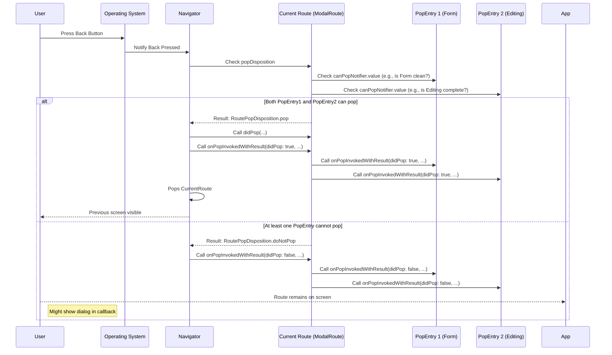

# Chapter 8: PopEntry

Welcome back to our Flutter navigation journey! In the last chapter, [Chapter 7: LocalHistoryRoute](07_localhistoryroute_.md), we learned how a single route could manage its own "mini-history" using `LocalHistoryEntry` to handle back presses internally, perfect for showing/hiding overlays or sections within a screen without leaving it.

Now, let's introduce `PopEntry`. This is a newer and often more declarative way to manage if a route can be popped and to react when it *is* popped. Think of it as putting special "stickers" onto a playing card ([ModalRoute](04_modalroute_.md)) that can either stick the card to the stack (preventing the pop) or react when the card finally gets removed.

### What is a PopEntry?

A `PopEntry` is a simple object that you can associate with a [ModalRoute](04_modalroute_.md). It holds two key pieces of information:

1.  **Can Pop:** Whether this specific entry thinks the route can currently be popped.
2.  **On Pop Invoked:** A function (`onPopInvokedWithResult`) to call when the route is popped (or a pop is attempted and blocked).

Imagine your [ModalRoute](04_modalroute_.md) (the playing card) can have multiple stickers (`PopEntry`s) stuck to it by different parts of your screen's UI (like different widgets). Before the card can be removed (popped), *every* sticker must agree that it's okay to remove the card. If even one sticker says "No, don't pop yet!" then the card stays. If all stickers say "Yes, go ahead!", the card can be popped. When the card *is* removed, *every* sticker gets notified.

This is the mechanism used by the modern `PopScope` widget. When you use `PopScope` inside a route, it often works by creating a `PopEntry` and registering it with the [ModalRoute](04_modalroute_.md) that contains it.

Common use cases for `PopEntry` (often via `PopScope`):

*   **Blocking pops with unsaved data:** If the user is editing a form, you can create a `PopEntry` that says the route *cannot* be popped while there are unsaved changes.
*   **Showing a confirmation dialog:** When a pop is attempted but blocked (because a `PopEntry` said no), you can use the `onPopInvokedWithResult` callback of that `PopEntry` to show a "Discard changes?" dialog.
*   **Reacting to a pop:** Even if you don't block the pop, a `PopEntry`'s `onPopInvokedWithResult` can be used to perform cleanup or other actions just before or after the route is popped.

### Why Use PopEntry?

`PopEntry` provides a more structured and explicit way to manage pop behavior compared to the older `WillPopCallback`s (though those are still supported for compatibility and specific advanced cases).

*   **Declarative:** Widgets like `PopScope` make it easy to declare pop behavior right where the relevant UI lives, creating a `PopEntry` under the hood.
*   **Multiple handlers:** Several `PopEntry` instances can be registered with a single route, each controlling its own `canPop` status and reacting to pop attempts independently. The route's overall `canPop` becomes the logical AND of all registered `PopEntry`s.
*   **Rich callback:** The `onPopInvokedWithResult` callback provides information about whether the pop *actually* happened (`didPop` boolean) and the `result` the route was popped with, allowing for more nuanced reactions.

### Key Concepts of PopEntry

*   **`canPopNotifier`:** This is a `ValueListenable<bool>`. When its value is `true`, this `PopEntry` contributes to the route being potentially pop-able. When it's `false`, this entry signals "do not pop." The route listens to this notifier and updates its own `canPop` status accordingly.
*   **`onPopInvokedWithResult(bool didPop, T? result)`:** This callback is triggered whenever a pop is attempted on the route, regardless of whether it was successfully popped or blocked.
    *   `didPop`: `true` if the route *was* actually popped and removed from the navigator stack; `false` if the pop was blocked (e.g., by a `PopEntry` or [LocalHistoryRoute](07_localhistoryroute_.md)).
    *   `result`: The value the route was popped with (if `didPop` is true).
*   **Registering/Unregistering:** A `PopEntry` must be registered with its containing [ModalRoute](04_modalroute_.md) using `modalRoute.registerPopEntry()` and unregistered using `modalRoute.unregisterPopEntry()` when it's no longer needed (typically handled automatically by widgets like `PopScope`).

### How PopEntry Works (Conceptual)

Let's see how a Route with a several PopEntries (stickers) behaves when a pop is attempted.



1.  The user initiates a back action.
2.  The OS notifies the [Navigator](03_overlayroute_.md).
3.  The [Navigator](03_overlayroute_.md) consults the current route's `popDisposition`.
4.  The route's `popDisposition` (specifically, the `ModalRoute` implementation using the `LocalHistoryRoute` mixin logic, which also checks registered `PopEntry`s) iterates through its registered `PopEntry` instances and reads their `canPopNotifier.value`.
5.  If *all* `PopEntry`s return `true` (and there's no [LocalHistoryRoute](07_localhistoryroute_.md) blocking it), the `popDisposition` signals that the route *can* be popped. The [Navigator](03_overlayroute_.md) proceeds with popping the route. After or during the animation, the route's `onPopInvokedWithResult` method is called with `didPop: true`. This cascades to calling `onPopInvokedWithResult` on all registered `PopEntry`s with `didPop: true`.
6.  If *any* `PopEntry` returns `false`, the `popDisposition` signals `RoutePopDisposition.doNotPop`. The [Navigator](03_overlayroute_.md) *does not* pop the route off the stack. The route's `onPopInvokedWithResult` method is called with `didPop: false`, which cascades to all registered `PopEntry`s calling their `onPopInvokedWithResult` with `didPop: false`. This is where a `PopEntry` might trigger a confirmation dialog.

### Looking at the Code

Let's look at the `PopEntry` definition itself.

```dart
abstract class PopEntry<T> {
  // ... deprecated onPopInvoked ...

  /// {@macro flutter.widgets.PopScope.onPopInvokedWithResult}
  void onPopInvokedWithResult(bool didPop, T? result);

  /// {@macro flutter.widgets.PopScope.canPop}
  ValueListenable<bool> get canPopNotifier;

  // ... toString ...
}
```
This abstract class defines the two key parts: the getter for `canPopNotifier` and the abstract method `onPopInvokedWithResult` that subclasses must implement.

Now, let's look at how `ModalRoute` uses `PopEntry` (from the provided snippet):

```dart
abstract class ModalRoute<T> extends TransitionRoute<T> with LocalHistoryRoute<T> {
  // ... other properties and methods ...

  // Holding as Object? instead of T so that PopScope in this route can be
  // declared with any supertype of T.
  final Set<PopEntry<Object?>> _popEntries = <PopEntry<Object?>>{}; // Stores registered entries

  // ... willPop (deprecated) ...

  @override
  RoutePopDisposition get popDisposition {
    for (final PopEntry<Object?> popEntry in _popEntries) { // Loop through registered entries
      if (!popEntry.canPopNotifier.value) { // Check each entry's canPopNotifier
        return RoutePopDisposition.doNotPop; // If any is false, block the pop
      }
    }

    return super.popDisposition; // If all can pop, let the base (LocalHistoryRoute) decide
  }

  @override
  void onPopInvokedWithResult(bool didPop, T? result) {
    for (final PopEntry<Object?> popEntry in _popEntries) { // Loop through registered entries
      popEntry.onPopInvokedWithResult(didPop, result); // Call callback on each entry
    }
    super.onPopInvokedWithResult(didPop, result);
  }

  /// Registers the existence of a [PopEntry] in the route.
  void registerPopEntry(PopEntry<Object?> popEntry) {
    _popEntries.add(popEntry); // Add to the set of entries
    popEntry.canPopNotifier.addListener(_maybeDispatchNavigationNotification); // Listen for canPop changes
    _maybeDispatchNavigationNotification(); // Trigger notification after adding
  }

  /// Unregisters a [PopEntry] in the route's widget subtree.
  void unregisterPopEntry(PopEntry<Object?> popEntry) {
    _popEntries.remove(popEntry); // Remove from the set
    popEntry.canPopNotifier.removeListener(_maybeDispatchNavigationNotification); // Stop listening
    _maybeDispatchNavigationNotification(); // Trigger notification after removing
  }

  // ... more code ...
}
```
Here, we see:
*   `_popEntries`: A `Set` within `ModalRoute` to keep track of all the `PopEntry` instances that have been registered with this route.
*   `popDisposition`: This overridden getter now explicitly loops through `_popEntries`. If *any* `PopEntry`'s `canPopNotifier.value` is `false`, it immediately returns `RoutePopDisposition.doNotPop`, effectively blocking the pop. If the loop completes (all `canPopNotifier.value`s were true), it then asks `super.popDisposition` (which handles the `LocalHistoryRoute` logic) whether the pop should happen or be handled locally.
*   `onPopInvokedWithResult`: This overridden method simply iterates through the registered `_popEntries` and calls `onPopInvokedWithResult` on each one, passing the same `didPop` and `result` arguments.
*   `registerPopEntry` and `unregisterPopEntry`: These methods manage adding/removing entries from the `_popEntries` set. They also add/remove a listener to the `PopEntry`'s `canPopNotifier` so that the route can react when a `PopEntry`'s `canPop` status changes (`_maybeDispatchNavigationNotification` is called to potentially notify listeners like the `AppBar`).

### Example: Using PopScope (Which Uses PopEntry)

You overwhelmingly interact with `PopEntry` through the `PopScope` widget. `PopScope` is a simple widget that wraps another widget and automatically creates, registers, and unregisters a `PopEntry` with the nearest [ModalRoute](04_modalroute_.md).

Here's how you'd use `PopScope` to prevent navigating away from a screen with unsaved changes without a confirmation:

```dart
import 'package:flutter/material.dart';

class EditItemScreen extends StatefulWidget {
  const EditItemScreen({super.key});

  @override
  State<EditItemScreen> createState() => _EditItemScreenState();
}

class _EditItemScreenState extends State<EditItemScreen> {
  // State to track if there are unsaved changes
  bool _hasUnsavedChanges = false;

  // ValueNotifier for PopScope's canPop property
  // PopScope will automatically wrap this in a PopEntry's canPopNotifier
  final ValueNotifier<bool> _canPop = ValueNotifier<bool>(true); // Start as pop-able

  @override
  void dispose() {
    _canPop.dispose(); // Clean up the notifier
    super.dispose();
  }

  void _onTextFieldChanged(String text) {
    // If the text changes, there are unsaved changes
    final bool hasChanges = text.isNotEmpty; // Simplified check
    if (_hasUnsavedChanges != hasChanges) {
      setState(() {
        _hasUnsavedChanges = hasChanges;
        // Update the ValueNotifier based on changes
        _canPop.value = !_hasUnsavedChanges; // Can pop IF there are NO unsaved changes
      });
    }
  }

  // This callback is called when a pop is invoked, regardless of whether it succeeds.
  void _onPopInvoked(bool didPop) {
    print('onPopInvoked called: didPop = $didPop');
    if (didPop) {
      // Route was successfully popped - maybe do cleanup here
       print('Route was popped.');
    } else {
      // Pop was blocked (because _canPop.value was false) - show a dialog
      print('Pop was blocked. Showing confirmation dialog...');
      _showDiscardChangesDialog();
    }
  }

  // Show a dialog asking the user if they want to discard changes
  Future<void> _showDiscardChangesDialog() async {
    final bool? discard = await showDialog<bool>(
      context: context,
      builder: (BuildContext dialogContext) {
        return AlertDialog(
          title: const Text('Discard Changes?'),
          content: const Text('You have unsaved changes. Do you want to discard them?'),
          actions: <Widget>[
            TextButton(
              child: const Text('Cancel'),
              onPressed: () {
                Navigator.of(dialogContext).pop(false); // Don't discard
              },
            ),
            TextButton(
              child: const Text('Discard'),
              onPressed: () {
                Navigator.of(dialogContext).pop(true); // Discard changes
              },
            ),
          ],
        );
      },
    );

    if (discard == true) {
      // User chose to discard changes - allow the pop now
      // This must be done AFTER the dialog is dismissed
       Navigator.of(context).pop();
    }
  }

  @override
  Widget build(BuildContext context) {
    // Wrap the entire screen content in PopScope
    return PopScope(
      canPop: _canPop.value, // Control pop-ability using your state
      onPopInvoked: _onPopInvoked, // Handle pop attempts
      child: Scaffold(
        appBar: AppBar(
          title: const Text('Edit Item'),
          // AppBar's back button respects the route's popDisposition,
          // which is influenced by PopScope's canPop.
        ),
        body: Padding(
          padding: const EdgeInsets.all(16.0),
          child: Column(
            crossAxisAlignment: CrossAxisAlignment.start,
            children: [
              TextField(
                decoration: const InputDecoration(labelText: 'Item Name'),
                onChanged: _onTextFieldChanged, // Listen for changes
              ),
              const SizedBox(height: 20),
              Text(
                _hasUnsavedChanges ? 'You have unsaved changes.' : 'No unsaved changes.',
                style: TextStyle(color: _hasUnsavedChanges ? Colors.red : Colors.green),
              ),
              // Save button (example, not fully implemented pop logic here)
               // ElevatedButton(
               //   onPressed: _hasUnsavedChanges ? () {
               //      // Save logic... then maybe Navigator.of(context).pop(true);
               //      // After saving, _hasUnsavedChanges would become false,
               //      // making canPop true again for future back presses.
               //   } : null,
               //   child: const Text('Save'),
               // ),
            ],
          ),
        ),
      ),
     );
  }
}

// To use this:
// Navigator.push(
//   context,
//   MaterialPageRoute(builder: (context) => const EditItemScreen()),
// );
```

In this example:

1.  We have an `EditItemScreen` that uses a boolean `_hasUnsavedChanges` and a `ValueNotifier<bool> _canPop` to manage its state.
2.  The `_onTextFieldChanged` method updates `_hasUnsavedChanges` and, crucially, updates `_canPop.value`. When there are unsaved changes, `_canPop.value` becomes `false`.
3.  The entire `Scaffold` is wrapped in a `PopScope`.
4.  `PopScope`'s `canPop` property is bound to `_canPop.value`. When `_canPop.value` is false, `PopScope` configures the underlying `PopEntry`'s notifier to be false, telling the route "Don't pop yet!".
5.  `PopScope`'s `onPopInvoked` property is set to our `_onPopInvoked` method.
6.  When the user presses the back button while `_hasUnsavedChanges` is true:
    *   The [Navigator](03_overlayroute_.md) initiates a pop.
    *   The route checks its `popDisposition`.
    *   The `PopScope`'s underlying `PopEntry` contributes `false` to the check.
    *   The route's `popDisposition` returns `RoutePopDisposition.doNotPop`.
    *   The [Navigator](03_overlayroute_.md) *does not* pop the route.
    *   The route calls `onPopInvokedWithResult(didPop: false, result: null)` on all registered `PopEntry`s.
    *   Our `_onPopInvoked` method is called with `didPop: false`.
    *   Inside `_onPopInvoked`, since `didPop` is false, we show the "Discard Changes?" dialog.
    *   If the user chooses "Discard", the dialog pops with `true`. We then *manually* call `Navigator.of(context).pop()` again. This time, because we're leaving, we'd typically save or discard changes such that `_hasUnsavedChanges` would be false, making `_canPop.value` true *before* this second pop attempt is processed, and the route *can* be popped.

This demonstrates how `PopScope` (and thus `PopEntry` underneath) provides a clean way to intercept and react to back navigation based on your screen's state.

### Conclusion

In this chapter, we introduced `PopEntry`, a modern abstraction to declaratively manage a route's pop behavior and react to pop events. We learned that `PopEntry`s, often created by the `PopScope` widget, use a `canPopNotifier` to signal whether a route should currently be allowed to pop and an `onPopInvokedWithResult` callback to handle the outcome of a pop attempt. Understanding `PopEntry` illuminates how widgets like `PopScope` provide powerful control over navigation within your Flutter applications.

In the next chapter, we'll explore `RouteAware` and `RouteObserver`, which allow widgets to be notified when the route they are in changes state (e.g., when it becomes the top-most route or is covered by another route).

[Chapter 9: RouteAware](09_routeaware_.md)

---

Generated by [AI Codebase Knowledge Builder](https://github.com/The-Pocket/Tutorial-Codebase-Knowledge)