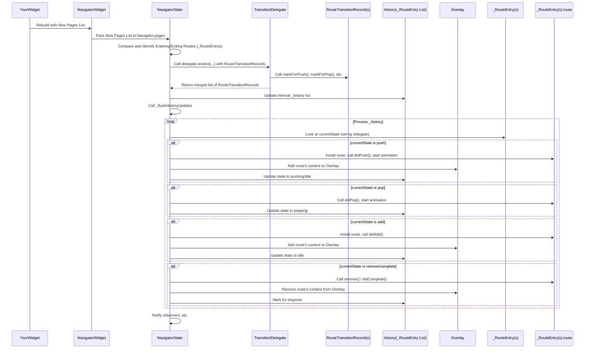

# Chapter 8: TransitionDelegate

Welcome back, future Flutter navigators! In our previous chapter, [Chapter 7: NavigatorObserver](07_navigatorobserver_.md), we learned how `NavigatorObserver` lets us watch and react to navigation events like routes being pushed or popped.

Today, we're diving into a concept that’s specifically relevant when you're using the Page-based navigation API ([Chapter 4: Page](04_page_.md)), and it helps the [Navigator](01_navigator_.md) decide *how* screens should animate when the list of [Page](04_page_.md)s changes: the **TransitionDelegate**.

Think of the **TransitionDelegate** as the choreographer for the Page-based [Navigator](01_navigator_.md). When you change the list of [Page](04_page_.md)s you provide to the [Navigator](01_navigator_.md), the `TransitionDelegate` is consulted to decide exactly which pages need to animate (slide in or out) and which ones can just appear or disappear instantly.

## Why do we need a TransitionDelegate?

When you use the `Navigator.pages` property (as introduced in [Chapter 4: Page](04_page_.md)), the [Navigator](01_navigator_.md) compares the *new* list of [Page](04_page_.md)s you give it with the *old* list it was managing. Based on this comparison, it figures out which pages are:

*   **New:** These need to enter the screen.
*   **Missing:** These need to exit the screen.
*   **Existing:** These stay on the screen (though their position relative to others might change).

For the "New" and "Missing" pages, the [Navigator](01_navigator_.md) needs to know how to handle them:

*   Should a "New" page slide in with a push animation? Or should it just appear instantly (like adding it without an animation)?
*   Should a "Missing" page slide out with a pop animation? Or should it just disappear instantly (like removing it without an animation)?

The **TransitionDelegate** is the object that makes these decisions. It looks at the state of all pages (entering, exiting, or remaining) and *tells* the [Navigator](01_navigator_.md) what actions to take (push, add, pop, remove, complete) for each route, corresponding to the page.

This delegate-based approach is flexible because you can customize the animation behavior based on your app's needs, especially when navigating complex or non-linear flows using the Page-based API.

## How TransitionDelegate Works

When you update the `pages` list on a [Navigator](01_navigator_.md), the [Navigator](01_navigator_.md) does some internal work to figure out which pages are entering and which are exiting. It represents these changes as a list of `RouteTransitionRecord` objects. Each `RouteTransitionRecord` wraps a [Route](02_route_.md) and indicates if that route is "waiting for an entering decision" or "waiting for an exiting decision."

The [Navigator](01_navigator_.md) then passes these records to the `TransitionDelegate`'s `resolve` method.

The `resolve` method receives three pieces of information:

1.  `newPageRouteHistory`: A list of `RouteTransitionRecord`s for pages that will be in the history *after* the update. Some of these might be new and need an "entering decision."
2.  `locationToExitingPageRoute`: A map showing which pages are exiting, keyed by the page below them (or null if they were the bottom-most exiting page). Some of these might need an "exiting decision."
3.  `pageRouteToPagelessRoutes`: A map showing any [Route](02_route_.md)s that were pushed imperatively ([Chapter 1: Navigator](01_navigator_.md)) *on top of* page-based routes. If a page they were on top of is exiting, these pageless routes also need "exiting decisions."

Your `TransitionDelegate.resolve` method must then iterate through these records and make decisions. For records needing a decision:

*   If `isWaitingForEnteringDecision` is true, you call `markForPush()` or `markForAdd()` on the record.
*   If `isWaitingForExitingDecision` is true, you call `markForPop()`, `markForComplete()`, or `markForRemove()` on the record.

After making *all* necessary decisions, `resolve` must return an `Iterable<RouteTransitionRecord>` containing *all* the records from `newPageRouteHistory` and *all* the records from `locationToExitingPageRoute` (and their associated pageless routes), merged into a single list representing the final desired order of routes in the history. The relative order of pages from `newPageRouteHistory` must be preserved in the result.

It sounds a bit complex, but the core idea is: the delegate sees who's coming and going and decides how they move.

## The Default TransitionDelegate

Flutter provides a `DefaultTransitionDelegate` that implements logical default behavior:

*   The newly added page that ends up at the *very top* of the stack is marked for `markForPush` (animates in).
*   Any other newly added pages *below* the top one are marked for `markForAdd` (appear instantly).
*   The page that was at the *very top* and is now missing is marked for `markForPop` (animates out).
*   Any other missing pages *below* the top one are marked for `markForComplete` (disappear instantly, completing their future).

This behavior mimics typical imperatively driven navigation patterns where only the top-most route transition is animated.

## Implementing a Custom TransitionDelegate

Let's imagine a simple use case: We want to always animate *all* new pages being pushed *in* from the right, and *all* pages being removed *out* to the right, regardless of where they are in the stack. This isn't typical, but it demonstrates overriding the default behavior.

We'll need a simple app using the Page-based API, perhaps showing a list of numbers, and adding a detail page when a number is tapped.

First, let's set up our basic screens or page builders (similar to [Chapter 4: Page](04_page_.md)). We'll use `MaterialPage` for simplicity.

```dart
import 'package:flutter/material.dart';

// A simple page for the home screen
class HomePage extends Page<void> {
  const HomePage() : super(key: const ValueKey('HomePage'), name: '/');

  @override
  Route<void> createRoute(BuildContext context) {
    return MaterialPageRoute<void>(
      settings: this,
      builder: (BuildContext context) {
        return Scaffold(
          appBar: AppBar(title: const Text('Home')),
          body: ListView.builder(
            itemCount: 5,
            itemBuilder: (context, index) {
              return ListTile(
                title: Text('Item $index'),
                onTap: () {
                  // In a real app, you'd add a DetailPage to your
                  // pages list managed by a state object.
                  // This is just to illustrate the Page concept.
                },
              );
            },
          ),
        );
      },
    );
  }
}

// A simple page for the detail screen
class DetailPage extends Page<void> {
  const DetailPage({required this.itemIndex}) : super(key: ValueKey('Detail$itemIndex'), name: '/detail/$itemIndex', arguments: itemIndex);

  final int itemIndex;

  @override
  Route<void> createRoute(BuildContext context) {
    return MaterialPageRoute<void>(
      settings: this,
      builder: (BuildContext context) {
        return Scaffold(
          appBar: AppBar(title: Text('Item Detail $itemIndex')),
          body: Center(
            child: Text('Details for item $itemIndex'),
          ),
        );
      },
    );
  }
}
```

Now, let's create our custom `TransitionDelegate`:

```dart
import 'package:flutter/widgets.dart'; // Important for TransitionDelegate and RouteTransitionRecord

// Our custom TransitionDelegate that always animates pushes and pops
class AlwaysAnimateTransitionDelegate extends TransitionDelegate<void> {
  const AlwaysAnimateTransitionDelegate();

  @override
  Iterable<RouteTransitionRecord> resolve({
    required List<RouteTransitionRecord> newPageRouteHistory,
    required Map<RouteTransitionRecord?, RouteTransitionRecord> locationToExitingPageRoute,
    required Map<RouteTransitionRecord?, List<RouteTransitionRecord>> pageRouteToPagelessRoutes,
  }) {
    final List<RouteTransitionRecord> results = <RouteTransitionRecord>[];

    // Handle routes that are entering (new pages)
    for (final RouteTransitionRecord pageRoute in newPageRouteHistory) {
      if (pageRoute.isWaitingForEnteringDecision) {
        // Always mark for push (animate in)
        pageRoute.markForPush();
      }
      // Add the page route to the results list
      results.add(pageRoute);
    }

    // Handle routes that are exiting (missing pages)
    for (final RouteTransitionRecord exitingPageRoute in locationToExitingPageRoute.values) {
      if (exitingPageRoute.isWaitingForExitingDecision) {
        // Always mark for pop (animate out)
        exitingPageRoute.markForPop(exitingPageRoute.route.currentResult);

        // Handle any pageless routes on top of this exiting page
        final List<RouteTransitionRecord>? pagelessRoutes = pageRouteToPagelessRoutes[exitingPageRoute];
        if (pagelessRoutes != null) {
          for (final RouteTransitionRecord pagelessRoute in pagelessRoutes) {
             if (pagelessRoute.isWaitingForExitingDecision) {
                // Also mark pageless routes for pop
                pagelessRoute.markForPop(pagelessRoute.route.currentResult);
             }
           }
        }
      }
      // Add the exiting route to the results list.
      // Note: The order matters; we must maintain the relative order
      // of pages from newPageRouteHistory. Exiting pages can be inserted
      // around them. In this simple example, we just add them to the end.
      results.add(exitingPageRoute);
    }

    // The default delegate inserts exiting pages at the location they were removed
    // from. Let's imitate that to keep the list order accurate.
    final List<RouteTransitionRecord> mergedList = [];
    final Iterator<RouteTransitionRecord> exitingIterator = locationToExitingPageRoute.values.iterator;
    RouteTransitionRecord? nextExiting = exitingIterator.moveNext() ? exitingIterator.current : null;
    final RouteTransitionRecord? firstEnteringPage = newPageRouteHistory.isNotEmpty ? newPageRouteHistory.first : null;
     RouteTransitionRecord? nextEntering = firstEnteringPage;

    Iterable<RouteTransitionRecord>? exitingBelowFirstEntering;
    if (firstEnteringPage != null) {
         exitingBelowFirstEntering = locationToExitingPageRoute.entries
             .where(( MapEntry<RouteTransitionRecord?, RouteTransitionRecord> entry) => entry.key == null) // Find exiting pages whose location was null (bottom)
             .map(( MapEntry<RouteTransitionRecord?, RouteTransitionRecord> entry) => entry.value);
         mergedList.addAll(exitingBelowFirstEntering); // Add exiting pages that were at the bottom
    }

    for(final RouteTransitionRecord entering in newPageRouteHistory) {
        mergedList.add(entering);
        // Find any exiting pages whose location was this entering page
         final Iterable<RouteTransitionRecord> exitingAboveThisEntering = locationToExitingPageRoute.entries
             .where(( MapEntry<RouteTransitionRecord?, RouteTransitionRecord> entry) => entry.key == entering)
             .map(( MapEntry<RouteTransitionRecord?, RouteTransitionRecord> entry) => entry.value);
         mergedList.addAll(exitingAboveThisEntering);
    }

    // Add any remaining exiting pages that weren't placed
    for(final exiting in locationToExitingPageRoute.values) {
        if (!mergedList.contains(exiting)) {
             mergedList.add(exiting);
        }
    }

    // Add any pageless routes attached to exiting pages that weren't added
    for (final parentPageEntry in pageRouteToPagelessRoutes.keys) {
        final pagelessRoutes = pageRouteToPagelessRoutes[parentPageEntry]!;
         for (final pagelessRoute in pagelessRoutes) {
             if (!mergedList.contains(pagelessRoute)) {
                  mergedList.add(pagelessRoute);
             }
        }
    }

    return mergedList;
  }
}
```

Explanation:

*   Our `AlwaysAnimateTransitionDelegate` extends `TransitionDelegate<void>`.
*   The `resolve` method receives the information described earlier.
*   We iterate through `newPageRouteHistory`. If a page `isWaitingForEnteringDecision`, we call `markForPush()` on its record. This signals to the [Navigator](01_navigator_.md) that the corresponding route should be pushed with an animation.
*   We iterate through the values of `locationToExitingPageRoute` (the exiting page records). If a page `isWaitingForExitingDecision`, we call `markForPop()`. This signals that the corresponding route should be popped with an animation. We also handle any pageless routes associated with this exiting page in the same way.
*   Finally, we construct the `mergedList`. The `resolve` method *must* return a list containing all involved route records in their *new* order. The relative order of `newPageRouteHistory` entries must be preserved. Exiting entries can be placed anywhere else. A safe default is to place entering routes followed by exiting routes, or (as done in the comment and refined logic) insert exiting routes where they were removed from relative to the entering stack. The slightly more complex list merging logic ensures all records are included and the relative order of the *new* history stack is correct while placing the exiting routes appropriately.

To use this delegate, you'd provide an instance of it to your `Navigator` (or `MaterialApp.router` / `WidgetsApp.router` which manage the [Navigator]):

```dart
import 'package:flutter/material.dart';
import 'pages.dart'; // Contains HomePage and DetailPage
import 'my_transition_delegate.dart'; // Contains AlwaysAnimateTransitionDelegate

void main() {
  runApp(MaterialApp.router( // Using .router for Page-based navigation
    routerDelegate: MyRouterDelegate(), // You'd typically have a custom RouterDelegate
    routeInformationParser: MyRouteInformationParser(), // and a RouteInformationParser
  ));
}

// Simplified example of a minimal delegate/parser setup
class MyRouterDelegate extends RouterDelegate<List<Page<dynamic>>>
    with ChangeNotifier, PopNavigatorRouterDelegateMixin<List<Page<dynamic>>> {

  final List<Page<dynamic>> _pages = [const HomePage()];

  @override
  Widget build(BuildContext context) {
    // This is where the Navigator is built with the pages and the transition delegate
    return Navigator(
      key: navigatorKey, // Required by PopNavigatorRouterDelegateMixin
      pages: List.of(_pages), // Pass a copy of the pages list
      onPopPage: _handlePopPage, // Handle pops
      transitionDelegate: const AlwaysAnimateTransitionDelegate(), // Our custom delegate!
    );
  }

  bool _handlePopPage(Route<dynamic> route, dynamic result) {
     if (route.settings is Page) {
      final int index = _pages.indexWhere(
        (Page<dynamic> page) => page.key == route.settings.key,
      );
      if (index >= 0) {
        _pages.removeAt(index);
        notifyListeners(); // Notify the RouterDelegate that state changed
        return route.didPop(result);
      }
    }
    return false;
  }

  void _addDetailPage(int index) {
     _pages.add(DetailPage(itemIndex: index));
     notifyListeners(); // Trigger a rebuild of the Navigator
  }

  //--- Standard RouterDelegate overrides (simplified) ---
  @override
  GlobalKey<NavigatorState> get navigatorKey => GlobalKey<NavigatorState>();

   @override
  Future<void> setNewRoutePath(List<Page<dynamic>> configuration) {
    // Implement logic to update _pages based on initial route/deep links
     return SynchronousFuture(null);
  }

   @override
   List<Page<dynamic>> get currentConfiguration => List.of(_pages);
}

// Minimal RouteInformationParser
class MyRouteInformationParser extends RouteInformationParser<List<Page<dynamic>>> {
  @override
  Future<List<Page<dynamic>>>> parseRouteInformation(RouteInformation routeInformation) async {
     // Implement logic to parse initial route and create initial list of Pages
     return [const HomePage()]; // Just return default for simplicity
  }

  @override
  RouteInformation restoreRouteInformation(List<Page<dynamic>> configuration) {
     // Implement logic to create RouteInformation from current Page list
     return RouteInformation(uri: Uri.parse(configuration.last.name ?? '/'));
  }
}

// In your HomeScreen, you'd need access to the RouterDelegate to call _addDetailPage:
/*
class HomeScreen extends StatelessWidget {
  const HomeScreen({super.key});

  @override
  Widget build(BuildContext context) {
    // Access the RouterDelegate (example, implementation detail depends on state management)
    final MyRouterDelegate routerDelegate = Router.of(context).routerDelegate as MyRouterDelegate;

    return Scaffold(
      appBar: AppBar(title: const Text('Home')),
      body: ListView.builder(
        itemCount: 5,
        itemBuilder: (context, index) {
          return ListTile(
            title: Text('Item $index'),
            onTap: () {
              routerDelegate._addDetailPage(index); // Call the method to add a page
            },
          );
        },
      ),
    );
  }
}
*/
```

In this setup, whenever the `_pages` list in `MyRouterDelegate` is modified (e.g., by calling `_addDetailPage` and then `notifyListeners`), the `MaterialApp.router` rebuilds the `Navigator`, providing the updated `_pages` list. The `Navigator` then uses `AlwaysAnimateTransitionDelegate` to decide how to animate the changes.

## TransitionDelegate Under the Hood (Simplified)

Let's look at the definition of `TransitionDelegate`:

```dart
// From packages/flutter/lib/src/widgets/navigator.dart

abstract class TransitionDelegate<T> { // T is the return type, often void
  const TransitionDelegate();

  // This is the core method the Navigator calls
  Iterable<RouteTransitionRecord> resolve({
    required List<RouteTransitionRecord> newPageRouteHistory,
    required Map<RouteTransitionRecord?, RouteTransitionRecord> locationToExitingPageRoute,
    required Map<RouteTransitionRecord?, List<RouteTransitionRecord>> pageRouteToPagelessRoutes,
  });

  // Internal method used by NavigatorState, wraps resolve and adds assertions
  // to check the validity of the output.
  Iterable<RouteTransitionRecord> _transition({
    required List<RouteTransitionRecord> newPageRouteHistory,
    required Map<RouteTransitionRecord?, RouteTransitionRecord> locationToExitingPageRoute,
    required Map<RouteTransitionRecord?, List<RouteTransitionRecord>> pageRouteToPagelessRoutes,
  });
}
```

And the `RouteTransitionRecord`:

```dart
// From packages/flutter/lib/src/widgets/navigator.dart

abstract class RouteTransitionRecord {
  Route<dynamic> get route; // The associated Route
  bool get isWaitingForEnteringDecision; // Needs entering decision?
  bool get isWaitingForExitingDecision; // Needs exiting decision?

  // Methods to make decisions:
  void markForPush();
  void markForAdd();
  void markForPop([dynamic result]);
  void markForComplete([dynamic result]);
  void markForRemove();
}
```

These snippets show the interface the [NavigatorState](01_navigator_.md) uses to interact with the delegate. The `_transition` method is the internal entry point that calls your overridden `resolve` method and performs validation on your return value.

How does this fit into the `NavigatorState`'s update process when `pages` changes (simplified from `_updatePages` in `navigator.dart`)?

1.  **Diffing:** The `NavigatorState` compares the old and new `pages` lists, identifies which routes correspond to new or missing pages, and creates `_RouteEntry` records (which implement `RouteTransitionRecord`) internally. `_RouteEntry`s for new pages are marked `isWaitingForEnteringDecision`. `_RouteEntry`s for missing pages are marked `isWaitingForExitingDecision`.
2.  **Delegate Call:** The `NavigatorState` collects these records into the lists/maps required by `TransitionDelegate.resolve` and calls your delegate: `widget.transitionDelegate._transition(...)`.
3.  **Decision Made:** Your `resolve` method iterates through the records that need decisions and calls methods like `markForPush`, `markForPop`, etc., on them. This updates the internal state (`currentState`) of those `_RouteEntry` records.
4.  **History Update:** Your `resolve` method returns the merged list of records. The `NavigatorState` then updates its internal `_history` list (`_history.clear(); _history.addAll(results);`) according to this new order.
5.  **Flush Updates:** The `NavigatorState` calls `_flushHistoryUpdates`, which processes the updated `_history` list. It looks at the `currentState` of each
    `_RouteEntry` (which was set by your `TransitionDelegate`). For entries marked `push`, `add`, `pop`, `remove`, etc., it performs the corresponding actions:
    *   `push`: Installs the route, adds its overlay entries, calls `route.didPush()`, starts animation.
    *   `add`: Installs the route, adds its overlay entries, calls `route.didAdd()`.
    *   `pop`: Calls `route.didPop()`, starts animation. After animation, calls `finalizeRoute`, removes overlay entries, disposes.
    *   `complete`: Calls `route.didComplete()`, removes overlay entries, disposes.
    *   `remove`: Removes overlay entries, disposes.
6.  **Observer Notification:** As part of `_flushHistoryUpdates`, observers are notified ([Chapter 7: NavigatorObserver](07_navigatorobserver_.md)).



This expanded diagram shows where the `TransitionDelegate` fits into the Page-based navigation flow. It acts after the [Navigator] determines *what* needs to change based on the page list, but *before* it performs the final updates and animations.

## Conclusion

The `TransitionDelegate` is a key component when using the Page-based API (`Navigator.pages`) for navigation in Flutter. It provides a centralized mechanism for deciding how screens should animate when the list of pages changes. By implementing your own `TransitionDelegate` and overriding the `resolve` method, you can customize the entry and exit transitions for pages, offering flexibility beyond the default push/pop behavior and enabling complex declarative navigation patterns.

With this chapter, we've covered most of the core building blocks of Navigator behavior. In the next and final chapter, we'll touch upon `RestorableRouteFuture`, a helper class specifically useful when using state restoration alongside imperative navigation calls.

[Chapter 9: RestorableRouteFuture](09_restorableroutefuture_.md)

---

Generated by [AI Codebase Knowledge Builder](https://github.com/The-Pocket/Tutorial-Codebase-Knowledge)