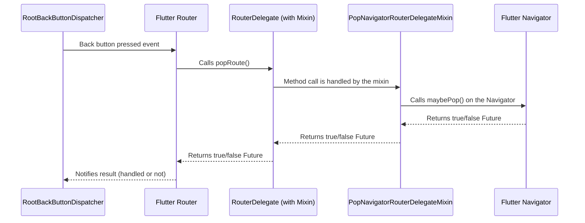

# Chapter 9: PopNavigatorRouterDelegateMixin

Welcome back! We've covered the essential pieces of Flutter's Declarative Router: how it gets information ([Chapter 1: RouteInformation](01_routeinformation_.md), [Chapter 2: RouteInformationProvider](02_routeinformationprovider_.md)), how it understands that information ([Chapter 3: RouteInformationParser](03_routeinformationparser_.md)), how it builds the UI based on it ([Chapter 4: RouterDelegate](04_routerdelegate_.md)), and how it coordinates everything ([Chapter 5: Router](05_router_.md)). We also looked at how the system back button is handled ([Chapter 6: BackButtonDispatcher](06_backbuttondispatcher_.md), [Chapter 7: RootBackButtonDispatcher](07_rootbackbuttondispatcher_.md), [Chapter 8: ChildBackButtonDispatcher](08_childbuttondispatcher_.md)).

In [Chapter 4](04_routerdelegate_.md), when we discussed the `RouterDelegate`, we mentioned that it's responsible for handling the `popRoute()` method, which is called when the system back button is pressed (via the [BackButtonDispatcher](06_backbuttondispatcher_.md) and [Router](05_router_.md)). We also saw that a `RouterDelegate` typically builds a `Navigator` to manage screens using a stack of `Page` objects.

Handling `popRoute()` manually can be a bit tricky, especially if your `RouterDelegate` is managing a complex `Navigator` stack. You need to check if the `Navigator` can pop a page, perform the pop, and return the correct boolean result (`true` if a page was popped, `false` otherwise).

This is where the `PopNavigatorRouterDelegateMixin` comes to the rescue!

## What is PopNavigatorRouterDelegateMixin?

The `PopNavigatorRouterDelegateMixin` is a **helpful tool** that you can mix into your `RouterDelegate` class. Its sole purpose is to provide a standard implementation for the `RouterDelegate`'s required `popRoute()` method that automatically interacts with a `Navigator`.

Think of it as a predefined answer key for the back button question that your `RouterDelegate` gets asked. When the system back button is pressed, the [Router](05_router_.md) calls your `RouterDelegate`'s `popRoute()` method. If you've mixed in `PopNavigatorRouterDelegateMixin`, this mixin handles the call by:

1.  Finding the `Navigator` associated with the `RouterDelegate` (using a special `GlobalKey` provided by the mixin).
2.  Asking that `Navigator` if it can pop the current page using `Navigator.maybePop()`.
3.  Performing the pop action on the `Navigator` if possible.
4.  Returning the `Future<bool>` result from `Navigator.maybePop()`, which is `true` if a route was popped, and `false` otherwise.

Essentially, it connects the back button behavior initiated by the [BackButtonDispatcher](06_backbuttondispatcher_.md) directly to the standard page-stack management of a `Navigator`, without you having to write that plumbing code yourself.

Here's the back button flow with the mixin:



This diagram shows how the mixin seamlessly steps in to handle the `popRoute` call and delegate the actual popping work to the `Navigator`.

## Why Use PopNavigatorRouterDelegateMixin?

If your `RouterDelegate` primarily manages navigation using a single `Navigator` (which is a very common pattern, especially for flat or linear navigation flows), this mixin simplifies your code significantly. You avoid writing boilerplate code to find the `Navigator`, call `maybePop`, and return the result.

It promotes clean separation of concerns:
*   Your `RouterDelegate` handles *how* to build the UI based on the configuration and *what* pages go into the `Navigator`.
*   The `PopNavigatorRouterDelegateMixin` handles the standard *interaction* between the back button event and the `Navigator`.

Using the mixin is highly recommended whenever your `RouterDelegate` includes a `Navigator` whose back stack should correspond to the system back button behavior.

## How to Use PopNavigatorRouterDelegateMixin

Using `PopNavigatorRouterDelegateMixin` is straightforward. You simply mix it into your `RouterDelegate` class definition and provide the necessary `GlobalKey<NavigatorState>`.

Let's revisit our `MyAppRouterDelegate` from [Chapter 4](04_routerdelegate_.md) and see how we already used the mixin.

```dart
import 'package:flutter/foundation.dart'; // For SynchronousFuture
import 'package:flutter/material.dart';   // For Navigator, GlobalKey, MaterialPage

// Re-using MyAppRouteConfiguration from previous chapters
enum MyAppPath {
  home,
  itemDetail,
}

class MyAppRouteConfiguration { // ... definition as before ... }

// Our RouterDelegate using the mixin
class MyAppRouterDelegate extends RouterDelegate<MyAppRouteConfiguration>
    with ChangeNotifier, PopNavigatorRouterDelegateMixin<MyAppRouteConfiguration> { // *** Mixin Used Here! ***

  // *** Required by PopNavigatorRouterDelegateMixin ***
  // This is the GlobalKey that the mixin will use to find the Navigator
  @override
  final GlobalKey<NavigatorState> navigatorKey = GlobalKey<NavigatorState>();

  MyAppRouteConfiguration? _currentConfiguration;

  @override
  MyAppRouteConfiguration? get currentConfiguration => _currentConfiguration;

  @override
  Future<void> setNewRoutePath(MyAppRouteConfiguration configuration) {
    _currentConfiguration = configuration;
    notifyListeners(); // Notify the Router to rebuild
    return SynchronousFuture<void>(null);
  }

  // *** popRoute() is now implemented by the mixin! ***
  // We DO NOT need to write the popRoute method here anymore if we use the mixin.

  @override
  Widget build(BuildContext context) {
    List<Page> pages = [];

    pages.add(
       MaterialPage(
         child: HomePage( // ... uses setNewRoutePath to navigate ... ),
         key: const ValueKey('HomePage'),
       )
    );

    if (_currentConfiguration?.isItemDetailPage == true) {
      pages.add(
        MaterialPage(
          child: ItemDetailPage(itemId: _currentConfiguration!.itemId!),
          key: ValueKey('ItemDetailPage-${_currentConfiguration!.itemId}'),
        )
      );
    }

    // Build a Navigator with the determined list of pages
    return Navigator(
      key: navigatorKey, // *** Use the mixin's navigatorKey here! ***
      pages: pages,
      onPopPage: (route, result) {
        // This is called by the Navigator when a page's route is popped.
        // It's triggered by things like the AppBar back button.
        // We still need to handle this to update our internal configuration.
        if (!route.didPop(result)) {
          return false;
        }

        // Update config based on which page was popped.
        // In this simple case, going back from ItemDetail leads to Home.
         if (_currentConfiguration?.isItemDetailPage == true) {
           setNewRoutePath(MyAppRouteConfiguration.home());
        }

        return true;
      },
    );
  }
  // dispose method inherited from ChangeNotifier
}

// HomePage and ItemDetailPage widgets as before
```

The key changes are:

1.  We add `with PopNavigatorRouterDelegateMixin<MyAppRouteConfiguration>` to the class definition. The `<MyAppRouteConfiguration>` part tells the mixin the type of configuration our `RouterDelegate` uses, although the mixin doesn't directly use the configuration type; it just needs to match the delegate's definition.
2.  We provide the required `navigatorKey` getter: `final GlobalKey<NavigatorState> navigatorKey = GlobalKey<NavigatorState>();`. This creates a `GlobalKey` instance and makes it available to the mixin.
3.  **We remove our own implementation of the `popRoute()` method.** The mixin now provides it for us.
4.  **Crucially, when building the `Navigator`, we assign the mixin's `navigatorKey` to the `Navigator`'s `key` property:** `key: navigatorKey`. This allows the mixin's `popRoute` implementation to find and interact with *this specific* `Navigator` instance using `navigatorKey.currentState`.

Now, thanks to the mixin, when the system back button is pressed and the [Router](05_router_.md) calls our delegate's `popRoute()`, the mixin will automatically execute `navigatorKey.currentState?.maybePop()` and return the result. The standard back button behavior of popping the top screen from the `Navigator` stack is handled for us!

The `onPopPage` callback in the `Navigator` is still necessary because it handles pops triggered *within* the `Navigator` itself (like the back arrow generated by a `MaterialApp`'s `AppBar`). The mixin handles the system back button event which comes from *outside* the `Navigator` via the [BackButtonDispatcher](06_backbuttondispatcher_.md) and [Router](05_router_.md). You often need both: `onPopPage` to update your delegate's internal state when the `Navigator` pops, and the mixin for `popRoute` to tell the `Navigator` *to* pop when the system back button is pressed.

## Internal View (How Flutter Uses PopNavigatorRouterDelegateMixin)

Let's look at the implementation of `PopNavigatorRouterDelegateMixin` within `packages/flutter/lib/src/widgets/router.dart`.

```dart
// Snippet from packages/flutter/lib/src/widgets/router.dart
mixin PopNavigatorRouterDelegateMixin<T> on RouterDelegate<T> { // 'on' constraint that this is for RouterDelegate<T>
  /// The key used for retrieving the current navigator.
  ///
  /// When using this mixin, be sure to use this key to create the navigator.
  GlobalKey<NavigatorState>? get navigatorKey;

  @override
  Future<bool> popRoute() {
    final NavigatorState? navigator = navigatorKey?.currentState; // Get the NavigatorState using the provided key
    return navigator?.maybePop() ?? SynchronousFuture<bool>(false); // Call maybePop and return its result
  }
}
```

This is the entire implementation of the mixin's core logic!

1.  `mixin PopNavigatorRouterDelegateMixin<T> on RouterDelegate<T>`: This declares the mixin and uses the `on` keyword to specify that it can only be mixed into classes that implement `RouterDelegate<T>`.
2.  `GlobalKey<NavigatorState>? get navigatorKey;`: This is the abstract getter that you *must* implement in your class when you mix in `PopNavigatorRouterDelegateMixin`. The mixin needs a way to access a `GlobalKey` connected to the `Navigator`.
3.  `@override Future<bool> popRoute() { ... }`: This overrides the `popRoute` method required by the `RouterDelegate` interface.
    *   `final NavigatorState? navigator = navigatorKey?.currentState;`: This line attempts to get the current state of the `Navigator` widget associated with `navigatorKey`. If the `Navigator` is not yet built, or the key isn't associated with one, `navigator` will be null.
    *   `return navigator?.maybePop() ?? SynchronousFuture<bool>(false);`: This is the heart of it.
        *   `navigator?.maybePop()`: Calls the `maybePop()` method on the `NavigatorState` if `navigator` is not null. `maybePop()` attempts to pop the current route off the stack. It returns a `Future<bool>` that completes with `true` if a route was successfully popped, and `false` otherwise (e.g., if there's only one route left on the stack and it's the original route).
        *   `?? SynchronousFuture<bool>(false)`: This is the null-aware coalescing operator. If `navigator?.maybePop()` returns null (e.g., because `navigator` was null), it defaults to returning a `SynchronousFuture` that completes with `false`. This handles cases where the `Navigator` isn't available yet.

This minimal code effectively hooks the back button event (received by `popRoute`) directly to the standard popping mechanism of the `Navigator` associated with the `navigatorKey`. Because `Navigator.maybePop()` internally checks if it *can* pop before actually doing so, the mixin provides robust default behavior that won't accidentally pop fundamental routes before the app is ready to close.

## Conclusion

The `PopNavigatorRouterDelegateMixin` is a very useful helper for `RouterDelegate` classes that manage navigation using a `Navigator`. By mixing it in and providing a `GlobalKey` for your `Navigator`, you get a default implementation of the `popRoute()` method that automatically tells the `Navigator` to try and pop a route. This simplifies the connection between the system back button ([BackButtonDispatcher](06_backbuttondispatcher_.md) -> [Router](05_router_.md)) and the standard page-stack management of a `Navigator`, allowing your app to behave as users expect when they press the back button without requiring you to write intricate pop handling code in your delegate.

We've now covered all the core components of Flutter's Declarative Router system and how they work together to handle both incoming route information and outgoing user actions like the back button. Understanding these pieces gives you a solid foundation for building powerful and flexible navigation in your Flutter applications.

This is the final chapter in this introductory series on Flutter's Declarative Router! Congratulations on making it this far! You now have a foundational understanding of the delegates and widgets that make up this system.

---

Generated by [AI Codebase Knowledge Builder](https://github.com/The-Pocket/Tutorial-Codebase-Knowledge)