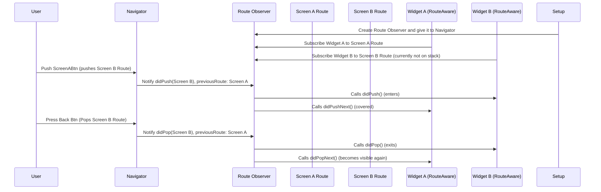

# Chapter 9: RouteAware

Welcome back, future Flutter expert! We've been learning a lot about how Flutter stacks up screens like playing cards ([Route](01_route_.md)s), adding cool animations ([TransitionRoute](02_transitionroute_.md)), layering content on top ([OverlayRoute](03_overlayroute_.md), [ModalRoute](04_modalroute_.md), [PopupRoute](05_popuproute_.md)), handling fancy back gestures ([PredictiveBackRoute](06_predictivebackroute_.md)), and even managing mini-histories within a single screen ([LocalHistoryRoute](07_localhistoryroute_.md), [PopEntry](08_popentry_.md)).

Now, imagine you have a little widget on one of these screens, and this widget needs to know *when* its screen becomes the main focus, or when another screen covers it up, or when its screen is completely removed. For instance, maybe a video player widget on a screen needs to pause the video when another screen pops up, and resume when its screen becomes fully visible again.

That's where `RouteAware` comes in! It's a way for widgets to "listen" for what's happening to the route (screen) they are a part of.

### What is a RouteAware?

Think of a `RouteAware` as a gadget you plug into a widget. This gadget lets the widget receive special messages (notifications) whenever the screen it lives on changes its visibility state relative to the top of the navigation stack.

These messages tell the widget:

*   "Your screen is now the very top screen, the user can see and interact with only your screen." (`didPopNext` - implies the route *above* it was popped)
*   "Your screen just got pushed onto the stack and is now the top screen." (`didPush`)
*   "Your screen is no longer the top screen because a new screen was pushed on top of it." (`didPushNext`)
*   "Your screen was completely removed from the navigation stack (like hitting back when it was the first screen)." (`didPop`)

To get these messages, your widget needs to somehow register itself with something that *knows* about route changes. This "something" is usually a [RouteObserver](10_routeobserver_.md) (which we'll cover in the next chapter).

### Why Use RouteAware?

As mentioned in the intro, listening to route changes is useful for managing state or behavior in response to navigation. Common scenarios include:

*   **Pausing/resuming animations or media playback:** Stop a video when covered, resume when visible.
*   **Saving/loading state:** Maybe save temporary data when the screen is about to be covered.
*   **Tracking analytics:** Log when a screen becomes fully visible.
*   **Managing resources:** Release resources when a screen is hidden and reallocate them when it becomes active again.

Instead of constantly checking the [Navigator](03_overlayroute_.md) state, a `RouteAware` widget simply defines methods that get called when specific navigation events happen to its route.

### Key Concepts of RouteAware

`RouteAware` is actually a **mixin**. Remember, a mixin is like adding extra abilities to a class. By mixing `RouteAware` into your `State` class for a stateful widget, you give that state object the ability to implement and respond to the specific `RouteAware` methods.

The key concept is the set of methods it adds:

*   **`didPopNext()`:** Called when the route on top of this route is popped, making this route visible again.
*   **`didPush()`:** Called when this route is pushed onto the navigator.
*   **`didPop()`:** Called when this route is popped off the navigator.
*   **`didPushNext()`:** Called when a new route has been pushed on top of this this route.

Your widget's `State` class will mix in `RouteAware` and provide the code inside these methods to react to the events.

### How RouteAware Works (Conceptual)

Here's a simplified look at how a widget using `RouteAware` gets notified, involving a `RouteObserver`.



1.  You create a `RouteObserver` and provide it to your app's `Navigator` (or `MaterialApp`/`CupertinoApp` using the `navigatorObservers` property).
2.  Inside your `StatefulWidget`'s `State` (that mixes in `RouteAware`), in the `init` method, you use the `RouteObserver` to **subscribe** this `State` object to notifications for *its* route (`ModalRoute.of(context)`).
3.  When navigation happens (push, pop), the `Navigator` notifies the `RouteObserver`.
4.  The `RouteObserver` looks at which routes were involved and calls the appropriate `RouteAware` methods (`didPushNext`, `didPopNext`, `didPop`, `didPush`) on the widgets it knows are subscribed to those routes.
5.  In the `dispose` method of your `State`, you **unsubscribe** from the `RouteObserver` to prevent memory leaks.

The key enabler here is the [RouteObserver](10_routeobserver_.md) (next chapter!), which sits in the middle, tracking navigation and calling the `RouteAware` methods on subscribed widgets.

### Looking at the Code

Let's look at the definition of the `RouteAware` mixin.

```dart
abstract mixin class RouteAware {
  /// Called when the top route has been popped off, and the current route
  /// shows up.
  void didPopNext() {} // Implies route below this one IS being popped and this is about to become active.

  /// Called when the current route has been pushed.
  void didPush() {}

  /// Called when the current route has been popped off.
  void didPop() {} // Implies this route IS being popped (removed).

  /// Called when a new route has been pushed, and the current route is no
  /// longer visible.
  void didPushNext() {}
}
```

As you can see, it's an abstract mixin with four empty methods. You provide the implementation when you mix it into your `State` class.

### Example: A Widget Aware of Route Changes

Let's create a simple widget that changes the text it displays based on whether its screen is the top-most route.

```dart
import 'package:flutter/material.dart'; // For MaterialPageRoute and MaterialApp
import 'package:flutter/widgets.dart'; // For State, StatefulWidget

// We'll need a RouteObserver. You typically create this ONCE for your app.
// For simplicity, let's create it here. Usually, it would be higher up,
// like in your MaterialApp or a Provider.
final RouteObserver<ModalRoute<dynamic>> routeObserver = RouteObserver<ModalRoute<dynamic>>();

// This is the screen that contains our RouteAware widget.
class TrackedScreen extends StatelessWidget {
  const TrackedScreen({super.key, required this.screenName});

  final String screenName;

  @override
  Widget build(BuildContext context) {
    return Scaffold(
      appBar: AppBar(title: Text('$screenName Screen')),
      body: Center(
        child: Column(
          mainAxisAlignment: MainAxisAlignment.center,
          children: [
            // Our RouteAware widget lives here
            RouteAwareWidget(
              key: ValueKey(screenName), // Give it a key to differentiate instances
              routeObserver: routeObserver, // Pass the observer
              screenName: screenName, // Pass screen name for context
            ),
            const SizedBox(height: 20),
            ElevatedButton(
              // Button to push a new screen on top
              onPressed: () {
                Navigator.of(context).push(
                  MaterialPageRoute(
                    builder: (context) => TrackedScreen(screenName: '${screenName} Child'),
                  ),
                );
              },
              child: const Text('Push New Screen on Top'),
            ),
          ],
        ),
      ),
    );
  }
}

// Our custom widget that is aware of its route's state
class RouteAwareWidget extends StatefulWidget {
  const RouteAwareWidget({
    super.key,
    required this.routeObserver, // Requires the RouteObserver
    required this.screenName,
  });

  final RouteObserver<ModalRoute<dynamic>> routeObserver;
  final String screenName;

  @override
  State<RouteAwareWidget> createState() => _RouteAwareWidgetState();
}

// Mixin RouteAware into the State class
class _RouteAwareWidgetState extends State<RouteAwareWidget> with RouteAware {

  String _status = 'Initializing...';

  // Get the route this widget is in
  ModalRoute<dynamic>? get _route => ModalRoute.of(context);

  @override
  void initState() {
    super.initState();
    // We can't subscribe here because the ModalRoute might not be available yet
    // or the observer isn't ready. Do it in didChangeDependencies.
  }

  @override
  void didChangeDependencies() {
    super.didChangeDependencies();
    // Get the route object and subscribe to the observer
    // Check if _route is not null and the route has changed since the last call
    final ModalRoute<dynamic>? newRoute = _route; // Get current route
    final ModalRoute<dynamic>? oldRoute = ModalRoute.of(context, listen: false); // Get previous route without subscribing

    if (newRoute != null && newRoute != oldRoute) { // Only subscribe if route is valid and has changed
        widget.routeObserver.subscribe(this, newRoute); // THIS is the important part!
        // Update status based on initial state (when didChangeDependencies is first called after push)
        _updateStatus(newRoute.isCurrent ? 'pushed (active)' : 'pushed (covered)');
    }
  }


  @override
  void dispose() {
    // ALWAYS unsubscribe when the widget is removed from the tree
    widget.routeObserver.unsubscribe(this); // Clean up!
    super.dispose();
  }

  // --- RouteAware Methods Start ---

  // Called when the route on top of this route is popped
  @override
  void didPopNext() {
    // Route below this one became visible
    _updateStatus('Became active (didPopNext)');
  }

  // Called when this route has been pushed
  // Note: For the initial push, this might be called before didChangeDependencies
  // where we subscribe. didChangeDependencies is a safer place for initial status check.
  @override
  void didPush() {
    // This route came into view.
    // _updateStatus('Became active (didPush)'); // Often called before subscription, less reliable for first state
  }


  // Called when this route has been popped
  @override
  void didPop() {
    // This route is leaving.
    _updateStatus('Was popped (didPop)');
  }

  // Called when a new route has been pushed on top of this route
  @override
  void didPushNext() {
    // This route is now covered.
    _updateStatus('Became inactive (didPushNext)');
  }

  // --- RouteAware Methods End ---

  void _updateStatus(String status) {
    // Update the widget's state to show the status
    if (mounted) { // Make sure the widget is still in the tree
      setState(() {
        _status = status;
      });
       print('[${widget.screenName}] $_status'); // Log to console
    }
  }

  @override
  Widget build(BuildContext context) {
    return Text('Widget in "${widget.screenName}" - Status: $_status');
  }
}

// To run this example, you'd set up your MaterialApp with the observer:
// MaterialApp(
//   home: const TrackedScreen(screenName: 'Home'),
//   navigatorObservers: [routeObserver], // Add your observer here!
// );

```

Explanation:

1.  We create a global `RouteObserver` instance. You'd pass this to your `MaterialApp` or `CupertinoApp` via `navigatorObservers`.
2.  `TrackedScreen` is a simple wrapper, pushing more `TrackedScreen`s when a button is tapped.
3.  `RouteAwareWidget` is our custom widget. Its `_RouteAwareWidgetState` mixes in `RouteAware`.
4.  The `_route` getter helps us easily access the `ModalRoute` this widget is inside.
5.  Crucially, in `didChangeDependencies`, we get the `_route` and call `widget.routeObserver.subscribe(this, newRoute)`. This registers `this` state object (`RouteAware`) with the observer for the `newRoute` object. We also update the initial status.
6.  In `dispose`, we call `widget.routeObserver.unsubscribe(this)` to stop receiving notifications and allow the state and its resources to be properly garbage collected.
7.  We implement the four `RouteAware` methods (`didPopNext`, `didPush`, `didPop`, `didPushNext`). Inside these, we simply update a status string and print to the console so you can see when they are called.
8.  The `_updateStatus` helper is used to safely update the state and print logs.

When you run this and navigate:

*   Pushing "Home": `[Home] pushed (active)` (from didChangeDependencies)
*   Tapping "Push New Screen": `[Home] Became inactive (didPushNext)` printed for the Home screen's widget, then `[Home Child] pushed (active)` (from didChangeDependencies) printed for the new screen's widget.
*   Tapping "Push New Screen" again: `[Home Child] Became inactive (didPushNext)` for the second screen's widget, then `[Home Child Child] pushed (active)` for the third screen's widget.
*   Pressing Back: `[Home Child Child] Was popped (didPop)` for the third screen's widget, then `[Home Child] Became active (didPopNext)` for the second screen's widget.
*   Pressing Back again: `[Home Child] Was popped (didPop)` for the second screen's widget, then `[Home] Became active (didPopNext)` for the first screen's widget.

This demonstrates how the `RouteAware` methods are called as screens are pushed and popped on top of the widget's route.

### Conclusion

In this chapter, we explored `RouteAware`, a mixin that allows Flutter widgets to receive notifications about changes to the visibility status of the route they belong to. We learned about the four key methods (`didPush`, `didPop`, `didPushNext`, `didPopNext`) that get called in response to navigation events. We also saw conceptually how `RouteAware` works together with a [RouteObserver](10_routeobserver_.md) (which we'll dive into next) to deliver these notifications, and how to use `didChangeDependencies` and `dispose` to subscribe and unsubscribe. Understanding `RouteAware` is essential for building widgets that need to react to navigation lifecycle events.

In the next chapter, we'll look at [RouteObserver](10_routeobserver_.md), the class that tracks navigation and dispatches these `RouteAware` notifications.

[Chapter 10: RouteObserver](10_routeobserver_.md)

---

Generated by [AI Codebase Knowledge Builder](https://github.com/The-Pocket/Tutorial-Codebase-Knowledge)