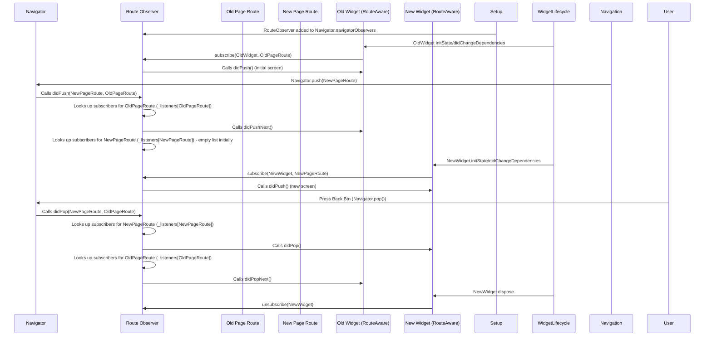

# Chapter 10: RouteObserver

Welcome back! In our previous chapter, [Chapter 9: RouteAware](09_routeaware_.md), we learned about `RouteAware`, a mixin that lets individual widgets listen for signals about their screen's visibility changing. We saw how a widget could know if its screen was covered or uncovered by another route.

But how do those signals get sent? How does the navigation system know *which* `RouteAware` widgets are interested in *which* routes? That's the job of the `RouteObserver`!

### What is a RouteObserver?

Imagine a librarian who keeps a list of people (your `RouteAware` widgets) currently reading specific books (your [Route](01_route_.md)s). When someone puts a new book on the table (pushes a new route) or takes a book away (pops a route), the librarian checks their list and tells the affected readers what happened ("Someone just put a new book on top of yours!", "The book on top was just taken away, yours is visible again!").

A `RouteObserver` is just like that librarian. It:

1.  Sits and watches the [Navigator](03_overlayroute_.md)'s stack of routes.
2.  Keeps a list of `RouteAware` objects that have "subscribed" to specific routes.
3.  When a navigation event happens (push, pop, etc.), it figures out which routes are affected.
4.  For the affected routes, it looks up which `RouteAware` objects are subscribed to them.
5.  It then calls the appropriate `RouteAware` methods (`didPush`, `didPop`, `didPushNext`, `didPopNext`) on those subscribed objects.

You typically create **one** `RouteObserver` instance for your entire app and provide it to your main [Navigator](03_overlayroute_.md) (usually through `MaterialApp` or `CupertinoApp`). Then, any `RouteAware` widget in your app can subscribe to it.

### Why Use RouteObserver?

`RouteObserver` acts as the central hub for `RouteAware` notifications. Without it, the [Navigator](03_overlayroute_.md) wouldn't know about individual widgets wanting to listen to route changes.

*   **Decoupling:** It keeps the [Navigator](03_overlayroute_.md) clean. The [Navigator](03_overlayroute_.md) just needs to tell its observers what happened. The observers handle finding and notifying the interested widgets.
*   **Scalability:** You can have many `RouteAware` widgets throughout your app, all using the same `RouteObserver` instance to get notified.
*   **Clear Communication:** It provides a standard mechanism for widgets to react to navigation lifecycle events.

You won't usually inherit from `RouteObserver`. You just create an instance of it and use it.

### Key Concepts of RouteObserver

*   **Extends `NavigatorObserver`:** `RouteObserver` gets its "watchful" ability by extending `NavigatorObserver`. `NavigatorObserver` is a class that the [Navigator](03_overlayroute_.md) calls methods on whenever navigation events happen. `RouteObserver` implements these `NavigatorObserver` methods (like `didPush`, `didPop`) and uses them as triggers to notify its subscribers.
*   **Subscription:** `RouteAware` objects (specifically, the `State` objects that mix in `RouteAware`) call `routeObserver.subscribe(this, route)` to start receiving notifications for a particular route.
*   **Unsubscription:** `RouteAware` objects **must** call `routeObserver.unsubscribe(this)` when they are no longer needed (usually in their `dispose` method) to prevent memory leaks.
*   **Mapping:** `RouteObserver` uses an internal map (`_listeners`) to keep track of which subscribers (`RouteAware` objects) are interested in which routes.

### How RouteObserver Works (Conceptual)

Let's revisit the push sequence from the [RouteAware](09_routeaware_.md) chapter, focusing on the `RouteObserver`'s role.



1.  The `RouteObserver` is created and given to the `Navigator`.
2.  When a `RouteAware` widget initializes, it finds its route and the `RouteObserver` (via `InheritedWidget`s not explicitly shown here, like `Navigator`), and calls `subscribe(this, route)`. The observer adds the widget to its internal map keyed by the route. For the very first route, the observer calls `didPush` on subscription.
3.  When `Navigator.push` is called:
    *   The `Navigator` calls `didPush` on its observers, including our `RouteObserver`.
    *   Our `RouteObserver` receives the `newRoute` and `previousRoute`.
    *   It finds all subscribers for the `previousRoute` and calls `didPushNext()` on them, because their route is now covered.
    *   It finds all subscribers for the `newRoute` (there shouldn't be any yet, as the widgets haven't built/subscribed).
4.  The new screen's widgets build, including the `RouteAware` ones.
5.  When the new `RouteAware` widget initializes (`didChangeDependencies`), it subscribes to the observer for the `newRoute`. When `subscribe` is called, the observer sees this is the currently active route and immediately calls `didPush()` on the new subscriber.
6.  When `Navigator.pop` is called:
    *   The `Navigator` calls `didPop` on its observers.
    *   Our `RouteObserver` receives the `poppedRoute` and the `routeBelow` (which is the `previousRoute` from the push).
    *   It finds all subscribers for the `poppedRoute` and calls `didPop()`.
    *   It finds all subscribers for the `routeBelow` and calls `didPopNext()`, as their route is now the top one again.
7.  When the popped screen's widget is disposed, its `RouteAware` state calls `unsubscribe`.

The `RouteObserver` acts as the intermediary, relaying events from the `Navigator` to the specific `RouteAware` widgets that signed up to listen.

### Looking at the Code

Let's look at the definition of the `RouteObserver` class.

```dart
class RouteObserver<R extends Route<dynamic>> extends NavigatorObserver {
  // Stores the subscribers for each route. Map is from Route -> Set of RouteAware objects.
  final Map<R, Set<RouteAware>> _listeners = <R, Set<RouteAware>>{};

  /// Subscribe [routeAware] to be informed about changes to [route].
  void subscribe(RouteAware routeAware, R route) {
    // Get or create the set of subscribers for this route.
    final Set<RouteAware> subscribers = _listeners.putIfAbsent(route, () => <RouteAware>{});
    // Add the routeAware object to the set.
    if (subscribers.add(routeAware)) {
      // Immediately notify the newly subscribed widget IF its route is the current one.
      // This handles the case where the widget is built on the currently visible screen.
      // (Although subscribing in didChangeDependencies after push handles this too).
      routeAware.didPush();
    }
  }

  /// Unsubscribe [routeAware].
  void unsubscribe(RouteAware routeAware) {
    // Iterate through all routes being observed
    final List<R> routes = _listeners.keys.toList(); // Copy keys to avoid modifying during iteration
    for (final R route in routes) {
      final Set<RouteAware>? subscribers = _listeners[route];
      if (subscribers != null) {
        // Remove the routeAware object from the set for this route.
        subscribers.remove(routeAware);
        // If the set becomes empty, remove the route from the map.
        if (subscribers.isEmpty) {
          _listeners.remove(route);
        }
      }
    }
  }

  @override
  void didPop(Route<dynamic> route, Route<dynamic>? previousRoute) {
    // Called by the Navigator when a route is popped.
    // Check if the popped route and the route below are of the generic type R we are observing.
    if (route is R && previousRoute is R) {
      // Get subscribers for the route *below* the popped one.
      final List<RouteAware>? previousSubscribers = _listeners[previousRoute]?.toList();

      if (previousSubscribers != null) {
        // Notify those subscribers that the route above them was popped.
        for (final RouteAware routeAware in previousSubscribers) {
          routeAware.didPopNext();
        }
      }

      // Get subscribers for the popped route.
      final List<RouteAware>? subscribers = _listeners[route]?.toList();

      if (subscribers != null) {
        // Notify those subscribers that their route was popped.
        for (final RouteAware routeAware in subscribers) {
          routeAware.didPop();
        }
        // We might expect the route to be removed from _listeners later via unsubscribe
        // from the disposed widgets, but explicitly removing it here is also an option
        // if there are no more expected subscribers. The current implementation relies
        // on explicit unsubscribe.
      }
    }
  }

  @override
  void didPush(Route<dynamic> route, Route<dynamic>? previousRoute) {
    // Called by the Navigator when a route is pushed.
     // Check if the new route and the route below are of the generic type R we are observing.
    if (route is R && previousRoute is R) {
      // Get subscribers for the route *below* the new one.
      final Set<RouteAware>? previousSubscribers = _listeners[previousRoute];

      if (previousSubscribers != null) {
        // Notify those subscribers that a new route was pushed on top of theirs.
        for (final RouteAware routeAware in previousSubscribers) {
          routeAware.didPushNext();
        }
      }
       // Note: Subscribers for the 'route' just pushed aren't notified via didPush here.
       // They are notified inside the subscribe method when they register themselves
       // in their didChangeDependencies. This is because didPush happens early
       // in the route's lifecycle, before widgets are fully built and can subscribe.
    }
  }
}
```

Key parts:

*   `extends NavigatorObserver`: This is where it gets the `didPop` and `didPush` methods that the `Navigator` calls.
*   `Map<R, Set<RouteAware>> _listeners`: The heart of the observer – a map storing sets of `RouteAware` objects, keyed by the `Route` objects they are interested in. `R` is a generic type parameter, allowing you to observe specific route types (like `PageRoute` or `ModalRoute`) or all routes (`Route<dynamic>`).
*   `subscribe(RouteAware routeAware, R route)`: Adds a `RouteAware` object to the set associated with a specific `route`. If the route is the current one, it immediately calls `didPush`.
*   `unsubscribe(RouteAware routeAware)`: Removes a `RouteAware` object from any set it is in across all
  routes being observed. This is critical for cleanup.
*   `didPop(Route route, Route previousRoute)`: When notified of a pop, it finds the subscribers for the `previousRoute` (the one *below* the popped one) and calls `didPopNext()`. It finds subscribers for the popped `route` and calls `didPop()`.
*   `didPush(Route route, Route previousRoute)`: When notified of a push, it finds the subscribers for the `previousRoute` (the one *below* the new one) and calls `didPushNext()`.

### Example: Connecting RouteAware and RouteObserver

We already saw the `RouteAwareWidget` in the previous chapter. The missing piece to make it work was providing the `RouteObserver` to the `Navigator` and passing it down (or accessing it via a method like `Navigator.of(context)` if the observer was retrieved elsewhere, though passing it explicitly is often clearer for beginner examples).

Here's how you set up the `MaterialApp` to provide the observer:

```dart
import 'package:flutter/material.dart';
import 'package:flutter/widgets.dart'; // Needed for RouteAware

// The RouteObserver instance your widgets will subscribe to.
// It's usually global or provided via a dependency injection system.
final RouteObserver<ModalRoute<dynamic>> routeObserver = RouteObserver<ModalRoute<dynamic>>();

// (Code for TrackedScreen and RouteAwareWidget from Chapter 9 goes here)
// ... copy/paste TrackedScreen and RouteAwareWidget (including the mixin state and methods) ...

class MyApp extends StatelessWidget {
  const MyApp({super.key});

  @override
  Widget build(BuildContext context) {
    return MaterialApp(
      title: 'RouteObserver Example',
      // This is where you give the Navigator your RouteObserver!
      navigatorObservers: [routeObserver],
      home: const TrackedScreen(screenName: 'Home'),
    );
  }
}

void main() {
  runApp(const MyApp());
}
```

In this setup:

1.  We create the `routeObserver` instance. We specify `<ModalRoute<dynamic>>` to observe changes for any type of `ModalRoute` (which includes full-screen pages like those created by `MaterialPageRoute`).
2.  In `MaterialApp`, we use the `navigatorObservers` parameter and pass our `routeObserver` instance in a list. The `MaterialApp`'s internal `Navigator` will now notify this observer about navigation events.
3.  Our `RouteAwareWidget` (from the previous chapter) receives this observer and uses its `subscribe`/`unsubscribe` methods.

Now, when you run this application and navigate between the `TrackedScreen`s, the `RouteAwareWidget` instances will receive the `didPush`, `didPop`, `didPushNext`, and `didPopNext` notifications because:

*   Navigation events happen on the `Navigator`.
*   The `Navigator` calls `didPush`/`didPop` on the `routeObserver`.
*   The `routeObserver` looks up which `RouteAwareWidgetState` instances are subscribed to the affected routes and calls the corresponding `RouteAware` methods on them.
*   The `RouteAwareWidgetState` then updates its internal status and rebuilds.

This clearly shows the flow: `Navigator` -> `RouteObserver` -> `RouteAware`.

### Conclusion

In this chapter, we learned about `RouteObserver`, the crucial component that tracks navigation events within the `Navigator` and dispatches notifications to interested `RouteAware` objects. We saw that it extends `NavigatorObserver` to receive notifications from the `Navigator` and maintains a mapping of routes to their subscribed `RouteAware` widgets. By providing a `RouteObserver` to your app's `Navigator` and having widgets mix in `RouteAware` and subscribe/unsubscribe, you enable them to react gracefully to navigation lifecycle changes.

This concludes our series on Flutter navigation core concepts! We started with the basic [Route](01_route_.md) stack and ended with how individual widgets can become aware of their route's state, covering animations, overlays, predictive back, and local history along the way. Understanding these concepts provides a solid foundation for building robust navigation in your Flutter applications.

---

Generated by [AI Codebase Knowledge Builder](https://github.com/The-Pocket/Tutorial-Codebase-Knowledge)