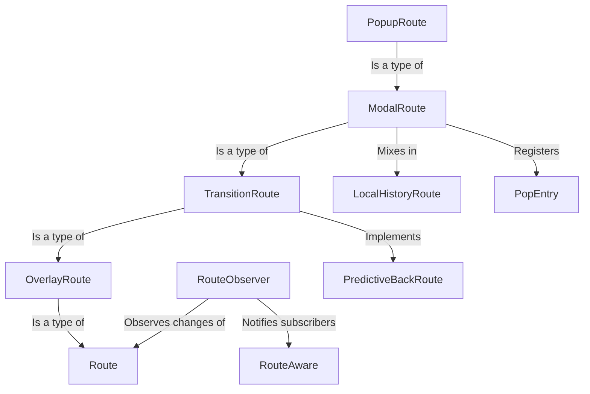

# Tutorial: flutter

This Flutter code defines how different **screens** (called *Routes*) are managed within an app using a **Navigator**.
It covers basic screen transitions, overlays for things like **dialogs**, handling back navigation, and notifying parts of the app
when their corresponding screen becomes visible or invisible using **observers** and **aware** objects.

**Source Repository:** [None](None)

## Chapters

1. [Route
](01_route_.md)
2. [TransitionRoute
](02_transitionroute_.md)
3. [OverlayRoute
](03_overlayroute_.md)
4. [ModalRoute
](04_modalroute_.md)
5. [PopupRoute
](05_popuproute_.md)
6. [PredictiveBackRoute
](06_predictivebackroute_.md)
7. [LocalHistoryRoute
](07_localhistoryroute_.md)
8. [PopEntry
](08_popentry_.md)
9. [RouteAware
](09_routeaware_.md)
10. [RouteObserver
](10_routeobserver_.md)

---

Generated by [AI Codebase Knowledge Builder](https://github.com/The-Pocket/Tutorial-Codebase-Knowledge)