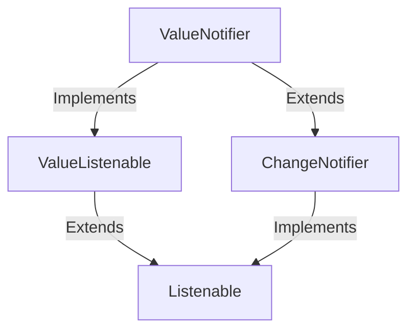

# Tutorial: flutter

This part of the Flutter framework provides core tools for **managing and notifying listeners about changes**.
It allows objects to be *watched* and provides convenient ways to handle single changing values or more complex scenarios
where multiple parts of your application need to react to updates.

**Source Repository:** [None](None)

## Chapters

1. [ChangeNotifier
](01_changenotifier_.md)
2. [Listenable
](02_listenable_.md)
3. [ValueNotifier
](03_valuenotifier_.md)
4. [ValueListenable
](04_valuelistenable_.md)

---

Generated by [AI Codebase Knowledge Builder](https://github.com/The-Pocket/Tutorial-Codebase-Knowledge)