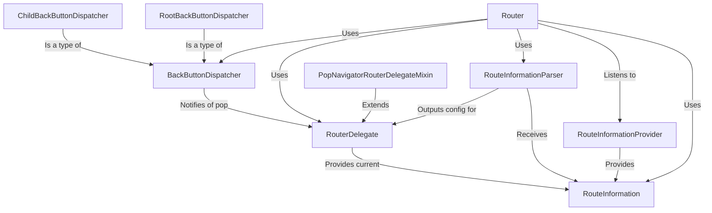

# Tutorial: flutter

The Flutter `router` system is like a **traffic controller** for your app's screens.
It works by taking *route information* (like a web address or a back button press),
*parsing* it to understand where the user wants to go, and then *delegating*
the task of building the correct screens to display. It also helps manage the
system's back button behavior.

**Source Repository:** [None](None)

## Chapters

1. [RouteInformation
](01_routeinformation_.md)
2. [RouteInformationProvider
](02_routeinformationprovider_.md)
3. [RouteInformationParser
](03_routeinformationparser_.md)
4. [RouterDelegate
](04_routerdelegate_.md)
5. [Router
](05_router_.md)
6. [BackButtonDispatcher
](06_backbuttondispatcher_.md)
7. [RootBackButtonDispatcher
](07_rootbackbuttondispatcher_.md)
8. [ChildBackButtonDispatcher
](08_childbackbuttondispatcher_.md)
9. [PopNavigatorRouterDelegateMixin
](09_popnavigatorrouterdelegatemixin_.md)

---

Generated by [AI Codebase Knowledge Builder](https://github.com/The-Pocket/Tutorial-Codebase-Knowledge)