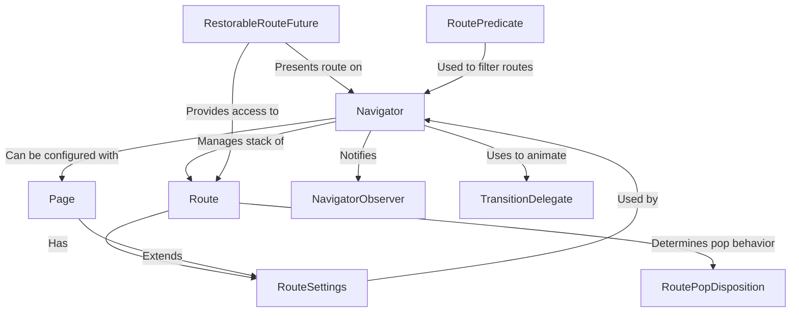

# Tutorial: flutter

This Flutter project provides a system for managing the flow and structure of screens within an application. The core idea revolves around a **Navigator**, which acts like a stack of *Routes* (individual screens). Users can *push* new routes onto the stack to move forward or *pop* routes off the stack to go back. This system allows for organized navigation, passing data between screens (*RouteSettings*), observing navigation events (*NavigatorObserver*), and even handling animated transitions (*TransitionDelegate*).

**Source Repository:** [None](None)

## Chapters

1. [Navigator
](01_navigator_.md)
2. [Route
](02_route_.md)
3. [RouteSettings
](03_routesettings_.md)
4. [Page
](04_page_.md)
5. [RoutePredicate
](05_routepredicate_.md)
6. [RoutePopDisposition
](06_routepopdisposition_.md)
7. [NavigatorObserver
](07_navigatorobserver_.md)
8. [TransitionDelegate
](08_transitiondelegate_.md)
9. [RestorableRouteFuture
](09_restorableroutefuture_.md)

---

Generated by [AI Codebase Knowledge Builder](https://github.com/The-Pocket/Tutorial-Codebase-Knowledge)