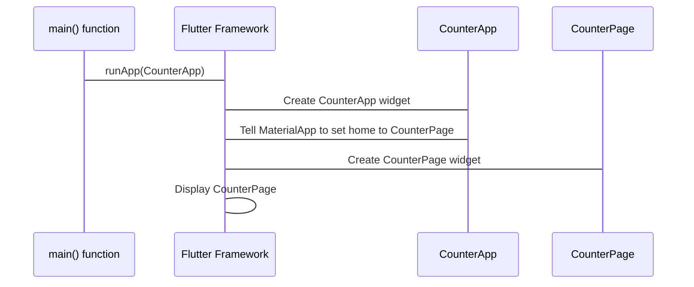

# Chapter 1: CounterApp

Welcome to the wonderful world of Flutter and our `flutter_counter` project! In this first chapter, we're going to talk about the very foundation of our application: the `CounterApp`. Think of the `CounterApp` like the outside shell or the main structure of a physical calculator. It's what you hold in your hand and it contains everything inside.

So, what does the `CounterApp` actually *do* for us? It's the main entry point of our application. When you run your Flutter app, the `CounterApp` is the very first thing that gets created and displayed. Its main job is to tell Flutter which "screen" or "page" to show when the app starts.

In our `flutter_counter` project, the `CounterApp` is responsible for showing the "Counter Page" as the main screen. We'll learn more about the [CounterPage](02_counterpage_.md) in the next chapter, but for now, just imagine it's the part of the calculator where you see the numbers.

Let's look at the code that makes this happen.

### Setting up the App

All Flutter apps start execution in the `main` function. This function is like the initial power button for your calculator.

```dart
// File: lib/main.dart

import 'package:bloc/bloc.dart';
import 'package:flutter/widgets.dart';
import 'package:flutter_counter/app.dart';
import 'package:flutter_counter/counter_observer.dart';

void main() {
  Bloc.observer = const CounterObserver(); // We'll talk about this later!
  runApp(const CounterApp()); // This is where the magic happens!
}
```

In this simple code snippet, the most important line for understanding `CounterApp` is `runApp(const CounterApp());`. This tells Flutter to build and display the `CounterApp` widget. Widgets are the building blocks of Flutter's user interface, like individual buttons or text labels, but `CounterApp` is a special kind of widget that defines the overall structure of the app.

### What is `CounterApp`?

Now let's peek inside the `CounterApp` code itself. Remember, think of `CounterApp` as the outer casing of our calculator.

```dart
// File: lib/app.dart

import 'package:flutter/material.dart';
import 'package:flutter_counter/counter/counter.dart';

/// {@template counter_app}
/// A [MaterialApp] which sets the `home` to [CounterPage].
/// {@endtemplate}
class CounterApp extends MaterialApp {
  /// {@macro counter_app}
  const CounterApp({super.key}) : super(home: const CounterPage());
}
```

This looks a bit different from what you might expect! The `CounterApp` class *extends* (or inherits from) `MaterialApp`. `MaterialApp` is a special widget provided by Flutter that provides a lot of the basic structure and styling that you expect in a standard mobile app using Google's "Material Design". It handles things like themes, navigation, and setting the initial screen.

The key part here is `: super(home: const CounterPage())`. This is how `CounterApp` tells the `MaterialApp` what to display first. It's saying, "Dear `MaterialApp`, when you start up, please show the `CounterPage`!". The `home` property of `MaterialApp` is where you set the primary screen of your application.

So, the `CounterApp` isn't doing a lot of heavy lifting itself. Its main job is to use the `MaterialApp` provided by Flutter and configure it to display our [CounterPage](02_counterpage_.md) as the starting point.

### How It All Flows Together

Let's visualize the simple flow when our app starts:



1. The `main` function tells Flutter to run our application, starting with `CounterApp`.
2. Flutter creates an instance of the `CounterApp` widget.
3. The `CounterApp`, which is a `MaterialApp`, is told to set its "home" screen to `CounterPage`.
4. Flutter creates an instance of the `CounterPage` widget.
5. Flutter then displays the `CounterPage` on the screen.

It's a simple setup, but crucial for launching our application and presenting the correct initial content.

### Conclusion

In this chapter, we learned that the `CounterApp` is the main wrapper around our entire application. It's responsible for telling Flutter what the main screen should be, which in our case is the [CounterPage](02_counterpage_.md). It achieves this by extending Flutter's built-in `MaterialApp` and setting the `home` property.

Next, we'll dive into the [CounterPage](02_counterpage_.md) itself to see what makes up that initial screen we're displaying.

[Next Chapter: CounterPage](02_counterpage_.md)

---

Generated by [AI Codebase Knowledge Builder](https://github.com/The-Pocket/Tutorial-Codebase-Knowledge)