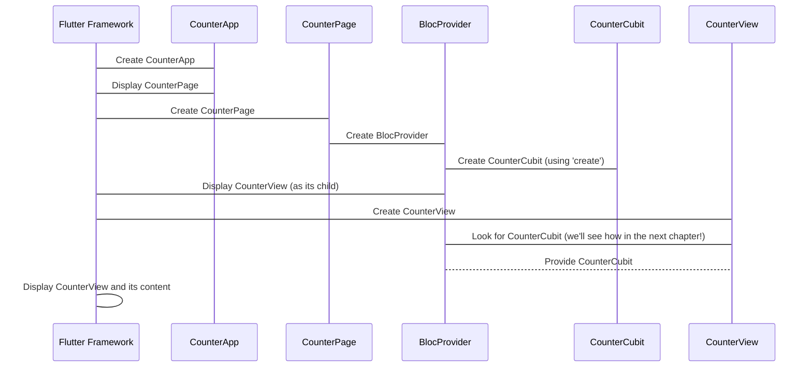

# Chapter 2: CounterPage

Welcome back! In the last chapter, we learned that the [CounterApp](01_counterapp_.md) is like the outer shell of our calculator, and its main job is to show the [CounterPage](02_counterpage_.md) when the app starts. Now, it's time to open up that shell and see what the [CounterPage](02_counterpage_.md) is all about!

Think of the [CounterPage](02_CounterPage.md) as the part of the calculator that contains both the "brain" (the logic that knows how to count) and the "screen" (what you actually see). The [CounterPage](02_counterpage_.md) acts as a helpful helper that makes sure the brain and the screen can talk to each other.

Why do we need this "helper"? In Flutter, our user interface (the screen you see) is made up of "widgets". Sometimes, these widgets need to know about some special "data" or "manager" to work correctly. In our counter app, the "screen" part needs to know about the "brain" part so it can ask it to count up or down. The [CounterPage](02_counterpage_.md) is where we set up this connection.

## What is the CounterPage?

The [CounterPage](02_counterpage_.md) is a simple Flutter widget. Its main purpose is to bring together two other important parts of our counter app:

1.  The **CounterCubit**: This is like the "brain" of our counter. It holds the actual number and has the logic to increase or decrease it. We'll learn more about the [CounterCubit](04_countercubit_.md) in a later chapter.
2.  The **CounterView**: This is the "screen" part. It displays the current number and has the buttons you press to make the number change. We'll explore the [CounterView](03_counterview_.md) in the next chapter.

The [CounterPage](02_counterpage_.md) doesn't *do* the counting itself, and it doesn't *draw* anything on the screen directly. Its job is just to make sure the [CounterView](03_counterview_.md) has access to the [CounterCubit](04_countercubit_.md).

## Setting Up the Connection with BlocProvider

How does the [CounterPage](02_counterpage_.md) achieve this connection? It uses something called a `BlocProvider`. Don't worry too much about the word "Bloc" for now, it's just a pattern (or a way of organizing code) that helps manage the "brain" part of our app.

The `BlocProvider` is like a special box that can hold our [CounterCubit](04_countercubit_.md). When we put the [CounterCubit](04_countercubit_.md) in the `BlocProvider`, any widget *inside* that `BlocProvider` (like our [CounterView](03_counterview_.md)) can easily find and use the [CounterCubit](04_countercubit_.md).

Let's look at the code for the [CounterPage](02_counterpage_.md):

```dart
// File: lib/counter/view/counter_page.dart

import 'package:flutter/material.dart';
import 'package:flutter_bloc/flutter_bloc.dart'; // We need this for BlocProvider
import 'package:flutter_counter/counter/counter.dart'; // Imports CounterCubit and CounterView

// This is our CounterPage widget!
class CounterPage extends StatelessWidget {
  const CounterPage({super.key});

  @override
  Widget build(BuildContext context) {
    return BlocProvider( // This is the special box!
      create: (_) => CounterCubit(), // We create the "brain" and put it in the box
      child: const CounterView(), // The "screen" (and everything inside it) can access the box
    );
  }
}
```

Let's break this down:

*   `class CounterPage extends StatelessWidget`: This just means [CounterPage](02_counterpage_.md) is a simple widget that doesn't need to remember anything itself.
*   `Widget build(BuildContext context)`: Every widget needs this part to describe what it looks like.
*   `return BlocProvider(...)`: This is the key part! We are returning a `BlocProvider` widget.
*   `create: (_) => CounterCubit()`: This tells the `BlocProvider` *how* to create the "brain" (the [CounterCubit](04_countercubit_.md)). It creates a new `CounterCubit` whenever the `BlocProvider` is built.
*   `child: const CounterView()`: This tells the `BlocProvider` that our [CounterView](03_counterview_.md) (the "screen") should be *inside* this `BlocProvider`. This means the [CounterView](03_counterview_.md) can now easily get the `CounterCubit` from the `BlocProvider`.

## How the Connection Works

When the [CounterApp](01_counterapp_.md) tells Flutter to show the [CounterPage](02_counterpage_.md), here's what happens:



1.  Flutter starts the app, creating the [CounterApp](01_counterapp_.md).
2.  The [CounterApp](01_counterapp_.md) tells Flutter to show the [CounterPage](02_counterpage_.md).
3.  Flutter creates the [CounterPage](02_counterpage_.md) widget.
4.  Inside its `build` method, the [CounterPage](02_counterpage_.md) creates a `BlocProvider`.
5.  The `BlocProvider` uses the `create` instruction to make a new [CounterCubit](04_countercubit_.md).
6.  The `BlocProvider` then tells Flutter to display its "child", which is our [CounterView](03_counterview_.md).
7.  Flutter creates the [CounterView](03_counterview_.md) widget.
8.  Now, the [CounterView](03_counterview_.md) can easily find the [CounterCubit](04_countercubit_.md) that was put into the `BlocProvider` by the [CounterPage](02_counterpage_.md). We'll see *how* the [CounterView](03_counterview_.md) does this in the next chapter!
9.  Finally, Flutter displays the [CounterView](03_counterview_.md) on your screen, and because the [CounterView](03_counterview_.md) has access to the [CounterCubit](04_countercubit_.md), it knows the current count and can ask the [CounterCubit](04_countercubit_.md) to change the number when you press buttons.

## Conclusion

The [CounterPage](02_counterpage_.md) acts as a crucial intermediate step. It's not the visual part (that's the [CounterView](03_counterview_.md)), and it's not the logic part (that's the [CounterCubit](04_countercubit_.md)). Instead, it's the "connector" that creates the [CounterCubit](04_countercubit_.md) and makes it available to the [CounterView](03_counterview_.md) using a `BlocProvider`. This setup is a common way in Flutter to provide important "managers" or "brains" to the parts of your app that need them.

Now that we understand how the [CounterPage](02_counterpage_.md) connects the brain and the screen, let's dive into the "screen" part itself: the [CounterView](03_counterview_.md)!

[Next Chapter: CounterView](03_counterview_.md)

---

Generated by [AI Codebase Knowledge Builder](https://github.com/The-Pocket/Tutorial-Codebase-Knowledge)