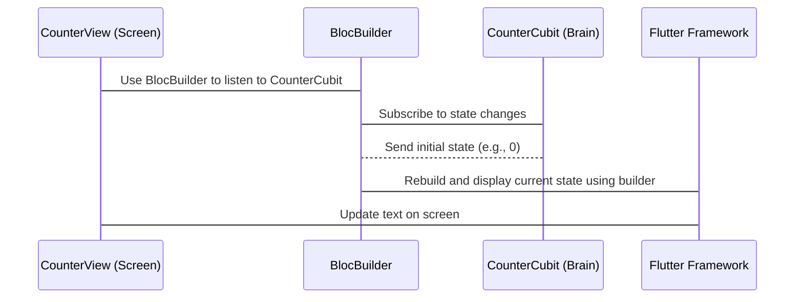
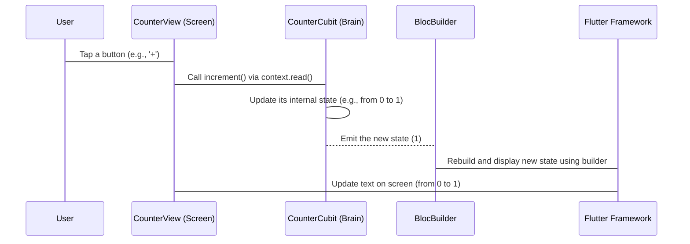

# Chapter 3: CounterView

Welcome back, aspiring Flutter developers! In the last chapter, we saw how the [CounterPage](02_counterpage_.md) acts as the "connector," setting up our "brain" ([CounterCubit](04_countercubit_.md)) and making it available to the "screen" part using `BlocProvider`. Now, let's finally look at that "screen" part!

Think of the [CounterView](03_counterview_.md) as the actual display and buttons on your calculator. It's what you *see* and what you *interact* with. It shows the current number and lets you press buttons to make that number go up or down.

The [CounterView](03_counterview_.md) has two main jobs:

1.  **Display the number:** It needs to get the current count from the "brain" ([CounterCubit](04_countercubit_.md)) and show it on the screen.
2.  **Listen for button taps:** When you press the "+" or "-" button, it needs to tell the "brain" ([CounterCubit](04_countercubit_.md)) to update the number.

The amazing part is that the [CounterView](03_counterview_.md) doesn't need to know *how* the counting happens. It just needs to know *what* the current count is and *how* to ask the brain to change it.

## What is CounterView?

The [CounterView](03_counterview_.md) is a standard Flutter widget that describes the visual layout of our counter screen. In our project, it's a `StatelessWidget`, meaning it doesn't need to manage its own internal state (like remembering the count itself, that's the job of the [CounterCubit](04_countercubit_.md)!).

It uses other Flutter widgets like `Scaffold`, `Center`, `Text`, and `FloatingActionButton` to build the user interface you see.

Let's look at the important parts of the [CounterView](03_counterview_.md) code. Remember, it's the "screen" part!

### Building the User Interface

```dart
// File: lib/counter/view/counter_view.dart

// ... imports and CounterView class definition ...

@override
Widget build(BuildContext context) {
  final textTheme = Theme.of(context).textTheme;
  return Scaffold( // Basic layout structure
    body: Center( // Centers the content
      child: BlocBuilder<CounterCubit, int>( // This reacts to changes in the brain!
        builder: (context, state) {
          return Text('$state', style: textTheme.displayMedium); // Displays the count
        },
      ),
    ),
    // ... Floating action buttons below ...
  );
}

// ... rest of the code ...
```

This is the `build` method of our `CounterView`. It describes what the screen looks like:

*   `Scaffold`: Provides a basic visual structure (like a standard page with a body and optional floating buttons).
*   `Center`: Puts whatever is inside it right in the middle of the screen.
*   `BlocBuilder<CounterCubit, int>`: This is a special widget provided by the `flutter_bloc` library. This is how our "screen" (the [CounterView](03_counterview_.md)) listens to the "brain" ([CounterCubit](04_countercubit_.md)).
    *   `<CounterCubit, int>` tells the `BlocBuilder` that it's looking for a `CounterCubit` and that the `CounterCubit` holds an `int` (an integer, which is our count).
    *   The `builder` part is like a little instruction telling the `BlocBuilder` what to draw whenever the `CounterCubit`'s state (the count) changes. The `state` variable inside the `builder` gives us the *current* most recent value from the `CounterCubit`.
*   `Text('$state', ...)`: This displays the actual count on the screen. The `$state` part shows the current number we got from the `CounterCubit`.

So, the `BlocBuilder` is the bridge that allows the [CounterView](03_counterview_.md) to automatically update the displayed number whenever the [CounterCubit](04_countercubit_.md)'s value changes.

### Adding Buttons

Now, let's look at the buttons:

```dart
// File: lib/counter/view/counter_view.dart

// ... previous code ...

floatingActionButton: Column( // Arranges buttons vertically
  mainAxisAlignment: MainAxisAlignment.end, // Puts them at the bottom
  crossAxisAlignment: CrossAxisAlignment.end, // Aligns them to the right
  children: <Widget>[
    FloatingActionButton( // The '+' button
      key: const Key('counterView_increment_floatingActionButton'),
      child: const Icon(Icons.add),
      onPressed: () => context.read<CounterCubit>().increment(), // Tell the brain to increment!
    ),
    const SizedBox(height: 8), // Adds a small space between buttons
    FloatingActionButton( // The '-' button
      key: const Key('counterView_decrement_floatingActionButton'),
      child: const Icon(Icons.remove),
      onPressed: () => context.read<CounterCubit>().decrement(), // Tell the brain to decrement!
    ),
  ],
),
// ... rest of the code ...
```

This part adds the two round buttons you see at the bottom right of the screen:

*   `floatingActionButton`: This is a standard property of the `Scaffold` widget to place "floating" buttons.
*   `Column`: Arranges the buttons one below the other.
*   `FloatingActionButton`: These are the actual circular buttons.
*   `child: const Icon(...)`: Puts the "+" or "-" icon inside the button.
*   `onPressed`: This is the most important part for interaction! It tells Flutter what to do when the button is tapped.
    *   `() => context.read<CounterCubit>().increment()`: When the "+" button is pressed, this line finds the `CounterCubit` (remember, it was provided by the [CounterPage](02_counterpage_.md) using `BlocProvider`!) and calls its `increment()` method. This is how the "screen" tells the "brain" to count up!
    *   `() => context.read<CounterCubit>().decrement()`: Similarly, when the "-" button is pressed, this finds the `CounterCubit` and calls its `decrement()` method.

The `context.read<CounterCubit>()` part is how a widget inside a `BlocProvider` can access the "brain" ([CounterCubit](04_countercubit_.md)) that was put there by its higher-level widget (the [CounterPage](02_counterpage_.md)). The `context` is like the widget's address book, and `.read<CounterCubit>()` asks that address book to find the `CounterCubit` that's available.

## How CounterView Interacts

Here's how the [CounterView](03_counterview_.md) talks to the [CounterCubit](04_countercubit_.md):

When the app starts and the [CounterView](03_counterview_.md) is displayed:



1.  The [CounterView](03_counterView.md) is built and uses `BlocBuilder` to watch the `CounterCubit`.
2.  `BlocBuilder` starts listening to the `CounterCubit` for any changes in its state (the count).
3.  Initially, the `CounterCubit` sends its starting state (usually 0) to the `BlocBuilder`.
4.  The `BlocBuilder` uses the `builder` function to create a `Text` widget showing that initial state.
5.  Flutter displays this text on the screen.

When a button is pressed:



1.  The user taps one of the buttons on the [CounterView](03_counterView.md).
2.  The `onPressed` function is triggered, using `context.read<CounterCubit>()` to find the `CounterCubit` and calls `increment()` or `decrement()`.
3.  The `CounterCubit` updates its internal number.
4.  Since `BlocBuilder` was listening, the `CounterCubit` automatically sends the *new* number to the `BlocBuilder`.
5.  The `BlocBuilder` sees the new number and uses its `builder` function to create an *updated* `Text` widget showing the new number.
6.  Flutter updates the screen to show the new number.

This happens without the [CounterView](03_counterView.md) manually telling the text to change! The `BlocBuilder` handles the "rebuilding" part automatically whenever the `CounterCubit`'s state changes.

## Conclusion

The [CounterView](03_counterView.md) is the visual face of our counter app. It uses Flutter widgets to display the current count and provide buttons for the user to interact with. The key concepts here are:

*   Using `BlocBuilder` to listen for changes in the "brain" ([CounterCubit](04_countercubit_.md)) and automatically update the display.
*   Using `context.read<CounterCubit>()` in the button's `onPressed` to find the "brain" and tell it to perform an action (`increment` or `decrement`).

The [CounterView](03_CounterView.md) is purely about presentation and interaction. It doesn't hold the counting logic itself; it delegates that responsibility to the [CounterCubit](04_countercubit_.md).

Next, we'll finally dive into the "brain" itself: the [CounterCubit](04_countercubit_.md)! We'll see how it stores the number and how those `increment()` and `decrement()` methods actually work.

[Next Chapter: CounterCubit](04_countercubit_.md)

---

Generated by [AI Codebase Knowledge Builder](https://github.com/The-Pocket/Tutorial-Codebase-Knowledge)