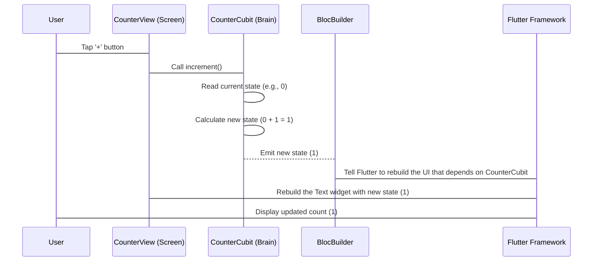

# Chapter 4: CounterCubit

Welcome back! In the last two chapters, we looked at the [CounterPage](02_counterpage_.md) (the connector) and the [CounterView](03_counterview_.md) (the screen and buttons). We saw how the [CounterView](03_counterview_.md) used `BlocBuilder` to show the number and `context.read<CounterCubit>()` to ask the "brain" to change the number. But we still haven't seen the "brain" itself!

This chapter is all about the **CounterCubit**, which is the "brain" of our simple counter application. Think of it as a special manager that holds the actual count and knows how to perform the *only* two actions our counter needs: increasing the number and decreasing the number. It's like having a little assistant whose only job is to remember the count and add or subtract one when you tell it to.

The problem the `CounterCubit` solves is keeping track of the count *separately* from the part that displays the number. Why is this good? Because the display part ([CounterView](03_counterview_.md)) doesn't need to worry about the counting logic, and the counting logic (CounterCubit) doesn't need to worry about how the number is shown on the screen. They can focus on their own jobs, making the code easier to understand and manage!

## What is CounterCubit?

The `CounterCubit` is a special type of class from the `bloc` library (which `flutter_bloc` uses). A Cubit is basically a simple way to manage "state" (data that changes, like our count) and provide ways to change that state.

In our case, the "state" that the `CounterCubit` manages is just a single number (an integer, `int`).

Let's look at the basic structure of our `CounterCubit`:

```dart
// File: lib/counter/cubit/counter_cubit.dart

import 'package:bloc/bloc.dart'; // Need this for Cubit

/// Our CounterCubit class
class CounterCubit extends Cubit<int> {
  /// When we create a CounterCubit, its starting state (the count) is 0.
  CounterCubit() : super(0);

  // Methods to change the state go here...
}
```

*   `class CounterCubit extends Cubit<int>`: This tells Flutter that `CounterCubit` is a Cubit, and the `<int>` part says that the type of data it will hold and manage (its "state") is an integer.
*   `CounterCubit() : super(0);`: This is how we create a new `CounterCubit`. `: super(0)` is special code that tells the `Cubit` parent class to start with an initial state of `0`.

So, right when a `CounterCubit` is created (which happens in the [CounterPage](02_counterpage_.md) when it's put into the `BlocProvider`), its internal count is set to 0.

## How it Changes the State: `emit()`

The main job of a `Cubit` is to *emit* new states when something happens. When we say "emit", think of it like the `CounterCubit` sending out a signal saying, "Hey, my number has changed! Here's the new value!". Any widget that's listening with a `BlocBuilder` (like our [CounterView](03_counterview_.md)) will hear this signal and update itself.

How does the `CounterCubit` emit a new state? With the `emit()` method.

Let's add the `increment()` method to our `CounterCubit`:

```dart
// File: lib/counter/cubit/counter_cubit.dart

// ... previous code ...

class CounterCubit extends Cubit<int> {
  CounterCubit() : super(0);

  /// Add 1 to the current state.
  void increment() {
    // state is the current number held by the Cubit
    // emit() tells listeners the new number
    emit(state + 1);
  }

  // decrement() method goes here...
}
```

*   `void increment()`: This is the method that the [CounterView](03_counterview_.md) calls when the "+" button is pressed. It's a `void` method because it doesn't return a value; its job is just to update the state.
*   `emit(state + 1)`: This is the core!
    *   `state`: Inside the `CounterCubit`, `state` always represents the *current* number the Cubit is holding.
    *   `state + 1`: This calculates the *next* number by adding 1 to the current number.
    *   `emit(...)`: This takes the result of the calculation (`state + 1`) and *emits* it as the *new* state of the `CounterCubit`.

When `emit()` is called, two important things happen:
1. The Cubit's internal `state` value is updated to the new number (e.g., 0 becomes 1).
2. A signal is sent out to anyone listening (like our `BlocBuilder` in the [CounterView](03_counterview_.md)) that the state has changed.

Now, let's add the `decrement()` method:

```dart
// File: lib/counter/cubit/counter_cubit.dart

// ... previous code ...

class CounterCubit extends Cubit<int> {
  CounterCubit() : super(0);

  void increment() => emit(state + 1); // Shorter way to write it!

  /// Subtract 1 from the current state.
  void decrement() {
    // state is the current number
    // emit() tells listeners the new number
    emit(state - 1);
  }
}
```

*   `void decrement()`: Called when the "-" button is pressed on the [CounterView](03_counterview_.md).
*   `emit(state - 1)`: Calculates the next state by subtracting 1 from the current `state` and then `emit()`s this new state.

And that's it for the core logic of the `CounterCubit`! It's very simple: it just holds an integer and has two methods to add or subtract 1 from that integer, emitting the new value each time.

## How it Works with the View

Let's revisit the flow from our previous chapter, now focusing on the `CounterCubit`'s role.

When you tap the "+" button on the [CounterView](03_counterview_.md):



1.  The user taps the "+" button on the CounterView.
2.  The `onPressed` function calls `context.read<CounterCubit>().increment()`.
3.  The `increment()` method in the `CounterCubit` is executed.
4.  Inside `increment()`, the current `state` (let's say it's 0) is read.
5.  The new state (`0 + 1 = 1`) is calculated.
6.  `emit(1)` is called. This updates the `CounterCubit`'s internal state to 1 AND sends a signal to the `BlocBuilder` listening in the [CounterView](03_counterview_.md).
7.  The `BlocBuilder` receives the new state (1).
8.  The `BlocBuilder` tells Flutter that the UI dependent on this state needs to be rebuilt.
9.  Flutter rebuilds the part of the [CounterView](03_counterview_.md) inside the `BlocBuilder`'s `builder` function.
10. The `Text` widget is created again, but this time the `state` variable inside the `builder` is 1, so it displays "1".
11. The user sees the count updated on the screen.

The same process happens for `decrement()`, but `emit(state - 1)` is called instead.

The `CounterCubit` is purely about managing the state (the number) and providing methods to change it. It has *no* knowledge of the user interface; it doesn't know or care that it's being displayed as text or changed by a button. It just updates its internal value and emits the new state.

## Conclusion

In this chapter, we met the "brain" of our counter: the **CounterCubit**. We learned that it's a simple class that holds the current count as its "state" and uses the `emit()` method to update that state and notify anyone listening. The `increment()` and `decrement()` methods provide the ways to change the count. The `CounterCubit` is intentionally simple, focusing only on the counting logic, while relying on the [CounterView](03_counterview_.md) to handle the display and user interaction.

Now that we understand how the state is managed and updated, we'll look at one final piece of the puzzle: the [BlocObserver](05_blocobserver_.md), which helps us see *when* the state changes are happening.

[Next Chapter: BlocObserver](05_blocobserver_.md)

---

Generated by [AI Codebase Knowledge Builder](https://github.com/The-Pocket/Tutorial-Codebase-Knowledge)