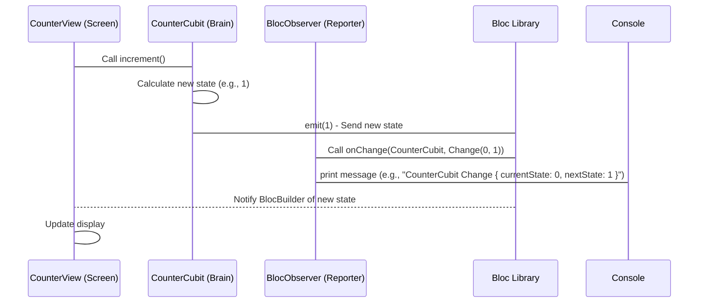

# Chapter 5: BlocObserver

Welcome back! In the last chapter, we finally peeked inside the "brain" of our counter application, the [CounterCubit](04_countercubit_.md). We saw how it holds the current count (`state`) and uses `emit()` to update the number and signal changes to the [CounterView](03_counterview_.md).

Today, we're going to talk about something that helps us *see* these signals. Imagine you're watching the [CounterCubit](04_countercubit_.md) very closely. Every time its number changes (every time it `emit()`s a new state), you write down what the number *was* and what it just changed *to*. This is exactly what the **BlocObserver** does! It's like our silent reporter, watching the `CounterCubit` and making notes of every time its state changes.

Why would we want this reporter? When you're building apps, especially as they get more complicated, sometimes the numbers or data don't change the way you expect. The `BlocObserver` is a super helpful tool for debugging. It prints messages to your console (that technical window where you see app activity) every time a state changes. Seeing these messages can help you understand exactly when and how your `CounterCubit` is changing its number, which is invaluable for finding and fixing problems.

In our simple counter app, the `BlocObserver` will show us messages like "CounterCubit state changed from 0 to 1" when we press the plus button.

## What is BlocObserver?

The `BlocObserver` is a special class provided by the `bloc` library. You can create your own custom observer by extending the `BlocObserver` class and overriding (changing) some of its methods to add your own actions, like printing messages.

In our `flutter_counter` project, we have a custom observer specifically for our counter, called `CounterObserver`.

Let's look at its code:

```dart
// File: lib/counter_observer.dart

import 'package:bloc/bloc.dart';

/// Our custom observer for the counter
class CounterObserver extends BlocObserver {
  /// Just creates our observer
  const CounterObserver();

  @override
  void onChange(BlocBase<dynamic> bloc, Change<dynamic> change) {
    super.onChange(bloc, change);
    // Print a message whenever a state changes!
    // ignore: avoid_print
    print('${bloc.runtimeType} $change');
  }
}
```

Let's break this down:

*   `class CounterObserver extends BlocObserver`: This tells Flutter that `CounterObserver` is our custom observer, inheriting from the standard `BlocObserver`.
*   `const CounterObserver();`: This is just the standard way to create our observer.
*   `@override void onChange(BlocBase<dynamic> bloc, Change<dynamic> change)`: This is the key method we've overridden. The `BlocObserver` automatically calls this method *every time* a `Bloc` or `Cubit` (like our [CounterCubit](04_countercubit_.md)) emits a new state.
    *   `bloc`: This tells us *which* `Bloc` or `Cubit` had a state change (in our case, it will be our `CounterCubit`). `bloc.runtimeType` tells us its name as code.
    *   `change`: This is a special object that tells us what the state was *before* the change (`change.currentState`) and what the state is *after* the change (`change.nextState`).
*   `super.onChange(bloc, change);`: This line calls the original `onChange` method from the `BlocObserver` class. It's good practice to include this.
*   `print('${bloc.runtimeType} $change');`: This is where the magic happens! We use the `print` function to send a message to the console. This message will include the name of the `Cubit` (`bloc.runtimeType`) and the details of the change (`$change`). The `$change` will automatically show the previous and next state.

So, this `CounterObserver` is set up to simply listen for *any* state change in *any* Bloc or Cubit it's watching and print a helpful message about it.

## Connecting the Observer

Creating the `CounterObserver` class isn't enough; we need to tell the `bloc` library to *use* our observer. This is done very early in our application's startup process, right in the `main` function.

Remember this line from Chapter 1?

```dart
// File: lib/main.dart

import 'package:bloc/bloc.dart';
// ... other imports ...
import 'package:flutter_counter/counter_observer.dart'; // We need our observer here

void main() {
  // This line connects our observer!
  Bloc.observer = const CounterObserver();
  runApp(const CounterApp());
}
```

*   `Bloc.observer = const CounterObserver();`: This is the crucial line. The `bloc` library has a static property called `observer`. By setting this property to an instance of our `CounterObserver`, we are telling the `bloc` library, "Hey, please use *this* observer to watch all the Blocs and Cubits in my app!".

This happens *before* our [CounterApp](01_counterapp_.md) (and subsequently the [CounterPage](02_counterpage_.md) and [CounterCubit](04_countercubit_.md)) is even created. This ensures that our `CounterObserver` is ready to watch the `CounterCubit` from the moment it's brought to life.

## How the Observer Works

Let's visualize how the `BlocObserver` fits into the flow when the `CounterCubit` emits a new state (like when you press the "+" button):



1.  The user taps the "+" button on the [CounterView](03_counterview_.md).
2.  The [CounterView](03_counterview_.md) calls `increment()` on the [CounterCubit](04_countercubit_.md).
3.  The [CounterCubit](04_countercubit_.md) calculates the new state and calls `emit()`.
4.  The `bloc` library receives the new state from the `CounterCubit`.
5.  Since we set a `Bloc.observer`, the `bloc` library calls the `onChange` method on our `CounterObserver`, passing details about the change (what `Cubit` changed, and what the old and new states are).
6.  Our `CounterObserver`'s `onChange` method executes the `print` statement, sending a message to the console.
7.  *At the same time*, the `bloc` library also notifies any widgets listening (like our `BlocBuilder` in the [CounterView](03_counterview_.md)) that the state has changed.
8.  The [CounterView](03_counterview_.md) updates its display.

The `BlocObserver` is a separate process that just *watches* and reports. It doesn't affect *how* the state changes or *how* the UI is updated. It's purely there for observation and debugging.

## What You'll See in the Console

If you run the `flutter_counter` app and open your IDE's console (look for "Run" or "Debug" output), you'll see messages like these when you interact with the counter:

*   When the app starts and the [CounterCubit](04_countercubit_.md) is created (it starts with state 0):
    ```
    CounterCubit change: Change { currentState: 0, nextState: 0 }
    ```
    (This might vary slightly depending on the exact setup, but you'll often see the initial state emitted).
*   When you tap the "+" button:
    ```
    CounterCubit change: Change { currentState: 0, nextState: 1 }
    ```
*   If you tap "+" again:
    ```
    CounterCubit change: Change { currentState: 1, nextState: 2 }
    ```
*   If you tap the "-" button:
    ```
    CounterCubit change: Change { currentState: 2, nextState: 1 }
    ```

These messages give you a clear timeline of every state change that happens in your `CounterCubit`, which is incredibly useful for understanding the flow of data in your application.

## Conclusion

The `BlocObserver` is a powerful but simple tool for monitoring the state changes of your Blocs and Cubits. By creating a custom observer (like our `CounterObserver`) and setting `Bloc.observer` in the `main` function, we can get valuable insights into how our application's state is changing over time. While it doesn't change the app's behavior, it's an essential helper for development and debugging.

We've now covered all the core components of our simple `flutter_counter` application: the main app structure ([CounterApp](01_counterapp_.md)), the connector page ([CounterPage](02_counterpage_.md)), the user interface ([CounterView](03_counterview_.md)), the logic "brain" ([CounterCubit](04_countercubit_.md)), and the reporting tool ([BlocObserver](05_blocobserver_.md)). You now have a foundational understanding of how this simple app is built using the Bloc pattern!

There is no next chapter in this basic tutorial series. You can now explore the code more deeply or try modifying the app yourself!

---

Generated by [AI Codebase Knowledge Builder](https://github.com/The-Pocket/Tutorial-Codebase-Knowledge)