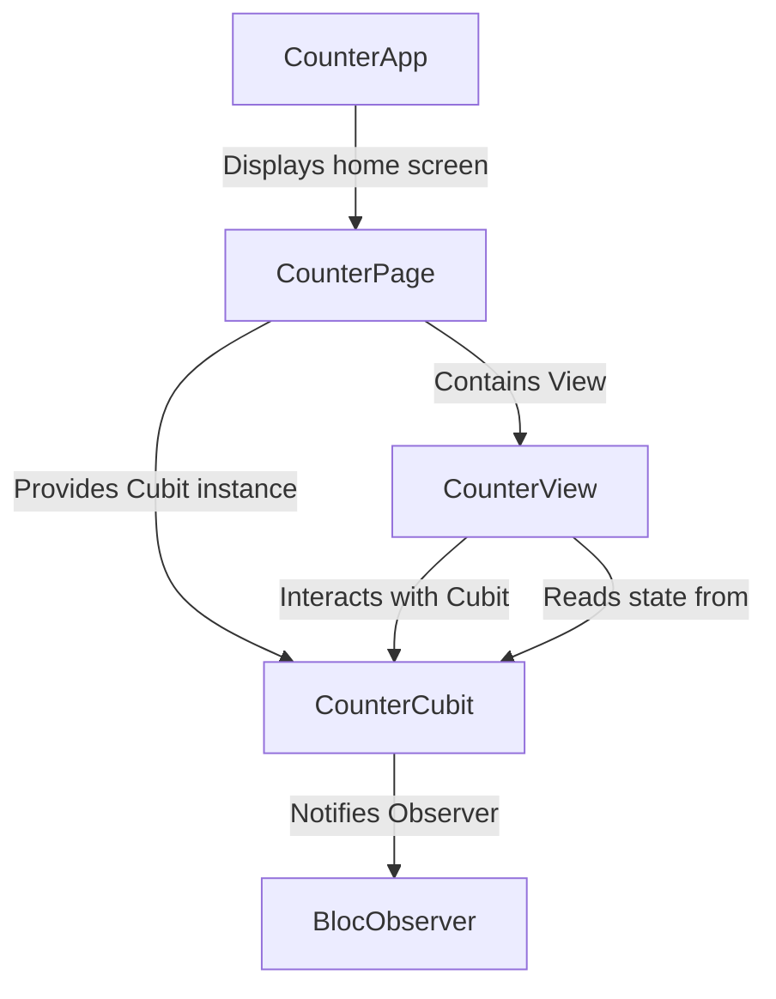

# Tutorial: flutter_counter

This Flutter project builds a simple *counter* application.
It uses a *Cubits and Blocs* pattern to manage the counter's number.
The user can see the current number and press buttons to **increase** or **decrease** it.

**Source Repository:** [None](None)

## Chapters

1. [CounterApp
](01_counterapp_.md)
2. [CounterPage
](02_counterpage_.md)
3. [CounterView
](03_counterview_.md)
4. [CounterCubit
](04_countercubit_.md)
5. [BlocObserver
](05_blocobserver_.md)

---

Generated by [AI Codebase Knowledge Builder](https://github.com/The-Pocket/Tutorial-Codebase-Knowledge)