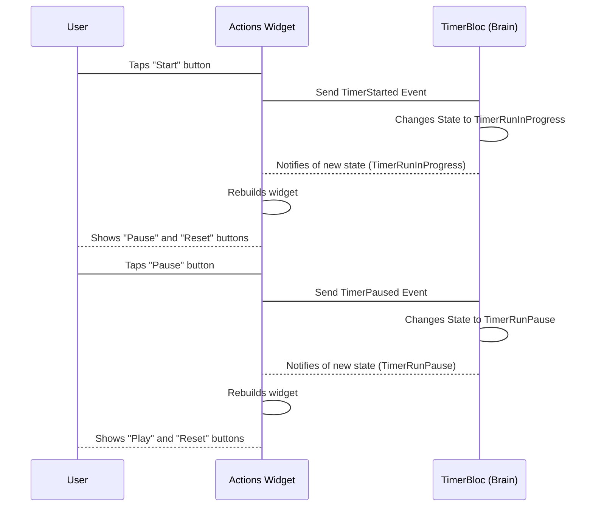

# Chapter 2: Actions (Widget)

Welcome back! In [Chapter 1: TimerPage/TimerView](01_timerpage_timerview_.md), we set up the basic screen structure for our timer app. We saw that the `TimerView` contains a special widget called `Actions`. Today, we're going to really dig into what that `Actions` widget does and why it's so important for controlling our timer.

Remember the physical timer analogy? If the `TimerView` is the face of the timer with the display and buttons, the `Actions` widget is specifically the **buttons** themselves. But not just any buttons – it's the part that makes sure you see the *right* buttons at the *right* time.

### Showing the Right Buttons

Think about our timer. When it's just starting (like when you first take it out of the box), you'd expect to see a "Start" button. Once you press start, you'd probably see "Pause" and "Reset" instead. If you pause it, you might see "Play" (to resume) and "Reset". And when the timer finishes, maybe just "Reset" to start again.

The `Actions` widget's main job is to figure out which group of buttons to show based on what the timer is currently doing (its "state"). Is it counting down? Is it paused? Is it finished?

This is where our "brain," the [TimerBloc](05_timerbloc_.md), comes in handy. The `Actions` widget doesn't decide the state itself; it *listens* to the [TimerBloc](05_timerbloc_.md)'s state and displays the buttons that match that state.

### How `Actions` Works

Let's look at the heart of the `Actions` widget. It uses something called `BlocBuilder`.

```dart
// Inside the Actions widget's build method
@override
Widget build(BuildContext context) {
  return BlocBuilder<TimerBloc, TimerState>( // 1. Watch the TimerBloc state
    buildWhen: (prev, state) => prev.runtimeType != state.runtimeType, // 2. Only rebuild when the state type changes
    builder: (context, state) { // 3. Build the buttons based on the current state
      return Row( // Arrange buttons side-by-side
        mainAxisAlignment: MainAxisAlignment.spaceEvenly, // Space them out
        children: [
          ...switch (state) { // 4. Choose which buttons to show based on state
            TimerInitial() => [
              // Buttons for the initial state
            ],
            TimerRunInProgress() => [
              // Buttons for when the timer is running
            ],
            // ... other states
          },
        ],
      );
    },
  );
}
```

Let's break this down:

1.  `BlocBuilder<TimerBloc, TimerState>`: This tells Flutter that this widget wants to "watch" our `TimerBloc` and that the state it cares about is a `TimerState` (we'll learn more about [TimerState](06_timerstate_.md) later, but for now, think of it as a variable holding the timer's current condition).
2.  `buildWhen`: This is a cool optimization. We only want to change the set of buttons when the *type* of timer state changes (like going from "running" to "paused"), not every single time the duration ticks down.
3.  `builder`: This is the part that actually builds the visual widget. It gets the current `context` (information about where this widget is in the app) and the current `state` from the `TimerBloc`.
4.  `...switch (state)`: This block is where the magic happens! It looks at the `state` and uses a `switch` statement (like asking "What case are we in?") to decide which list of buttons to create.

Let's see what buttons are shown for each state:

#### `TimerInitial` State (Just starting out)

```dart
switch (state) {
  TimerInitial() => [
    FloatingActionButton( // A nice circular button
      child: const Icon(Icons.play_arrow), // A triangle icon (play)
      onPressed: () => context // What happens when pressed
          .read<TimerBloc>() // Get the TimerBloc
          .add(TimerStarted(duration: state.duration)), // Tell it to start
    ),
  ],
  // ... other states
}
```

When the state is `TimerInitial`, we only show *one* button: a play button. When this button is pressed, we `read` the `TimerBloc` and `add` a `TimerStarted` [TimerEvent](04_timerevent_.md). This is how `Actions` tells the [TimerBloc](05_timerbloc_.md) that the user wants to start the timer.

#### `TimerRunInProgress` State (Timer is counting down)

```dart
switch (state) {
  // ... TimerInitial ...
  TimerRunInProgress() => [
    FloatingActionButton(
      child: const Icon(Icons.pause), // Pause icon
      onPressed: () {
        context.read<TimerBloc>().add(const TimerPaused()); // Tell it to pause
      },
    ),
    FloatingActionButton(
      child: const Icon(Icons.replay), // Replay icon
      onPressed: () {
        context.read<TimerBloc>().add(const TimerReset()); // Tell it to reset
      },
    ),
  ],
  // ... other states
}
```

If the state is `TimerRunInProgress` (meaning the timer is actively counting down), we show two buttons: Pause and Reset. Tapping Pause sends a `TimerPaused` event, and tapping Reset sends a `TimerReset` event to the [TimerBloc](05_timerbloc_.md).

#### `TimerRunPause` State (Timer is paused)

```dart
switch (state) {
  // ... TimerInitial, TimerRunInProgress ...
  TimerRunPause() => [
    FloatingActionButton(
      child: const Icon(Icons.play_arrow), // Play icon (to resume)
      onPressed: () {
        context.read<TimerBloc>().add(const TimerResumed()); // Tell it to resume
      },
    ),
    FloatingActionButton(
      child: const Icon(Icons.replay), // Replay icon
      onPressed: () {
        context.read<TimerBloc>().add(const TimerReset()); // Tell it to reset
      },
    ),
  ],
  // ... other states
}
```

When the timer is in the `TimerRunPause` state, we also show two buttons, but this time it's Play (to resume) and Reset. Pressing Play sends a `TimerResumed` event, and Reset sends a `TimerReset` event.

#### `TimerRunComplete` State (Timer reached 0)

```dart
switch (state) {
  // ... TimerInitial, TimerRunInProgress, TimerRunPause ...
  TimerRunComplete() => [
    FloatingActionButton(
      child: const Icon(Icons.replay), // Replay icon
      onPressed: () {
        context.read<TimerBloc>().add(const TimerReset()); // Tell it to reset
      },
    ),
  ]
}
```

Finally, if the state is `TimerRunComplete` (the timer has finished), we only show the Reset button. Tapping it sends a `TimerReset` event to get the timer ready for another go.

### The Flow: State Changes -> Button Changes

Here's a simple diagram showing how state changes in the [TimerBloc](05_timerbloc_.md) cause the `Actions` widget to update its buttons:



This diagram illustrates the core concept: the `Actions` widget *reacts* to changes in the [TimerBloc](05_timerbloc_.md)'s state. It doesn't hold the state itself; it just looks at the state provided by the [TimerBloc](05_timerbloc_.md) and draws the corresponding buttons. When a button is pressed, it doesn't change the state directly; instead, it sends a message (an event) back to the [TimerBloc](05_timerbloc_.md), telling it what the user wants to do.

You can see the full code for the `Actions` widget in the provided `lib/timer/view/timer_page.dart` file.

### Conclusion

The `Actions` widget is a great example of how we separate concerns in our app. It's only responsible for the *visual* presentation of the control buttons and sending user *actions* (button taps) to the brain ([TimerBloc](05_timerbloc_.md)). It doesn't handle the logic of counting down or managing the timer state itself. This makes our code cleaner and easier to understand.

In the next chapter, we'll explore the `TimerText` widget, which is responsible for displaying the time itself.

[Next Chapter: TimerText (Widget)](03_timertext__widget__.md)

---

Generated by [AI Codebase Knowledge Builder](https://github.com/The-Pocket/Tutorial-Codebase-Knowledge)