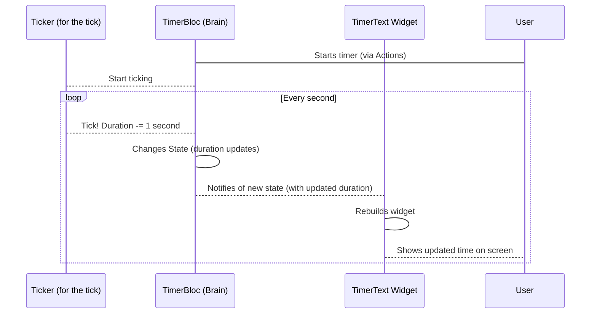

# Chapter 3: TimerText (Widget)

Welcome back! In [Chapter 1: TimerPage/TimerView](01_timerpage_timerview_.md), we saw the overall screen structure. In [Chapter 2: Actions (Widget)](02_actions__widget__.md), we learned how the buttons on our timer app decide what to show and how they tell the "brain" ([TimerBloc](05_timerbloc_.md)) what to do.

Now, let's look at the part of the screen that's arguably the most important for a timer: the display that shows the time counting down! This is handled by our `TimerText` widget.

### Seeing the Time: The Job of TimerText

Imagine looking at a digital clock. You don't see raw numbers like `180` (seconds). You see a friendly format like "03:00". The `TimerText` widget does exactly this: it takes the total number of seconds from our timer's "brain" ([TimerBloc](05_timerbloc_.md)) and turns it into a nice "minutes:seconds" string that's easy for us to read.

Its main job is simply to *display* the current duration of the timer. It doesn't manage the duration itself; it just shows whatever number the [TimerBloc](05_timerbloc_.md) tells it to display.

### How TimerText Gets the Time

Just like the `Actions` widget, the `TimerText` widget needs to know what's happening with the timer's state. It specifically cares about the `duration` property within the [TimerState](06_timerstate_.md).

To get this information and *react* when it changes, the `TimerText` widget also uses a powerful tool called `BlocConsumer` or `BlocSelector`/`context.select`. In this case, we'll use `context.select` which is a neat way to just listen to a very specific part of the state.

Here's the simplified code for the `TimerText` widget:

```dart
import 'package:flutter/material.dart';
import 'package:flutter_bloc/flutter_bloc.dart';
import 'package:flutter_timer/timer/bloc/timer_bloc.dart'; // We need the TimerBloc definition

class TimerText extends StatelessWidget {
  const TimerText({super.key});

  @override
  Widget build(BuildContext context) {
    // 1. Get the duration from the TimerBloc state
    final duration = context.select((TimerBloc bloc) => bloc.state.duration);

    // 2. Convert seconds into minutes and seconds format
    final minutesStr =
        ((duration / 60) % 60).floor().toString().padLeft(2, '0');
    final secondsStr = (duration % 60).toString().padLeft(2, '0');

    // 3. Display the formatted time
    return Text(
      '$minutesStr:$secondsStr',
      // Add styling for big text
      style: Theme.of(context)
          .textTheme
          .displayLarge /* maybe .copyWith(...) */,
    );
  }
}
```

Let's break it down:

1.  `final duration = context.select((TimerBloc bloc) => bloc.state.duration);`: This is the key line! `context.select` lets this widget "listen" specifically to the `duration` variable inside the current state of the `TimerBloc`. Whenever the `duration` changes in the [TimerBloc](05_timerbloc_.md)'s state, this widget will rebuild and update the displayed time.
2.  Formatting the Time: The code then takes the `duration` (which is in seconds) and performs some simple math to figure out the minutes and remaining seconds.
    *   `duration / 60)$: This divides the total seconds by 60 to get the total minutes (including fractions).
    *   `% 60)$: The modulo operator (`%`) gives us the remainder after dividing by 60. This gives us the remaining seconds.
    *   `.floor()`: Rounds down to the nearest whole number for the minutes.
    *   `.toString()`: Converts the numbers to text.
    *   `.padLeft(2, '0')`: This is important! It makes sure the numbers like `5` become `05` so the format is consistent (like "03:05" instead of "3:5").
3.  `return Text('$minutesStr:$secondsStr', ...);`: Finally, a standard Flutter `Text` widget is used to show the formatted string, applying a large text style to make it prominent on the screen.

So, the `TimerText` widget is like the display screen of our timer. It passively watches the timer's brain ([TimerBloc](05_timerbloc_.md)) and updates itself every time the brain says the time has changed.

### The Flow: State Changes -> Text Changes

Here's a simple diagram showing how state changes in the [TimerBloc](05_timerbloc_.md) cause the `TimerText` widget to update the time display:



This diagram shows that the `TimerText` widget doesn't cause any changes itself. It just listens to the [TimerBloc](05_timerbloc_.md) and updates its display whenever the `duration` value within the [TimerBloc](05_timerbloc_.md)'s state changes. This happens frequently when the timer is running.

You can see the full, very short code for the `TimerText` widget in the provided `lib/timer/view/timer_page.dart` file.

### Conclusion

The `TimerText` widget is a simple but crucial part of our timer app's user interface. Its sole responsibility is to display the time that it receives from the [TimerBloc](05_timerbloc_.md) in a user-friendly "minutes:seconds" format. By using `context.select`, it efficiently listens only for changes in the duration without needing to know anything else about the timer's internal workings.

We've now covered the main visual components of our timer: the overall screen (`TimerPage`/`TimerView`), the control buttons (`Actions`), and the time display (`TimerText`). But how does the timer actually *count* downwards and manage its state? That's where the core logic comes in, driven by Timer Events, States, and the Bloc itself.

In the next chapter, we'll introduce the concept of [TimerEvent](04_timerevent_.md), which are the messages our UI sends to the [TimerBloc](05_timerbloc_.md) to tell it what to do.

[Next Chapter: TimerEvent](04_timerevent_.md)

---

Generated by [AI Codebase Knowledge Builder](https://github.com/The-Pocket/Tutorial-Codebase-Knowledge)