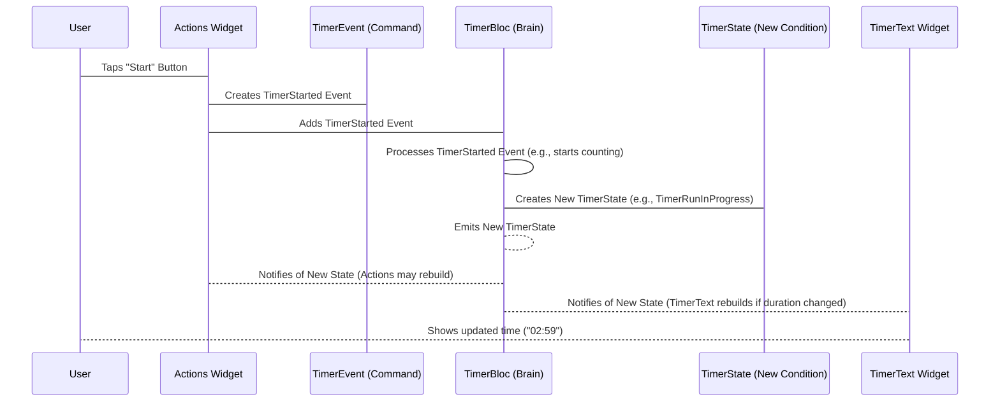

# Chapter 4: TimerEvent

Welcome back, future Flutter developer! In the last few chapters, we looked at what our timer app looks like ([Chapter 1: TimerPage/TimerView](01_timerpage_timerview_.md)), the buttons you press ([Chapter 2: Actions (Widget)](02_actions__widget_.md)), and where the time is shown ([Chapter 3: TimerText (Widget)](03_timertext__widget_.md)).

But how do the buttons (`Actions`) actually *tell* the timer to do something, like start counting, pause, or reset? They can't directly change the timer's internal working because that logic lives in the "brain," the [TimerBloc](05_timerbloc_.md).

This is where `TimerEvent` comes in!

### What is a TimerEvent? Sending Commands to the Brain

Think of the [TimerBloc](05_timerbloc_.md) as a military commander who needs instructions. You, the user, are giving these instructions by tapping buttons on the screen. A `TimerEvent` is like sending a specific **command** to the commander ([TimerBloc](05_timerbloc_.md)).

When you tap the "Start" button, the `Actions` widget doesn't just say "Start!". It sends a structured message, a `TimerStarted` event, to the [TimerBloc](05_timerbloc_.md). When you tap "Pause", it sends a `TimerPaused` event, and so on.

The [TimerBloc](05_timerbloc_.md) is constantly listening for these `TimerEvent` commands. When it receives one, it processes the command and updates the timer's state (like changing from "paused" to "running").

### The Different Commands (TimerEvents)

In our timer app, we have a few main commands you can send. Each command is represented by a different type of `TimerEvent`:

*   `TimerStarted`: "Commander! Start counting down the timer!" This event usually includes how long the timer should start with.
*   `TimerPaused`: "Commander! Stop counting for now, but remember the current time!"
*   `TimerResumed`: "Commander! Okay, you can continue counting down from where you left off!"
*   `TimerReset`: "Commander! Forget everything and set the timer back to its initial time!"
*   `_TimerTicked`: This is a special *internal* event. It's like the second hand on a clock ticking. The brain ([TimerBloc](05_timerbloc_.md)) sends this event to *itself* every second to remind itself to decrease the duration. You, the user, don't send this one!

These events are defined in a file called `timer_event.dart`.

```dart
// Inside lib/timer/bloc/timer_event.dart

part of 'timer_bloc.dart'; // This connects it to the TimerBloc file

sealed class TimerEvent {
  const TimerEvent(); // All timer events share this base
}

final class TimerStarted extends TimerEvent {
  const TimerStarted({required this.duration}); // Tells the bloc the starting duration
  final int duration;
}

final class TimerPaused extends TimerEvent {
  const TimerPaused(); // No extra info needed
}

final class TimerResumed extends TimerEvent {
  const TimerResumed(); // No extra info needed
}

class TimerReset extends TimerEvent {
  const TimerReset(); // No extra info needed
}

class _TimerTicked extends TimerEvent { // Notice the underscore - it's private!
  const _TimerTicked({required this.duration}); // Tells the bloc the new duration
  final int duration;
}
```

Let's look at this simple code:

*   `sealed class TimerEvent`: This is the base for all our commands. Think of it as the category "Timer Commands". `sealed` means all the *specific* commands must be defined in the same file.
*   `final class ... extends TimerEvent`: Each specific command (`TimerStarted`, `TimerPaused`, etc.) is defined as a `class` that "extends" `TimerEvent`. This means they *are* a type of `TimerEvent`.
*   `TimerStarted` needs a `duration` because when you start a timer, you need to know how long it should run.
*   `_TimerTicked` also needs a `duration` because it reports the new time every second. The underscore `_` at the beginning means this event is only used *inside* the `timer_bloc.dart` file and is not sent from the UI.

### Sending Events from Actions (Widget)

Now let's see how the `Actions` widget uses these events. Remember from [Chapter 2: Actions (Widget)](02_actions__widget_.md) that when you tap a button, the `onPressed` function runs:

```dart
// Simplified snippet from Actions widget
// ...
onPressed: () {
  // This line gets the TimerBloc instance
  context.read<TimerBloc>()
      // This line ADDS the event to the bloc!
      .add(const TimerPaused()); // Or TimerStarted, TimerResumed, TimerReset
},
// ...
```

This is the crucial connection! `context.read<TimerBloc>()` finds the [TimerBloc](05_timerbloc_.md) that was provided higher up in the widget tree ([Chapter 1: TimerPage/TimerView](01_timerpage_timerview_.md)). Then, `.add(...)` sends the specific `TimerEvent` command to that [TimerBloc](05_bloc_.md).

It's like pointing at the commander and saying, "Commander! Execute the 'Pause Timer' command!"

### How the TimerBloc Responds to Events

The [TimerBloc](05_timerbloc_.md) has special instructions for what to do when it receives each type of `TimerEvent`.

```dart
// Inside lib/timer/bloc/timer_bloc.dart constructor
TimerBloc(...) : ... {
  on<TimerStarted>(_onStarted); // When TimerStarted arrives, call _onStarted method
  on<TimerPaused>(_onPaused);   // When TimerPaused arrives, call _onPaused method
  on<TimerResumed>(_onResumed); // When TimerResumed arrives, call _onResumed method
  on<TimerReset>(_onReset);     // When TimerReset arrives, call _onReset method
  on<_TimerTicked>(_onTicked);   // When _TimerTicked arrives, call _onTicked method
}
```

The `on<EventType>(methodName)` lines tell the [TimerBloc](05_timerbloc_.md): "Whenever you receive a `EventType` event, run the code inside the `methodName` function." These methods (`_onStarted`, `_onPaused`, etc.) are where the actual timer logic happens (we'll explore this more in [Chapter 5: TimerBloc](05_timerbloc_.md)).

When a `TimerEvent` is received, the corresponding method is called. Inside that method, the [TimerBloc](05_timerbloc_.md) will perform the necessary actions (like starting a tick timer, pausing it) and crucially, **emit** a new [TimerState](06_timerstate_.md) to describe the timer's *new* condition.

### The Flow: User -> Event -> Bloc -> State -> UI

Here's a simplified picture of how a user action (like tapping "Start") flows through our system using a `TimerEvent`:



In this flow:

1.  You tap a button in the `Actions` widget.
2.  The `Actions` widget creates the correct `TimerEvent` (the command).
3.  The `Actions` widget sends (adds) this event to the `TimerBloc`.
4.  The `TimerBloc` receives and processes the event according to its rules (the `on` handlers).
5.  Based on the event, the `TimerBloc` decides what the new condition of the timer should be and creates a new `TimerState`.
6.  The `TimerBloc` broadcasts ("emits") this new `TimerState`.
7.  Widgets like `Actions` and `TimerText` are listening to the `TimerBloc`. When they hear about a new state, they update themselves accordingly (e.g., `Actions` shows different buttons, `TimerText` shows the new duration).

### Conclusion

`TimerEvent`s are the way our user interface (specifically the `Actions` widget) communicates with the core logic "brain," the [TimerBloc](05_timerbloc_.md). They represent the *intent* of the user – what they want the timer to *do*. By sending these clear, structured commands, we keep the UI simple (it just sends messages) and the logic centralized in the [TimerBloc](05_timerbloc_.md), which knows how to act upon these commands.

We now understand how the UI sends commands. Next, we'll dive deep into the [TimerBloc](05_timerbloc_.md) itself to see how it receives these events and uses them to manage the timer's duration and state.

[Next Chapter: TimerBloc](05_timerbloc_.md)

---

Generated by [AI Codebase Knowledge Builder](https://github.com/The-Pocket/Tutorial-Codebase-Knowledge)