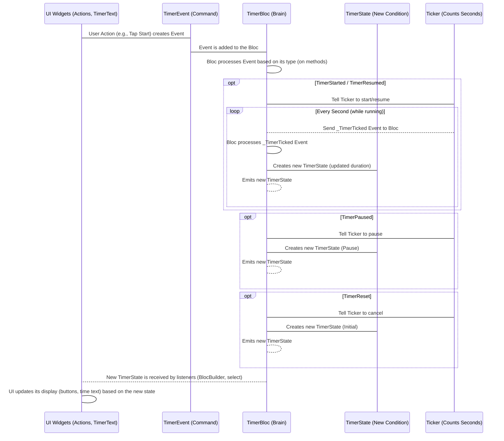

# Chapter 5: TimerBloc

Alright, welcome back! In our previous chapters, we built the look and feel of our timer: the main screen ([Chapter 1: TimerPage/TimerView](01_timerpage_timerview_.md)), the buttons ([Chapter 2: Actions (Widget)](02_actions__widget_.md)), and the time display ([Chapter 3: TimerText (Widget)](03_timertext__widget_.md)). We also learned about [TimerEvent](04_timerevent_.md)s ([Chapter 4: TimerEvent](04_timerevent_.md)), which are the "commands" our buttons send to the timer.

Now, it's time to meet the **brain** of our timer app: the `TimerBloc`. This is where all the important decisions are made and where the timer actually counts down.

### What is the TimerBloc? The Brain of the Timer

Imagine the `TimerBloc` is the central control room for our timer. It holds all the important information:

*   How much time is currently left?
*   Is the timer running, paused, or finished?

And it knows how to react to the commands ([TimerEvent](04_timerevent_.md)s) sent its way:

*   When it gets a "Start" command, it starts counting down.
*   When it gets a "Pause" command, it stops counting.
*   When it gets a "Reset" command, it sets the time back to the beginning.
*   When it gets a "_TimerTicked" event (its internal reminder), it subtracts one second from the time.

The `TimerBloc` works with a special helper called a [Ticker](07_ticker_.md) to actually count the seconds. We'll learn more about the [Ticker](07_ticker_.md) in a later chapter, but for now, think of it as the stopwatch that the `TimerBloc` tells to start and stop.

The `TimerBloc` is built using a powerful pattern called **Bloc** (Business Logic Component), which helps separate the user interface (what you see) from the business logic (how things work).

### TimerBloc's Main Responsibilities

The `TimerBloc` has two main jobs:

1.  **Manage the State:** It keeps track of the timer's current condition ([TimerState](06_timerstate_.md)). Is it just starting (`TimerInitial`)? Is it counting down (`TimerRunInProgress`)? Is it paused (`TimerRunPause`)? Has it finished (`TimerRunComplete`)? It holds the current `duration` (time left) as part of this state.
2.  **Process Events:** It listens for [TimerEvent](04_timerevent_.md)s (the commands from the UI or from itself) and updates the state accordingly.

### How TimerBloc Works: Receiving Events and Emitting States

Here's the basic cycle of the `TimerBloc`:

1.  The `TimerBloc` starts with an initial state, usually `TimerInitial` with a default duration (like 60 seconds).
2.  It waits for an event.
3.  Something happens that sends an event (like the user tapping a button, or the [Ticker](07_ticker_.md) "ticking").
4.  The `TimerBloc` receives the event.
5.  Based on the type of event and its current state, the `TimerBloc` decides what the new state should be.
6.  The `TimerBloc` *emits* (sends out) this new state.
7.  Widgets that are listening to the `TimerBloc` (like `TimerText` and `Actions`) receive the new state and update themselves to show the latest information.
8.  Go back to step 2 and wait for the next event.

Let's look at the core structure of the `TimerBloc` code:

```dart
// Inside lib/timer/bloc/timer_bloc.dart

class TimerBloc extends Bloc<TimerEvent, TimerState> {
  // Constructor: this is where the bloc is created
  TimerBloc({required Ticker ticker})
      : _ticker = ticker,
        super(const TimerInitial(_duration)) { // Start with the initial state
    // These are the handlers for each event type
    on<TimerStarted>(_onStarted);
    on<TimerPaused>(_onPaused);
    on<TimerResumed>(_onResumed);
    on<TimerReset>(_onReset);
    on<_TimerTicked>(_onTicked);
  }

  final Ticker _ticker; // Holds a reference to the Ticker helper
  static const int _duration = 60; // The initial timer duration

  StreamSubscription<int>? _tickerSubscription; // Manages the ticking

  @override
  Future<void> close() {
    // Clean up the ticker when the bloc is closed
    _tickerSubscription?.cancel();
    return super.close();
  }

  // Methods that handle specific events (explained below)
  void _onStarted(TimerStarted event, Emitter<TimerState> emit) { ... }
  void _onPaused(TimerPaused event, Emitter<TimerState> emit) { ... }
  void _onResumed(TimerResumed event, Emitter<TimerState> emit) { ... }
  void _onReset(TimerReset event, Emitter<TimerState> emit) { ... }
  void _onTicked(_TimerTicked event, Emitter<TimerState> emit) { ... }
}
```

In this code:

*   `class TimerBloc extends Bloc<TimerEvent, TimerState>`: This declares our `TimerBloc`. It inherits powerful features from the `Bloc` class. The `<TimerEvent, TimerState>` tells the Bloc that it will receive `TimerEvent`s and manage `TimerState`s.
*   `super(const TimerInitial(_duration))`: When the `TimerBloc` is created, this line tells it to start with the `TimerInitial` state, setting the initial duration to `_duration` (60 seconds).
*   `on<EventType>(_onMethod)`: These lines are the event handlers. They connect each `TimerEvent` type (like `TimerStarted`) to a specific method (`_onStarted`) that contains the logic for handling that event. The `Emitter<TimerState> emit` parameter in the handler methods is crucial – it's used to **emit** new states.
*   `_ticker`: This stores the [Ticker](07_ticker_.md) object, which helps us count down the seconds.
*   `_tickerSubscription`: When the timer is running, the `Ticker` sends out a signal every second. This subscription is like the connection cable that receives those signals. We need to manage it to start and stop the ticking.
*   `close()`: This method is called when the `TimerBloc` is no longer needed (like when the screen is closed). It's important to clean up the `_tickerSubscription` to prevent memory leaks.

### Handling Specific Events (The Logic)

Now let's briefly look at what happens inside the event handler methods (the `_on...` functions). Remember, their job is to take an event and emit a new state. The `emit` function is how the bloc tells the world its state has changed.

#### 1. Handling `TimerStarted` (`_onStarted`)

When the `TimerBloc` receives a `TimerStarted` event:

```dart
// Inside TimerBloc (lib/timer/bloc/timer_bloc.dart)
void _onStarted(TimerStarted event, Emitter<TimerState> emit) {
  emit(TimerRunInProgress(event.duration)); // 1. Change state to Running
  _tickerSubscription?.cancel();           // 2. Stop any previous ticking
  _tickerSubscription = _ticker           // 3. Start a new ticker subscription
      .tick(ticks: event.duration)
      .listen((duration) => add(_TimerTicked(duration: duration))); // 4. For each tick, add a _TimerTicked event
}
```

1.  `emit(TimerRunInProgress(event.duration))`: It immediately changes the state to `TimerRunInProgress`, setting the current duration to the one provided by the `TimerStarted` event.
2.  `_tickerSubscription?.cancel()`: It stops any existing tick timer (in case you hit Start twice).
3.  `_ticker.tick(ticks: event.duration)`: It tells the [Ticker](07_ticker_.md) to start ticking down from the specified `duration`.
4.  `.listen(...) => add(_TimerTicked(duration: duration))`: This is important! For every "tick" the [Ticker](07_ticker_.md) sends, the `TimerBloc` receives the updated `duration` and internally sends (adds) a `_TimerTicked` event to *itself*.

#### 2. Handling `_TimerTicked` (`_onTicked`)

This is the event that makes the timer count down. It's sent by the [Ticker](07_ticker_.md) (via the subscription).

```dart
// Inside TimerBloc (lib/timer/bloc/timer_bloc.dart)
void _onTicked(_TimerTicked event, Emitter<TimerState> emit) {
  emit(
    event.duration > 0
        ? TimerRunInProgress(event.duration) // 1. If time left, stay Running
        : const TimerRunComplete(),        // 2. If time is 0, change to Complete
  );
}
```

1.  `event.duration > 0 ? TimerRunInProgress(event.duration)`: If the new duration received from the [Ticker](07_ticker_.md) is greater than 0, the state is updated to `TimerRunInProgress` with the new duration. This causes the `TimerText` widget to update.
2.  `: const TimerRunComplete()`: If the duration reaches 0, the state is changed to `TimerRunComplete`.

#### 3. Handling `TimerPaused` (`_onPaused`)

```dart
// Inside TimerBloc (lib/timer/bloc/timer_bloc.dart)
void _onPaused(TimerPaused event, Emitter<TimerState> emit) {
  if (state is TimerRunInProgress) { // 1. Only pause if it's currently running
    _tickerSubscription?.pause();   // 2. Tell the ticker to pause
    emit(TimerRunPause(state.duration)); // 3. Change state to Paused
  }
}
```

1.  It first checks if the current state is `TimerRunInProgress`. You can only pause a running timer!
2.  `_tickerSubscription?.pause()`: It tells the [Ticker](07_ticker_.md) to pause its counting.
3.  `emit(TimerRunPause(state.duration))`: It changes the state to `TimerRunPause`, remembering the duration at which it was paused.

#### 4. Handling `TimerResumed` (`_onResumed`)

```dart
// Inside TimerBloc (lib/timer/bloc/timer_bloc.dart)
void _onResumed(TimerResumed resume, Emitter<TimerState> emit) {
  if (state is TimerRunPause) { // 1. Only resume if it's currently paused
    _tickerSubscription?.resume(); // 2. Tell the ticker to resume
    emit(TimerRunInProgress(state.duration)); // 3. Change state back to Running
  }
}
```

1.  It checks if the current state is `TimerRunPause`. You can only resume a paused timer!
2.  `_tickerSubscription?.resume()`: It tells the [Ticker](07_ticker_.md) to continue counting.
3.  `emit(TimerRunInProgress(state.duration))`: It changes the state back to `TimerRunInProgress`.

#### 5. Handling `TimerReset` (`_onReset`)

```dart
// Inside TimerBloc (lib/timer/bloc/timer_bloc.dart)
void _onReset(TimerReset event, Emitter<TimerState> emit) {
  _tickerSubscription?.cancel(); // 1. Stop the ticker completely
  emit(const TimerInitial(_duration)); // 2. Change state back to initial
}
```

1.  `_tickerSubscription?.cancel()`: This stops the [Ticker](07_ticker_.md) from counting, no matter what it was doing (running or paused).
2.  `emit(const TimerInitial(_duration))`: It sets the state back to `TimerInitial` with the original duration.

### The Flow: Events In, States Out

Here's a diagram showing how the `TimerBloc` acts as the central hub, receiving events and emitting states that affect the UI:



This diagram shows that the `TimerBloc` sits in the middle, reacting to events and producing states. The [Ticker](07_ticker_.md) is a dependency that helps the `TimerBloc` execute the "start" and "tick" logic.

### Conclusion

The `TimerBloc` is the core logic handler for our timer application. It receives `TimerEvent` commands, uses a [Ticker](07_ticker_.md) to manage the countdown, and updates its internal `TimerState` which it then emits for the UI to react to. By separating this logic into the `TimerBloc`, our UI widgets remain simple and focused on just displaying information and sending events. This makes our app organized and easier to manage.

We've seen how the `TimerBloc` *manages* the state by changing it. In the next chapter, we'll take a closer look at what the `TimerState` itself is and the different conditions it can represent.

[Next Chapter: TimerState](06_timerstate_.md)

---

Generated by [AI Codebase Knowledge Builder](https://github.com/The-Pocket/Tutorial-Codebase-Knowledge)