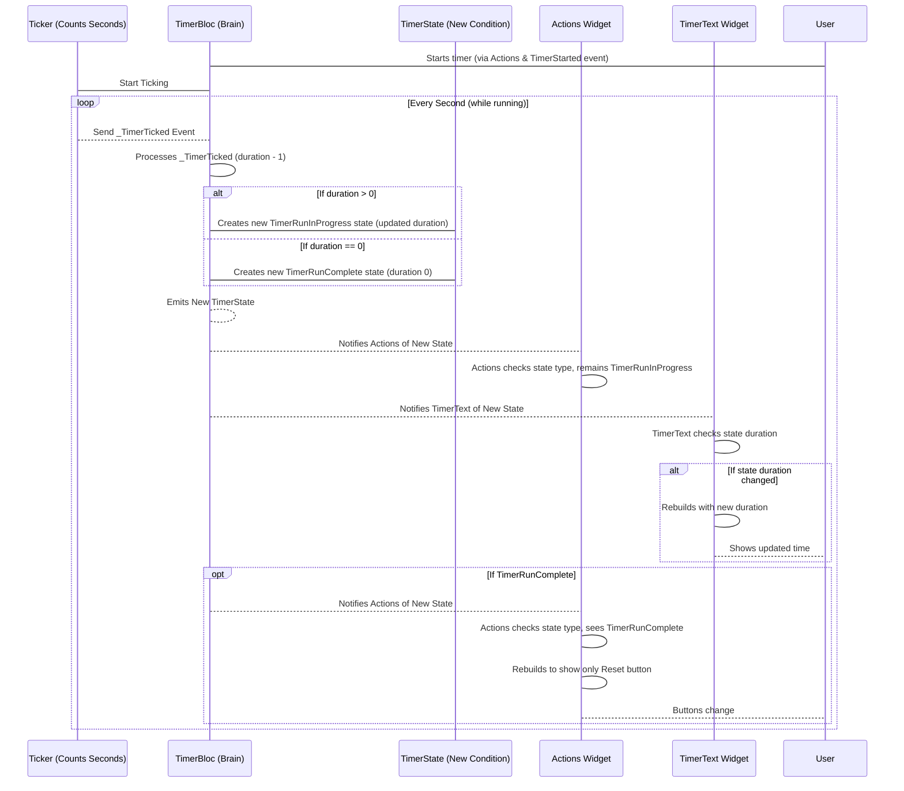

# Chapter 6: TimerState

Welcome back! In the last chapter, [Chapter 5: TimerBloc](05_timerbloc_.md), we learned about the brain of our timer application, the `TimerBloc`. We saw how it receives commands ([TimerEvent](04_timerevent_.md)s) and uses a [Ticker](07_ticker_.md) to count down.

Today, we'll focus on something the `TimerBloc` *manages*: the `TimerState`. Think of the `TimerState` as the **status message** of our timer. It tells us, and importantly, it tells our UI widgets ([Chapter 1: TimerPage/TimerView](01_timerpage_timerview_.md), [Chapter 2: Actions (Widget)](02_actions__widget_.md), [Chapter 3: TimerText (Widget)](03_timertext__widget_.md)), exactly what the timer is doing right now.

### What is TimerState? The Timer's Current Status

Imagine your phone when you're using a timer app. You see the time counting down, and the buttons change. The app knows whether it's "Running", "Paused", or if it has "Finished". This current condition is the timer's `State`.

The `TimerState` in our app serves this exact purpose. It's a piece of data that describes:

1.  **What is the timer currently doing?** (Is it waiting, running, paused, or finished?)
2.  **What is the current duration (time left)?**

Every time something important happens with the timer (like starting, pausing, or a second ticking by), the `TimerBloc` calculates the *new* status and creates a new `TimerState` to represent it. It then "emits" this new state so that interested parts of the app (like the widgets) can react.

### The Different Statuses (TimerStates)

Our timer can be in four main situations, and each is represented by a different type of `TimerState`. These are defined in the `timer_state.dart` file:

```dart
// Inside lib/timer/bloc/timer_state.dart

part of 'timer_bloc.dart'; // Connects it to the TimerBloc file

sealed class TimerState extends Equatable { // Base for all statuses
  const TimerState(this.duration); // All states know the current duration
  final int duration; // The time left in seconds

  @override
  List<Object> get props => [duration]; // Helps Bloc know when the state *really* changed
}

final class TimerInitial extends TimerState { // 1. Waiting to start
  const TimerInitial(super.duration);
  // ... formatting for printing the state ...
}

final class TimerRunPause extends TimerState { // 2. Temporarily stopped
  const TimerRunPause(super.duration);
    // ... formatting ...
}

final class TimerRunInProgress extends TimerState { // 3. Actively counting down
  const TimerRunInProgress(super.duration);
    // ... formatting ...
}

final class TimerRunComplete extends TimerState { // 4. Reached zero
  const TimerRunComplete() : super(0); // Duration is 0 when complete
    // ... formatting ...
}
```

Let's break down these statuses:

1.  **`TimerInitial`**: This is the very first state when the timer starts. It's like taking a fresh timer out of the box. It knows the *starting* duration, but it's not counting down yet.
2.  **`TimerRunPause`**: The timer was counting down but is now temporarily stopped. It remembers how much time was left when it was paused.
3.  **`TimerRunInProgress`**: The timer is actively counting down, second by second. This state holds the current duration remaining.
4.  **`TimerRunComplete`**: The timer has successfully reached zero seconds!

Notice that *all* these states inherit from a base `TimerState` class and *all* of them have a `duration` property. This is important because both our `TimerText` ([Chapter 3: TimerText (Widget)](03_timertext__widget_.md)) and `Actions` ([Chapter 2: Actions (Widget)](02_actions__widget_.md)) widgets need access to the current duration and the state type.

*   `sealed class TimerState`: Like `TimerEvent`, this means all the distinct state types are defined in this one file.
*   `const TimerState(this.duration)`: This constructor in the base class ensures that every state *must* have a duration associated with it.
*   `final class ... extends TimerState`: Each specific state is a class inheriting from `TimerState`.
*   `TimerRunComplete() : super(0)`: The `TimerRunComplete` state always sets its duration to 0, since the countdown is finished.

### How Widgets Use TimerState

Our UI widgets don't *change* the `TimerState`; they *listen* to the `TimerBloc` and read the current `TimerState` to know what to show.

#### TimerText and TimerState

The `TimerText` widget only cares about one thing from the state: the `duration`.

```dart
// Inside TimerText widget (lib/timer/view/timer_page.dart)
@override
Widget build(BuildContext context) {
  // This line reads the 'duration' property from the current TimerBloc state
  final duration = context.select((TimerBloc bloc) => bloc.state.duration);

  // ... rest of the code formats and displays the duration ...
  return Text('$minutesStr:$secondsStr', ...);
}
```

As we saw in [Chapter 3: TimerText (Widget)](03_timertext__widget_.md), `context.select` is used to specifically listen for changes to `bloc.state.duration`. Whenever the `TimerBloc` emits a new state *and* that new state's `duration` is different, the `TimerText` widget rebuilds itself to show the updated time. It doesn't need to know *which type* of state it is (Initial, InProgress, etc.), just the duration.

#### Actions (Widget) and TimerState

The `Actions` widget, on the other hand, cares about *both* the type of state *and* sometimes the duration (for the initial "Start" button).

```dart
// Inside Actions widget (lib/timer/view/timer_page.dart)
@override
Widget build(BuildContext context) {
  return BlocBuilder<TimerBloc, TimerState>(
    buildWhen: (prev, state) => prev.runtimeType != state.runtimeType, // Rebuild mainly when state TYPE changes
    builder: (context, state) {
      return Row(
        children: [
          ...switch (state) { // The 'switch' checks the state's TYPE
            TimerInitial() => [
              // Show Start button
              FloatingActionButton(
                onPressed: () => context
                    .read<TimerBloc>()
                    .add(TimerStarted(duration: state.duration)), // Uses initial duration
                child: const Icon(Icons.play_arrow),
              ),
            ],
            TimerRunInProgress() => [
              // Show Pause and Reset buttons
              // ...
            ],
            TimerRunPause() => [
              // Show Play and Reset buttons
              // ...
            ],
            TimerRunComplete() => [
              // Show Reset button
              // ...
            ]
          },
        ],
      );
    },
  );
}
```

As discussed in [Chapter 2: Actions (Widget)](02_actions__widget_.md), the `BlocBuilder` provides the current `state` object. The `switch (state)` statement looks at the specific *type* of `TimerState` (e.g., `TimerInitial`, `TimerRunInProgress`) and then displays the corresponding buttons. When in the `TimerInitial` state, it accesses `state.duration` to know the starting value to send in the `TimerStarted` event.

This is a powerful concept: the UI widgets are "reactive". They simply update themselves whenever the *state* of the underlying logic (`TimerBloc`) changes. They don't need to contain complex logic about *when* to change buttons; the `TimerBloc` updates the state, and the `Actions` widget automatically displays the correct buttons for that state.

### How the TimerBloc Changes TimerState

The `TimerBloc` is the *only* part of our app that is allowed to create and "emit" new `TimerState` objects. This happens inside the event handler methods we saw in [Chapter 5: TimerBloc](05_timerbloc_.md). Each handler (`_onStarted`, `_onTicked`, etc.) uses the `emit` function to broadcast the new status.

```dart
// Inside TimerBloc's _onStarted method (lib/timer/bloc/timer_bloc.dart)
void _onStarted(TimerStarted event, Emitter<TimerState> emit) {
  // ... before emitting ...
  emit(TimerRunInProgress(event.duration)); // <-- Creating and emitting a new TimerRunInProgress state
  // ... after emitting ...
}

// Inside TimerBloc's _onTicked method (lib/timer/bloc/timer_bloc.dart)
void _onTicked(_TimerTicked event, Emitter<TimerState> emit) {
  emit(
    // Creating and emitting either TimerRunInProgress or TimerRunComplete
    event.duration > 0
        ? TimerRunInProgress(event.duration)
        : const TimerRunComplete(),
  );
}

// Inside TimerBloc's _onPaused method (lib/timer/bloc/timer_bloc.dart)
void _onPaused(TimerPaused event, Emitter<TimerState> emit) {
  if (state is TimerRunInProgress) {
    // ... before emitting ...
    emit(TimerRunPause(state.duration)); // <-- Creating and emitting a new TimerRunPause state
  }
}

// And so on for _onResumed and _onReset...
```

The `TimerBloc`'s responsibility is to calculate the *next* appropriate state after processing an event and then emit that new state.

### The Flow: Bloc Changes State -> UI Reacts to State

Here's a sequence showing how the `TimerBloc` changing the `TimerState` impacts the UI:



This shows that the `TimerState` emitted by the `TimerBloc` is the trigger for the UI to update. The `Actions` widget reacts primarily to the *type* of state, while the `TimerText` widget reacts primarily to the `duration` within the state.

### Conclusion

`TimerState` represents the different life stages or conditions of our timer (Initial, Running, Paused, Complete). It holds not just the status but also the crucial piece of information: the current duration. The `TimerBloc` is responsible for managing and emitting these states, while our UI widgets listen to the `TimerBloc` and automatically update their appearance and behavior based on the current `TimerState`. This separation of concerns, powered by Bloc, makes our timer app's logic and UI easy to reason about.

We've now seen how the internal state is represented. In the next chapter, we'll look at the final piece of the puzzle: the [Ticker](07_ticker_.md), which is the simple component that actually performs the second-by-second countdown.

[Next Chapter: Ticker](07_ticker_.md)

---

Generated by [AI Codebase Knowledge Builder](https://github.com/The-Pocket/Tutorial-Codebase-Knowledge)