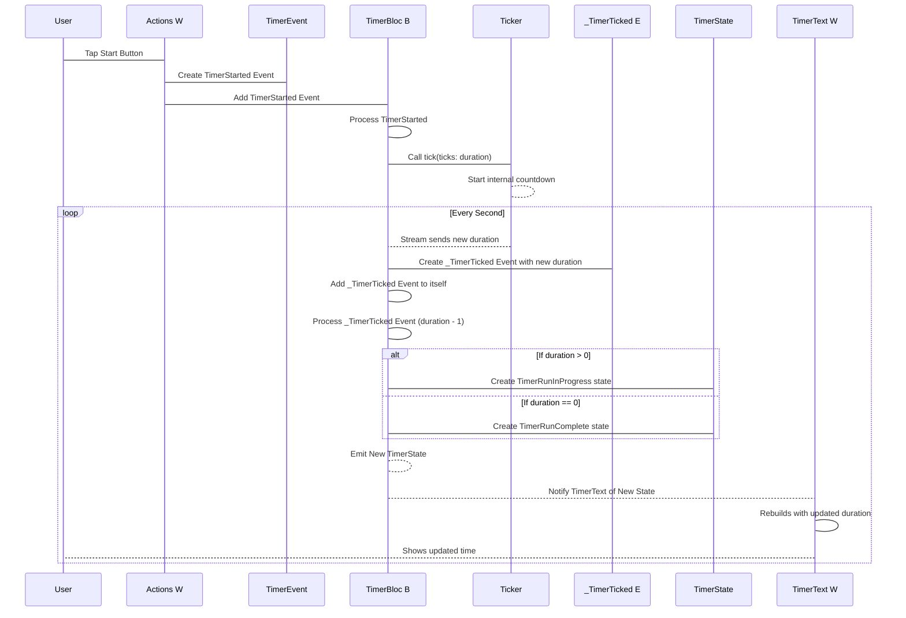

# Chapter 7: Ticker

Welcome back! We've reached the final piece of our timer puzzle. In the previous chapters, we built the user interface ([Chapter 1: TimerPage/TimerView](01_timerpage_timerview_.md)), added buttons that send commands ([Chapter 2: Actions (Widget)](02_actions__widget_.md) and [Chapter 4: TimerEvent](04_timerevent_.md)), and created the brain that manages the timer's status ([Chapter 5: TimerBloc](05_timerbloc_.md) and [Chapter 6: TimerState](06_timerstate_.md)).

But there's one last question: How does the `TimerBloc` actually know when a second has passed so it can count down? It needs a way to receive a signal, like a clock ticking, every second. This is where the `Ticker` comes in!

### What is a Ticker? The Simple Clock

Imagine a old-school mechanical timer or even an old clock with a loud "tick-tock" sound. The `Ticker` in our app is very similar. It's a simple component whose only job is to **count down** and let whoever is listening know when each second has passed.

It doesn't know about buttons, states, or durations in the complex way the [TimerBloc](05_timerbloc_.md) does. You just tell the `Ticker` to start counting from a specific number, and it will "tick" for you every second until it reaches zero.

The `TimerBloc` is the one that tells the `Ticker` when to start and stop ticking. When the `Ticker` ticks, it sends a message back to the `TimerBloc`, which then updates the timer's state and duration.

### How the Ticker Works

The `Ticker` provides a special kind of data stream called a `Stream`. Think of a `Stream` like a conveyor belt that carries items (in this case, numbers representing the remaining seconds) over time. The `Ticker` puts a new number on the conveyor belt every second.

Here's what the `Ticker` code looks like:

```dart
// Inside lib/ticker.dart

class Ticker {
  const Ticker(); // It doesn't need any special setup

  // This method starts the ticking
  Stream<int> tick({required int ticks}) {
    // Creates a stream that sends a value every second
    return Stream.periodic(const Duration(seconds: 1), (x) => ticks - x - 1)
        // Only take 'ticks' number of values
        .take(ticks);
  }
}
```

Let's break down the `tick` method:

*   `Stream<int> tick({required int ticks})`: This method is called `tick`. It takes one input: `ticks`, which is the starting number of seconds to count down from. It returns a `Stream` which will give us `int` (whole number) values.
*   `Stream.periodic(const Duration(seconds: 1), ...)`: This is powerful! It creates a `Stream` that automatically sends a new value *periodically* (over and over again). We tell it `const Duration(seconds: 1)`, which means "send a value every 1 second".
*   `(x) => ticks - x - 1`: This is how the value sent each second is calculated.
    *   `x` is a counter that starts at 0 for the first tick, then 1 for the second, 2 for the third, and so on.
    *   `ticks - x - 1`: Let's say you start with `ticks: 10`.
        *   After 1 second (`x` is 0): `10 - 0 - 1` = 9. (The first tick reports 9 seconds left).
        *   After 2 seconds (`x` is 1): `10 - 1 - 1` = 8. (The second tick reports 8 seconds left).
        *   ...and so on. This formula correctly gives us the *remaining* seconds each time.
*   `.take(ticks)`: This tells the `Stream` to stop after it has sent `ticks` number of values. So, if you start with `ticks: 10`, it will send 10 values (9, 8, 7, ... 0) and then stop automatically.

So, when the `TimerBloc` calls `_ticker.tick(ticks: 60)`, the `Ticker` starts its internal clock and sends the numbers 59, 58, 57, ... all the way down to 0, once every second.

### How the TimerBloc Uses the Ticker

The `TimerBloc` needs to **listen** to the `Stream` provided by the `Ticker`. When the `Ticker` sends a new number, the `TimerBloc` needs to receive it and do something with it.

Remember this part of the `_onStarted` method in the `TimerBloc`?

```dart
// Inside TimerBloc's _onStarted method (lib/timer/bloc/timer_bloc.dart)
void _onStarted(TimerStarted event, Emitter<TimerState> emit) {
  emit(TimerRunInProgress(event.duration));
  _tickerSubscription?.cancel(); // Cancel previous listener
  _tickerSubscription = _ticker // Get the Ticker
      .tick(ticks: event.duration) // Start the tick stream
      .listen( // START LISTENING TO THE STREAM
          (duration) => add(_TimerTicked(duration: duration)) // When a new duration arrives from the Ticker, send a _TimerTicked event to ourselves
      );
}
```

When the `TimerBloc` starts the timer (receives a `TimerStarted` event), it does two important things with the `Ticker`:

1.  `_ticker.tick(ticks: event.duration)`: It tells the `_ticker` instance to start its countdown Stream, starting from the `duration` specified in the event.
2.  `.listen(...)`: This is where the `TimerBloc` connects to the `Ticker`'s Stream. It's like plugging into the conveyor belt.
3.  `(duration) => add(_TimerTicked(duration: duration))`: This is what happens *every time* the `Ticker` sends a new number (a new `duration`) on its Stream. The `TimerBloc` takes that new `duration` and immediately sends a `_TimerTicked` event (`add(...)`) to itself!

So, the `Ticker` doesn't directly update the state. It's a simple helper that provides the countdown numbers. The `TimerBloc` listens to these numbers and uses them to trigger its own internal `_TimerTicked` event, which then leads to the state being updated.

### The Flow: Ticker to Bloc to State

Here's how the `Ticker` fits into the overall flow:



In this diagram:

1.  The user starts the timer via the UI (`Actions`).
2.  This sends a `TimerStarted` event to the `TimerBloc`.
3.  The `TimerBloc` receives the event and tells the `Ticker` to start ticking.
4.  The `Ticker` counts down internally and sends a new number on its Stream *every second*.
5.  The `TimerBloc` is *listening* to that Stream. When it receives a number, it creates and adds a `_TimerTicked` event to itself.
6.  The `TimerBloc` processes the `_TimerTicked` event, decreases the duration in its state, and emits a new `TimerState`.
7.  The `TimerText` widget sees the new `TimerState` (with the updated duration) and updates the display.

The `Ticker` is a very focused tool – it just provides the stream of numbers. The `TimerBloc` uses this stream as its timing mechanism to drive the state changes.

### Conclusion

The `Ticker` is a simple but essential piece that provides the timing for our timer. It acts like a basic countdown clock, sending a new number every second via a `Stream`. The `TimerBloc` listens to this `Stream` and uses the incoming numbers (`duration`) to trigger internal events (`_TimerTicked`) which then lead to the `TimerBloc` updating and emitting new `TimerState`s. This layered approach, with the `Ticker` providing low-level timing, the `TimerBloc` managing logic and state, and the UI reacting to the state, is a core principle of building structured applications like this.

We have now explored all the main concepts in our `flutter_timer` project! You've learned how the different parts (Pages, Widgets, Events, States, Bloc, and Ticker) work together to create a functional and well-organized timer application.

This concludes the tutorial for the `flutter_timer` project. Great job completing it!

---

Generated by [AI Codebase Knowledge Builder](https://github.com/The-Pocket/Tutorial-Codebase-Knowledge)