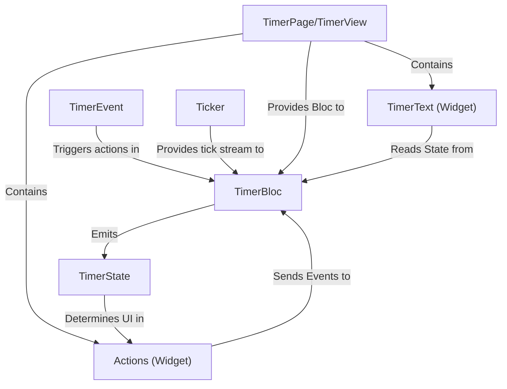

# Tutorial: flutter_timer

This project is a simple **timer** application built with Flutter.
It **counts down** from a set time, allowing you to **start**, **pause**, **resume**, and **reset** it using on-screen buttons.
The timer's state and actions are managed by a central "brain" that uses a "clock" to keep track of the passing seconds and updates the display.

**Source Repository:** [None](None)

## Chapters

1. [TimerPage/TimerView
](01_timerpage_timerview_.md)
2. [Actions (Widget)
](02_actions__widget__.md)
3. [TimerText (Widget)
](03_timertext__widget__.md)
4. [TimerEvent
](04_timerevent_.md)
5. [TimerBloc
](05_timerbloc_.md)
6. [TimerState
](06_timerstate_.md)
7. [Ticker
](07_ticker_.md)

---

Generated by [AI Codebase Knowledge Builder](https://github.com/The-Pocket/Tutorial-Codebase-Knowledge)