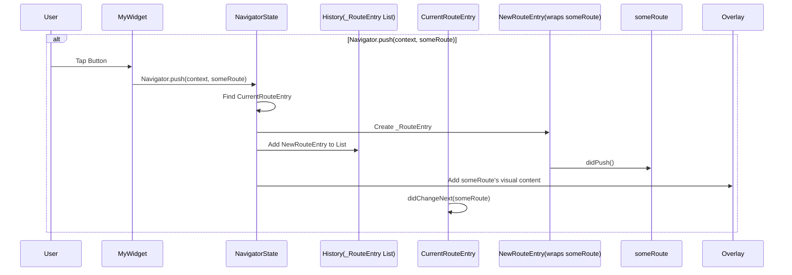
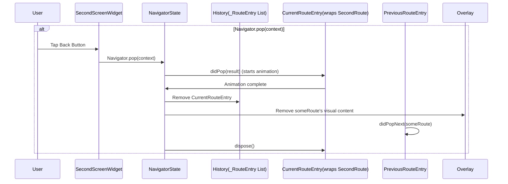

# Chapter 2: Route

Welcome back to our Flutter navigation journey! In the last chapter, [Chapter 1: Navigator](01_navigator_.md), we learned that the `Navigator` is like a stack of cards, and it helps us move between different screens in our app using `push` and `pop`. But what *are* those cards? This chapter is all about the cards themselves: the `Route`.

Think of a **Route** as the recipe for a single screen or "page" in your app. It's not the screen itself, but rather an instruction set for the `Navigator` on *how* to display that screen and manage its lifecycle.

Imagine our simple app from the last chapter again:

```
Home Screen (Screen 1 - Tap button to go to Screen 2)
  |
  | -- represents navigating --
  |    (managed by Navigator)
  |
Second Screen (Screen 2 - Tap button to go back)
```

Each of these screens, "Home Screen" and "Second Screen," is represented by a `Route` in Flutter. When you `push` something onto the `Navigator`, you're essentially putting a `Route` object on top of the stack. When you `pop`, you're removing the top `Route`.

## What does a Route do?

A `Route` object holds all the information the `Navigator` needs to manage a screen, such as:

*   **What widget to display:** This is the actual visual content of your screen (we'll often call this the "page").
*   **How it animates:** When a `Route` is pushed or popped, it usually comes with a transition animation (like sliding or fading). The `Route` helps define this.
*   **Whether it can be popped:** Does hitting the back button or calling `pop` on this screen work? Some routes might say "no."
*   **What value it returns:** Remember how we mentioned routes can return a result when popped? The `Route` facilitates this.

In short, the `Route` is the abstract idea of a navigable entry in your app's history, managed by the `Navigator`.

## Our First Route in Action

In [Chapter 1: Navigator](01_navigator_.md), we used `MaterialPageRoute`. Let's look at that snippet again:

```dart
Navigator.push(
  context,
  MaterialPageRoute(builder: (context) => SecondScreen()), // This is our Route!
);
```

Here, `MaterialPageRoute` is a concrete type of `Route`. It's a pre-built recipe that knows how to create a full-screen mobile-platform-style animated transition.

The important part for the `Route` itself is the `builder` property.

```dart
MaterialPageRoute(
  builder: (BuildContext context) {
    // This function builds the widget for your screen (the "page")
    return SecondScreen();
  }
)
```

The `builder` is a function that takes a `BuildContext` and returns the widget tree for the screen this `Route` represents. So, our `SecondScreen` widget is the actual visual content, and the `MaterialPageRoute` is the `Route` object telling the `Navigator` how to handle that content.

Let's simplify the `SecondScreen` for clarity:

```dart
import 'package:flutter/material.dart';

class SecondScreen extends StatelessWidget {
  const SecondScreen({super.key});

  @override
  Widget build(BuildContext context) {
    return Scaffold(
      appBar: AppBar(
        title: const Text('Second Screen'),
      ),
      body: Center(
        child: ElevatedButton(
          onPressed: () {
            // This uses the Navigator to pop this Route off the stack
            Navigator.pop(context);
          },
          child: const Text('Go Back!'),
        ),
      ),
    );
  }
}
```

And our first screen:

```dart
import 'package:flutter/material.dart';
import 'second_screen.dart'; // Import our second screen

class HomeScreen extends StatelessWidget {
  const HomeScreen({super.key});

  @override
  Widget build(BuildContext context) {
    return Scaffold(
      appBar: AppBar(
        title: const Text('Home Screen'),
      ),
      body: Center(
        child: ElevatedButton(
          onPressed: () {
            // Push the MaterialPageRoute onto the Navigator
            Navigator.push(
              context,
              MaterialPageRoute(builder: (context) => const SecondScreen()),
            );
          },
          child: const Text('Go to Second Screen'),
        ),
      ),
    );
  }
}
```

In this setup:

*   `HomeScreen` is a widget.
*   `SecondScreen` is the widget that visually represents the content of our second route.
*   `MaterialPageRoute` is the `Route` instance that contains the `SecondScreen` widget recipe (`builder`) and tells the `Navigator` how to animate and manage this page.

## Route Settings

Every `Route` also has `settings`. These are like extra details about the `Route`. The most common piece of `settings` you'll encounter is the `name`.

```dart
MaterialPageRoute(
  settings: const RouteSettings(name: '/secondScreen'), // Add a name
  builder: (context) => const SecondScreen(),
);
```

Assigning a `name` allows you to navigate to routes using their name (which is super useful for larger apps), like with `Navigator.pushNamed`. We saw this briefly in [Chapter 1: Navigator](01_navigator_.md).

Let's look at a code snippet from Flutter's `navigator.dart` file that defines `RouteSettings`:

```dart
/// Data that might be useful in constructing a [Route].
@immutable
class RouteSettings {
  /// Creates data used to construct routes.
  const RouteSettings({this.name, this.arguments});

  /// The name of the route (e.g., "/settings").
  ///
  /// If null, the route is anonymous.
  final String? name;

  /// The arguments passed to this route.
  ///
  /// May be used when building the route, e.g. in [Navigator.onGenerateRoute].
  final Object? arguments;

  @override
  String toString() =>
      '${objectRuntimeType(this, 'RouteSettings')}(${name == null ? 'none' : '"$name"'}, $arguments)';
}
```

This confirms that `RouteSettings` holds an optional `name` and optional `arguments`. We'll learn more about arguments and how they're used with named routes in later chapters.

## How Routes Interact with the Navigator Internals (Simplified)

We saw in [Chapter 1: Navigator](01_navigator_.md) a simplified diagram of how the `Navigator` manages its `_history` list. Let's refine that slightly to show where the `Route` fits in.

Imagine the `NavigatorState` has a list of internal entries, let's call them `_RouteEntry`. Each `_RouteEntry` wraps a `Route` object and keeps track of its internal state (is it animating? is it visible? etc.).

When you call `Navigator.push(context, someRoute)`:

1.  The `NavigatorState` finds the top visible `_RouteEntry` in its `_history` list.
2.  It creates a new `_RouteEntry` wrapping your `someRoute`.
3.  This new `_RouteEntry` is conceptually added to the end of the `_history` list.
4.  The `NavigatorState` tells the new route it's being pushed (`route.didPush()`).
5.  The new route gets added to the `Overlay` (which is where actual widgets live) and starts its entry animation.
6.  The previous top route is told that a new route is above it (`previousRoute.didChangeNext(newRoute)`).
7.  Once the animation finishes, the new route's internal state is updated to `idle`.



When you call `Navigator.pop(context)`:

1.  The `NavigatorState` finds the top visible `_RouteEntry`.
2.  It tells that route it's being popped (`route.didPop(result)`). The route performs its exit animation.
3.  Once the animation is done, the `_RouteEntry` is marked for final removal.
4.  The `NavigatorState` removes the `_RouteEntry` and its content from the `_history` list and the `Overlay`.
5.  The route that's now at the top is told that the route above it has been popped (`newTopicRoute.didPopNext(poppedRoute)`).
6.  Finally, the popped `Route` object is fully disposed.



Notice that the actual `Route` object (like our `MaterialPageRoute`) exists independently of the `_RouteEntry`. The `_RouteEntry` is the `Navigator`'s internal bookkeeper for that specific `Route` within its stack.

## Code Snippet: The Abstract `Route` Class

Let's look at the abstract definition of `Route` in `navigator.dart`. This is what all specific route types like `MaterialPageRoute` are built upon.

```dart
/// An abstraction for an entry managed by a [Navigator].
abstract class Route<T> extends _RoutePlaceholder {
  /// Initialize the [Route].
  Route({RouteSettings? settings, bool? requestFocus})
    : _settings = settings ?? const RouteSettings(),
      _requestFocus = requestFocus {
    // ... memory allocation logging ...
  }

  // The settings for this route (name, arguments)
  RouteSettings get settings;

  // Called when the route is inserted into the navigator.
  @protected
  @mustCallSuper
  void install() {}

  // Called after install when the route is pushed onto the navigator.
  @protected
  @mustCallSuper
  TickerFuture didPush() { /* ... */ }

  // Called after install when the route is added without transition.
  @protected
  @mustCallSuper
  void didAdd() { /* ... */ }

  // Called after install when the route replaced another.
  @protected
  @mustCallSuper
  void didReplace(Route<dynamic>? oldRoute) {}

  // Returns whether calling Navigator.maybePop should do anything.
  @Deprecated('Use popDisposition instead.')
  Future<RoutePopDisposition> willPop() async { /* ... */ }

  // Returns whether calling Navigator.maybePop should do anything.
  RoutePopDisposition get popDisposition { /* ... */ }

  // Called after a route pop was handled.
  @mustCallSuper
  void onPopInvokedWithResult(bool didPop, T? result) { /* ... */ }

  // Returns the result to use if Navigator.pop is called with null.
  T? get currentResult => null;

  // A future that completes when this route is popped.
  Future<T?> get popped;

  // A request was made to pop this route. Returns true if the navigator should pop.
  @mustCallSuper
  bool didPop(T? result) { /* ... */ }

  // The route was popped or is being removed.
  @protected
  @mustCallSuper
  void didComplete(T? result) { /* ... */ }

  // The route above this one was popped.
  @protected
  @mustCallSuper
  void didPopNext(Route<dynamic> nextRoute) {}

  // This route's next route changed.
  @protected
  @mustCallSuper
  void didChangeNext(Route<dynamic>? nextRoute) {}

  // This route's previous route changed.
  @protected
  @mustCallSuper
  void didChangePrevious(Route<dynamic>? previousRoute) {}

  // Called when the internal state of the route has changed.
  @protected
  @mustCallSuper
  void changedInternalState() {}

  // Called when the Navigator's external state has changed.
  @protected
  @mustCallSuper
  void changedExternalState() {}

  // Discards resources used by the object.
  @mustCallSuper
  @protected
  void dispose() { /* ... */ }

  // Whether this route is the top-most route.
  bool get isCurrent;

  // Whether this route is the bottom-most route.
  bool get isFirst;

  // Whether this route is on the navigator.
  bool get isActive;

  // ... other properties and methods ...
}
```

This abstract class shows the core methods that any `Route` implementation (like `MaterialPageRoute`) must handle. Things like `didPush`, `didPop`, `didComplete`, and interaction methods like `isCurrent` and `isFirst` are all defined here. This provides a consistent interface for the `Navigator` to interact with any type of `Route`.

## Conclusion

In this chapter, we zoomed in on the `Route`, understanding it as the "recipe" for a screen that the `Navigator` uses to manage the app's history stack. We saw how a `Route` defines not just the visual content but also how it interacts with the `Navigator`, including animations and pop behavior. We looked at `MaterialPageRoute` as a common example and explored the base `Route` class definition.

Now that we understand the building blocks of navigation (`Navigator` and `Route`), we'll look at the little helper object, `RouteSettings`, in more detail and see how it facilitates things like named routes and passing data in the next chapter.

[Chapter 3: RouteSettings](03_routesettings_.md)

---

Generated by [AI Codebase Knowledge Builder](https://github.com/The-Pocket/Tutorial-Codebase-Knowledge)