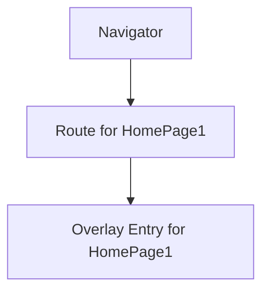
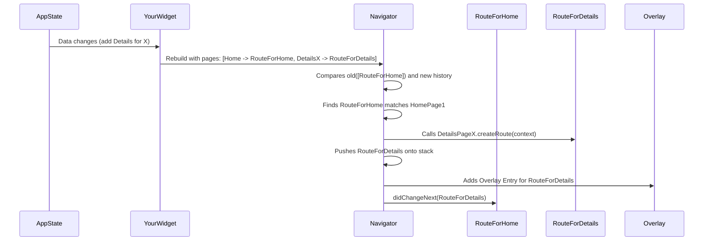
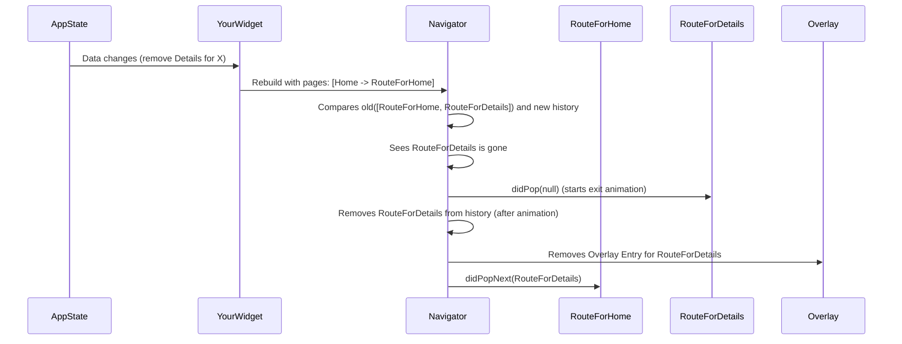
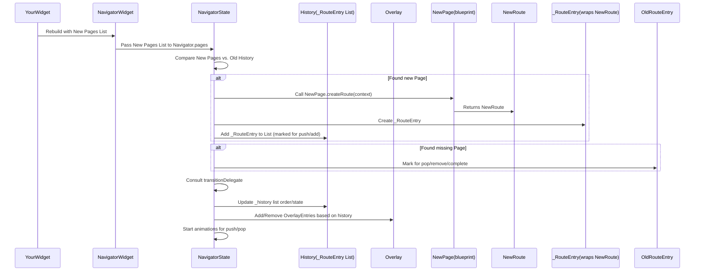

# Chapter 4: Page

Welcome back to our tour of Flutter navigation! In the previous chapters, we explored the [Navigator](01_navigator_.md) (our screen manager) and the [Route](02_route_.md) (the recipe for a screen, often with a name and arguments via [RouteSettings](03_routesettings_.md)).

So far, we've been using the "imperative" style of navigation. This means we tell the [Navigator](01_navigator_.md) exactly what to do with method calls like `push` and `pop`.

Now, let's introduce a more "declarative" way to handle navigation, especially when your app's history is driven by data. This is where the **Page** comes in.

## What is a Page?

Think of a **Page** as a blueprint for a [Route](02_route_.md).

Instead of telling the [Navigator](01_navigator_.md), "Okay, now `push` this specific [Route](02_route_.md)," you can give the [Navigator](01_navigator_.md) a **list of Page objects**. The [Navigator](01_navigator_.md) then looks at this list and figures out what [Route](02_route_.md)s it needs to build, add, remove, or update to match the list you provided.

This is particularly powerful when your app's state naturally lends itself to being represented as a list of active screens.

Let's consider a practical example: building a dynamic list of screens based on user interactions or data from the internet. Imagine a simple app that shows a list of items, and tapping an item adds a detail screen for that item to the navigation stack.

Using the imperative style, you'd manage a list of routes yourself and call `push` and `pop`. With the Page-based approach, you would manage a `List<Page>` and provide it to the [Navigator](01_navigator_.md).

## Page vs. RouteSettings

You might notice that `Page` sounds a lot like [RouteSettings](03_routesettings_.md) because they both hold information about a screen. In fact, `Page` is a specific *type* of [RouteSettings](03_routesettings_.md)!

Looking back at the definition of `Page` in `navigator.dart` (which we saw briefly in the previous chapters):

```dart
// From packages/flutter/lib/src/widgets/navigator.dart

/// Describes the configuration of a [Route].
///
/// The type argument `T` is the corresponding [Route]'s return type, as
/// used by [Route.currentResult], [Route.popped], and [Route.didPop].
///
/// ... (comments omitted for brevity)
abstract class Page<T> extends RouteSettings { // <-- Extends RouteSettings!
  /// Creates a page and initializes [key] for subclasses.
  const Page({
    this.key,
    super.name, // <-- Inherits name from RouteSettings
    super.arguments, // <-- Inherits arguments from RouteSettings
    this.restorationId,
    this.canPop = true,
    this.onPopInvoked = _defaultPopInvokedHandler,
  });

  // ... other properties specific to Page ...

  /// Creates the [Route] that corresponds to this page.
  ///
  /// The created [Route] must have its [Route.settings] property set to this [Page].
  @factory
  Route<T> createRoute(BuildContext context);

  // ... rest of the class ...
}
```

So, a `Page` *is* [RouteSettings](03_routesettings_.md), but it adds extra capabilities essential for this declarative style:

1.  **`key`:** Used for identifying pages when the list changes (similar to how keys are used in Flutter lists).
2.  **`createRoute`:** This is the crucial part! It's a method that knows how to create the actual [Route](02_route_.md) object (like `MaterialPageRoute`) that the [Navigator](01_navigator_.md) will put on its stack.

When you provide the [Navigator](01_navigator_.md) with a `List<Page>`, it iterates through the list. For each `Page`, it potentially calls `page.createRoute(context)` to get the [Route](02_route_.md) that corresponds to that page and adds it to its internal stack if needed.

## How Pages Work with Navigator.pages

The Page-based approach uses the `pages` property of the `Navigator` (which is automatically managed by `MaterialApp.router` or `WidgetsApp.router`, but you can use it directly with a plain `Navigator`).

Here's a simplified idea of how it works:

1.  You maintain a `List<Page>`. This list represents the desired state of the [Navigator's](01_navigator_.md) stack.
2.  You pass this list to the `pages` property of a `Navigator` widget.
3.  When the `pages` list changes (because you changed your app's state and rebuilt the widget tree), the [Navigator](01_navigator_.md) compares the new list with the old list of pages it was displaying.
4.  Based on this comparison (using the page `key` to identify matching pages), the [Navigator](01_navigator_.md) figures out which corresponding [Route](02_route_.md)s need to be added, removed, or reordered in its internal stack.
5.  It then performs the necessary operations (pushing new routes, popping old ones) to make its internal stack match the list of `pages`.

Imagine you start with a list `[ HomePage1 ]`. The [Navigator](01_navigator_.md) builds and shows the route for `HomePage1`.



Then, your app state changes, and you rebuild the [Navigator](01_navigator_.md) with the list `[ HomePage1, DetailsPageX ]`.

The [Navigator](01_navigator_.md):

1.  Sees `HomePage1` is still in the list (and likely has the same key). It keeps the existing [Route](02_route_.md) for it.
2.  Sees `DetailsPageX` is new. It calls `DetailsPageX.createRoute(context)` to build the [Route](02_route_.md) for it.
3.  Pushes the new `DetailsPageX` route onto the stack.



If the list changes back to `[ HomePage1 ]`, the [Navigator](01_navigator_.md) sees `DetailsPageX` is gone and pops its corresponding [Route](02_route_.md).



This "diffing" and updating process is handled automatically by the [Navigator](01_navigator_.md) when you use the `pages` list.

## Implementing a Simple Page

To use the Page-based approach, you often create your own subclass of `Page`. A minimal custom `Page` needs to implement the `createRoute` method.

Let's create a `DetailPage` that can receive an item index.

```dart
// Import necessary Flutter packages
import 'package:flutter/material.dart';

// Define our custom Page class
class DetailPage extends Page<void> { // Page takes a generic type for the return value
  const DetailPage({
    required this.itemIndex,
    LocalKey? key, // Pages often use keys for identification
  }) : super(key: key, name: '/detail/$itemIndex', arguments: itemIndex); // Pass info to super

  final int itemIndex; // Data the page needs

  // This is the crucial method: telling the Navigator how to create the Route
  @override
  Route<void> createRoute(BuildContext context) {
    // We'll use a MaterialPageRoute, but you could use others or a custom one
    return MaterialPageRoute<void>(
      settings: this, // Pass the Page itself as settings so the Route knows its config
      builder: (BuildContext context) {
        // This builder creates the actual widget for the screen
        return Scaffold(
          appBar: AppBar(title: Text('Item Detail $itemIndex')),
          body: Center(
            child: Text('Details for item $itemIndex'),
          ),
        );
      },
    );
  }
}
```

Explanation:

*   We create a class `DetailPage` that `extends Page<void>`. `void` means this page doesn't return a result when popped (like dialogs might).
*   It has an `itemIndex` property which is the data this page needs.
*   In the constructor, we call `super()` to pass the `key`, `name`, and `arguments` (the `itemIndex`) up to the base `Page` ([RouteSettings](03_routesettings_.md)) class. The `name` is helpful for debugging and potential deep linking.
*   The `createRoute` method takes a `BuildContext` and returns a `Route<void>`.
*   Inside `createRoute`, we create a `MaterialPageRoute`. This route *recipe* knows how to build the visual part (`Scaffold` with the item details) and how to animate.
*   **Crucially**, we pass `this` (`DetailPage`) as the `settings` for the `MaterialPageRoute`. This ensures the created [Route](02_route_.md) object holds a reference back to the `Page` config that created it, which is important for the [Navigator's](01_navigator_.md) internal management.

Now, instead of calling `Navigator.push(context, MaterialPageRoute(...))`, you would add instances of `DetailPage` to your `List<Page>` that is provided to the [Navigator].

## Page and the Page-Based Navigator (Briefly)

Using `Navigator.pages` is typically done when you're managing your app's navigation state explicitly, often with a state management solution or a custom `Router`. The core idea is that you maintain a list of `Page` objects in your state, and whenever that list changes, you rebuild the `Navigator` with the new list.

The [Navigator](01_navigator_.md) then uses its `transitionDelegate` to efficiently update its route stack based on the old and new `pages` lists.

For a very simple example, imagine a widget that holds a list of pages in its state:

```dart
import 'package:flutter/material.dart';

class MyNavigatorWidget extends StatefulWidget {
  const MyNavigatorWidget({super.key});

  @override
  State<MyNavigatorWidget> createState() => _MyNavigatorWidgetState();
}

class _MyNavigatorWidgetState extends State<MyNavigatorWidget> {
  // The list of pages we want to display
  final List<Page<dynamic>> _pages = <Page<dynamic>>[
    // Start with a home page
    MaterialPage<void>(
      key: const ValueKey('HomePage'), // Add keys for Page-based navigation
      child: Scaffold(
        appBar: AppBar(title: const Text('Home')),
        body: Center(
          child: ElevatedButton(
            onPressed: () {
              // Add a detail page to the list!
              setState(() {
                _pages.add(const DetailPage(itemIndex: 1, key: ValueKey('Detail1')));
              });
            },
            child: const Text('Go to Detail 1 (Page)'),
          ),
        ),
      ),
    ),
  ];

  // Callback for when a Page-based route is popped
  bool _handlePopPage(Route<dynamic> route, dynamic result) {
    // If the route corresponds to a Page...
    if (route.settings is Page) {
      // Find the index of this page in our list
      final int index = _pages.indexWhere(
        (Page<dynamic> page) => page.key == route.settings.key,
      );
      if (index >= 0) {
        // Remove the page from our list
        setState(() {
          _pages.removeAt(index);
        });
        // Tell the Navigator that the pop was handled by us
        return route.didPop(result); // Important: Tell the route it was popped
      }
    }
    // If it's not a Page-based route we manage, let Navigator handle it
    return false;
  }

  @override
  Widget build(BuildContext context) {
    return Navigator(
      key: const ValueKey('MyNavigator'), // Give the navigator a key
      pages: List.of(_pages), // Pass the list of pages
      onPopPage: _handlePopPage, // Handle pops from Page-based routes
      // onGenerateRoute and onUnknownRoute are NOT used with Navigator.pages
      // unless handling non-page-based routes pushed imperatively.
    );
  }
}

// Need our DetailPage from the previous example
// class DetailPage extends Page ... { ... }
```

Explanation:

*   We have a `_MyNavigatorWidgetState` that holds the `_pages` list.
*   Initially, the list contains only one `MaterialPage`. We use `MaterialPage` here, which is a convenient pre-built `Page` that creates a simple `MaterialPageRoute`. Notice we give it a `key`.
*   The `Navigator`'s `pages` property is set to `List.of(_pages)`. We create a *copy* (`List.of`) because the `Navigator` expects an immutable list.
*   The `onPopPage` callback is essential when using `Navigator.pages`. When the user tries to pop a route that was created from our `pages` list, the [Navigator](01_navigator_.md) calls this. It's *our* responsibility to update the `_pages` list by removing the corresponding `Page` and then calling `route.didPop(result)` to finalize the pop operation on the route itself.
*   When the button is tapped, we `setState` to add a `DetailPage` to our `_pages` list. This triggers a rebuild of `MyNavigatorWidget`.
*   The `Navigator` sees the `_pages` list has changed, compares it to the old list, and adds the `DetailPage` route.
*   When the detail page is popped (e.g., by the back button), `_handlePopPage` is called. We find the corresponding `DetailPage` in `_pages`, remove it, and call `route.didPop`. The `Navigator` then sees the list has changed again and removes the detail route.

This example is simplified, but it shows the core pattern: manage a list of `Page` objects and feed it to the `Navigator.pages` property. The [Navigator](01_navigator_.md) does the heavy lifting of updating the route stack.

## Page Under the Hood (Simplified)

We already saw the definition of the abstract `Page` class which extends [RouteSettings](03_routesettings_.md).

```dart
// From packages/flutter/lib/src/widgets/navigator.dart

abstract class Page<T> extends RouteSettings {
  // ... properties like key, name, arguments, restorationId, canPop, onPopInvoked

  /// Creates the [Route] that corresponds to this page.
  @factory
  Route<T> createRoute(BuildContext context);

  // ... rest of the class ...
}
```

The key part is the `createRoute` method. Any concrete implementation of `Page` (like `MaterialPage` or our `DetailPage`) must provide this method.

Let's look at how the [NavigatorState](01_navigator_.md) internally handles the `pages` list (simplified from `_updatePages` method in `navigator.dart`).

1.  **Comparison:** The `NavigatorState` compares the incoming `widget.pages` list with its current internal list of route entries (`_history`). Pages are matched primarily by their `key` property or, if keys are absent, by their runtime type. If a page has no key, it makes comparison less reliable.
2.  **Route Creation:** For any new `Page` in the `widget.pages` list that doesn't have a matching existing route entry, the [Navigator](01_navigator_.md) calls `page.createRoute(context)` to get the corresponding [Route](02_route_.md) object.
3.  **State Transfer:** If an existing route entry matches an updated page (based on key/type), the `Page` object on the existing route entry is updated by calling `_updateSettings` on the internal `_RouteEntry`. The existing [Route](02_route_.md) associated with the entry is told that its settings have changed via `route.changedInternalState()`.
4.  **Operations (Push/Pop/Remove):** Based on the difference between the lists, the [Navigator](01_navigator_.md) determines which entries need to be added (corresponding to new pages), which need to be removed (corresponding to missing pages), and the order of the remaining entries.
5.  **Transition Delegate:** The `transitionDelegate` (like `DefaultTransitionDelegate`) is consulted to decide how new entries should animate in (e.g., `markForPush` or `markForAdd`) and how removed entries should animate out (e.g., `markForPop` or `markForRemove`).
6.  **History Update:** The internal `_history` list is updated according to the decisions from the `transitionDelegate`. Entries marked for disposal are removed.
7.  **Overlay & Animations:** The necessary [OverlayEntry](01_navigator_.md) objects for the new route entries are added to the [Navigator's](01_navigator_.md) `Overlay`, and the transition animations are started for routes marked for push or pop.



This high-level flow shows that the `Page` objects are the *input* to the `Navigator` in this paradigm. The `Navigator` takes these blueprints, creates the actual `Route` objects using `createRoute`, and manages its internal stack state to match the desired configuration described by the list of `Page`s.

## Conclusion

In this chapter, we introduced the concept of a `Page`. We learned that a `Page` is a type of [RouteSettings](03_routesettings_.md) that adds a `key` and, crucially, a `createRoute` method, making it a blueprint for creating [Route](02_route_.md)s. We saw how the Page-based approach allows for declarative navigation by providing a list of `Page` objects to the `Navigator.pages` property. This enables the [Navigator](01_navigator_.md) to automatically manage its route stack to match the desired state represented by the list, simplifying navigation logic, especially in scenarios driven by dynamic data or complex state.

Now that we understand how Pages are used as blueprints for routes in the declarative navigation model, we'll move on to another concept that helps the [Navigator](01_navigator_.md) make decisions: the `RoutePredicate`.

[Chapter 5: RoutePredicate](05_routepredicate_.md)

---

Generated by [AI Codebase Knowledge Builder](https://github.com/The-Pocket/Tutorial-Codebase-Knowledge)