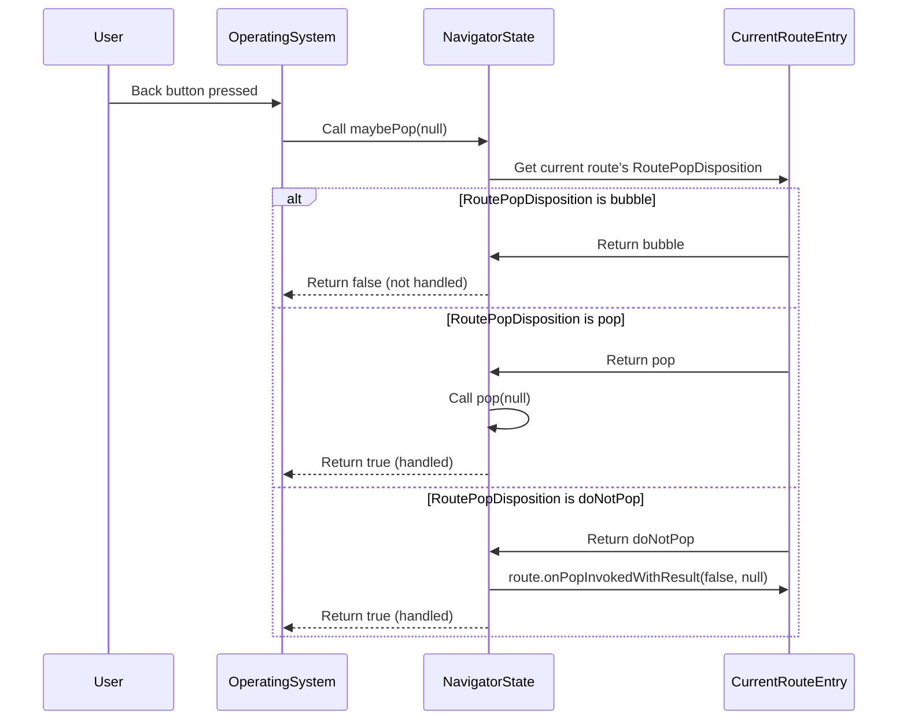

# Chapter 6: RoutePopDisposition

Welcome back, aspiring Flutter developers! In our previous chapter, [Chapter 5: RoutePredicate](05_routepredicate_.md), we learned how `RoutePredicate` helps the [Navigator](01_navigator_.md) decide which routes to interact with, especially when using `popUntil` or `pushNamedAndRemoveUntil`.

Today, we're going to look at a concept that's closely related to *whether* a single [Route](02_route_.md) can be popped at all and how it should behave when a pop is attempted: **RoutePopDisposition**.

Think of `RoutePopDisposition` as a rule that a specific screen ([Route](02_route_.md)) sets for itself about how it responds to being asked to close or "pop." It's like a door deciding if it should open when someone tries to go back through it.

## Why do we need RoutePopDisposition?

Most of the time, when you push a new screen, it's expected that hitting the back button or calling `Navigator.pop` will dismiss that screen and take you back. `MaterialPageRoute` (which we used in earlier chapters) provides this behavior automatically.

However, there are cases where you might *not* want a screen to be easily dismissed by the back button:

1.  **Forms with unsaved changes:** If a user is filling out a form and accidentally hits the back button, you might want to show a confirmation dialog ("Discard changes?") instead of just closing the screen immediately. The screen needs a way to say, "Hold on, let me handle this pop request first."
2.  **Blocking navigation:** Sometimes, a screen represents a crucial step that the user *must* complete before going back. You might want to completely ignore back button presses until a specific action is taken on that screen.
3.  **Top-level app exit:** When the very first screen of your app is visible, hitting the back button shouldn't usually navigate *back* within your app (because there's nowhere to go!). Instead, it should allow the operating system (like Android) to handle it, potentially closing the app or sending it to the background.

`RoutePopDisposition` helps a [Route](02_route_.md) communicate its preference for how the [Navigator](01_navigator_.md) should handle a pop request targeted at it.

## Understanding the Options

`RoutePopDisposition` is an `enum` (a set of predefined values) with three possible options:

*   **`RoutePopDisposition.pop`**: This is the default behavior for most routes that aren't the very first one. It means, "Yes, go ahead and pop me off the stack." The [Navigator](01_navigator_.md) will proceed with the standard pop operation (exit animation, disposal, etc.).
*   **`RoutePopDisposition.doNotPop`**: This means, "No, don't pop me. Ignore this pop request." The [Navigator](01_navigator_.md) will stop the pop process, and the screen will remain visible. This is useful for completely blocking back navigation.
*   **`RoutePopDisposition.bubble`**: This is the default behavior for the very first route ([Route.isFirst](02_route_.md) is true). It means, "I can't be popped internally. Pass this pop request up to the next level," which is typically the operating system. This allows the system to handle the "back" action (e.g., minimizing the app).

## How is RoutePopDisposition Used?

The [Navigator](01_navigator_.md) checks the `RoutePopDisposition` when the `Navigator.maybePop` method is called. `maybePop` is internally called when the system back button is pressed (on platforms that have one) or when a `PopScope` widget allows a pop. It's the polite way to attempt a pop, giving the current [Route](02_route_.md) a chance to respond. The standard `Navigator.pop` method, however, is an imperative command that bypasses this check and force-pops the route (unless the route has internal pop handling that *does* check the disposition, like `ModalRoute`).

`Route` objects have a getter `popDisposition` (and a deprecated `willPop` future) that return one of these `RoutePopDisposition` values.

Let's create a simple screen that prevents itself from being popped using `doNotPop`:

```dart
import 'package:flutter/material.dart';

// A screen that resists popping!
class ResistPopScreen extends ModalRoute<void> {
  @override
  Duration get transitionDuration => const Duration(milliseconds: 300);

  @override
  bool get opaque => true;

  @override
  bool get barrierDismissible => false; // Cannot dismiss by tapping barrier

  @override
  Color get barrierColor => Colors.black54; // Semi-transparent black barrier

  @override
  String? get barrierLabel => null;

  @override
  bool get maintainState => true;

  @override
  Widget buildPage(
    BuildContext context,
    Animation<double> animation,
    Animation<double> secondaryAnimation,
  ) {
    return Material(
      type: MaterialType.transparency,
      child: Center(
        child: Container(
          padding: const EdgeInsets.all(16),
          color: Colors.white,
          child: Column(
            mainAxisSize: MainAxisSize.min,
            children: [
              const Text(
                'You cannot pop this screen with the back button!',
                textAlign: TextAlign.center,
                style: TextStyle(fontSize: 18),
              ),
              const SizedBox(height: 20),
              ElevatedButton(
                onPressed: () {
                  // We use Navigator.pop here, which is an imperative command
                  // and bypasses the RoutePopDisposition check.
                  // This button *will* dismiss the screen.
                  Navigator.pop(context);
                },
                child: const Text('Dismiss Anyway (using pop)'),
              ),
               ElevatedButton(
                onPressed: () {
                  // This tries to maybePop, which will consult
                  // RoutePopDisposition and be ignored.
                  Navigator.maybePop(context);
                },
                child: const Text('Try to Pop Politely (won\'t work)'),
              ),
            ],
          ),
        ),
      ),
    );
  }

  // Override popDisposition to prevent popping via maybePop (like back button)
  @override
  RoutePopDisposition get popDisposition {
      print('ResistPopScreen: Deciding pop disposition...');
      return RoutePopDisposition.doNotPop;
  }
}

// Our HomeScreen to push the ResistPopScreen
class HomeScreen extends StatelessWidget {
  const HomeScreen({super.key});

  @override
  Widget build(BuildContext context) {
    return Scaffold(
      appBar: AppBar(title: const Text('Home Screen')),
      body: Center(
        child: ElevatedButton(
          onPressed: () {
            // Push our ResistPopScreen
            Navigator.push(context, ResistPopScreen());
          },
          child: const Text('Go to Resist Pop Screen'),
        ),
      ),
    );
  }
}

// Add this to your main MaterialApp routes if using named routes,
// or push it directly as shown above.
/*
routes: {
  '/': (context) => const HomeScreen(),
  // We push the route directly in this example, not via named routes.
  // If you wanted a named route:
  // '/resistPop': (context) => ResistPopScreen(), // Need a different way to build ModalRoute often
},
*/
```

In this example:

*   We created a custom [Route](02_route_.md) by extending `ModalRoute`. `ModalRoute`s are good for overlays like dialogs or custom screens that block interaction with the previous screen.
*   We overrode the `buildPage` method to provide the visual content of our screen (a simple box with text and buttons).
*   **Crucially**, we overrode the `popDisposition` getter to return `RoutePopDisposition.doNotPop`.
*   When you run this, navigate to the `ResistPopScreen`. Hitting the system back button (which calls `maybePop`) will do nothing. The `print` statement in `popDisposition` confirms it was checked.
*   Tapping the "Try to Pop Politely" button (which also calls `maybePop`) will also do nothing. The `popDisposition` prevents it.
*   Tapping the "Dismiss Anyway (using pop)" button works because it calls `Navigator.pop`, which is a direct command to the [Navigator](01_navigator_.md) to remove the route, regardless of its `popDisposition`.

This demonstrates how `doNotPop` gives a route control over whether it responds to "polite" pop requests like the system back button.

For a forms-with-unsaved-changes scenario, you might initially return `RoutePopDisposition.pop` but use a `PopScope` widget (or the older `WillPopScope`) within the route's content. This widget would intercept the pop and show a dialog *before* the route's `popDisposition` is even consulted (or sometimes trigger a change that causes `popDisposition` to become `doNotPop` if necessary).

## RoutePopDisposition Under the Hood (Simplified)

Let's look at where `RoutePopDisposition` is defined and how it's used in the `NavigatorState`.

The `RoutePopDisposition` enum is simply:

```dart
/// Indicates whether the current route should be popped.
enum RoutePopDisposition {
  /// Pop the route.
  pop,

  /// Do not pop the route.
  doNotPop,

  /// Delegate this to the next level of navigation.
  bubble,
}
```

The core logic for using this enum lives in the `NavigatorState.maybePop` method (simplified, focusing on `popDisposition`):

```dart
// Inside NavigatorState class (simplified maybePop)
@optionalTypeArgs
Future<bool> maybePop<T extends Object?>([T? result]) async {
  // Find the current top-most route that is "present" (visible or animating)
  final _RouteEntry? lastEntry = _lastRouteEntryWhereOrNull(_RouteEntry.isPresentPredicate);

  if (lastEntry == null) {
    return false; // Nothing to pop
  }
  assert(lastEntry.route._navigator == this);

  // Check the route's pop disposition
  switch (lastEntry.route.popDisposition) {
    case RoutePopDisposition.bubble:
      // Route says let someone else handle it (e.g., OS)
      return false; // Indicate that *this* navigator didn't handle it

    case RoutePopDisposition.pop:
      // Route says it's okay to pop.
      pop(result); // Call our internal pop method
      return true; // Indicate that we handled the pop

    case RoutePopDisposition.doNotPop:
      // Route says don't pop it, ignore the request.
      // We still call onPopInvokedWithResult to notify the route that a pop
      // was attempted but canceled.
      lastEntry.route.onPopInvokedWithResult(false, result);
      return true; // Indicate that we handled the pop (by ignoring it)
  }
}
```



This simplified flow shows that `maybePop` is the gatekeeper that respects the `RoutePopDisposition`. It gets the disposition from the current route and then follows the rule: return `false` for `bubble` (let the caller handle it, usually means exiting the app scope), or return `true` for `pop` or `doNotPop` (meaning this `Navigator` "handled" the request, either by performing the pop or deliberately ignoring it).

Routes built with `MaterialPageRoute` and `CupertinoPageRoute` automatically implement `popDisposition` to return `bubble` if `isFirst` is true and `pop` otherwise. Custom routes can override this logic to implement behaviors like our `ResistPopScreen`.

## Conclusion

`RoutePopDisposition` is a simple but effective enum that allows individual [Route](02_route_.md)s to control how they respond to requests to be popped, particularly via `Navigator.maybePop` (triggered by system back buttons). By returning `pop`, `doNotPop`, or `bubble`, a route signals its intention, enabling scenarios like preventing accidental data loss or controlling app exit behavior. While `Navigator.pop` provides a way to imperatively dismiss a route, `maybePop` and `RoutePopDisposition` offer a cooperative mechanism for handling navigation changes requested by the system or other widgets like `PopScope`.

In the next chapter, we'll explore `NavigatorObserver`, which allows you to listen to and react to various navigation events happening within a [Navigator].

[Chapter 7: NavigatorObserver](07_navigatorobserver_.md)

---

Generated by [AI Codebase Knowledge Builder](https://github.com/The-Pocket/Tutorial-Codebase-Knowledge)